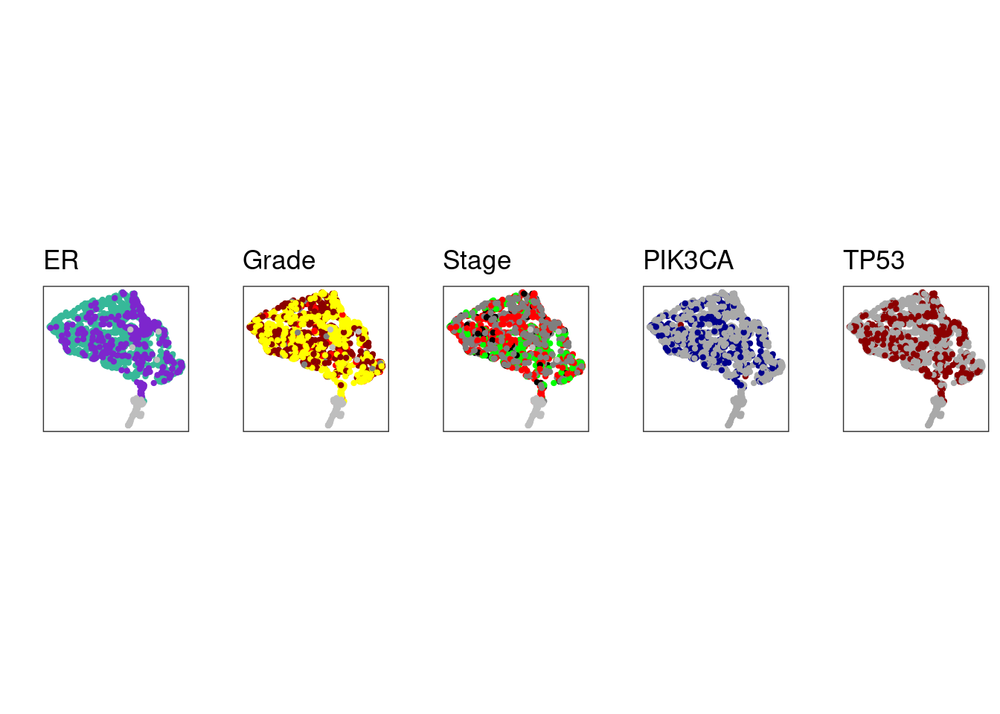

---
jupyter:
  jupytext:
    formats: ipynb,Rmd
    text_representation:
      extension: .Rmd
      format_name: rmarkdown
      format_version: '1.2'
      jupytext_version: 1.11.4
  kernelspec:
    display_name: R
    language: R
    name: ir
---

# Definition of Clock, MG and ML scores 


## Introduction


After cleaning the methylation data from TME effects we went on to look for global trends in the methylation data, i.e. trends that affect all or almost all of the methylome, in particular due to replication age and copy number aberration effects. 


## Initialize


```r
source(here::here("scripts/init.R"))
```

## Load data


We load both TME-normalized and raw methylation values.


```r
all_norm_meth <- fread(here("data/all_norm_meth.tsv")) %>% as_tibble() 
```


```r
all_mat_raw <- get_all_meth()  %>% intervs_to_mat()

head(all_mat_raw)
```

```
##                        MB_0006    MB_0028    MB_0030    MB_0035    MB_0040
## chr1_762469_763020 0.000000000 0.00000000 0.00000000 0.00000000 0.00000000
##                       MB_0046    MB_0050     MB_0053    MB_0054     MB_0062
## chr1_762469_763020 0.00000000 0.00000000          NA 0.00000000 0.000000000
##                        MB_0064     MB_0068    MB_0112     MB_0113    MB_0114
## chr1_762469_763020 0.021276596 0.000000000 0.01058201 0.000000000         NA
##                        MB_0118     MB_0119    MB_0120    MB_0121     MB_0123
## chr1_762469_763020 0.007067138 0.007751938 0.00000000 0.00000000 0.000000000
##                       MB_0124     MB_0125    MB_0126     MB_0127    MB_0128
## chr1_762469_763020 0.01731602 0.000000000 0.02469136 0.000000000 0.00000000
##                       MB_0129     MB_0130     MB_0131     MB_0133     MB_0134
## chr1_762469_763020 0.00000000 0.011764706 0.012500000 0.000000000 0.027522936
##                       MB_0135    MB_0136     MB_0137     MB_0138    MB_0140
## chr1_762469_763020 0.00000000 0.00000000 0.008403361 0.000000000 0.00000000
##                        MB_0142     MB_0143    MB_0144    MB_0145    MB_0146
## chr1_762469_763020 0.000000000 0.004901961 0.00000000 0.00990099 0.00000000
##                        MB_0147    MB_0148     MB_0149     MB_0150    MB_0151
## chr1_762469_763020 0.026086957 0.00000000 0.000000000 0.000000000 0.00000000
##                        MB_0152     MB_0154     MB_0155     MB_0157    MB_0162
## chr1_762469_763020 0.000000000          NA 0.004032258 0.000000000 0.00000000
##                        MB_0163     MB_0164    MB_0165     MB_0166    MB_0167
## chr1_762469_763020          NA 0.023809524 0.00000000 0.021126761 0.00000000
##                        MB_0168    MB_0169    MB_0170     MB_0171    MB_0172
## chr1_762469_763020 0.005494505 0.03000000 0.00000000 0.046511628 0.00000000
##                        MB_0173     MB_0174     MB_0175    MB_0176     MB_0177
## chr1_762469_763020 0.009569378 0.019607843 0.000000000 0.00000000 0.013513514
##                        MB_0178     MB_0179     MB_0180     MB_0181    MB_0184
## chr1_762469_763020 0.029411765 0.012195122          NA 0.000000000 0.00000000
##                        MB_0188    MB_0189    MB_0191     MB_0192     MB_0193
## chr1_762469_763020 0.000000000 0.00000000         NA 0.000000000 0.000000000
##                       MB_0194     MB_0195     MB_0197    MB_0198     MB_0199
## chr1_762469_763020         NA 0.017094017 0.000000000 0.01886792 0.000000000
##                       MB_0201    MB_0202    MB_0203     MB_0204    MB_0205
## chr1_762469_763020 0.00000000 0.00000000 0.03000000 0.000000000 0.01442308
##                        MB_0206     MB_0207     MB_0214    MB_0215    MB_0218
## chr1_762469_763020 0.000000000 0.021739130 0.000000000 0.00000000 0.00000000
##                       MB_0220     MB_0221    MB_0222     MB_0223    MB_0224
## chr1_762469_763020         NA          NA 0.00000000 0.018691589 0.02197802
##                        MB_0225     MB_0226     MB_0227     MB_0228     MB_0229
## chr1_762469_763020 0.018867925 0.014925373 0.006993007          NA 0.000000000
##                        MB_0231    MB_0233     MB_0234     MB_0235    MB_0236
## chr1_762469_763020          NA 0.00000000 0.000000000 0.004608295 0.00000000
##                       MB_0238    MB_0239     MB_0240    MB_0241    MB_0242
## chr1_762469_763020         NA 0.00000000 0.000000000 0.00000000 0.00000000
##                        MB_0243     MB_0244    MB_0245     MB_0246     MB_0248
## chr1_762469_763020 0.000000000 0.012048193 0.00000000 0.004739336 0.000000000
##                         MB_0249    MB_0250    MB_0251     MB_0252     MB_0253
## chr1_762469_763020 0.0189873418 0.01449275 0.03255814 0.031914894 0.005882353
##                        MB_0254     MB_0255     MB_0256     MB_0257     MB_0258
## chr1_762469_763020 0.000000000 0.006666667 0.000000000 0.004273504 0.013157895
##                        MB_0259    MB_0260     MB_0261     MB_0262     MB_0263
## chr1_762469_763020          NA 0.01675978 0.008474576 0.048780488 0.000000000
##                       MB_0264     MB_0265    MB_0266     MB_0268    MB_0270
## chr1_762469_763020 0.00000000 0.000000000 0.00000000 0.009345794         NA
##                        MB_0271     MB_0272    MB_0273    MB_0278    MB_0279
## chr1_762469_763020 0.000000000 0.025423729 0.00000000 0.00000000 0.01716738
##                       MB_0280     MB_0282    MB_0283    MB_0284    MB_0285
## chr1_762469_763020 0.00000000 0.006250000 0.00000000 0.00000000 0.04109589
##                        MB_0286     MB_0287     MB_0288     MB_0290     MB_0291
## chr1_762469_763020 0.000000000 0.000000000 0.061538462          NA          NA
##                        MB_0292    MB_0293     MB_0294     MB_0295     MB_0301
## chr1_762469_763020          NA 0.04301075 0.000000000 0.000000000 0.020833333
##                        MB_0302     MB_0303    MB_0304    MB_0305     MB_0306
## chr1_762469_763020 0.006896552          NA 0.00000000 0.00000000 0.000000000
##                       MB_0307     MB_0308     MB_0309     MB_0310     MB_0311
## chr1_762469_763020 0.00000000 0.012738854          NA 0.012626263 0.000000000
##                       MB_0312     MB_0313     MB_0314    MB_0315     MB_0316
## chr1_762469_763020 0.00000000 0.000000000 0.000000000 0.00000000 0.000000000
##                       MB_0317    MB_0318    MB_0319     MB_0320     MB_0321
## chr1_762469_763020 0.00000000 0.00000000 0.01190476 0.000000000 0.010752688
##                       MB_0322     MB_0324     MB_0325     MB_0327    MB_0328
## chr1_762469_763020 0.01507538 0.003086420 0.009615385 0.000000000 0.01869159
##                        MB_0329    MB_0330     MB_0336     MB_0339     MB_0340
## chr1_762469_763020 0.000000000 0.00000000 0.000000000 0.006451613 0.000000000
##                       MB_0341     MB_0342     MB_0343    MB_0345    MB_0348
## chr1_762469_763020 0.00000000 0.000000000 0.000000000 0.00000000 0.03030303
##                        MB_0349    MB_0350     MB_0352    MB_0353    MB_0356
## chr1_762469_763020 0.000000000 0.00000000 0.000000000         NA 0.05660377
##                       MB_0358     MB_0359    MB_0360    MB_0361    MB_0362
## chr1_762469_763020 0.00000000 0.013793103 0.00000000         NA 0.00000000
##                       MB_0363    MB_0364     MB_0365    MB_0366     MB_0367
## chr1_762469_763020 0.00000000 0.00000000 0.008333333 0.00000000 0.028985507
##                       MB_0368     MB_0369    MB_0370     MB_0371     MB_0373
## chr1_762469_763020 0.01239669 0.020000000 0.00000000 0.003533569 0.000000000
##                        MB_0374    MB_0375     MB_0378     MB_0379    MB_0380
## chr1_762469_763020 0.000000000 0.02380952 0.000000000 0.000000000 0.00000000
##                       MB_0381     MB_0383     MB_0384     MB_0385     MB_0386
## chr1_762469_763020 0.01379310 0.008064516 0.006329114 0.000000000 0.000000000
##                       MB_0388    MB_0389     MB_0391    MB_0392    MB_0393
## chr1_762469_763020 0.00000000 0.00000000 0.000000000 0.00000000 0.00000000
##                       MB_0394     MB_0395     MB_0396    MB_0398    MB_0399
## chr1_762469_763020 0.03015075 0.000000000 0.000000000 0.00000000 0.00000000
##                       MB_0400    MB_0401    MB_0402     MB_0404    MB_0406
## chr1_762469_763020 0.00000000 0.00000000 0.01550388 0.000000000 0.00660066
##                       MB_0408    MB_0410     MB_0411     MB_0412     MB_0413
## chr1_762469_763020 0.02545455 0.00000000 0.021276596 0.000000000 0.016949153
##                        MB_0414     MB_0417     MB_0418     MB_0419     MB_0420
## chr1_762469_763020 0.000000000 0.000000000 0.006802721 0.008695652 0.011560694
##                        MB_0421     MB_0422     MB_0425     MB_0426     MB_0427
## chr1_762469_763020 0.008474576          NA 0.000000000 0.014925373 0.008196721
##                       MB_0428     MB_0429    MB_0431     MB_0432     MB_0434
## chr1_762469_763020 0.00000000 0.033333333 0.00000000 0.000000000 0.000000000
##                       MB_0436    MB_0437     MB_0439    MB_0440     MB_0442
## chr1_762469_763020 0.00462963 0.00000000 0.006410256 0.01724138 0.008888889
##                        MB_0443     MB_0444    MB_0445    MB_0446     MB_0449
## chr1_762469_763020 0.008474576 0.004098361 0.03465347 0.04098361 0.008403361
##                        MB_0451     MB_0452     MB_0453     MB_0454     MB_0455
## chr1_762469_763020 0.000000000 0.015267176 0.010928962 0.000000000 0.000000000
##                       MB_0458    MB_0460    MB_0462     MB_0464    MB_0465
## chr1_762469_763020 0.00000000 0.00000000 0.00000000 0.016666667 0.00000000
##                        MB_0466    MB_0467     MB_0468     MB_0469    MB_0471
## chr1_762469_763020 0.012500000 0.01250000 0.000000000 0.000000000 0.00000000
##                       MB_0474    MB_0475     MB_0476     MB_0478    MB_0479
## chr1_762469_763020 0.02597403         NA 0.000000000 0.012422360 0.00000000
##                        MB_0480     MB_0481     MB_0482    MB_0483     MB_0484
## chr1_762469_763020 0.000000000 0.000000000          NA         NA 0.000000000
##                        MB_0485    MB_0486     MB_0487     MB_0488     MB_0489
## chr1_762469_763020 0.008333333         NA 0.003937008          NA 0.000000000
##                        MB_0492    MB_0496     MB_0497    MB_0500    MB_0501
## chr1_762469_763020 0.057142857 0.00000000 0.000000000 0.00000000 0.01522843
##                        MB_0502     MB_0503    MB_0504     MB_0505     MB_0506
## chr1_762469_763020 0.003558719 0.000000000 0.00000000 0.012048193 0.000000000
##                        MB_0507    MB_0508    MB_0510    MB_0511     MB_0512
## chr1_762469_763020 0.012269939 0.00000000 0.02884615         NA 0.000000000
##                        MB_0513     MB_0514     MB_0516     MB_0519    MB_0521
## chr1_762469_763020 0.000000000 0.000000000 0.027027027 0.010169492 0.00000000
##                        MB_0525    MB_0527    MB_0528    MB_0529     MB_0530
## chr1_762469_763020 0.008695652 0.00000000 0.00000000 0.00000000 0.006756757
##                        MB_0531     MB_0532     MB_0534     MB_0535     MB_0536
## chr1_762469_763020 0.000000000 0.009009009 0.044444444 0.000000000 0.009345794
##                        MB_0538     MB_0542    MB_0544    MB_0545     MB_0546
## chr1_762469_763020 0.000000000 0.022388060 0.01219512 0.00000000 0.000000000
##                        MB_0549     MB_0550    MB_0551     MB_0552     MB_0553
## chr1_762469_763020 0.000000000 0.008474576 0.03278689 0.000000000 0.009174312
##                        MB_0558    MB_0559     MB_0566     MB_0568     MB_0569
## chr1_762469_763020 0.014925373 0.00000000 0.000000000 0.000000000 0.015151515
##                        MB_0570     MB_0571     MB_0572     MB_0574     MB_0575
## chr1_762469_763020 0.012500000 0.021276596 0.000000000 0.017241379 0.000000000
##                       MB_0576     MB_0580     MB_0581    MB_0582    MB_0583
## chr1_762469_763020 0.00000000 0.000000000 0.000000000 0.00000000 0.00000000
##                       MB_0585    MB_0589     MB_0591    MB_0593    MB_0594
## chr1_762469_763020 0.02739726 0.00000000 0.000000000 0.00000000 0.00000000
##                        MB_0596     MB_0597     MB_0600     MB_0601     MB_0603
## chr1_762469_763020 0.000000000 0.000000000 0.005681818 0.000000000 0.000000000
##                        MB_0605    MB_0606     MB_0608    MB_0609     MB_0610
## chr1_762469_763020 0.004132231 0.00000000          NA 0.00000000 0.014598540
##                        MB_0615     MB_0616    MB_0617     MB_0618     MB_0620
## chr1_762469_763020 0.000000000 0.007692308 0.00000000 0.000000000 0.003968254
##                        MB_0621     MB_0622     MB_0623    MB_0626     MB_0627
## chr1_762469_763020 0.000000000 0.000000000 0.000000000 0.00000000 0.000000000
##                       MB_0628    MB_0631     MB_0632     MB_0637    MB_0638
## chr1_762469_763020 0.01851852 0.03260870 0.007692308 0.021978022 0.00000000
##                        MB_0639    MB_0642     MB_0643    MB_0646     MB_0649
## chr1_762469_763020 0.051282051 0.00000000 0.000000000 0.00000000 0.000000000
##                       MB_0650    MB_0653     MB_0655    MB_0656    MB_0657
## chr1_762469_763020 0.00000000 0.00000000 0.000000000 0.00000000 0.00000000
##                       MB_0659     MB_0662     MB_0663    MB_0664     MB_0666
## chr1_762469_763020 0.00000000 0.000000000 0.000000000 0.00000000 0.000000000
##                       MB_0668     MB_0676     MB_0684     MB_0685     MB_0692
## chr1_762469_763020         NA 0.000000000          NA 0.004166667 0.000000000
##                        MB_0698     MB_0700    MB_0719     MB_0724     MB_0732
## chr1_762469_763020 0.003703704 0.000000000 0.00000000 0.000000000 0.000000000
##                       MB_0735    MB_0739     MB_0748      MB_0756     MB_0767
## chr1_762469_763020 0.01234568 0.00000000 0.000000000 0.0000000000 0.000000000
##                       MB_0768      MB_0770     MB_0772     MB_0778     MB_0779
## chr1_762469_763020 0.01538462 0.0000000000 0.000000000 0.000000000 0.000000000
##                        MB_0785     MB_0786     MB_0788     MB_0794      MB_0795
## chr1_762469_763020 0.000000000 0.000000000 0.000000000 0.000000000 0.0000000000
##                         MB_0801     MB_0803     MB_0818     MB_0825     MB_0826
## chr1_762469_763020 0.0238095238 0.000000000 0.000000000 0.000000000 0.008695652
##                        MB_0828     MB_0833     MB_0835     MB_0841      MB_0850
## chr1_762469_763020 0.000000000 0.000000000 0.000000000 0.000000000 0.0000000000
##                        MB_0857     MB_0865     MB_0868     MB_0872     MB_0873
## chr1_762469_763020 0.000000000 0.000000000 0.011173184 0.009259259 0.013245033
##                        MB_0875      MB_0877    MB_0878     MB_0879    MB_0880
## chr1_762469_763020 0.004484305 0.0000000000 0.02932551 0.008635579 0.00000000
##                        MB_0881    MB_0884     MB_0886     MB_0890    MB_0892
## chr1_762469_763020          NA 0.02083333 0.000000000 0.031250000 0.01562500
##                        MB_0894     MB_0895     MB_0897     MB_0898     MB_0899
## chr1_762469_763020 0.029569892          NA 0.000000000 0.024096386 0.009708738
##                        MB_0901     MB_0902    MB_0904     MB_0905     MB_0906
## chr1_762469_763020 0.000000000 0.013698630 0.00000000 0.000000000 0.000000000
##                        MB_0908     MB_0923     MB_0924    MB_0925     MB_0927
## chr1_762469_763020 0.006944444 0.015544041 0.019607843 0.00000000 0.000000000
##                       MB_0928     MB_0929     MB_0930     MB_0931    MB_0932
## chr1_762469_763020 0.03149606 0.006944444 0.040000000 0.027397260 0.00000000
##                       MB_0933     MB_0934    MB_0935     MB_0936     MB_0937
## chr1_762469_763020 0.00000000 0.000000000 0.00990099 0.007462687 0.000000000
##                        MB_0939     MB_0941     MB_0942     MB_0943    MB_0944
## chr1_762469_763020 0.000000000 0.000000000 0.000000000 0.000000000         NA
##                       MB_0945    MB_0947     MB_0948    MB_0949     MB_0950
## chr1_762469_763020 0.01463415 0.02564103 0.000000000 0.00000000 0.020000000
##                        MB_0951     MB_0952    MB_0953     MB_0955     MB_0956
## chr1_762469_763020 0.003649635 0.000000000 0.02020202 0.000000000 0.000000000
##                       MB_0957     MB_0958     MB_0961    MB_0964     MB_0965
## chr1_762469_763020 0.00000000 0.000000000 0.000000000 0.00000000          NA
##                        MB_0966     MB_0967     MB_0968     MB_0969    MB_0970
## chr1_762469_763020 0.040462428 0.022471910 0.004807692 0.000000000 0.00000000
##                        MB_0971    MB_0973    MB_0974     MB_0975     MB_0976
## chr1_762469_763020 0.033613445 0.00000000 0.00000000 0.000000000 0.000000000
##                        MB_0978     MB_0979     MB_0980     MB_0982     MB_0983
## chr1_762469_763020 0.000000000 0.000000000 0.013986014          NA 0.000000000
##                        MB_0984     MB_0986     MB_0987    MB_0988     MB_0989
## chr1_762469_763020 0.000000000 0.008196721 0.000000000 0.00000000 0.000000000
##                        MB_0990      MB_0991    MB_0992     MB_0993     MB_0994
## chr1_762469_763020 0.002570694 0.0046728972 0.00000000 0.000000000 0.007604563
##                        MB_0995     MB_0996     MB_0997     MB_0998     MB_0999
## chr1_762469_763020 0.017937220 0.000000000 0.007751938 0.013986014 0.004201681
##                        MB_1001    MB_1002     MB_1003     MB_1004     MB_1005
## chr1_762469_763020 0.000000000 0.01190476 0.000000000 0.011560694 0.000000000
##                        MB_1006     MB_1007     MB_1008     MB_1009     MB_1010
## chr1_762469_763020 0.005494505 0.006250000 0.000000000 0.000000000 0.000000000
##                        MB_1011     MB_1012     MB_1013    MB_1014     MB_1015
## chr1_762469_763020 0.000000000 0.004032258 0.014388489 0.00000000 0.020270270
##                       MB_1017     MB_1018     MB_1020     MB_1022     MB_1023
## chr1_762469_763020 0.01923077 0.005025126 0.011560694 0.005899705 0.006666667
##                        MB_1024     MB_1025     MB_1026     MB_1027     MB_1028
## chr1_762469_763020 0.006493506 0.000000000 0.000000000 0.042253521 0.014925373
##                        MB_1029    MB_1031     MB_1032    MB_1033    MB_1034
## chr1_762469_763020 0.014084507 0.00000000 0.000000000 0.01162791 0.00000000
##                        MB_1035     MB_1036    MB_1037    MB_1038     MB_1039
## chr1_762469_763020 0.025641026 0.000000000 0.01333333 0.00000000 0.028169014
##                       MB_1040     MB_1041    MB_1043    MB_1044     MB_1045
## chr1_762469_763020 0.00000000 0.000000000 0.00000000 0.04545455 0.000000000
##                        MB_1046    MB_1047     MB_1048     MB_1049     MB_1050
## chr1_762469_763020 0.000000000 0.00000000 0.000000000 0.000000000 0.000000000
##                       MB_1051     MB_1052     MB_1053     MB_1054    MB_1055
## chr1_762469_763020 0.00000000 0.000000000 0.009900990 0.010638298         NA
##                        MB_1056     MB_1057     MB_1058     MB_1059     MB_1061
## chr1_762469_763020 0.000000000 0.000000000 0.016666667 0.005847953 0.000000000
##                       MB_1062     MB_1063     MB_1064     MB_1065     MB_1066
## chr1_762469_763020 0.03125000 0.008695652 0.006172840 0.008196721 0.008264463
##                        MB_1067    MB_1068     MB_1069    MB_1070     MB_1071
## chr1_762469_763020 0.012500000 0.00000000 0.009174312 0.01923077 0.000000000
##                        MB_1072    MB_1073     MB_1074     MB_1075     MB_1076
## chr1_762469_763020 0.000000000 0.01142857 0.006896552 0.016528926 0.000000000
##                       MB_1077    MB_1078    MB_1079    MB_1080    MB_1081
## chr1_762469_763020 0.00000000 0.01176471 0.06451613 0.00000000 0.01818182
##                        MB_1082    MB_1083     MB_1084     MB_1085     MB_1086
## chr1_762469_763020 0.000000000 0.01123596 0.012345679 0.016949153 0.006329114
##                        MB_1087    MB_1090     MB_1091     MB_1093     MB_1096
## chr1_762469_763020 0.000000000         NA 0.000000000 0.000000000 0.020408163
##                       MB_1097    MB_1098     MB_1100     MB_1101     MB_1102
## chr1_762469_763020 0.02941176 0.00000000 0.006172840 0.000000000 0.000000000
##                        MB_1103     MB_1104     MB_1105    MB_1107     MB_1110
## chr1_762469_763020 0.000000000 0.000000000 0.000000000 0.00000000 0.000000000
##                        MB_1111     MB_1114     MB_1116     MB_1118    MB_1119
## chr1_762469_763020 0.006410256 0.006493506 0.000000000 0.000000000 0.01086957
##                        MB_1120     MB_1121     MB_1122    MB_1123    MB_1124
## chr1_762469_763020 0.004950495 0.005235602 0.000000000 0.01224490 0.04950495
##                        MB_1125     MB_1126     MB_1127     MB_1129     MB_1130
## chr1_762469_763020 0.000000000 0.000000000 0.000000000 0.008163265 0.000000000
##                        MB_1131     MB_1132     MB_1134     MB_1135     MB_1136
## chr1_762469_763020 0.000000000 0.000000000 0.010025063 0.010810811 0.000000000
##                       MB_1137     MB_1138     MB_1139     MB_1141    MB_1142
## chr1_762469_763020 0.00000000 0.003174603 0.004694836 0.007712082 0.00000000
##                        MB_1143     MB_1144     MB_1145    MB_1146     MB_1147
## chr1_762469_763020 0.004484305 0.009836066 0.008771930 0.01307190 0.009966777
##                       MB_1148     MB_1149     MB_1151     MB_1152    MB_1155
## chr1_762469_763020 0.02479339 0.007092199 0.004901961 0.011235955 0.01877934
##                        MB_1156     MB_2517     MB_2536    MB_2556     MB_2564
## chr1_762469_763020 0.000000000 0.000000000 0.005263158 0.00000000 0.011976048
##                        MB_2610     MB_2613     MB_2614      MB_2616    MB_2617
## chr1_762469_763020 0.023437500 0.000000000 0.023809524 0.0000000000 0.00000000
##                        MB_2618     MB_2624    MB_2626    MB_2632     MB_2634
## chr1_762469_763020 0.000000000 0.000000000 0.00000000 0.05263158 0.000000000
##                       MB_2640     MB_2643    MB_2645    MB_2669     MB_2686
## chr1_762469_763020 0.00000000 0.016528926         NA 0.00000000 0.000000000
##                       MB_2705     MB_2708     MB_2711     MB_2712     MB_2718
## chr1_762469_763020         NA 0.015873016 0.019607843 0.008620690 0.005181347
##                       MB_2724     MB_2728     MB_2730     MB_2742     MB_2744
## chr1_762469_763020 0.02255639 0.000000000 0.000000000          NA 0.000000000
##                        MB_2745     MB_2747    MB_2749     MB_2750    MB_2752
## chr1_762469_763020 0.000000000 0.016042781 0.02439024 0.009345794 0.02777778
##                        MB_2753     MB_2754     MB_2760     MB_2763    MB_2764
## chr1_762469_763020 0.026595745 0.018656716 0.000000000 0.009090909 0.00000000
##                       MB_2765    MB_2767     MB_2769    MB_2770     MB_2772
## chr1_762469_763020 0.00000000         NA 0.000000000 0.04477612 0.018691589
##                        MB_2774     MB_2775     MB_2778    MB_2779      MB_2781
## chr1_762469_763020 0.011235955 0.008333333 0.000000000 0.03448276 0.0288461538
##                        MB_2790     MB_2791     MB_2792     MB_2793    MB_2796
## chr1_762469_763020 0.000000000 0.028571429 0.000000000 0.007246377 0.00000000
##                        MB_2803    MB_2814    MB_2819     MB_2820     MB_2821
## chr1_762469_763020 0.000000000 0.00000000 0.00000000 0.010101010 0.028571429
##                       MB_2827    MB_2833    MB_2834     MB_2835     MB_2838
## chr1_762469_763020 0.01923077 0.02884615 0.00617284 0.011235955 0.000000000
##                       MB_2840     MB_2842    MB_2843    MB_2844    MB_2845
## chr1_762469_763020 0.00000000 0.000000000 0.01986755 0.00000000 0.00000000
##                        MB_2846     MB_2847     MB_2848     MB_2849     MB_2850
## chr1_762469_763020 0.000000000 0.000000000 0.006993007 0.000000000 0.000000000
##                        MB_2851    MB_2853     MB_2854     MB_2862     MB_2895
## chr1_762469_763020 0.000000000 0.00000000 0.000000000 0.008264463 0.000000000
##                       MB_2896    MB_2901    MB_2912     MB_2916     MB_2917
## chr1_762469_763020 0.00000000 0.00000000 0.00000000 0.000000000 0.019047619
##                       MB_2919    MB_2923     MB_2927     MB_2929     MB_2931
## chr1_762469_763020 0.02898551 0.00000000          NA 0.008264463 0.000000000
##                        MB_2933    MB_2939    MB_2951    MB_2952     MB_2953
## chr1_762469_763020 0.036231884 0.00000000 0.02027027 0.00000000 0.003846154
##                       MB_2954     MB_2957     MB_2960     MB_2963     MB_2969
## chr1_762469_763020 0.01488095 0.021052632 0.005347594 0.013245033 0.000000000
##                        MB_2977    MB_2983    MB_2984     MB_2990     MB_2993
## chr1_762469_763020 0.010791367 0.00000000 0.01910828 0.000000000 0.000000000
##                       MB_2994    MB_2996     MB_3001     MB_3005     MB_3006
## chr1_762469_763020 0.00000000 0.00000000          NA 0.007692308          NA
##                        MB_3007     MB_3008    MB_3014    MB_3016     MB_3021
## chr1_762469_763020 0.000000000 0.010309278 0.00000000         NA 0.000000000
##                       MB_3025     MB_3028     MB_3031     MB_3033     MB_3035
## chr1_762469_763020 0.00000000          NA 0.010101010 0.014423077 0.015748031
##                       MB_3037     MB_3046    MB_3049    MB_3050     MB_3057
## chr1_762469_763020 0.00000000 0.011764706 0.00000000         NA 0.000000000
##                        MB_3058     MB_3063     MB_3064     MB_3067    MB_3079
## chr1_762469_763020 0.000000000 0.000000000 0.000000000 0.031250000 0.01219512
##                        MB_3082     MB_3083     MB_3085    MB_3088     MB_3089
## chr1_762469_763020 0.008130081 0.018181818 0.007142857 0.01369863 0.000000000
##                        MB_3102     MB_3104     MB_3105    MB_3110    MB_3121
## chr1_762469_763020 0.000000000 0.013157895 0.000000000 0.00000000 0.01754386
##                       MB_3122     MB_3153     MB_3165     MB_3167     MB_3171
## chr1_762469_763020 0.00000000 0.000000000 0.011764706 0.031847134 0.010638298
##                        MB_3211    MB_3218     MB_3228    MB_3235    MB_3252
## chr1_762469_763020 0.004672897         NA 0.000000000 0.00000000 0.00000000
##                        MB_3253     MB_3254     MB_3266     MB_3271     MB_3275
## chr1_762469_763020 0.027027027 0.000000000 0.006622517 0.000000000 0.012096774
##                        MB_3277     MB_3292     MB_3295     MB_3297     MB_3298
## chr1_762469_763020 0.010638298 0.009259259 0.000000000 0.040983607 0.015748031
##                       MB_3300    MB_3301    MB_3315     MB_3328     MB_3329
## chr1_762469_763020 0.02941176 0.00000000 0.02500000 0.000000000          NA
##                       MB_3341     MB_3350    MB_3351     MB_3357     MB_3360
## chr1_762469_763020 0.00000000 0.009615385 0.00000000          NA 0.021052632
##                        MB_3361    MB_3367    MB_3371     MB_3378     MB_3382
## chr1_762469_763020          NA 0.00000000 0.01818182 0.000000000 0.000000000
##                        MB_3383     MB_3395     MB_3396    MB_3402     MB_3403
## chr1_762469_763020 0.000000000 0.000000000 0.019417476 0.00000000 0.000000000
##                        MB_3412     MB_3417     MB_3429     MB_3430    MB_3435
## chr1_762469_763020 0.038251366 0.044692737 0.012422360 0.005617978 0.02040816
##                       MB_3436     MB_3437    MB_3439    MB_3452     MB_3453
## chr1_762469_763020 0.00000000 0.000000000 0.00000000 0.02727273 0.000000000
##                       MB_3459     MB_3462    MB_3467     MB_3470     MB_3476
## chr1_762469_763020 0.01863354 0.000000000 0.00000000 0.008264463 0.004950495
##                       MB_3479     MB_3490     MB_3492     MB_3497    MB_3500
## chr1_762469_763020 0.01492537 0.012738854 0.000000000 0.000000000 0.00000000
##                       MB_3502     MB_3506     MB_3510     MB_3526    MB_3545
## chr1_762469_763020 0.00000000 0.000000000 0.000000000 0.000000000         NA
##                       MB_3548     MB_3555    MB_3556     MB_3560     MB_3576
## chr1_762469_763020         NA 0.000000000 0.00000000          NA 0.006622517
##                       MB_3582     MB_3600    MB_3614     MB_3676     MB_3702
## chr1_762469_763020 0.00000000 0.004587156 0.00000000 0.000000000 0.005586592
##                        MB_3706     MB_3707     MB_3711    MB_3747    MB_3748
## chr1_762469_763020 0.007194245 0.000000000          NA 0.00000000 0.03750000
##                       MB_3752   MB_3754     MB_3755     MB_3781     MB_3804
## chr1_762469_763020         NA 0.0000000 0.000000000 0.019704433 0.019138756
##                       MB_3823     MB_3824    MB_3838    MB_3840     MB_3842
## chr1_762469_763020 0.00000000 0.022727273 0.02290076 0.00000000 0.034482759
##                        MB_3850    MB_3852     MB_3854     MB_3865    MB_3866
## chr1_762469_763020 0.000000000         NA 0.000000000 0.000000000 0.00000000
##                        MB_3871    MB_3874    MB_3978    MB_4000    MB_4001
## chr1_762469_763020 0.000000000 0.00000000 0.00000000 0.00000000 0.00000000
##                        MB_4003     MB_4004    MB_4008    MB_4012     MB_4015
## chr1_762469_763020 0.009009009 0.000000000 0.00000000 0.00000000 0.006024096
##                       MB_4017     MB_4018    MB_4024    MB_4033     MB_4036
## chr1_762469_763020 0.00000000 0.000000000 0.00000000 0.00000000 0.013574661
##                       MB_4038     MB_4039    MB_4040     MB_4042     MB_4046
## chr1_762469_763020 0.02117647 0.000000000 0.00000000 0.004115226 0.000000000
##                       MB_4048     MB_4049    MB_4051     MB_4053     MB_4054
## chr1_762469_763020 0.04242424 0.010309278 0.01030928 0.009132420 0.012738854
##                        MB_4055     MB_4056     MB_4057    MB_4058     MB_4059
## chr1_762469_763020 0.012987013 0.058394161 0.000000000 0.02803738 0.000000000
##                       MB_4060    MB_4061     MB_4062    MB_4063     MB_4064
## chr1_762469_763020 0.03007519 0.00000000 0.000000000 0.01612903 0.008522727
##                         MB_4066     MB_4072     MB_4079    MB_4083     MB_4084
## chr1_762469_763020 0.0546448087 0.006711409 0.000000000 0.01298701 0.012875536
##                        MB_4091     MB_4098    MB_4110     MB_4117    MB_4119
## chr1_762469_763020 0.005555556 0.013333333 0.02702703 0.022988506 0.01923077
##                        MB_4120     MB_4123     MB_4126    MB_4127    MB_4139
## chr1_762469_763020 0.005681818 0.000000000 0.000000000 0.00000000 0.00000000
##                       MB_4141    MB_4145     MB_4146    MB_4148     MB_4154
## chr1_762469_763020 0.00000000 0.01282051 0.000000000 0.02083333 0.000000000
##                        MB_4169     MB_4171     MB_4173     MB_4189     MB_4190
## chr1_762469_763020 0.007662835 0.004081633 0.010362694 0.024390244 0.000000000
##                       MB_4211    MB_4212    MB_4213     MB_4222     MB_4224
## chr1_762469_763020 0.00990099 0.02380952 0.00000000 0.004761905 0.000000000
##                        MB_4230     MB_4233    MB_4234     MB_4235     MB_4236
## chr1_762469_763020 0.004347826 0.016000000 0.01086957 0.009868421 0.000000000
##                        MB_4254    MB_4255     MB_4264     MB_4266     MB_4268
## chr1_762469_763020 0.005128205 0.03448276 0.012500000 0.000000000 0.000000000
##                       MB_4270     MB_4272    MB_4274     MB_4276    MB_4278
## chr1_762469_763020 0.01265823 0.000000000 0.00000000 0.005780347 0.01481481
##                       MB_4281     MB_4282     MB_4283    MB_4289     MB_4293
## chr1_762469_763020 0.00000000 0.026455026 0.005102041 0.03333333 0.011834320
##                       MB_4300     MB_4306    MB_4308     MB_4310    MB_4313
## chr1_762469_763020 0.01142857 0.000000000         NA 0.030000000 0.00000000
##                       MB_4317    MB_4318     MB_4322    MB_4323    MB_4328
## chr1_762469_763020 0.00000000         NA 0.000000000 0.00000000 0.00000000
##                       MB_4331     MB_4333    MB_4339     MB_4341     MB_4342
## chr1_762469_763020 0.00000000 0.000000000 0.00000000 0.000000000 0.000000000
##                        MB_4343    MB_4348    MB_4350    MB_4351     MB_4353
## chr1_762469_763020          NA 0.00000000 0.01492537 0.03030303 0.009009009
##                        MB_4354     MB_4357    MB_4360    MB_4361     MB_4362
## chr1_762469_763020          NA 0.000000000 0.00000000 0.00000000 0.019354839
##                        MB_4368    MB_4374     MB_4375    MB_4381    MB_4390
## chr1_762469_763020 0.012048193         NA 0.000000000 0.00000000 0.01219512
##                        MB_4395    MB_4407     MB_4408    MB_4409    MB_4410
## chr1_762469_763020 0.016393443 0.00000000 0.000000000 0.00000000 0.01785714
##                        MB_4413    MB_4416     MB_4417    MB_4421    MB_4426
## chr1_762469_763020 0.004587156 0.01578947 0.000000000 0.00000000 0.03680982
##                       MB_4431     MB_4434     MB_4442    MB_4444   MB_4455
## chr1_762469_763020         NA 0.013698630 0.008823529 0.00000000 0.0000000
##                        MB_4458     MB_4464     MB_4465    MB_4474    MB_4477
## chr1_762469_763020 0.000000000 0.009852217 0.026315789 0.00000000 0.00000000
##                        MB_4482     MB_4483     MB_4484     MB_4487     MB_4492
## chr1_762469_763020 0.005390836 0.000000000 0.008130081 0.003344482 0.000000000
##                        MB_4495    MB_4511     MB_4521    MB_4528     MB_4529
## chr1_762469_763020 0.008888889         NA 0.000000000 0.00000000 0.005681818
##                       MB_4531    MB_4541     MB_4548    MB_4556     MB_4557
## chr1_762469_763020 0.00000000 0.00000000 0.011235955 0.01851852 0.000000000
##                        MB_4558     MB_4564     MB_4578     MB_4591    MB_4593
## chr1_762469_763020 0.013636364 0.052631579 0.000000000 0.005154639 0.01428571
##                        MB_4598     MB_4599     MB_4601     MB_4602     MB_4603
## chr1_762469_763020 0.024509804 0.003236246 0.008230453 0.000000000 0.000000000
##                       MB_4607     MB_4613     MB_4616     MB_4618     MB_4621
## chr1_762469_763020 0.01187648 0.000000000 0.002624672 0.000000000 0.000000000
##                        MB_4622    MB_4623    MB_4626     MB_4627     MB_4630
## chr1_762469_763020 0.029411765 0.00000000 0.03937008 0.010526316 0.025641026
##                        MB_4633     MB_4634     MB_4635    MB_4639     MB_4640
## chr1_762469_763020 0.008230453 0.000000000 0.000000000 0.00000000 0.007407407
##                        MB_4641     MB_4642     MB_4643    MB_4644    MB_4648
## chr1_762469_763020 0.004149378 0.000000000 0.015772871 0.00000000 0.00000000
##                       MB_4649    MB_4651     MB_4653    MB_4654    MB_4655
## chr1_762469_763020 0.00000000 0.01562500 0.008298755 0.01777778 0.01600000
##                        MB_4661     MB_4663    MB_4665    MB_4666     MB_4669
## chr1_762469_763020 0.005882353 0.000000000 0.01481481 0.01388889 0.017167382
##                        MB_4670     MB_4671    MB_4672    MB_4673     MB_4674
## chr1_762469_763020 0.000000000 0.007843137 0.00000000 0.01212121 0.003115265
##                       MB_4675    MB_4679     MB_4681    MB_4682    MB_4685
## chr1_762469_763020 0.01886792 0.00877193 0.000000000 0.00000000 0.03597122
##                        MB_4686    MB_4688     MB_4691     MB_4692     MB_4694
## chr1_762469_763020 0.009049774 0.02197802 0.005076142 0.012195122 0.000000000
##                       MB_4696    MB_4697    MB_4698    MB_4701     MB_4702
## chr1_762469_763020 0.00000000 0.00000000 0.00000000 0.01626016 0.021126761
##                        MB_4704     MB_4705    MB_4706    MB_4708     MB_4709
## chr1_762469_763020 0.000000000 0.010638298 0.01416431 0.02976190 0.010452962
##                        MB_4710     MB_4711     MB_4712     MB_4714     MB_4715
## chr1_762469_763020 0.010101010 0.014285714 0.008620690 0.012000000 0.028248588
##                       MB_4716     MB_4717    MB_4719     MB_4722     MB_4723
## chr1_762469_763020 0.00000000 0.000000000 0.00000000 0.008333333 0.016129032
##                        MB_4724    MB_4725     MB_4729     MB_4730     MB_4731
## chr1_762469_763020 0.005847953 0.02127660 0.013245033 0.008403361 0.000000000
##                        MB_4732     MB_4733     MB_4735     MB_4737    MB_4738
## chr1_762469_763020 0.018181818 0.005376344 0.023323615 0.011111111 0.02631579
##                        MB_4739     MB_4741     MB_4742     MB_4743     MB_4744
## chr1_762469_763020 0.010101010 0.009433962 0.010989011 0.014285714 0.000000000
##                        MB_4745     MB_4746    MB_4749     MB_4752     MB_4757
## chr1_762469_763020 0.004310345 0.000000000 0.00000000 0.000000000 0.005617978
##                        MB_4758     MB_4762     MB_4763     MB_4764    MB_4767
## chr1_762469_763020 0.000000000 0.015625000 0.008583691 0.037234043 0.00000000
##                       MB_4769     MB_4770     MB_4771    MB_4778     MB_4779
## chr1_762469_763020 0.02482270 0.003344482 0.013986014 0.00000000 0.006024096
##                        MB_4782     MB_4784    MB_4785     MB_4787     MB_4790
## chr1_762469_763020 0.007092199 0.008264463 0.00000000 0.020547945 0.004830918
##                       MB_4791     MB_4793    MB_4794    MB_4796     MB_4797
## chr1_762469_763020 0.02000000 0.000000000 0.02739726 0.01030928 0.000000000
##                        MB_4798     MB_4800    MB_4801     MB_4802     MB_4805
## chr1_762469_763020 0.010000000 0.000000000 0.02536232 0.007092199 0.029411765
##                        MB_4806    MB_4809     MB_4814     MB_4816     MB_4818
## chr1_762469_763020 0.000000000 0.02884615 0.006289308 0.020833333 0.011904762
##                       MB_4820    MB_4825     MB_4827     MB_4828    MB_4829
## chr1_762469_763020 0.01287554 0.00000000 0.003546099 0.008849558 0.00000000
##                        MB_4832     MB_4834     MB_4836     MB_4838    MB_4839
## chr1_762469_763020 0.037974684 0.000000000 0.008849558 0.011764706 0.00000000
##                        MB_4843    MB_4849    MB_4851     MB_4853     MB_4855
## chr1_762469_763020 0.011173184 0.01980198 0.00000000 0.009852217 0.016666667
##                        MB_4858     MB_4859     MB_4862     MB_4865     MB_4866
## chr1_762469_763020 0.008695652 0.004329004 0.028571429 0.010989011 0.010869565
##                       MB_4867    MB_4869     MB_4871     MB_4872     MB_4873
## chr1_762469_763020 0.01067616 0.00862069 0.007125891 0.000000000 0.006514658
##                        MB_4876    MB_4878    MB_4879    MB_4880     MB_4881
## chr1_762469_763020 0.021126761 0.01764706 0.05769231 0.02702703 0.000000000
##                        MB_4883    MB_4886     MB_4887     MB_4888    MB_4893
## chr1_762469_763020 0.012307692 0.01149425 0.007662835 0.011494253 0.00800000
##                        MB_4894     MB_4896     MB_4897    MB_4898     MB_4899
## chr1_762469_763020 0.009950249 0.000000000 0.007692308 0.04705882 0.000000000
##                        MB_4900    MB_4904     MB_4907    MB_4908     MB_4911
## chr1_762469_763020 0.013513514 0.01648352 0.006993007 0.00000000 0.000000000
##                       MB_4912    MB_4925    MB_4928     MB_4929    MB_4930
## chr1_762469_763020 0.00000000 0.01197605 0.00000000 0.006024096 0.02439024
##                         MB_4931    MB_4933     MB_4934    MB_4935    MB_4937
## chr1_762469_763020 0.0267857143 0.01081081 0.008928571 0.02097902 0.01840491
##                        MB_4941    MB_4942     MB_4944     MB_4945     MB_4949
## chr1_762469_763020 0.010752688 0.02116402 0.007812500 0.003333333 0.005882353
##                       MB_4950     MB_4952     MB_4956    MB_4957    MB_4959
## chr1_762469_763020 0.00000000 0.013333333 0.000000000 0.01333333 0.00000000
##                        MB_4961     MB_4962     MB_4965     MB_4966     MB_4967
## chr1_762469_763020 0.005405405 0.000000000 0.009852217 0.009756098 0.036144578
##                        MB_4968      MB_4969     MB_4970    MB_4976    MB_4977
## chr1_762469_763020 0.000000000 0.0058823529 0.025000000 0.00000000 0.00000000
##                       MB_4981     MB_4986     MB_4987     MB_4991     MB_4992
## chr1_762469_763020 0.01190476 0.012048193 0.008849558 0.000000000 0.000000000
##                        MB_4993     MB_4994     MB_4996     MB_4998     MB_4999
## chr1_762469_763020 0.011560694 0.012396694 0.009009009 0.005000000 0.006289308
##                        MB_5001    MB_5004     MB_5008     MB_5011    MB_5013
## chr1_762469_763020 0.012987013 0.02272727 0.000000000 0.000000000 0.00000000
##                        MB_5014    MB_5015     MB_5018     MB_5019    MB_5022
## chr1_762469_763020 0.004854369 0.00000000 0.014285714 0.000000000 0.00000000
##                        MB_5027     MB_5028     MB_5033     MB_5039     MB_5040
## chr1_762469_763020 0.002832861 0.000000000 0.016000000 0.000000000 0.011764706
##                        MB_5041    MB_5043     MB_5044    MB_5045    MB_5049
## chr1_762469_763020 0.005376344 0.00000000 0.000000000 0.00000000 0.00000000
##                        MB_5050    MB_5052    MB_5053     MB_5054    MB_5057
## chr1_762469_763020 0.014035088 0.02395210 0.00000000 0.013986014 0.01098901
##                        MB_5059    MB_5060    MB_5061     MB_5062     MB_5063
## chr1_762469_763020 0.000000000 0.01075269 0.00000000 0.013157895 0.020833333
##                        MB_5064    MB_5066    MB_5068     MB_5070    MB_5072
## chr1_762469_763020 0.008333333 0.01449275 0.00000000 0.008333333 0.00000000
##                        MB_5073    MB_5074    MB_5078     MB_5079     MB_5081
## chr1_762469_763020 0.005865103 0.02439024 0.02702703 0.009090909 0.009852217
##                       MB_5084    MB_5086     MB_5088    MB_5092     MB_5098
## chr1_762469_763020 0.00304878 0.00000000 0.000000000 0.01648352 0.004950495
##                        MB_5100     MB_5101     MB_5102     MB_5105    MB_5107
## chr1_762469_763020 0.000000000 0.000000000 0.028409091 0.004651163 0.01507538
##                        MB_5110    MB_5114     MB_5115     MB_5116     MB_5118
## chr1_762469_763020 0.005988024 0.01562500 0.000000000 0.013937282 0.003215434
##                        MB_5120     MB_5121     MB_5122     MB_5123    MB_5124
## chr1_762469_763020 0.008474576 0.000000000 0.021739130 0.013513514 0.00000000
##                        MB_5126     MB_5127     MB_5134     MB_5135     MB_5138
## chr1_762469_763020 0.000000000 0.051020408 0.000000000 0.000000000 0.000000000
##                        MB_5139    MB_5144    MB_5145     MB_5147    MB_5150
## chr1_762469_763020 0.000000000 0.00000000 0.01574803 0.000000000 0.00000000
##                       MB_5152    MB_5157    MB_5161     MB_5164    MB_5167
## chr1_762469_763020 0.00000000 0.00000000 0.00000000 0.000000000 0.04477612
##                        MB_5169    MB_5171    MB_5172     MB_5174    MB_5175
## chr1_762469_763020 0.026548673 0.00000000         NA 0.000000000 0.00000000
##                       MB_5176     MB_5182    MB_5184     MB_5186    MB_5188
## chr1_762469_763020 0.00000000 0.011111111 0.02564103 0.011406844 0.04147465
##                        MB_5190    MB_5191     MB_5193      MB_5197     MB_5200
## chr1_762469_763020 0.000000000 0.00000000 0.000000000 0.0441176471          NA
##                         MB_5205    MB_5208    MB_5209     MB_5211     MB_5212
## chr1_762469_763020           NA 0.00000000 0.00000000 0.023809524 0.007874016
##                        MB_5214     MB_5215     MB_5218    MB_5221    MB_5222
## chr1_762469_763020 0.005763689 0.022727273 0.051282051 0.00000000 0.04177546
##                        MB_5223     MB_5224   MB_5225    MB_5226    MB_5227
## chr1_762469_763020 0.035335689 0.009900990 0.0000000 0.00000000 0.00000000
##                        MB_5230     MB_5232    MB_5233    MB_5235     MB_5238
## chr1_762469_763020 0.007874016 0.003802281 0.00000000 0.00000000 0.000000000
##                        MB_5239    MB_5243    MB_5244     MB_5251    MB_5256
## chr1_762469_763020 0.000000000 0.04166667 0.00000000 0.000000000 0.02453988
##                       MB_5259    MB_5261    MB_5264     MB_5266    MB_5270
## chr1_762469_763020 0.00000000 0.00000000 0.01388889 0.008771930         NA
##                        MB_5271    MB_5272     MB_5273     MB_5275     MB_5277
## chr1_762469_763020 0.000000000 0.00000000 0.000000000 0.009049774 0.006250000
##                        MB_5278    MB_5279    MB_5280     MB_5281     MB_5284
## chr1_762469_763020 0.007142857 0.00000000 0.01562500 0.000000000 0.000000000
##                        MB_5286     MB_5287    MB_5288    MB_5292    MB_5293
## chr1_762469_763020 0.000000000 0.000000000 0.00000000 0.00000000 0.00000000
##                       MB_5298     MB_5306     MB_5311     MB_5312    MB_5313
## chr1_762469_763020 0.01242236 0.000000000 0.000000000 0.022304833 0.00000000
##                        MB_5315    MB_5322     MB_5327     MB_5329     MB_5331
## chr1_762469_763020 0.004048583 0.00000000 0.045714286 0.009950249 0.000000000
##                        MB_5334    MB_5335    MB_5338     MB_5339    MB_5341
## chr1_762469_763020 0.028169014 0.00000000 0.00000000 0.000000000 0.00000000
##                        MB_5345   MB_5348    MB_5350     MB_5351     MB_5358
## chr1_762469_763020 0.000000000 0.0000000 0.00000000 0.000000000 0.009433962
##                       MB_5360    MB_5361    MB_5364     MB_5366     MB_5381
## chr1_762469_763020         NA 0.01562500 0.01827676 0.029069767 0.006578947
##                       MB_5396     MB_5399    MB_5402     MB_5410     MB_5425
## chr1_762469_763020 0.01142857 0.000000000 0.00000000 0.000000000 0.006410256
##                        MB_5427     MB_5428    MB_5433    MB_5439     MB_5440
## chr1_762469_763020 0.000000000 0.000000000 0.00000000 0.01003344 0.000000000
##                        MB_5442    MB_5491    MB_5493     MB_5495     MB_5498
## chr1_762469_763020          NA 0.00000000 0.01204819 0.031250000 0.000000000
##                        MB_5513    MB_5519    MB_5530    MB_5533     MB_5543
## chr1_762469_763020 0.002777778 0.02298851 0.02985075 0.00000000 0.000000000
##                        MB_5558     MB_5559     MB_5563    MB_5567    MB_5580
## chr1_762469_763020 0.000000000 0.038461538 0.009090909 0.00000000 0.00000000
##                        MB_5582    MB_5584    MB_5588    MB_5592     MB_5593
## chr1_762469_763020 0.005586592 0.00000000 0.00000000 0.00913242 0.014814815
##                       MB_5596    MB_5603    MB_5605    MB_5614     MB_5620
## chr1_762469_763020 0.01666667 0.01315789 0.04705882 0.01273885 0.011299435
##                        MB_5634    MB_5640     MB_5641    MB_5642     MB_5646
## chr1_762469_763020 0.009900990 0.01398601 0.007092199 0.01775148 0.016393443
##                        MB_5651     MB_5656     MB_6007    MB_6008     MB_6010
## chr1_762469_763020 0.000000000 0.009615385 0.000000000 0.00000000 0.000000000
##                       MB_6011     MB_6012    MB_6018     MB_6019     MB_6023
## chr1_762469_763020 0.02054795 0.000000000 0.03846154 0.008695652 0.010752688
##                        MB_6024    MB_6025     MB_6026     MB_6030     MB_6036
## chr1_762469_763020 0.013274336 0.00000000 0.014705882 0.019607843 0.036585366
##                        MB_6039    MB_6042     MB_6044    MB_6046    MB_6047
## chr1_762469_763020 0.006024096 0.02142857 0.000000000 0.02898551 0.00952381
##                       MB_6048    MB_6049     MB_6050     MB_6052    MB_6053
## chr1_762469_763020 0.00952381         NA 0.000000000 0.000000000 0.00000000
##                        MB_6055    MB_6058    MB_6059    MB_6060    MB_6062
## chr1_762469_763020 0.000000000 0.00000000 0.00000000 0.01818182 0.03007519
##                        MB_6063     MB_6065    MB_6068     MB_6069    MB_6071
## chr1_762469_763020 0.013245033 0.008426966 0.00000000          NA 0.02702703
##                       MB_6075    MB_6077     MB_6079     MB_6080    MB_6082
## chr1_762469_763020 0.00000000 0.00000000 0.009433962 0.005714286 0.01910828
##                        MB_6083    MB_6085    MB_6090     MB_6092     MB_6097
## chr1_762469_763020 0.006578947 0.01117318 0.01257862 0.000000000 0.016194332
##                       MB_6098    MB_6100     MB_6101     MB_6103    MB_6105
## chr1_762469_763020 0.00000000 0.00000000 0.009803922 0.008032129 0.00000000
##                        MB_6107     MB_6108     MB_6113    MB_6114    MB_6116
## chr1_762469_763020 0.000000000 0.028409091 0.000000000 0.00000000 0.01183432
##                        MB_6118    MB_6122     MB_6124     MB_6125     MB_6131
## chr1_762469_763020 0.011173184 0.00000000 0.005291005 0.018867925 0.016000000
##                       MB_6133     MB_6135     MB_6138     MB_6141     MB_6143
## chr1_762469_763020 0.01027397 0.000000000 0.000000000 0.007462687 0.016000000
##                        MB_6144     MB_6145     MB_6146     MB_6147    MB_6149
## chr1_762469_763020 0.009950249 0.004975124 0.000000000 0.006191950 0.00000000
##                       MB_6150    MB_6152    MB_6154    MB_6156    MB_6157
## chr1_762469_763020 0.01212121 0.04022989 0.00000000 0.00000000 0.00000000
##                       MB_6160    MB_6163     MB_6164    MB_6167     MB_6168
## chr1_762469_763020 0.02531646 0.01435407 0.007407407 0.01197605 0.019230769
##                        MB_6169    MB_6171     MB_6178     MB_6179     MB_6181
## chr1_762469_763020 0.009090909 0.01282051 0.013245033 0.005586592 0.007407407
##                       MB_6184    MB_6185    MB_6187     MB_6188    MB_6192
## chr1_762469_763020 0.00000000 0.00000000 0.00000000 0.000000000 0.03389831
##                        MB_6194    MB_6195     MB_6201     MB_6204     MB_6207
## chr1_762469_763020 0.000000000 0.00000000 0.000000000 0.030769231 0.019417476
##                       MB_6208    MB_6211     MB_6212     MB_6213    MB_6214
## chr1_762469_763020 0.00000000 0.00000000 0.000000000 0.000000000 0.00000000
##                        MB_6218    MB_6223     MB_6224     MB_6225    MB_6226
## chr1_762469_763020 0.000000000 0.03409091 0.000000000 0.024193548 0.01149425
##                       MB_6228     MB_6229    MB_6230     MB_6231    MB_6232
## chr1_762469_763020 0.00000000 0.000000000 0.00000000 0.000000000 0.04166667
##                       MB_6233     MB_6234    MB_6237    MB_6238    MB_6239
## chr1_762469_763020 0.00000000 0.000000000         NA 0.03378378 0.00000000
##                        MB_6242     MB_6245     MB_6246    MB_6248    MB_6251
## chr1_762469_763020 0.000000000          NA 0.004081633 0.00000000 0.01666667
##                       MB_6253     MB_6254     MB_6256     MB_6257    MB_6259
## chr1_762469_763020 0.02127660 0.010256410 0.000000000 0.000000000 0.00000000
##                        MB_6261     MB_6263    MB_6269    MB_6271     MB_6272
## chr1_762469_763020 0.000000000 0.015000000 0.00000000 0.00000000 0.000000000
##                        MB_6274     MB_6275    MB_6281     MB_6283     MB_6284
## chr1_762469_763020 0.000000000 0.000000000 0.01941748 0.025157233 0.009259259
##                        MB_6286    MB_6287    MB_6288    MB_6289     MB_6291
## chr1_762469_763020          NA 0.00000000 0.00000000         NA 0.020833333
##                        MB_6293     MB_6294     MB_6297     MB_6300     MB_6302
## chr1_762469_763020 0.069892473 0.026785714 0.030674847 0.000000000 0.000000000
##                        MB_6305     MB_6306    MB_6308     MB_6312     MB_6314
## chr1_762469_763020 0.000000000 0.000000000 0.00000000 0.057692308 0.000000000
##                        MB_6317     MB_6318    MB_6319     MB_6322    MB_6328
## chr1_762469_763020 0.000000000          NA 0.00000000 0.005649718 0.01574803
##                        MB_6329    MB_6330    MB_6334    MB_6336     MB_6337
## chr1_762469_763020 0.000000000 0.01481481 0.00000000 0.00000000 0.000000000
##                        MB_6346     MB_6358     MB_6359     MB_6360     MB_6363
## chr1_762469_763020 0.041666667 0.025000000 0.021276596 0.004484305 0.020833333
##                        MB_7000     MB_7002    MB_7003    MB_7004    MB_7005
## chr1_762469_763020 0.018181818 0.000000000 0.00000000 0.00877193 0.02112676
##                        MB_7006     MB_7007    MB_7008     MB_7009     MB_7010
## chr1_762469_763020 0.000000000 0.011764706 0.03030303 0.009900990 0.006172840
##                        MB_7012     MB_7014     MB_7015     MB_7016     MB_7017
## chr1_762469_763020 0.015037594 0.018867925 0.009708738 0.000000000 0.000000000
##                       MB_7018     MB_7019     MB_7020     MB_7022     MB_7023
## chr1_762469_763020 0.00000000 0.004716981 0.000000000          NA 0.000000000
##                       MB_7026     MB_7028     MB_7029     MB_7030     MB_7031
## chr1_762469_763020 0.01703578 0.027777778 0.000000000 0.000000000 0.000000000
##                        MB_7032    MB_7034     MB_7035     MB_7036     MB_7037
## chr1_762469_763020 0.034188034 0.00000000 0.000000000 0.000000000 0.000000000
##                        MB_7038     MB_7039    MB_7040    MB_7041     MB_7043
## chr1_762469_763020 0.000000000 0.010638298 0.02857143 0.00000000 0.000000000
##                        MB_7046     MB_7048     MB_7049     MB_7050    MB_7051
## chr1_762469_763020 0.000000000 0.006872852 0.010638298 0.005291005 0.02298851
##                       MB_7052     MB_7053     MB_7054     MB_7055     MB_7056
## chr1_762469_763020 0.03448276 0.006410256 0.000000000 0.006134969 0.009803922
##                       MB_7057     MB_7058    MB_7060     MB_7061    MB_7062
## chr1_762469_763020 0.01507538 0.036363636 0.00000000 0.000000000 0.02189781
##                        MB_7065    MB_7066    MB_7067    MB_7068     MB_7070
## chr1_762469_763020 0.010309278 0.04320988 0.00000000 0.01351351 0.000000000
##                        MB_7071     MB_7072     MB_7073     MB_7074    MB_7075
## chr1_762469_763020 0.008849558 0.000000000 0.016666667 0.008928571 0.01481481
##                        MB_7076     MB_7077     MB_7078     MB_7079     MB_7080
## chr1_762469_763020 0.006211180 0.006802721 0.000000000 0.000000000 0.011494253
##                        MB_7083     MB_7084     MB_7085    MB_7086     MB_7087
## chr1_762469_763020 0.000000000 0.000000000 0.006134969 0.00000000 0.000000000
##                       MB_7088    MB_7089     MB_7090     MB_7091     MB_7092
## chr1_762469_763020 0.01190476 0.04020101 0.000000000 0.026881720 0.012987013
##                        MB_7093     MB_7095     MB_7096     MB_7097    MB_7099
## chr1_762469_763020 0.007874016 0.025641026 0.000000000 0.000000000 0.00000000
##                        MB_7100     MB_7102     MB_7104    MB_7107     MB_7109
## chr1_762469_763020 0.000000000 0.000000000 0.006134969 0.00000000 0.000000000
##                        MB_7113     MB_7115    MB_7116     MB_7118     MB_7119
## chr1_762469_763020 0.010309278 0.000000000         NA 0.000000000 0.000000000
##                        MB_7120    MB_7122    MB_7129    MB_7131    MB_7132
## chr1_762469_763020 0.000000000 0.00000000 0.00000000         NA 0.00729927
##                       MB_7137    MB_7138     MB_7141     MB_7142    MB_7144
## chr1_762469_763020 0.02000000 0.03738318 0.000000000 0.028037383 0.02985075
##                        MB_7145    MB_7151    MB_7153     MB_7154     MB_7157
## chr1_762469_763020 0.021551724 0.00000000 0.00000000 0.010309278 0.000000000
##                       MB_7158    MB_7159     MB_7160    MB_7161     MB_7162
## chr1_762469_763020 0.02739726 0.00000000 0.012820513 0.01136364 0.000000000
##                        MB_7164     MB_7167     MB_7170    MB_7171    MB_7172
## chr1_762469_763020 0.000000000 0.000000000 0.000000000 0.01408451         NA
##                       MB_7173     MB_7174     MB_7182    MB_7186     MB_7187
## chr1_762469_763020         NA 0.032085561 0.000000000 0.02898551 0.000000000
##                        MB_7189     MB_7192    MB_7197     MB_7198     MB_7199
## chr1_762469_763020 0.000000000 0.032967033 0.00000000 0.000000000 0.008064516
##                        MB_7200     MB_7205     MB_7208     MB_7214     MB_7217
## chr1_762469_763020 0.000000000 0.000000000 0.000000000 0.000000000 0.006410256
##                        MB_7218    MB_7221     MB_7223    MB_7225     MB_7227
## chr1_762469_763020 0.009523810 0.00000000 0.000000000 0.00000000 0.050000000
##                        MB_7228     MB_7229    MB_7232     MB_7233    MB_7236
## chr1_762469_763020 0.000000000 0.000000000 0.01351351 0.000000000 0.00000000
##                        MB_7237     MB_7241     MB_7243     MB_7244    MB_7245
## chr1_762469_763020 0.017857143 0.000000000 0.000000000 0.000000000 0.00000000
##                        MB_7249    MB_7250     MB_7251     MB_7252     MB_7253
## chr1_762469_763020 0.000000000 0.00000000 0.000000000 0.017937220 0.000000000
##                       MB_7254     MB_7256     MB_7261     MB_7262    MB_7263
## chr1_762469_763020 0.01149425 0.000000000 0.000000000 0.000000000 0.00000000
##                       MB_7265     MB_7268     MB_7271    MB_7273    MB_7275
## chr1_762469_763020         NA 0.000000000 0.000000000 0.00000000 0.00000000
##                       MB_7278     MB_7279    MB_7281    MB_7283    MB_7285
## chr1_762469_763020 0.00000000 0.000000000 0.00000000 0.01829268         NA
##                        MB_7288     MB_7289    MB_7291    MB_7292     MB_7293
## chr1_762469_763020 0.000000000 0.000000000 0.00000000 0.00000000 0.006849315
##                       MB_7296     MB_7298
## chr1_762469_763020         NA 0.000000000
##  [ reached getOption("max.print") -- omitted 5 rows ]
```

```r
dim(all_mat_raw)
```

```
## [1] 201082   1782
```

## Clustering of normalized methylation of ER+ tumors


```r
ER_positive_mat <- all_norm_meth %>% select(chrom:end, any_of(ER_positive_samples)) %>% intervs_to_mat()
```


```r
ER_positive_mat_raw <- all_mat_raw[, ER_positive_samples]
```

Filter loci that have low methylation (average of under 0.1):


```r
means <- rowMeans(all_mat_raw, na.rm=TRUE)
means_ER_positive <- rowMeans(ER_positive_mat_raw, na.rm=TRUE)
```


```r
meth_thresh <- 0.1
```


```r
options(repr.plot.width = 4, repr.plot.height = 4)
tibble(m = means_ER_positive) %>% ggplot(aes(x=m))  + geom_density() + geom_vline(xintercept=meth_thresh) + theme_bw()
```


```r
ER_positive_mat_s <- ER_positive_mat[means_ER_positive >= meth_thresh, ]
nrow(ER_positive_mat_s)
```

```
## [1] 171026
```

We sample 50k loci and calculate a correlation matrix of their methylation values in ER+ samples:


```r
set.seed(17)
ER_positive_mat_s <- ER_positive_mat_s[sample(1:nrow(ER_positive_mat_s), 5e4), ]
```


```r
cm <- tgs_cor(t(ER_positive_mat_s), pairwise.complete.obs=TRUE) %cache_rds% here("data/ER_positive_loci_cm_samp.rds")
```

We remove rows and columns without at least one correlation value above 0.25:


```r
cm1 <- cm
diag(cm1) <- NA
cor_maxs <- matrixStats::rowMaxs(abs(cm1), na.rm=TRUE)
f <- cor_maxs >= 0.25
cm_f <- cm[f, f] 
```


```r
dim(cm_f)
```

```
## [1] 45299 45299
```

We cluster the correlation matrix using `hclust`:


```r
hc_meth <- as.dist(1-cm_f) %>% fastcluster::hclust(method = "ward.D2") %cache_rds% here("data/ER_positive_loci_cm_hclust.rds")
```

Reorder the dendrogram according to raw average methylation:


```r
hc_meth <- vegan:::reorder.hclust(hc_meth, rowMeans(ER_positive_mat_raw[rownames(cm_f), ], na.rm=TRUE)) %cache_rds% here("data/ER_positive_loci_cm_hclust_reordered.rds")
```

We start by cutting the the tree with a large number of clusters (14) which we will then aim to merge.


```r
k <- 14
```

#### Extended Data Figure 4a


```r
options(repr.plot.width = 8, repr.plot.height = 8)
plot_meth_mat_cm(cm_f, k=k, width = 1000, height = 1000, hc_meth=hc_meth, downscale = TRUE, zlim = c(-0.3, 0.3), colors = c("black", "darkred", "white", "darkblue", "cyan"))
```

```
## downscaling matrix
```

```
## downscale k: 22
```

```
## plotting
```


We can see that there is a large group of correlated loci at the top right (9-14), another group in the middle (5), and another one at the bottom left (1-2). In addition, we have another 2 small clusters (3 and 7) which are anti-correlated to each other.

The other clusters (4,6,8) look weak in their intra correalation. 

We term the first large group "clock", the second "ML" and the last "MG" due to reasons that would be disscused at `clock` and `Epigenomic-instability` notebooks. 


```r
ct <- cutree_order(hc_meth, k=k)
ct_new <- case_when(
    ct %in% 9:14 ~ "clock", 
    ct == 5 ~ "ML", 
    ct %in% 1:2 ~ "MG",
    ct == 3 ~ "other1",     
    ct == 7 ~ "other2", 
    TRUE ~ "no_cor")
names(ct_new) <- names(ct)
```


```r
clust_df <- as.matrix(ct_new) %>% mat_to_intervs() %>% rename(clust = V1) %cache_df% here("data/ER_positive_loci_clust.tsv") %>% as_tibble()
clust_df %>% count(clust)
```

```
## # A tibble: 6 x 2
##    clust     n
## 1  clock 21657
## 2     MG  4102
## 3     ML  2448
## 4 no_cor 13120
## 5 other1   821
## 6 other2  3151
```

We will generate a score for each tumor based on the mean methylation of each group:


```r
feats_mat <- tgs_matrix_tapply(all_norm_meth %>% intervs_to_mat() %>% .[names(ct_new), ] %>% t(), ct_new, mean, na.rm=TRUE) %>% t()
```

We add the TME features for comparison:


```r
tme_df <- fread(here("data/TME_features.tsv")) %>% as_tibble()
feats_mat <- cbind(feats_mat, tme_df  %>% select(samp, caf, immune, caf.meth, immune.meth) %>% as.data.frame() %>% column_to_rownames("samp"))
```


```r
feats_df <- feats_mat %>% 
    as.data.frame() %>% 
    rownames_to_column("samp") %>%     
    select(-other1, -other2, -no_cor) %>%
    left_join(samp_data %>% select(samp, ER=ER1), by = "samp") %>%     
    select(samp, ER, everything()) %cache_df% 
    here("data/epigenomic_features.tsv") %>% 
    as_tibble()
```


```r
head(feats_df)
```

```
## # A tibble: 6 x 9
##      samp  ER        clock          MG           ML        caf     immune
## 1 MB_0006 ER+  0.020284548 -0.09092389 -0.006315781 -0.2441946 -0.1114837
## 2 MB_0028 ER+  0.134212088 -0.02794677 -0.011634957 -1.7266095 -0.9358944
## 3 MB_0046 ER+  0.017717551  0.01210391 -0.103759329 -0.6545081 -1.0023582
## 4 MB_0050 ER+  0.003517646 -0.05415309 -0.046344401  1.7038169  0.1281640
## 5 MB_0053 ER+ -0.029721111  0.01603443  0.075428738 -0.8152407  0.2103729
## 6 MB_0054 ER+  0.067999324  0.04493482 -0.001099083 -0.5608747  0.9292829
##    caf.meth immune.meth
## 1 0.2950609   0.4722494
## 2 0.4851022   0.6191494
## 3 0.4210078   0.6308352
## 4 0.2336145   0.4808316
## 5 0.4603347   0.5915159
## 6 0.4790603   0.6093489
```

We save the the cluster association of each locus:


```r
loci_clust <- as.matrix(ct_new) %>% mat_to_intervs() %>% rename(clust = V1) %cache_df% here("data/ER_positive_loci_clust_df.tsv") %>% as_tibble()
```

For the 3 large meta-clusters (clock, MG, ML) we calcualte the __raw__ (before TME normalization) average methylation in each sample:


```r
loci_f <- loci_clust %>% filter(clust %in% c("clock", "MG", "ML")) %>% intervs_to_mat()
```


```r
feats_mat_raw <- tgs_matrix_tapply(all_mat_raw[rownames(loci_f), ] %>% t(), loci_f[, 1], mean, na.rm=TRUE) %>% t() %>% as.data.frame() %>% rownames_to_column("samp")
```


```r
feats_df_raw <- tme_df %>% 
    left_join(feats_mat_raw, by = "samp") %>% 
    add_ER() %>% 
    select(samp, ER, everything()) %fcache_df% 
    here("data/epigenomic_features_raw_meth.tsv") %>% 
    as_tibble()
head(feats_df_raw)
```

```
## # A tibble: 6 x 9
##      samp  ER        caf     immune  caf.meth immune.meth     clock        MG
## 1 MB_0006 ER+ -0.2441946 -0.1114837 0.2950609   0.4722494 0.7843678 0.2557624
## 2 MB_0028 ER+ -1.7266095 -0.9358944 0.4851022   0.6191494 0.8746526 0.3684660
## 3 MB_0046 ER+ -0.6545081 -1.0023582 0.4210078   0.6308352 0.7931583 0.3512826
## 4 MB_0050 ER+  1.7038169  0.1281640 0.2336145   0.4808316 0.8128158 0.1990629
## 5 MB_0053 ER+ -0.8152407  0.2103729 0.4603347   0.5915159 0.7309033 0.3691415
## 6 MB_0054 ER+ -0.5608747  0.9292829 0.4790603   0.6093489 0.8237875 0.3819997
##          ML
## 1 0.7020038
## 2 0.7049314
## 3 0.5910172
## 4 0.6801434
## 5 0.7798542
## 6 0.6909709
```

## Project clustering on ER- correlation matrix


```r
ER_negative_mat <- all_norm_meth %>% select(chrom:end, any_of(ER_negative_samples)) %>% intervs_to_mat()
```


```r
ER_negative_mat_f <- ER_negative_mat[rownames(cm_f), ]
```


```r
dim(ER_negative_mat_f)
```

```
## [1] 45299   310
```


```r
cm_f_neg <- tgs_cor(t(ER_negative_mat_f), pairwise.complete.obs=TRUE) %cache_rds% here("data/ER_negative_loci_cm_samp.rds")
```

#### Extended Data Figure 4b


```r
options(repr.plot.width = 8, repr.plot.height = 8)
plot_meth_mat_cm(cm_f_neg, k=k, width = 1000, height = 1000, hc_meth=hc_meth, downscale = TRUE, zlim = c(-0.3, 0.3), colors = c("black", "darkred", "white", "darkblue", "cyan"))
```

```
## downscaling matrix
```

```
## downscale k: 22
```

```
## plotting
```


We can see that the clock, MG and ML are preserved also in ER- tumors. 


## Classify loci in the genome to epigenomic features


See `Loss-clock` and `Epignomic-instability` notebooks for further characterization of the epigenomic scores. We would now continue to look at the broad genomic picture and try to classify loci in the genome based on their correlation with the scores. 


```r
# calculate the correlation between normalized methylation and the epigenomic features
epi_features_loci_cors <- function(all_norm_meth, feats_df, samples){
    samples <- intersect(samples, feats_df$samp)
    samples <- intersect(samples, colnames(all_norm_meth)[-(1:3)])
    mat <- all_norm_meth %>% select(chrom:end, any_of(samples)) %>% intervs_to_mat()
    feats_mat <- feats_df %>% select(-ER) %>% as.data.frame() %>% column_to_rownames("samp") %>% as.matrix()
    
    loci_cors <- tgs_cor(t(mat[, samples]), feats_mat[samples, ], pairwise.complete.obs = TRUE)
    loci_cors <- loci_cors %>% mat_to_intervs()
    return(loci_cors)    
}
```


```r
loci_cors <- bind_rows(
        epi_features_loci_cors(all_norm_meth, feats_df, ER_positive_samples) %>% mutate(ER = "ER+"), 
        epi_features_loci_cors(all_norm_meth, feats_df, ER_negative_samples) %>% mutate(ER = "ER-"), 
        epi_features_loci_cors(all_norm_meth, feats_df, normal_samples) %>% mutate(ER = "normal")
    ) %>% 
    select(chrom:end, ER, everything()) %fcache_df%
    here("data/features_loci_cors.tsv") %>% 
    as_tibble()    
```

Looking at all the correaltions we see that there are loci who are not correlated to any of the featurers:


```r
options(repr.plot.width = 7, repr.plot.height = 7)
loci_cors %>% filter(ER == "ER+") %>% ggplot(aes(x=MG, y=ML, color=clock)) + geom_point(size=0.0001) + theme_bw() + theme(aspect.ratio=1) + scale_color_viridis_c()
```


```r
loci_cors %>% filter(ER == "ER+") %>% ggplot(aes(x=ML, y=clock, color=MG)) + geom_point(size=0.0001) + theme_bw() + theme(aspect.ratio=1) + scale_color_viridis_c()
```


We use PCA (pricinpal component analysis) on the features for visualization of the feature space


```r
loci_cors %>% distinct(chrom, start, end) %>% nrow()
```

```
## [1] 201082
```


```r
pca <- loci_cors %>% filter(ER == "ER+") %>% select(-ER, -immune, -caf) %>% intervs_to_mat() %>% t() %>% prcomp()
```


```r
df <- pca$rotation %>% mat_to_intervs() %>% left_join(loci_cors %>% filter(ER == "ER+"), by = c("chrom", "start", "end")) %>% as_tibble()
```

#### Figure 2a


```r
options(repr.plot.width = 15, repr.plot.height = 5)

remove_axis <- function(x)
        theme( aspect.ratio = 1,
            strip.background = element_blank(),
            panel.grid.major = element_blank(),
            panel.grid.minor = element_blank(),
            axis.ticks = element_blank(),
            axis.text = element_blank()
        )
point_size = 1e-10
viridis_opt <- "E"
limits <- c(-0.25, 0.8)
p_clock_proj <- df %>% ggplot(aes(x=PC1, y=PC2, color=clock)) + geom_point(size=point_size)   + remove_axis() + scale_color_viridis_c(option = viridis_opt, limits = limits)
p_MG_proj <- df %>% ggplot(aes(x=PC1, y=PC2, color=MG)) + geom_point(size=point_size)   + remove_axis() + scale_color_viridis_c(option = viridis_opt, limits = limits)
p_ML_proj <- df %>% ggplot(aes(x=PC1, y=PC2, color=ML)) + geom_point(size=point_size)   + remove_axis() + scale_color_viridis_c(option = viridis_opt, limits = limits)
p_immune_proj <- df %>% ggplot(aes(x=PC1, y=PC2, color=immune)) + geom_point(size=point_size) + remove_axis() + scale_color_viridis_c(option = viridis_opt, limits = limits)
p_caf_proj <- df %>% ggplot(aes(x=PC1, y=PC2, color=caf)) + geom_point(size=point_size)  + remove_axis() + scale_color_viridis_c(option = viridis_opt, limits = limits)

(p_clock_proj + p_MG_proj + p_ML_proj) 
```


```r
(p_immune_proj + p_caf_proj + plot_spacer())
```


## Average methylation of the features


We will now move to look at the average methylation distribution of the scores. We will do that computing the average methylation (in ER+/ER-/normal) of loci that are highly correlated to them (above 0.6 for clock and above 0.5 for MG and ML). 


```r
loci_annot <- loci_cors %>% 
    filter(ER == "ER+") %>% 
    select(-ER) %>% 
    left_join(get_loci_annot(), by = c("chrom", "start", "end")) %cache_df%
    here("data/loci_annot_epigenomic_features.tsv") %>% 
    as_tibble()
head(loci_annot)
```

```
## # A tibble: 6 x 18
##   chrom  start    end        clock          MG          ML          caf
## 1  chr1 762469 763020  0.001575984 -0.01428874 -0.01551105  0.012110476
## 2  chr1 762676 763227 -0.129625330  0.33612856  0.03607766 -0.006588455
## 3  chr1 860619 861170 -0.050509334  0.29208240  0.14625292 -0.008582681
## 4  chr1 895465 896016  0.068537024  0.34194079  0.04775239  0.007077953
## 5  chr1 901375 901926  0.092230378  0.05256030  0.07306855  0.004076673
## 6  chr1 948345 948896  0.019768875  0.02448860  0.03588616 -0.003594507
##          immune    caf.meth immune.meth    cg_cont      tor tss_d    k27me3
## 1 -0.0038356268 -0.01015590  0.01583110 0.10130379 64.78630   158 0.9678000
## 2 -0.0051811514  0.27247376  0.13967267 0.12012641 64.80790   -48 0.9832893
## 3  0.0122705825  0.21490060  0.09494949 0.12763213 74.13830  -226 0.9983592
## 4  0.0037199954  0.25625416  0.17188417 0.09146498 78.45700  -226 0.9882345
## 5  0.0119557122  0.01421310 -0.01829405 0.05323296 79.12555  -226 0.9923163
## 6  0.0001512059  0.01424724  0.02610006 0.03862698 82.83044  -226 0.8459000
##   k4me1_luminal k4me1_myo1 k4me1_myo2 k4me1_hmec
## 1     0.5759000     0.8639  0.6325000  0.8790000
## 2     0.5759000     0.8639  0.7695000  0.8871000
## 3     0.9742000     0.9781  0.9804800  0.9547000
## 4     0.9742000     0.9603  0.9639000  0.9397000
## 5     0.9995784     0.9781  0.9962854  0.9994769
## 6     0.9940496     0.9704  0.9578000  0.9647000
```

See exons-TME notebook for the generation of this file. 


```r
loci_annot_exons <- fread(here("data/exon_annot_epigenomic_features.tsv")) %>% as_tibble()
```

## Plot distribution over samples of the correlated loci


We calculate the average methylation of each sample in loci that pass the threshold of every score: 


```r
df_MG <- colMeans(all_mat_raw[loci_annot %>% filter(MG >= 0.5) %>% intervs_to_mat() %>% rownames(), ], na.rm=TRUE) %>% enframe("samp", "MG")
df_ML <- colMeans(all_mat_raw[loci_annot %>% filter(ML >= 0.5) %>% intervs_to_mat() %>% rownames(), ], na.rm=TRUE) %>% enframe("samp", "ML")
df_clock <- colMeans(all_mat_raw[loci_annot %>% filter(clock >= 0.5) %>% intervs_to_mat() %>% rownames(), ], na.rm=TRUE) %>% enframe("samp", "clock")
df_sum <- df_clock %>% 
    left_join(df_MG, by = "samp") %>% 
    left_join(df_ML, by = "samp") %>% 
    add_ER() %>% 
    filter(!is.na(ER))
```

We can now plot the distribution of scores over samples: 


#### Figure 1i


```r
options(repr.plot.width = 4, repr.plot.height = 4)
p_avg_clock <- df_sum %>%     
    ggplot(aes(x=clock, color=ER)) + 
        geom_density() + 
        scale_color_manual(values = annot_colors$ER1) + 
        theme(aspect.ratio = 1) + 
        ylab("Density") + 
        xlab("Clock avg. methylation") + 
        coord_cartesian(xlim=c(0.25, 1))

p_avg_clock + theme_bw() + theme(aspect.ratio = 0.9)    
```


#### Figure 2b


```r
options(repr.plot.width = 4, repr.plot.height = 4)
p_avg_MG <- df_sum %>%     
    ggplot(aes(x=MG, color=ER)) + 
        geom_density() + 
        scale_color_manual(values = annot_colors$ER1) + 
        theme(aspect.ratio = 1) + 
        ylab("Density") + 
        xlab("MG avg. methylation") + 
        coord_cartesian(xlim=c(0, 0.6))

p_avg_MG + theme_bw() + theme(aspect.ratio = 0.9)    
```


```r
options(repr.plot.width = 4, repr.plot.height = 4)
p_avg_ML <- df_sum %>%     
    ggplot(aes(x=ML, color=ER)) + 
        geom_density() + 
        scale_color_manual(values = annot_colors$ER1) + 
        theme(aspect.ratio = 1) + 
        ylab("Density") + 
        xlab("ML avg. methylation") + 
        coord_cartesian(xlim=c(0.4, 1))

p_avg_ML + theme_bw() + theme(aspect.ratio = 0.9)    
```


Calculate p-values:


```r
df_sum %>% 
    gather("feat", "meth", -samp, -ER) %>% 
    group_by(feat) %>% 
    summarise(
        p_pos_norm = ks.test(meth[ER == "ER+"], meth[ER == "normal"])$p.value, 
        p_neg_norm = ks.test(meth[ER == "ER-"], meth[ER == "normal"])$p.value)
```

```
## # A tibble: 3 x 3
##    feat p_pos_norm p_neg_norm
## 1 clock          0          0
## 2    MG          0          0
## 3    ML          0          0
```

## Plot loci classification


Next, we classify loci to "Promoters", "Enhancers" or "Background" (non promoter/enhancer), and stratify by CpG content.


```r
df_loci_class <- loci_annot %>% 
        left_join(promoter_intervs %>% distinct(chrom, start, end) %>% mutate(type = "Promoters"), by = c("chrom", "start", "end")) 

k4me1_names <- grep("k4me1", colnames(loci_annot), value=TRUE)
df_loci_class <- df_loci_class %>%            
    mutate(type = 
        case_when(            
            type == "Promoters" ~ "Promoters",
            matrixStats::rowAnys((df_loci_class[, k4me1_names] > 0.97), na.rm = TRUE) ~ "Enhancers", 
            TRUE ~ "Background"
        )
    ) %>%                           
    bind_rows(loci_annot_exons %>% mutate(type = "Exons")) %>%
    mutate(cg_cont = cut(cg_cont, c(0,0.04,0.08,1), include.lowest=TRUE, labels=c("Low", "Mid", "High"))) %>%
    as_tibble()
```


```r
df_loci_layer <- df_loci_class %>% left_join(get_all_summary_meth(), by = c("chrom", "start", "end")) %>% mutate(normal_type = cut(normal, breaks = c(0, 0.2, 0.9, 1), labels = c("0-0.2", "0.2-0.9", "0.9-1"), include.lowest=TRUE))
```


```r
cor_thresh <- 0.25

df_loci_layer <- df_loci_layer %>% 
    mutate(layer = case_when(clock >= cor_thresh ~ "clock", MG >= cor_thresh ~ "MG", ML >= cor_thresh ~ "ML", TRUE ~ "other"), layer = factor(layer, levels = c("other", "clock", "ML", "MG")))
```


```r
df_loci_layer %>% count(type, layer)  %>% as.data.frame()
```

```
##          type layer     n
## 1  Background other 54248
## 2  Background clock 74369
## 3  Background    ML 11758
## 4  Background    MG  7044
## 5   Enhancers other 16628
## 6   Enhancers clock  5642
## 7   Enhancers    ML  5299
## 8   Enhancers    MG 10401
## 9       Exons other 17923
## 10      Exons clock  5146
## 11      Exons    ML  1944
## 12      Exons    MG  4499
## 13  Promoters other 11539
## 14  Promoters clock   780
## 15  Promoters    ML   379
## 16  Promoters    MG  2995
```


```r
df_loci_layer %>% filter(type == "Enhancers", cg_cont %in% c("Mid", "High")) %>% count(layer)  %>% mutate(p = n / sum(n)) %>% as.data.frame()
```

```
##   layer    n          p
## 1 other 7076 0.41197019
## 2 clock 1260 0.07335817
## 3    ML 1117 0.06503260
## 4    MG 7723 0.44963903
```


```r
df_loci_layer %>% 
    filter(type == "Enhancers") %>% 
    count(normal_type, layer) %>% 
    group_by(normal_type) %>% 
    mutate(p = n / sum(n)) %>% 
    as.data.frame()
```

```
##    normal_type layer    n           p
## 1        0-0.2 other 7141 0.471228718
## 2        0-0.2 clock  573 0.037811799
## 3        0-0.2    ML  184 0.012142009
## 4        0-0.2    MG 7256 0.478817474
## 5      0.2-0.9 other 7208 0.393965894
## 6      0.2-0.9 clock 3933 0.214965020
## 7      0.2-0.9    ML 4021 0.219774814
## 8      0.2-0.9    MG 3134 0.171294272
## 9        0.9-1 other 2279 0.504203540
## 10       0.9-1 clock 1136 0.251327434
## 11       0.9-1    ML 1094 0.242035398
## 12       0.9-1    MG   11 0.002433628
```

#### Figure 2c


```r
options(repr.plot.width = 4, repr.plot.height = 6)
df <- df_loci_layer %>% 
    filter(type == "Enhancers") %>% 
    count(normal_type, layer) %>% 
    group_by(normal_type) %>% 
    mutate(p = n / sum(n))

p_enh_layer_perc <- df %>% 
    filter(layer != "other") %>% 
    ggplot(aes(x=normal_type, y=p, fill=layer)) + 
        geom_col() + 
        scale_fill_manual(name = "", values = c("ML" = "darkblue", "MG" = "darkred", "clock" = "darkgreen")) + 
        scale_y_continuous(limits = c(0,1), labels=scales::percent) + 
        vertical_labs() +         
        xlab("Methylation in normal") + 
        ylab("% of enhancers")

p_enh_layer_perc + theme_bw() + vertical_labs()
```


#### Extended Data Figure 6c


```r
options(repr.plot.width = 10, repr.plot.height = 10)
df <- df_loci_class %>% 
    filter(!is.na(cg_cont)) %>% 
    mutate(cg_cont = case_when(cg_cont == "Low" ~ "Low", cg_cont %in% c("Mid", "High") ~ "Mid/High")) %>% 
    mutate(
        cg_cont = paste(cg_cont, "CpG cont."), 
        cg_cont = factor(cg_cont, levels=c("Low CpG cont.", "Mid/High CpG cont.")), 
        type = factor(type, levels=c("Promoters", "Enhancers", "Background", "Exons"))) %>% 
    select(chrom, start, end, type, cg_cont, clock, MG, ML) %>% 
    gather("class", "cor", -(chrom:end), -cg_cont, -type)

p_cor_density <- df %>% 
    ggplot(aes(x=cor, color=class)) + 
        geom_density(size=0.5) + 
        scale_color_manual(name = "", values = c("ML" = "darkblue", "MG" = "darkred", "clock" = "darkgreen")) +
        guides(color=FALSE) + 
        ylab("Density") + 
        xlab("Correlation to epigenomic score") + 
        facet_grid(type~cg_cont, scales="free_y") +
        theme(aspect.ratio=0.5) + 
        geom_vline(xintercept = cor_thresh, linetype = "dashed", color="darkgray") + 
        geom_text(data = df %>% count(type, cg_cont) %>% mutate(label = paste0("n=", scales::comma(n))), inherit.aes = FALSE, aes(label=label), x = 0.5, y = 4)
```

```
## Warning: `guides(<scale> = FALSE)` is deprecated. Please use `guides(<scale> =
## "none")` instead.
```

```r
p_cor_density + theme_bw() + theme(aspect.ratio=0.7)
```


## Project all epigenomic features using UMAP


```r
set.seed(17)
raw_feats <- fread(here("data/epigenomic_features_raw_meth.tsv"))
um <- raw_feats %>%     
        mutate(ML = -ML, clock = -clock, immune.meth = -immune.meth, caf.meth = -caf.meth) %>%
        mutate(caf = caf / 20, immune = immune / 20) %>%  
        select(caf, immune, clock, MG, ML) %>%        
        as.matrix() %>%
        umap::umap()
```


```r
mut_df <- fread(here("data/mutations.tsv")) %>% as_tibble()
p53_df <- mut_df %>%
        left_join(samp_data %>% select(samp, ER = ER1), by = "samp") %>%
        filter(gene == "TP53") %>%        
        mutate(p53= forcats::fct_recode(mutation, "WT" = "NO MUT", "TP53+" = "MUT+", "TP53-" = "MUT-")) %>%    
        select(samp, p53)
```

```
## Warning: Unknown levels in `f`: MUT+
```

```r
pik3ca_df <- mut_df %>%
        left_join(samp_data %>% select(samp, ER = ER1), by = "samp") %>%
        filter(gene == "PIK3CA") %>%        
        mutate(pik3ca = forcats::fct_recode(mutation, "WT" = "NO MUT", "PIK3CA+" = "MUT+", "PIK3CA-" = "MUT-")) %>%               select(samp, pik3ca)
```


```r
feats_proj <- raw_feats %>%     
        mutate(ML = -ML, clock = -clock, immune.meth = -immune.meth, caf.meth = -caf.meth) %>%
        mutate(x = um$layout[, 1], y = um$layout[, 2]) %>%
        left_join(samp_data %>% select(samp, iC10, stage, grade, PAM50, gi = giScore_width, MathScore, epi_burden = log10_global_epm), by = "samp") %>%
        mutate(iC10 = factor(iC10, levels = names(annot_colors$iC10))) %>%
        mutate(stage = factor(stage, levels = names(annot_colors$stage))) %>%
        mutate(grade = factor(grade, levels = names(annot_colors$grade))) %>%
        mutate(PAM50 = factor(PAM50, levels = names(annot_colors$PAM50))) %>%
        left_join(p53_df, by = "samp") %>%
        mutate(p53 = forcats::fct_explicit_na(p53)) %>%
        left_join(pik3ca_df, by = "samp") %>% 
        mutate(pik3ca = forcats::fct_explicit_na(pik3ca)) %>% 
        mutate(grade = ifelse(ER == "normal", "ADJNORMAL", grade)) %>% 
        mutate(stage = ifelse(ER == "normal", "ADJNORMAL", stage))
```

#### Figure 4a.


```r
options(repr.plot.width = 20, repr.plot.height = 4)
plotlist <- list()
plotlist$ER <- feats_proj %>%
    ggplot(aes(x = x, y = y, color = ER)) +
    scale_color_manual(values = annot_colors$ER1)

plotlist$iC10 <- feats_proj %>%
    ggplot(aes(x = x, y = y, color = iC10)) +
    scale_color_manual(values = annot_colors$iC10)

plotlist$PAM50 <- feats_proj %>%
    ggplot(aes(x = x, y = y, color = PAM50)) +
    scale_color_manual(values = annot_colors$PAM50)

plotlist$grade <- feats_proj %>%
    ggplot(aes(x = x, y = y, color = grade)) +
    scale_color_manual(values = annot_colors$grade)

plotlist$stage <- feats_proj %>%
    ggplot(aes(x = x, y = y, color = stage)) +
    scale_color_manual(values = annot_colors$stage)

for (feat in c("immune", "caf", "clock", "MG", "ML", "gi", "MathScore", "epi_burden")) {
    df <- feats_proj
    df[[feat]] <- clip_vals(df[[feat]], quantile(df[[feat]], 0.05, na.rm = TRUE), quantile(df[[feat]], 0.95, na.rm = TRUE))
    plotlist[[feat]] <- df %>%
        ggplot(aes_string(x = "x", y = "y", color = feat)) +
        scale_colour_distiller(palette = "RdYlBu")
}

plotlist$p53 <- feats_proj %>%
    ggplot(aes(x = x, y = y, color = p53)) +
    scale_color_manual(values = c("TP53+" = "darkred", "TP53-" = "darkred", "WT" = "darkgray", "(Missing)" = "darkgray"))
plotlist$pik3ca <- feats_proj %>%
    ggplot(aes(x = x, y = y, color = pik3ca)) +
    scale_color_manual(values = c("PIK3CA-" = "darkred", "PIK3CA+" = "darkblue", "WT" = "darkgray", "(Missing)" = "darkgray"))

plotlist1 <- map(plotlist, ~
.x +
    xlab("") +
    ylab("") +
    theme(
        aspect.ratio = 1,
        strip.background = element_blank(),
        panel.grid.major = element_blank(),
        panel.grid.minor = element_blank(),
        axis.ticks = element_blank(),
        axis.text = element_blank()
    ))

p <- plot_grid(plotlist = map(plotlist1, ~ .x + geom_point(size = 0.8)))

plots_ppt1 <- map2(
        plotlist[c("immune", "caf", "clock", "MG", "ML")],
        c("Immune", "CAF", "Clock", "MG", "ML"),
        ~ .x + geom_point(size = 0.05) + guides(color = "none") + ggtitle(.y)
    )

plots_ppt2 <- map2(
        plotlist[c("ER", "grade", "stage", "pik3ca", "p53")],
        c("ER", "Grade", "Stage", "PIK3CA", "TP53"),
        ~ .x + geom_point(size = 0.05) + guides(color = "none") + ggtitle(.y)
)

plot_grid(plotlist = map(plots_ppt1, ~ .x + theme_bw() + theme(aspect.ratio = 1, strip.background = element_blank(),        panel.grid.major = element_blank(), panel.grid.minor = element_blank(), axis.ticks = element_blank(), axis.text = element_blank()) + xlab("") + ylab("") + geom_point(size = 0.8)), nrow=1)
```


```r
plot_grid(plotlist = map(plots_ppt2, ~ .x + theme_bw() + theme(aspect.ratio = 1, strip.background = element_blank(),        panel.grid.major = element_blank(), panel.grid.minor = element_blank(), axis.ticks = element_blank(), axis.text = element_blank()) + xlab("") + ylab("") + geom_point(size = 0.8)), nrow=1)
```



## Compare epigenomic scores to clinical annotations


```r
all_feats <- fread(here("data/epigenomic_features.tsv")) %>% mutate(ML = -ML, clock = -clock, immune.meth = -immune.meth, caf.meth = -caf.meth) %>% as_tibble()
```


```r
feats_tidy <- all_feats %>% 
        select(-caf, -immune) %>% 
        rename(caf = caf.meth, immune = immune.meth) %>% 
        gather("feat", "score", -ER, -samp) 
```

#### Figure 4c, Extended Data Figure 10b


```r
options(repr.plot.width = 7, repr.plot.height = 10)

p_mut <- plot_score_feats_boxp(samp_data %>% select(samp, clin_feat = MathScore), "Mutational load (MATH score)
", feats_tidy, nbins = 5)
p_gi <- plot_score_feats_boxp(samp_data %>% select(samp, clin_feat = giScore_width), "Chromosomal Instability (CIN)", feats_tidy, nbins = 5) 

p_mut + p_gi 
```

```
## Warning: It is deprecated to specify `guide = FALSE` to remove a guide. Please
## use `guide = "none"` instead.

## Warning: It is deprecated to specify `guide = FALSE` to remove a guide. Please
## use `guide = "none"` instead.
```


p.values 


```r
feats_tidy %>% left_join(samp_data %>% select(samp, clin_feat = MathScore)) %>% group_by(ER, feat) %>% na.omit() %>% do({broom::tidy(cor.test(.$score, .$clin_feat, method = "spearman", use = "pairwise.complete.obs"))}) %>% filter(ER != "normal") %>% filter(p.value < 0.05) %>% arrange(p.value) %>% mutate(signif = case_when(p.value < 0.0001 ~ "****", p.value < 0.001 ~ "***", p.value < 0.01 ~ "**", p.value < 0.05 ~ "*"))
```

```
## Joining, by = "samp"
```

```
## Warning in cor.test.default(.$score, .$clin_feat, method = "spearman", use =
## "pairwise.complete.obs"): Cannot compute exact p-value with ties

## Warning in cor.test.default(.$score, .$clin_feat, method = "spearman", use =
## "pairwise.complete.obs"): Cannot compute exact p-value with ties

## Warning in cor.test.default(.$score, .$clin_feat, method = "spearman", use =
## "pairwise.complete.obs"): Cannot compute exact p-value with ties

## Warning in cor.test.default(.$score, .$clin_feat, method = "spearman", use =
## "pairwise.complete.obs"): Cannot compute exact p-value with ties

## Warning in cor.test.default(.$score, .$clin_feat, method = "spearman", use =
## "pairwise.complete.obs"): Cannot compute exact p-value with ties
```

```
## # A tibble: 5 x 8
## # groups: ER, feat
##    ER   feat   estimate statistic       p.value                          method
## 1 ER+    caf -0.1344037 203009259 0.00001594158 Spearman's rank correlation rho
## 2 ER+     MG  0.1246595 156648143 0.00006338479 Spearman's rank correlation rho
## 3 ER+     ML  0.1224722 157039572 0.00008525637 Spearman's rank correlation rho
## 4 ER-    caf -0.2064473   3657784 0.00077389932 Spearman's rank correlation rho
## 5 ER- immune -0.1645390   3530724 0.00755496383 Spearman's rank correlation rho
##   alternative signif
## 1   two.sided   ****
## 2   two.sided   ****
## 3   two.sided   ****
## 4   two.sided    ***
## 5   two.sided     **
```


```r
feats_tidy %>% left_join(samp_data %>% select(samp, clin_feat = giScore_width)) %>% group_by(ER, feat) %>% na.omit() %>% do({broom::tidy(cor.test(.$score, .$clin_feat, method = "spearman", use = "pairwise.complete.obs"))}) %>% filter(ER != "normal") %>% filter(p.value < 0.05) %>% arrange(p.value) %>% mutate(signif = case_when(p.value < 0.0001 ~ "****", p.value < 0.001 ~ "***", p.value < 0.01 ~ "**", p.value < 0.05 ~ "*"))
```

```
## Joining, by = "samp"
```

```
## # A tibble: 7 x 8
## # groups: ER, feat
##    ER feat   estimate statistic      p.value                          method
## 1 ER+  caf -0.2858945 238304890 7.387265e-21 Spearman's rank correlation rho
## 2 ER+   ML  0.2837975 132728278 1.497974e-20 Spearman's rank correlation rho
## 3 ER+   MG  0.2689927 135471936 1.636804e-18 Spearman's rank correlation rho
## 4 ER-  caf -0.2551031   3805302 3.005832e-05 Spearman's rank correlation rho
## 5 ER-   ML  0.1784401   2490858 3.734964e-03 Spearman's rank correlation rho
## 6 ER-   MG -0.1256257   3412744 4.183906e-02 Spearman's rank correlation rho
##   alternative signif
## 1   two.sided   ****
## 2   two.sided   ****
## 3   two.sided   ****
## 4   two.sided   ****
## 5   two.sided     **
## 6   two.sided      *
## # ... with 1 more rows
```


```r
feats_tidy %>% left_join(samp_data %>% select(samp, clin_feat = giScore_width), by = "samp") %>% count(ER, feat)
```

```
## # A tibble: 15 x 3
##    ER   feat    n
## 1 ER-    caf  310
## 2 ER-  clock  310
## 3 ER- immune  310
## 4 ER-     MG  310
## 5 ER-     ML  310
## 6 ER+    caf 1108
## # ... with 9 more rows
```

## Distribution of the scores in iC10 integrative clusters


```r
feats_tidy <- all_feats %>% 
    gather("feat", "score", -samp, -ER) %>% 
    mutate(ER = factor(ER, levels = c("ER+", "ER-", "normal")))
df_iC10 <- samp_data %>%
        select(samp, iC10) %>%
        mutate(iC10 = factor(iC10, levels = names(annot_colors$iC10))) %>%
        left_join(feats_tidy, by = "samp") %>%
        filter(ER != "normal", !is.na(feat))
df_iC10_count <- df_iC10 %>%
        group_by(feat) %>%
        mutate(score = cut(score, breaks = quantile(score, 0:5 / 5, na.rm = TRUE), include.lowest = TRUE, labels = as.character(1:5))) %>%
        count(iC10, feat, score) %>%
        group_by(feat, score) %>%
        mutate(p = n / sum(n))
```

#### Extended Data Figure 10a


```r
options(repr.plot.width = 5, repr.plot.height = 10)
p_iC10_count <- df_iC10_count %>%
        mutate(feat = factor(feat, levels = c("caf", "immune", "clock", "MG", "ML"))) %>% 
        filter(!is.na(feat)) %>% 
        ggplot(aes(fill = iC10, y = p, x = score, label = n)) +
        geom_col(width = 1, color = "black") +
        scale_fill_manual(values = annot_colors$iC10) +
        geom_text(family = "Arial", size = 1, position = position_stack(vjust = 0.5)) +
        guides(color = "none") +
        facet_grid(feat ~ .) +
        ylab("% of samples") +
        xlab("Score") +
        scale_y_continuous(labels = scales::percent) +
        theme(aspect.ratio = 0.6, axis.text.x = element_blank(), axis.ticks.x = element_blank(), panel.grid.major = element_blank(), panel.grid.minor = element_blank(), panel.background = element_blank(), panel.border = element_blank())

p_iC10_count
```


```r
p_ic10 <- df_iC10 %>%
        ggplot(aes(x = iC10, y = score, fill = iC10)) +
        geom_hline(yintercept = 0, color = "darkgray") +
        geom_boxplot(lwd = 0.2, outlier.size = 0.2) +
        scale_fill_manual(values = annot_colors$iC10, guide = "none") +
        facet_grid(feat ~ ., scales = "free_y") +
        ylab("") +
        xlab("iC10") +
        theme(aspect.ratio = 0.5)
p_ic10
```


## Epipolymorphism of the epigenomic layers


```r
loci_epi_mean <- fread(here("data/loci_epipoly_mean.tsv")) %>% as_tibble() 
```


```r
gvtrack.create("d_exon", "intervs.global.exon", "distance")
gvtrack.create("d_intron", "intervs.global.introns", "distance")
gvtrack.create("d_promoter", promoter_intervs, "distance")
loci_annot <- gextract.left_join(c("d_promoter", "d_exon", "d_intron"), intervals = loci_annot %>% distinct(chrom, start, end), iterator = loci_annot %>% distinct(chrom, start, end)) %>% 
    as_tibble() %>% 
    right_join(loci_annot, by = c("chrom", "start", "end"))
loci_annot <- loci_annot %>% mutate(type = case_when(
        d_promoter == 0 ~ "promoter",
        d_exon == 0 ~ "exon",
        d_intron == 0 ~ "intron", 
        TRUE ~ "inter-genic"        
    ))
```


```r
plot_epipoly_strip <- function(df, df_bg, ER, k=15){
    p_bg <- df_bg %>%
        filter(ER == !!ER) %>%
        arrange(pat_meth) %>%
        filter(!is.na(epipoly)) %>% 
        group_by(type) %>% 
        mutate(med = zoo::rollmedian(epipoly, k = k, na.pad = TRUE)) %>%
        ggplot(aes(x = pat_meth, y = epipoly)) +        
        geom_point(size = 0.001, color="gray", alpha=0.5) + 
        geom_line(inherit.aes = FALSE, data = tibble(m = seq(0, 1, by = 0.001)) %>% mutate(epipoly = 2 * m * (1 - m)), linetype = "dashed", aes(x = m, y = epipoly)) +
        geom_line(inherit.aes = FALSE, data = tibble(m = seq(0, 1, by = 0.001)) %>% mutate(epipoly = 1 - ((1 - 2 * m + 2 * m * m)^5)), linetype = "dashed", aes(x = m, y = epipoly)) +
        xlab("Avg. methylation") +
        ylab("Epi-polymorphism")
    df <- df %>% 
        filter(ER == !!ER) %>%
        arrange(pat_meth) %>%
        filter(!is.na(epipoly)) %>% 
        group_by(type) %>% 
        mutate(med = zoo::rollmedian(epipoly, k = k, na.pad = TRUE))
    p <- p_bg + 
        geom_point(data = df, size = 0.001, color="darkred", alpha=0.5) + 
        geom_line(inherit.aes = FALSE, aes(x = pat_meth, y = med), lwd = 0.6) +
        geom_line(data = df, inherit.aes = FALSE, aes(x = pat_meth, y = med), color = "red", lwd = 0.6) +
        theme(aspect.ratio = 1) 
    p + facet_grid(.~type)
}
```

#### Extended Data Figure 7a


```r
options(repr.plot.width = 15, repr.plot.height = 5)
df <- loci_epi_mean %>% inner_join(loci_annot %>% filter(MG >= 0.5))
```

```
## Joining, by = c("chrom", "start", "end")
```

```r
df_bg <- loci_epi_mean %>% anti_join(loci_annot %>% filter(MG >= 0.5)) %>% left_join(loci_annot)
```

```
## Joining, by = c("chrom", "start", "end")
## Joining, by = c("chrom", "start", "end")
```

```r
p_epipoly_MG <- plot_epipoly_strip(df, df_bg, "ER+", k=101)  + ggtitle("MG")
p_epipoly_MG
```

```
## Warning: Removed 100 row(s) containing missing values (geom_path).

## Warning: Removed 100 row(s) containing missing values (geom_path).
```


```r
options(repr.plot.width = 15, repr.plot.height = 5)
df <- loci_epi_mean %>% inner_join(loci_annot %>% filter(ML >= 0.5))
```

```
## Joining, by = c("chrom", "start", "end")
```

```r
df_bg <- loci_epi_mean %>% anti_join(loci_annot %>% filter(ML >= 0.5)) %>% left_join(loci_annot)
```

```
## Joining, by = c("chrom", "start", "end")
## Joining, by = c("chrom", "start", "end")
```

```r
p_epipoly_ML <- plot_epipoly_strip(df, df_bg, "ER+", k=101)  + ggtitle("ML")
p_epipoly_ML
```

```
## Warning: Removed 100 row(s) containing missing values (geom_path).
```

```
## Warning: Removed 109 row(s) containing missing values (geom_path).
```


## Comparison of the epigenomic scores with existing epigenomic age metrics


### phenoAge

Compare the epigenomic scores with phenoAge score from Steve Horvath's lab (PMID: 29676998)


```r
cpg_450k <- gintervals.load("intervs.450k_27k.cpgs") %>% as_tibble()
pheno_age <- fread(here("data/phenoAge.tsv")) %>% select(id = CpG) %>% left_join(cpg_450k, by = "id") %>% slice(-1) %>% select(chrom, start, end, id) %>% as_tibble()
```


```r
pheno_age_mb <- fread(here("data/pheno_age_score.tsv")) %>% as_tibble()
```

Unfortunately, the METABRIC data doesn't cover all of _phenoAge_ CpGs, but we have sufficient CpGs for correlating with the epigenomic scores:


```r
options(repr.plot.width = 7, repr.plot.height = 7)
n_cpgs_pheno <- colSums(!is.na(pheno_age_mb %>% intervs_to_mat())) %>% enframe("samp", "n_cpgs")
n_cpgs_pheno %>% ggplot(aes(x=n_cpgs, y = 1-..y..)) + stat_ecdf() + xlab("# of CpGs") + ylab("Fraction of samples") + theme_bw() + theme(aspect.ratio = 1)
```


```r
options(repr.plot.width = 7, repr.plot.height = 7)
n_samples_pheno <- rowSums(!is.na(pheno_age_mb %>% intervs_to_mat())) %>% enframe("cpg", "n_samples")
n_samples_pheno %>% ggplot(aes(x=n_samples, y = 1-..y..)) + stat_ecdf() + xlab("# of samples") + ylab("fraction of CpGs") + theme_bw() + theme(aspect.ratio = 1)  + scale_x_log10()
```

```
## Warning: Transformation introduced infinite values in continuous x-axis
```

```
## Warning: Removed 324 rows containing non-finite values (stat_ecdf).
```


```r
pheno_age_df <- pheno_age_mb %>% intervs_to_mat() %>% colMeans(na.rm = TRUE)  %>% enframe("samp", "pheno_age_score") %>% left_join(n_cpgs_pheno) %>% filter(n_cpgs >= 50)
```

```
## Joining, by = "samp"
```


```r
options(repr.plot.width = 15, repr.plot.height = 8)

df <- all_feats %>%     
    gather("feat", "score", clock:immune.meth) %>% 
    left_join(pheno_age_df)
```

```
## Joining, by = "samp"
```

```r
p_pheno_age <- df %>% 
    ggplot(aes(x=score, y=pheno_age_score, color=ER)) + geom_point(size=0.5) + facet_grid(ER~feat, scales="free") + scale_color_manual(values=annot_colors$ER1) +  theme(aspect.ratio=1)

p_pheno_age + theme_bw() + theme(aspect.ratio=1)
```

```
## Warning: Removed 5649 rows containing missing values (geom_point).
```


```r
df %>% 
    group_by(feat) %>% 
    summarise(cor = cor(pheno_age_score, score, use="pairwise.complete.obs")) %>% 
    arrange(cor) %>% 
    as.data.frame()
```

```
##          feat         cor
## 1    caf.meth -0.45571500
## 2          ML -0.28793733
## 3 immune.meth -0.24872108
## 4         caf -0.18080950
## 5       clock -0.06886096
## 6      immune  0.10135506
## 7          MG  0.56060188
```

#### Ext Data Figure 5e


```r
options(repr.plot.width = 15, repr.plot.height = 5)
p_pheno_age_clock <- df %>% 
    filter(feat == "clock") %>% 
    mutate(ER = factor(ER, levels = c("ER+", "ER-", "normal"))) %>%     
    ggplot(aes(x=score, y=pheno_age_score, color=ER)) + geom_point(size=0.1) + facet_grid(.~ER) + scale_color_manual(values=annot_colors$ER1) +  theme(aspect.ratio=1) + ylab("PhenoAge") + xlab("Clock")
p_pheno_age_clock + theme_bw() + theme(aspect.ratio=1)
```

```
## Warning: Removed 807 rows containing missing values (geom_point).
```


#### Ext Data Figure 5f


```r
options(repr.plot.width = 15, repr.plot.height = 5)
df <- pheno_age_df %>%     
    left_join(samp_data %>% select(samp, age)) %>% 
    add_ER()
```

```
## Joining, by = "samp"
```

```r
df  %>% summarise(cor = cor(age, pheno_age_score, method = "spearman", use = "pairwise.complete.obs"))
```

```
## # A tibble: 1 x 1
##          cor
## 1 0.06263803
```

```r
p_age_pheno <- df %>% 
    filter(!is.na(ER)) %>% 
    ggplot(aes(x=age, y=pheno_age_score, color=ER)) + 
        geom_point(size=0.1) + 
        scale_color_manual(values = annot_colors$ER1) + 
        theme(aspect.ratio = 1) + 
        facet_grid(.~ER) + 
        xlab("Biological age") + 
        ylab("phenoAge")

p_age_pheno + theme_bw() + theme(aspect.ratio = 1)
```

```
## Warning: Removed 33 rows containing missing values (geom_point).
```


```r
feats_mat <- all_feats %>% select(-ER) %>% column_to_rownames("samp") %>% as.matrix()
pheno_mat <- intervs_to_mat(pheno_age_mb)
samples <- intersect(colnames(pheno_mat), rownames(feats_mat))
cor_pheno <- tgs_cor(feats_mat[samples, ], t(pheno_mat[, samples]), pairwise.complete.obs=TRUE) %>% t() %>% mat_to_intervs() %>% as_tibble()
```

#### Ext Data Figure 5d


```r
options(repr.plot.width = 4, repr.plot.height = 4)
cor_thresh <- 0.25
cor_pheno <- cor_pheno %>% mutate(type = case_when(clock >= cor_thresh ~ "clock", MG >= cor_thresh ~ "MG", ML >= cor_thresh ~ "ML", is.na(MG) | is.na(ML) | is.na(clock) ~ "missing", TRUE ~ "other"))
p_pheno_cpgs <- cor_pheno %>% 
    count(type) %>% 
    ggplot(aes(x=reorder(type, n), y=n)) + geom_col() + xlab("CpG type") + ylab("phenoAge CpGs") + vertical_labs()
p_pheno_cpgs
```


```r
gc()
```

```
##               used    (Mb)  gc trigger     (Mb)    max used     (Mb)
## Ncells     5190360   277.2    13921326    743.5    13921326    743.5
## Vcells 10668643577 81395.3 15420004920 117645.4 13689732018 104444.4
```
