---
jupyter:
  jupytext:
    formats: ipynb,Rmd
    text_representation:
      extension: .Rmd
      format_name: rmarkdown
      format_version: '1.2'
      jupytext_version: 1.11.4
  kernelspec:
    display_name: R
    language: R
    name: ir
---

# Tumor microenvironment (TME) deconvolution


## Introduction


Tumor microenvironment [TME] effects are a major confounder in any dataset of tumor DNA methylation. Differences in methylation between tumor and normal cells or between different tumors can just reflect a different proportion of immune or cancer associated fibroblasts (CAF) cells. Fortunately, the METABRIC dataset contains gene expression for each sample, which allows us to identify Immune and CAF expression signatures and associate them with those of DNA methylation, using the cross-correlations between gene expression profiles with promoter methylation signatures. 

In broad strokes, _Methylayer_'s normalization strategy is to:

1. Compute cross-correlation between gene expression and promoter methylation. 
2. Cluster the cross-correlation matrix to identify TME expression signatures (i.e. groups of TME genes that affect promoter methylation). 
3. Use the Euclidean distance in the 2D space of these signatures to identify the K-nearest neighbors of each tumor. 
4. Subtract from the raw methylation value of each tumor the mean methylation of its K neighbors.

More details regarding TME normalization can be found in the Methylayer R package: https://github.com/tanaylab/methylayer

See also __Supplementary Note 1__ for an additional, independent and unsupervised analysis scheme using non-negative matrix factorization (NMF) that further validated Methylayer estimates of Immune and CAF.


## Initialize


```r
source(here::here("scripts/init.R"))
```

## Load data


#### Promoter methylation matrix:


```r
prom_avg_meth <- fread(here("data/promoter_avg_meth_filt.csv")) %>% 
    select(-name, -name3.chr) %>% 
    distinct(chrom, start, end, .keep_all = TRUE) %>% 
    as_tibble()
head(prom_avg_meth)
```

```
## # A tibble: 6 x 1,785
##   chrom  start    end MB_0006 MB_0028 MB_0030 MB_0035 MB_0040 MB_0046 MB_0050
## 1  chr1 762469 763020       0       0       0       0       0       0       0
##   MB_0053 MB_0054 MB_0062   MB_0064 MB_0068    MB_0112 MB_0113 MB_0114
## 1      NA       0       0 0.0212766       0 0.01058201       0      NA
##       MB_0118     MB_0119 MB_0120 MB_0121 MB_0123    MB_0124 MB_0125    MB_0126
## 1 0.007067138 0.007751938       0       0       0 0.01731602       0 0.02469136
##   MB_0127 MB_0128 MB_0129    MB_0130 MB_0131 MB_0133    MB_0134 MB_0135 MB_0136
## 1       0       0       0 0.01176471  0.0125       0 0.02752294       0       0
##       MB_0137 MB_0138 MB_0140 MB_0142     MB_0143 MB_0144    MB_0145 MB_0146
## 1 0.008403361       0       0       0 0.004901961       0 0.00990099       0
##      MB_0147 MB_0148 MB_0149 MB_0150 MB_0151 MB_0152 MB_0154     MB_0155
## 1 0.02608696       0       0       0       0       0      NA 0.004032258
##   MB_0157 MB_0162 MB_0163    MB_0164 MB_0165    MB_0166 MB_0167     MB_0168
## 1       0       0      NA 0.02380952       0 0.02112676       0 0.005494505
##   MB_0169 MB_0170    MB_0171 MB_0172     MB_0173    MB_0174 MB_0175 MB_0176
## 1    0.03       0 0.04651163       0 0.009569378 0.01960784       0       0
##      MB_0177    MB_0178    MB_0179 MB_0180 MB_0181 MB_0184 MB_0188 MB_0189
## 1 0.01351351 0.02941176 0.01219512      NA       0       0       0       0
##   MB_0191 MB_0192 MB_0193 MB_0194    MB_0195 MB_0197    MB_0198 MB_0199 MB_0201
## 1      NA       0       0      NA 0.01709402       0 0.01886792       0       0
##   MB_0202 MB_0203 MB_0204    MB_0205 MB_0206    MB_0207 MB_0214 MB_0215 MB_0218
## 1       0    0.03       0 0.01442308       0 0.02173913       0       0       0
##   MB_0220 MB_0221 MB_0222    MB_0223    MB_0224    MB_0225    MB_0226
## 1      NA      NA       0 0.01869159 0.02197802 0.01886792 0.01492537
##       MB_0227 MB_0228 MB_0229 MB_0231 MB_0233 MB_0234     MB_0235 MB_0236
## 1 0.006993007      NA       0      NA       0       0 0.004608295       0
##   MB_0238 MB_0239 MB_0240 MB_0241 MB_0242 MB_0243    MB_0244 MB_0245
## 1      NA       0       0       0       0       0 0.01204819       0
##       MB_0246 MB_0248    MB_0249    MB_0250    MB_0251    MB_0252     MB_0253
## 1 0.004739336       0 0.01898734 0.01449275 0.03255814 0.03191489 0.005882353
##   MB_0254     MB_0255 MB_0256     MB_0257    MB_0258 MB_0259    MB_0260
## 1       0 0.006666667       0 0.004273504 0.01315789      NA 0.01675978
##       MB_0261    MB_0262 MB_0263 MB_0264 MB_0265 MB_0266     MB_0268 MB_0270
## 1 0.008474576 0.04878049       0       0       0       0 0.009345794      NA
##   MB_0271    MB_0272 MB_0273 MB_0278    MB_0279 MB_0280 MB_0282 MB_0283 MB_0284
## 1       0 0.02542373       0       0 0.01716738       0 0.00625       0       0
##      MB_0285 MB_0286 MB_0287    MB_0288 MB_0290 MB_0291 MB_0292    MB_0293
## 1 0.04109589       0       0 0.06153846      NA      NA      NA 0.04301075
##   MB_0294 MB_0295    MB_0301     MB_0302 MB_0303 MB_0304 MB_0305 MB_0306
## 1       0       0 0.02083333 0.006896552      NA       0       0       0
##   MB_0307    MB_0308 MB_0309    MB_0310 MB_0311 MB_0312 MB_0313 MB_0314 MB_0315
## 1       0 0.01273885      NA 0.01262626       0       0       0       0       0
##   MB_0316 MB_0317 MB_0318    MB_0319 MB_0320    MB_0321    MB_0322    MB_0324
## 1       0       0       0 0.01190476       0 0.01075269 0.01507538 0.00308642
##       MB_0325 MB_0327    MB_0328 MB_0329 MB_0330 MB_0336     MB_0339 MB_0340
## 1 0.009615385       0 0.01869159       0       0       0 0.006451613       0
##   MB_0341 MB_0342 MB_0343 MB_0345    MB_0348 MB_0349 MB_0350 MB_0352 MB_0353
## 1       0       0       0       0 0.03030303       0       0       0      NA
##      MB_0356 MB_0358   MB_0359 MB_0360 MB_0361 MB_0362 MB_0363 MB_0364
## 1 0.05660377       0 0.0137931       0      NA       0       0       0
##       MB_0365 MB_0366    MB_0367    MB_0368 MB_0369 MB_0370     MB_0371 MB_0373
## 1 0.008333333       0 0.02898551 0.01239669    0.02       0 0.003533569       0
##   MB_0374    MB_0375 MB_0378 MB_0379 MB_0380   MB_0381     MB_0383     MB_0384
## 1       0 0.02380952       0       0       0 0.0137931 0.008064516 0.006329114
##   MB_0385 MB_0386 MB_0388 MB_0389 MB_0391 MB_0392 MB_0393    MB_0394 MB_0395
## 1       0       0       0       0       0       0       0 0.03015075       0
##   MB_0396 MB_0398 MB_0399 MB_0400 MB_0401    MB_0402 MB_0404    MB_0406
## 1       0       0       0       0       0 0.01550388       0 0.00660066
##      MB_0408 MB_0410   MB_0411 MB_0412    MB_0413 MB_0414 MB_0417     MB_0418
## 1 0.02545455       0 0.0212766       0 0.01694915       0       0 0.006802721
##       MB_0419    MB_0420     MB_0421 MB_0422 MB_0425    MB_0426     MB_0427
## 1 0.008695652 0.01156069 0.008474576      NA       0 0.01492537 0.008196721
##   MB_0428    MB_0429 MB_0431 MB_0432 MB_0434    MB_0436 MB_0437     MB_0439
## 1       0 0.03333333       0       0       0 0.00462963       0 0.006410256
##      MB_0440     MB_0442     MB_0443     MB_0444    MB_0445    MB_0446
## 1 0.01724138 0.008888889 0.008474576 0.004098361 0.03465347 0.04098361
##       MB_0449 MB_0451    MB_0452    MB_0453 MB_0454 MB_0455 MB_0458 MB_0460
## 1 0.008403361       0 0.01526718 0.01092896       0       0       0       0
##   MB_0462    MB_0464 MB_0465 MB_0466 MB_0467 MB_0468 MB_0469 MB_0471    MB_0474
## 1       0 0.01666667       0  0.0125  0.0125       0       0       0 0.02597403
##   MB_0475 MB_0476    MB_0478 MB_0479 MB_0480 MB_0481 MB_0482 MB_0483 MB_0484
## 1      NA       0 0.01242236       0       0       0      NA      NA       0
##       MB_0485 MB_0486     MB_0487 MB_0488 MB_0489    MB_0492 MB_0496 MB_0497
## 1 0.008333333      NA 0.003937008      NA       0 0.05714286       0       0
##   MB_0500    MB_0501     MB_0502 MB_0503 MB_0504    MB_0505 MB_0506    MB_0507
## 1       0 0.01522843 0.003558719       0       0 0.01204819       0 0.01226994
##   MB_0508    MB_0510 MB_0511 MB_0512 MB_0513 MB_0514    MB_0516    MB_0519
## 1       0 0.02884615      NA       0       0       0 0.02702703 0.01016949
##   MB_0521     MB_0525 MB_0527 MB_0528 MB_0529     MB_0530 MB_0531     MB_0532
## 1       0 0.008695652       0       0       0 0.006756757       0 0.009009009
##      MB_0534 MB_0535     MB_0536 MB_0538    MB_0542    MB_0544 MB_0545 MB_0546
## 1 0.04444444       0 0.009345794       0 0.02238806 0.01219512       0       0
##   MB_0549     MB_0550    MB_0551 MB_0552     MB_0553    MB_0558 MB_0559 MB_0566
## 1       0 0.008474576 0.03278689       0 0.009174312 0.01492537       0       0
##   MB_0568    MB_0569 MB_0570   MB_0571 MB_0572    MB_0574 MB_0575 MB_0576
## 1       0 0.01515152  0.0125 0.0212766       0 0.01724138       0       0
##   MB_0580 MB_0581 MB_0582 MB_0583    MB_0585 MB_0589 MB_0591 MB_0593 MB_0594
## 1       0       0       0       0 0.02739726       0       0       0       0
##   MB_0596 MB_0597     MB_0600 MB_0601 MB_0603     MB_0605 MB_0606 MB_0608
## 1       0       0 0.005681818       0       0 0.004132231       0      NA
##   MB_0609    MB_0610 MB_0615     MB_0616 MB_0617 MB_0618     MB_0620 MB_0621
## 1       0 0.01459854       0 0.007692308       0       0 0.003968254       0
##   MB_0622 MB_0623 MB_0626 MB_0627    MB_0628   MB_0631     MB_0632    MB_0637
## 1       0       0       0       0 0.01851852 0.0326087 0.007692308 0.02197802
##   MB_0638    MB_0639 MB_0642 MB_0643 MB_0646 MB_0649 MB_0650 MB_0653 MB_0655
## 1       0 0.05128205       0       0       0       0       0       0       0
##   MB_0656 MB_0657 MB_0659 MB_0662 MB_0663 MB_0664 MB_0666 MB_0668 MB_0676
## 1       0       0       0       0       0       0       0      NA       0
##   MB_0684     MB_0685 MB_0692     MB_0698 MB_0700 MB_0719 MB_0724 MB_0732
## 1      NA 0.004166667       0 0.003703704       0       0       0       0
##      MB_0735 MB_0739 MB_0748 MB_0756 MB_0767    MB_0768 MB_0770 MB_0772 MB_0778
## 1 0.01234568       0       0       0       0 0.01538462       0       0       0
##   MB_0779 MB_0785 MB_0786 MB_0788 MB_0794 MB_0795    MB_0801 MB_0803 MB_0818
## 1       0       0       0       0       0       0 0.02380952       0       0
##   MB_0825     MB_0826 MB_0828 MB_0833 MB_0835 MB_0841 MB_0850 MB_0857 MB_0865
## 1       0 0.008695652       0       0       0       0       0       0       0
##      MB_0868     MB_0872    MB_0873     MB_0875 MB_0877    MB_0878     MB_0879
## 1 0.01117318 0.009259259 0.01324503 0.004484305       0 0.02932551 0.008635579
##   MB_0880 MB_0881    MB_0884 MB_0886 MB_0890  MB_0892    MB_0894 MB_0895
## 1       0      NA 0.02083333       0 0.03125 0.015625 0.02956989      NA
##   MB_0897    MB_0898     MB_0899 MB_0901    MB_0902 MB_0904 MB_0905 MB_0906
## 1       0 0.02409639 0.009708738       0 0.01369863       0       0       0
##       MB_0908    MB_0923    MB_0924 MB_0925 MB_0927    MB_0928     MB_0929
## 1 0.006944444 0.01554404 0.01960784       0       0 0.03149606 0.006944444
##   MB_0930    MB_0931 MB_0932 MB_0933 MB_0934    MB_0935     MB_0936 MB_0937
## 1    0.04 0.02739726       0       0       0 0.00990099 0.007462687       0
##   MB_0939 MB_0941 MB_0942 MB_0943 MB_0944    MB_0945    MB_0947 MB_0948 MB_0949
## 1       0       0       0       0      NA 0.01463415 0.02564103       0       0
##   MB_0950     MB_0951 MB_0952    MB_0953 MB_0955 MB_0956 MB_0957 MB_0958
## 1    0.02 0.003649635       0 0.02020202       0       0       0       0
##   MB_0961 MB_0964 MB_0965    MB_0966    MB_0967     MB_0968 MB_0969 MB_0970
## 1       0       0      NA 0.04046243 0.02247191 0.004807692       0       0
##      MB_0971 MB_0973 MB_0974 MB_0975 MB_0976 MB_0978 MB_0979    MB_0980 MB_0982
## 1 0.03361345       0       0       0       0       0       0 0.01398601      NA
##   MB_0983 MB_0984     MB_0986 MB_0987 MB_0988 MB_0989     MB_0990     MB_0991
## 1       0       0 0.008196721       0       0       0 0.002570694 0.004672897
##   MB_0992 MB_0993     MB_0994    MB_0995 MB_0996     MB_0997    MB_0998
## 1       0       0 0.007604563 0.01793722       0 0.007751938 0.01398601
##       MB_0999 MB_1001    MB_1002 MB_1003    MB_1004 MB_1005     MB_1006 MB_1007
## 1 0.004201681       0 0.01190476       0 0.01156069       0 0.005494505 0.00625
##   MB_1008 MB_1009 MB_1010 MB_1011     MB_1012    MB_1013 MB_1014    MB_1015
## 1       0       0       0       0 0.004032258 0.01438849       0 0.02027027
##      MB_1017     MB_1018    MB_1020     MB_1022     MB_1023     MB_1024 MB_1025
## 1 0.01923077 0.005025126 0.01156069 0.005899705 0.006666667 0.006493506       0
##   MB_1026    MB_1027    MB_1028    MB_1029 MB_1031 MB_1032    MB_1033 MB_1034
## 1       0 0.04225352 0.01492537 0.01408451       0       0 0.01162791       0
##      MB_1035 MB_1036    MB_1037 MB_1038    MB_1039 MB_1040 MB_1041 MB_1043
## 1 0.02564103       0 0.01333333       0 0.02816901       0       0       0
##      MB_1044 MB_1045 MB_1046 MB_1047 MB_1048 MB_1049 MB_1050 MB_1051 MB_1052
## 1 0.04545455       0       0       0       0       0       0       0       0
##      MB_1053   MB_1054 MB_1055 MB_1056 MB_1057    MB_1058     MB_1059 MB_1061
## 1 0.00990099 0.0106383      NA       0       0 0.01666667 0.005847953       0
##   MB_1062     MB_1063    MB_1064     MB_1065     MB_1066 MB_1067 MB_1068
## 1 0.03125 0.008695652 0.00617284 0.008196721 0.008264463  0.0125       0
##       MB_1069    MB_1070 MB_1071 MB_1072    MB_1073     MB_1074    MB_1075
## 1 0.009174312 0.01923077       0       0 0.01142857 0.006896552 0.01652893
##   MB_1076 MB_1077    MB_1078    MB_1079 MB_1080    MB_1081 MB_1082    MB_1083
## 1       0       0 0.01176471 0.06451613       0 0.01818182       0 0.01123596
##      MB_1084    MB_1085     MB_1086 MB_1087 MB_1090 MB_1091 MB_1093    MB_1096
## 1 0.01234568 0.01694915 0.006329114       0      NA       0       0 0.02040816
##      MB_1097 MB_1098    MB_1100 MB_1101 MB_1102 MB_1103 MB_1104 MB_1105 MB_1107
## 1 0.02941176       0 0.00617284       0       0       0       0       0       0
##   MB_1110     MB_1111     MB_1114 MB_1116 MB_1118    MB_1119     MB_1120
## 1       0 0.006410256 0.006493506       0       0 0.01086957 0.004950495
##       MB_1121 MB_1122   MB_1123    MB_1124 MB_1125 MB_1126 MB_1127     MB_1129
## 1 0.005235602       0 0.0122449 0.04950495       0       0       0 0.008163265
##   MB_1130 MB_1131 MB_1132    MB_1134    MB_1135 MB_1136 MB_1137     MB_1138
## 1       0       0       0 0.01002506 0.01081081       0       0 0.003174603
##       MB_1139     MB_1141 MB_1142     MB_1143     MB_1144    MB_1145   MB_1146
## 1 0.004694836 0.007712082       0 0.004484305 0.009836066 0.00877193 0.0130719
##       MB_1147    MB_1148     MB_1149     MB_1151    MB_1152    MB_1155 MB_1156
## 1 0.009966777 0.02479339 0.007092199 0.004901961 0.01123596 0.01877934       0
##   MB_2517     MB_2536 MB_2556    MB_2564   MB_2610 MB_2613    MB_2614 MB_2616
## 1       0 0.005263158       0 0.01197605 0.0234375       0 0.02380952       0
##   MB_2617 MB_2618 MB_2624 MB_2626    MB_2632 MB_2634 MB_2640    MB_2643 MB_2645
## 1       0       0       0       0 0.05263158       0       0 0.01652893      NA
##   MB_2669 MB_2686 MB_2705    MB_2708    MB_2711    MB_2712     MB_2718
## 1       0       0      NA 0.01587302 0.01960784 0.00862069 0.005181347
##      MB_2724 MB_2728 MB_2730 MB_2742 MB_2744 MB_2745    MB_2747    MB_2749
## 1 0.02255639       0       0      NA       0       0 0.01604278 0.02439024
##       MB_2750    MB_2752    MB_2753    MB_2754 MB_2760     MB_2763 MB_2764
## 1 0.009345794 0.02777778 0.02659574 0.01865672       0 0.009090909       0
##   MB_2765 MB_2767 MB_2769    MB_2770    MB_2772    MB_2774     MB_2775 MB_2778
## 1       0      NA       0 0.04477612 0.01869159 0.01123596 0.008333333       0
##      MB_2779    MB_2781 MB_2790    MB_2791 MB_2792     MB_2793 MB_2796 MB_2803
## 1 0.03448276 0.02884615       0 0.02857143       0 0.007246377       0       0
##   MB_2814 MB_2819    MB_2820    MB_2821    MB_2827    MB_2833    MB_2834
## 1       0       0 0.01010101 0.02857143 0.01923077 0.02884615 0.00617284
##      MB_2835 MB_2838 MB_2840 MB_2842    MB_2843 MB_2844 MB_2845 MB_2846 MB_2847
## 1 0.01123596       0       0       0 0.01986755       0       0       0       0
##       MB_2848 MB_2849 MB_2850 MB_2851 MB_2853 MB_2854     MB_2862 MB_2895
## 1 0.006993007       0       0       0       0       0 0.008264463       0
##   MB_2896 MB_2901 MB_2912 MB_2916    MB_2917    MB_2919 MB_2923 MB_2927
## 1       0       0       0       0 0.01904762 0.02898551       0      NA
##       MB_2929 MB_2931    MB_2933 MB_2939    MB_2951 MB_2952     MB_2953
## 1 0.008264463       0 0.03623188       0 0.02027027       0 0.003846154
##      MB_2954    MB_2957     MB_2960    MB_2963 MB_2969    MB_2977 MB_2983
## 1 0.01488095 0.02105263 0.005347594 0.01324503       0 0.01079137       0
##      MB_2984 MB_2990 MB_2993 MB_2994 MB_2996 MB_3001     MB_3005 MB_3006
## 1 0.01910828       0       0       0       0      NA 0.007692308      NA
##   MB_3007    MB_3008 MB_3014 MB_3016 MB_3021 MB_3025 MB_3028    MB_3031
## 1       0 0.01030928       0      NA       0       0      NA 0.01010101
##      MB_3033    MB_3035 MB_3037    MB_3046 MB_3049 MB_3050 MB_3057 MB_3058
## 1 0.01442308 0.01574803       0 0.01176471       0      NA       0       0
##   MB_3063 MB_3064 MB_3067    MB_3079     MB_3082    MB_3083     MB_3085
## 1       0       0 0.03125 0.01219512 0.008130081 0.01818182 0.007142857
##      MB_3088 MB_3089 MB_3102    MB_3104 MB_3105 MB_3110    MB_3121 MB_3122
## 1 0.01369863       0       0 0.01315789       0       0 0.01754386       0
##   MB_3153    MB_3165    MB_3167   MB_3171     MB_3211 MB_3218 MB_3228 MB_3235
## 1       0 0.01176471 0.03184713 0.0106383 0.004672897      NA       0       0
##   MB_3252    MB_3253 MB_3254     MB_3266 MB_3271    MB_3275   MB_3277
## 1       0 0.02702703       0 0.006622517       0 0.01209677 0.0106383
##       MB_3292 MB_3295    MB_3297    MB_3298    MB_3300 MB_3301 MB_3315 MB_3328
## 1 0.009259259       0 0.04098361 0.01574803 0.02941176       0   0.025       0
##   MB_3329 MB_3341     MB_3350 MB_3351 MB_3357    MB_3360 MB_3361 MB_3367
## 1      NA       0 0.009615385       0      NA 0.02105263      NA       0
##      MB_3371 MB_3378 MB_3382 MB_3383 MB_3395    MB_3396 MB_3402 MB_3403
## 1 0.01818182       0       0       0       0 0.01941748       0       0
##      MB_3412    MB_3417    MB_3429     MB_3430    MB_3435 MB_3436 MB_3437
## 1 0.03825137 0.04469274 0.01242236 0.005617978 0.02040816       0       0
##   MB_3439    MB_3452 MB_3453    MB_3459 MB_3462 MB_3467     MB_3470     MB_3476
## 1       0 0.02727273       0 0.01863354       0       0 0.008264463 0.004950495
##      MB_3479    MB_3490 MB_3492 MB_3497 MB_3500 MB_3502 MB_3506 MB_3510 MB_3526
## 1 0.01492537 0.01273885       0       0       0       0       0       0       0
##   MB_3545 MB_3548 MB_3555 MB_3556 MB_3560     MB_3576 MB_3582     MB_3600
## 1      NA      NA       0       0      NA 0.006622517       0 0.004587156
##   MB_3614 MB_3676     MB_3702     MB_3706 MB_3707 MB_3711 MB_3747 MB_3748
## 1       0       0 0.005586592 0.007194245       0      NA       0  0.0375
##   MB_3752 MB_3754 MB_3755    MB_3781    MB_3804 MB_3823    MB_3824    MB_3838
## 1      NA       0       0 0.01970443 0.01913876       0 0.02272727 0.02290076
##   MB_3840    MB_3842 MB_3850 MB_3852 MB_3854 MB_3865 MB_3866 MB_3871 MB_3874
## 1       0 0.03448276       0      NA       0       0       0       0       0
##   MB_3978 MB_4000 MB_4001     MB_4003 MB_4004 MB_4008 MB_4012     MB_4015
## 1       0       0       0 0.009009009       0       0       0 0.006024096
##   MB_4017 MB_4018 MB_4024 MB_4033    MB_4036    MB_4038 MB_4039 MB_4040
## 1       0       0       0       0 0.01357466 0.02117647       0       0
##       MB_4042 MB_4046    MB_4048    MB_4049    MB_4051    MB_4053    MB_4054
## 1 0.004115226       0 0.04242424 0.01030928 0.01030928 0.00913242 0.01273885
##      MB_4055    MB_4056 MB_4057    MB_4058 MB_4059    MB_4060 MB_4061 MB_4062
## 1 0.01298701 0.05839416       0 0.02803738       0 0.03007519       0       0
##      MB_4063     MB_4064    MB_4066     MB_4072 MB_4079    MB_4083    MB_4084
## 1 0.01612903 0.008522727 0.05464481 0.006711409       0 0.01298701 0.01287554
##       MB_4091    MB_4098    MB_4110    MB_4117    MB_4119     MB_4120 MB_4123
## 1 0.005555556 0.01333333 0.02702703 0.02298851 0.01923077 0.005681818       0
##   MB_4126 MB_4127 MB_4139 MB_4141    MB_4145 MB_4146    MB_4148 MB_4154
## 1       0       0       0       0 0.01282051       0 0.02083333       0
##       MB_4169     MB_4171    MB_4173    MB_4189 MB_4190    MB_4211    MB_4212
## 1 0.007662835 0.004081633 0.01036269 0.02439024       0 0.00990099 0.02380952
##   MB_4213     MB_4222 MB_4224     MB_4230 MB_4233    MB_4234     MB_4235
## 1       0 0.004761905       0 0.004347826   0.016 0.01086957 0.009868421
##   MB_4236     MB_4254    MB_4255 MB_4264 MB_4266 MB_4268    MB_4270 MB_4272
## 1       0 0.005128205 0.03448276  0.0125       0       0 0.01265823       0
##   MB_4274     MB_4276    MB_4278 MB_4281    MB_4282     MB_4283    MB_4289
## 1       0 0.005780347 0.01481481       0 0.02645503 0.005102041 0.03333333
##      MB_4293    MB_4300 MB_4306 MB_4308 MB_4310 MB_4313 MB_4317 MB_4318 MB_4322
## 1 0.01183432 0.01142857       0      NA    0.03       0       0      NA       0
##   MB_4323 MB_4328 MB_4331 MB_4333 MB_4339 MB_4341 MB_4342 MB_4343 MB_4348
## 1       0       0       0       0       0       0       0      NA       0
##      MB_4350    MB_4351     MB_4353 MB_4354 MB_4357 MB_4360 MB_4361    MB_4362
## 1 0.01492537 0.03030303 0.009009009      NA       0       0       0 0.01935484
##      MB_4368 MB_4374 MB_4375 MB_4381    MB_4390    MB_4395 MB_4407 MB_4408
## 1 0.01204819      NA       0       0 0.01219512 0.01639344       0       0
##   MB_4409    MB_4410     MB_4413    MB_4416 MB_4417 MB_4421    MB_4426 MB_4431
## 1       0 0.01785714 0.004587156 0.01578947       0       0 0.03680982      NA
##      MB_4434     MB_4442 MB_4444 MB_4455 MB_4458     MB_4464    MB_4465 MB_4474
## 1 0.01369863 0.008823529       0       0       0 0.009852217 0.02631579       0
##   MB_4477     MB_4482 MB_4483     MB_4484     MB_4487 MB_4492     MB_4495
## 1       0 0.005390836       0 0.008130081 0.003344482       0 0.008888889
##   MB_4511 MB_4521 MB_4528     MB_4529 MB_4531 MB_4541    MB_4548    MB_4556
## 1      NA       0       0 0.005681818       0       0 0.01123596 0.01851852
##   MB_4557    MB_4558    MB_4564 MB_4578     MB_4591    MB_4593   MB_4598
## 1       0 0.01363636 0.05263158       0 0.005154639 0.01428571 0.0245098
##       MB_4599     MB_4601 MB_4602 MB_4603    MB_4607 MB_4613     MB_4616
## 1 0.003236246 0.008230453       0       0 0.01187648       0 0.002624672
##   MB_4618 MB_4621    MB_4622 MB_4623    MB_4626    MB_4627    MB_4630
## 1       0       0 0.02941176       0 0.03937008 0.01052632 0.02564103
##       MB_4633 MB_4634 MB_4635 MB_4639     MB_4640     MB_4641 MB_4642
## 1 0.008230453       0       0       0 0.007407407 0.004149378       0
##      MB_4643 MB_4644 MB_4648 MB_4649  MB_4651     MB_4653    MB_4654 MB_4655
## 1 0.01577287       0       0       0 0.015625 0.008298755 0.01777778   0.016
##       MB_4661 MB_4663    MB_4665    MB_4666    MB_4669 MB_4670     MB_4671
## 1 0.005882353       0 0.01481481 0.01388889 0.01716738       0 0.007843137
##   MB_4672    MB_4673     MB_4674    MB_4675    MB_4679 MB_4681 MB_4682
## 1       0 0.01212121 0.003115265 0.01886792 0.00877193       0       0
##      MB_4685     MB_4686    MB_4688     MB_4691    MB_4692 MB_4694 MB_4696
## 1 0.03597122 0.009049774 0.02197802 0.005076142 0.01219512       0       0
##   MB_4697 MB_4698    MB_4701    MB_4702 MB_4704   MB_4705    MB_4706   MB_4708
## 1       0       0 0.01626016 0.02112676       0 0.0106383 0.01416431 0.0297619
##      MB_4709    MB_4710    MB_4711    MB_4712 MB_4714    MB_4715 MB_4716
## 1 0.01045296 0.01010101 0.01428571 0.00862069   0.012 0.02824859       0
##   MB_4717 MB_4719     MB_4722    MB_4723     MB_4724   MB_4725    MB_4729
## 1       0       0 0.008333333 0.01612903 0.005847953 0.0212766 0.01324503
##       MB_4730 MB_4731    MB_4732     MB_4733    MB_4735    MB_4737    MB_4738
## 1 0.008403361       0 0.01818182 0.005376344 0.02332362 0.01111111 0.02631579
##      MB_4739     MB_4741    MB_4742    MB_4743 MB_4744     MB_4745 MB_4746
## 1 0.01010101 0.009433962 0.01098901 0.01428571       0 0.004310345       0
##   MB_4749 MB_4752     MB_4757 MB_4758  MB_4762     MB_4763    MB_4764 MB_4767
## 1       0       0 0.005617978       0 0.015625 0.008583691 0.03723404       0
##     MB_4769     MB_4770    MB_4771 MB_4778     MB_4779     MB_4782     MB_4784
## 1 0.0248227 0.003344482 0.01398601       0 0.006024096 0.007092199 0.008264463
##   MB_4785    MB_4787     MB_4790 MB_4791 MB_4793    MB_4794    MB_4796 MB_4797
## 1       0 0.02054795 0.004830918    0.02       0 0.02739726 0.01030928       0
##   MB_4798 MB_4800    MB_4801     MB_4802    MB_4805 MB_4806    MB_4809
## 1    0.01       0 0.02536232 0.007092199 0.02941176       0 0.02884615
##       MB_4814    MB_4816    MB_4818    MB_4820 MB_4825     MB_4827     MB_4828
## 1 0.006289308 0.02083333 0.01190476 0.01287554       0 0.003546099 0.008849558
##   MB_4829    MB_4832 MB_4834     MB_4836    MB_4838 MB_4839    MB_4843
## 1       0 0.03797468       0 0.008849558 0.01176471       0 0.01117318
##      MB_4849 MB_4851     MB_4853    MB_4855     MB_4858     MB_4859    MB_4862
## 1 0.01980198       0 0.009852217 0.01666667 0.008695652 0.004329004 0.02857143
##      MB_4865    MB_4866    MB_4867    MB_4869     MB_4871 MB_4872     MB_4873
## 1 0.01098901 0.01086957 0.01067616 0.00862069 0.007125891       0 0.006514658
##      MB_4876    MB_4878    MB_4879    MB_4880 MB_4881    MB_4883    MB_4886
## 1 0.02112676 0.01764706 0.05769231 0.02702703       0 0.01230769 0.01149425
##       MB_4887    MB_4888 MB_4893     MB_4894 MB_4896     MB_4897    MB_4898
## 1 0.007662835 0.01149425   0.008 0.009950249       0 0.007692308 0.04705882
##   MB_4899    MB_4900    MB_4904     MB_4907 MB_4908 MB_4911 MB_4912    MB_4925
## 1       0 0.01351351 0.01648352 0.006993007       0       0       0 0.01197605
##   MB_4928     MB_4929    MB_4930    MB_4931    MB_4933     MB_4934    MB_4935
## 1       0 0.006024096 0.02439024 0.02678571 0.01081081 0.008928571 0.02097902
##      MB_4937    MB_4941    MB_4942   MB_4944     MB_4945     MB_4949 MB_4950
## 1 0.01840491 0.01075269 0.02116402 0.0078125 0.003333333 0.005882353       0
##      MB_4952 MB_4956    MB_4957 MB_4959     MB_4961 MB_4962     MB_4965
## 1 0.01333333       0 0.01333333       0 0.005405405       0 0.009852217
##       MB_4966    MB_4967 MB_4968     MB_4969 MB_4970 MB_4976 MB_4977    MB_4981
## 1 0.009756098 0.03614458       0 0.005882353   0.025       0       0 0.01190476
##      MB_4986     MB_4987 MB_4991 MB_4992    MB_4993    MB_4994     MB_4996
## 1 0.01204819 0.008849558       0       0 0.01156069 0.01239669 0.009009009
##   MB_4998     MB_4999    MB_5001    MB_5004 MB_5008 MB_5011 MB_5013     MB_5014
## 1   0.005 0.006289308 0.01298701 0.02272727       0       0       0 0.004854369
##   MB_5015    MB_5018 MB_5019 MB_5022     MB_5027 MB_5028 MB_5033 MB_5039
## 1       0 0.01428571       0       0 0.002832861       0   0.016       0
##      MB_5040     MB_5041 MB_5043 MB_5044 MB_5045 MB_5049    MB_5050   MB_5052
## 1 0.01176471 0.005376344       0       0       0       0 0.01403509 0.0239521
##   MB_5053    MB_5054    MB_5057 MB_5059    MB_5060 MB_5061    MB_5062
## 1       0 0.01398601 0.01098901       0 0.01075269       0 0.01315789
##      MB_5063     MB_5064    MB_5066 MB_5068     MB_5070 MB_5072     MB_5073
## 1 0.02083333 0.008333333 0.01449275       0 0.008333333       0 0.005865103
##      MB_5074    MB_5078     MB_5079     MB_5081    MB_5084 MB_5086 MB_5088
## 1 0.02439024 0.02702703 0.009090909 0.009852217 0.00304878       0       0
##      MB_5092     MB_5098 MB_5100 MB_5101    MB_5102     MB_5105    MB_5107
## 1 0.01648352 0.004950495       0       0 0.02840909 0.004651163 0.01507538
##       MB_5110  MB_5114 MB_5115    MB_5116     MB_5118     MB_5120 MB_5121
## 1 0.005988024 0.015625       0 0.01393728 0.003215434 0.008474576       0
##      MB_5122    MB_5123 MB_5124 MB_5126    MB_5127 MB_5134 MB_5135 MB_5138
## 1 0.02173913 0.01351351       0       0 0.05102041       0       0       0
##   MB_5139 MB_5144    MB_5145 MB_5147 MB_5150 MB_5152 MB_5157 MB_5161 MB_5164
## 1       0       0 0.01574803       0       0       0       0       0       0
##      MB_5167    MB_5169 MB_5171 MB_5172 MB_5174 MB_5175 MB_5176    MB_5182
## 1 0.04477612 0.02654867       0      NA       0       0       0 0.01111111
##      MB_5184    MB_5186    MB_5188 MB_5190 MB_5191 MB_5193    MB_5197 MB_5200
## 1 0.02564103 0.01140684 0.04147465       0       0       0 0.04411765      NA
##   MB_5205 MB_5208 MB_5209    MB_5211     MB_5212     MB_5214    MB_5215
## 1      NA       0       0 0.02380952 0.007874016 0.005763689 0.02272727
##      MB_5218 MB_5221    MB_5222    MB_5223    MB_5224 MB_5225 MB_5226 MB_5227
## 1 0.05128205       0 0.04177546 0.03533569 0.00990099       0       0       0
##       MB_5230     MB_5232 MB_5233 MB_5235 MB_5238 MB_5239    MB_5243 MB_5244
## 1 0.007874016 0.003802281       0       0       0       0 0.04166667       0
##   MB_5251    MB_5256 MB_5259 MB_5261    MB_5264    MB_5266 MB_5270 MB_5271
## 1       0 0.02453988       0       0 0.01388889 0.00877193      NA       0
##   MB_5272 MB_5273     MB_5275 MB_5277     MB_5278 MB_5279  MB_5280 MB_5281
## 1       0       0 0.009049774 0.00625 0.007142857       0 0.015625       0
##   MB_5284 MB_5286 MB_5287 MB_5288 MB_5292 MB_5293    MB_5298 MB_5306 MB_5311
## 1       0       0       0       0       0       0 0.01242236       0       0
##      MB_5312 MB_5313     MB_5315 MB_5322    MB_5327     MB_5329 MB_5331
## 1 0.02230483       0 0.004048583       0 0.04571429 0.009950249       0
##      MB_5334 MB_5335 MB_5338 MB_5339 MB_5341 MB_5345 MB_5348 MB_5350 MB_5351
## 1 0.02816901       0       0       0       0       0       0       0       0
##       MB_5358 MB_5360  MB_5361    MB_5364    MB_5366     MB_5381    MB_5396
## 1 0.009433962      NA 0.015625 0.01827676 0.02906977 0.006578947 0.01142857
##   MB_5399 MB_5402 MB_5410     MB_5425 MB_5427 MB_5428 MB_5433    MB_5439
## 1       0       0       0 0.006410256       0       0       0 0.01003344
##   MB_5440 MB_5442 MB_5491    MB_5493 MB_5495 MB_5498     MB_5513    MB_5519
## 1       0      NA       0 0.01204819 0.03125       0 0.002777778 0.02298851
##      MB_5530 MB_5533 MB_5543 MB_5558    MB_5559     MB_5563 MB_5567 MB_5580
## 1 0.02985075       0       0       0 0.03846154 0.009090909       0       0
##       MB_5582 MB_5584 MB_5588    MB_5592    MB_5593    MB_5596    MB_5603
## 1 0.005586592       0       0 0.00913242 0.01481481 0.01666667 0.01315789
##      MB_5605    MB_5614    MB_5620    MB_5634    MB_5640     MB_5641    MB_5642
## 1 0.04705882 0.01273885 0.01129944 0.00990099 0.01398601 0.007092199 0.01775148
##      MB_5646 MB_5651     MB_5656 MB_6007 MB_6008 MB_6010    MB_6011 MB_6012
## 1 0.01639344       0 0.009615385       0       0       0 0.02054795       0
##      MB_6018     MB_6019    MB_6023    MB_6024 MB_6025    MB_6026    MB_6030
## 1 0.03846154 0.008695652 0.01075269 0.01327434       0 0.01470588 0.01960784
##      MB_6036     MB_6039    MB_6042 MB_6044    MB_6046    MB_6047    MB_6048
## 1 0.03658537 0.006024096 0.02142857       0 0.02898551 0.00952381 0.00952381
##   MB_6049 MB_6050 MB_6052 MB_6053 MB_6055 MB_6058 MB_6059    MB_6060    MB_6062
## 1      NA       0       0       0       0       0       0 0.01818182 0.03007519
##      MB_6063     MB_6065 MB_6068 MB_6069    MB_6071 MB_6075 MB_6077     MB_6079
## 1 0.01324503 0.008426966       0      NA 0.02702703       0       0 0.009433962
##       MB_6080    MB_6082     MB_6083    MB_6085    MB_6090 MB_6092    MB_6097
## 1 0.005714286 0.01910828 0.006578947 0.01117318 0.01257862       0 0.01619433
##   MB_6098 MB_6100     MB_6101     MB_6103 MB_6105 MB_6107    MB_6108 MB_6113
## 1       0       0 0.009803922 0.008032129       0       0 0.02840909       0
##   MB_6114    MB_6116    MB_6118 MB_6122     MB_6124    MB_6125 MB_6131
## 1       0 0.01183432 0.01117318       0 0.005291005 0.01886792   0.016
##      MB_6133 MB_6135 MB_6138     MB_6141 MB_6143     MB_6144     MB_6145
## 1 0.01027397       0       0 0.007462687   0.016 0.009950249 0.004975124
##   MB_6146    MB_6147 MB_6149    MB_6150    MB_6152 MB_6154 MB_6156 MB_6157
## 1       0 0.00619195       0 0.01212121 0.04022989       0       0       0
##      MB_6160    MB_6163     MB_6164    MB_6167    MB_6168     MB_6169
## 1 0.02531646 0.01435407 0.007407407 0.01197605 0.01923077 0.009090909
##      MB_6171    MB_6178     MB_6179     MB_6181 MB_6184 MB_6185 MB_6187 MB_6188
## 1 0.01282051 0.01324503 0.005586592 0.007407407       0       0       0       0
##      MB_6192 MB_6194 MB_6195 MB_6201    MB_6204    MB_6207 MB_6208 MB_6211
## 1 0.03389831       0       0       0 0.03076923 0.01941748       0       0
##   MB_6212 MB_6213 MB_6214 MB_6218    MB_6223 MB_6224    MB_6225    MB_6226
## 1       0       0       0       0 0.03409091       0 0.02419355 0.01149425
##   MB_6228 MB_6229 MB_6230 MB_6231    MB_6232 MB_6233 MB_6234 MB_6237    MB_6238
## 1       0       0       0       0 0.04166667       0       0      NA 0.03378378
##   MB_6239 MB_6242 MB_6245     MB_6246 MB_6248    MB_6251   MB_6253    MB_6254
## 1       0       0      NA 0.004081633       0 0.01666667 0.0212766 0.01025641
##   MB_6256 MB_6257 MB_6259 MB_6261 MB_6263 MB_6269 MB_6271 MB_6272 MB_6274
## 1       0       0       0       0   0.015       0       0       0       0
##   MB_6275    MB_6281    MB_6283     MB_6284 MB_6286 MB_6287 MB_6288 MB_6289
## 1       0 0.01941748 0.02515723 0.009259259      NA       0       0      NA
##      MB_6291    MB_6293    MB_6294    MB_6297 MB_6300 MB_6302 MB_6305 MB_6306
## 1 0.02083333 0.06989247 0.02678571 0.03067485       0       0       0       0
##   MB_6308    MB_6312 MB_6314 MB_6317 MB_6318 MB_6319     MB_6322    MB_6328
## 1       0 0.05769231       0       0      NA       0 0.005649718 0.01574803
##   MB_6329    MB_6330 MB_6334 MB_6336 MB_6337    MB_6346 MB_6358   MB_6359
## 1       0 0.01481481       0       0       0 0.04166667   0.025 0.0212766
##       MB_6360    MB_6363    MB_7000 MB_7002 MB_7003    MB_7004    MB_7005
## 1 0.004484305 0.02083333 0.01818182       0       0 0.00877193 0.02112676
##   MB_7006    MB_7007    MB_7008    MB_7009    MB_7010    MB_7012    MB_7014
## 1       0 0.01176471 0.03030303 0.00990099 0.00617284 0.01503759 0.01886792
##       MB_7015 MB_7016 MB_7017 MB_7018     MB_7019 MB_7020 MB_7022 MB_7023
## 1 0.009708738       0       0       0 0.004716981       0      NA       0
##      MB_7026    MB_7028 MB_7029 MB_7030 MB_7031    MB_7032 MB_7034 MB_7035
## 1 0.01703578 0.02777778       0       0       0 0.03418803       0       0
##   MB_7036 MB_7037 MB_7038   MB_7039    MB_7040 MB_7041 MB_7043 MB_7046
## 1       0       0       0 0.0106383 0.02857143       0       0       0
##       MB_7048   MB_7049     MB_7050    MB_7051    MB_7052     MB_7053 MB_7054
## 1 0.006872852 0.0106383 0.005291005 0.02298851 0.03448276 0.006410256       0
##       MB_7055     MB_7056    MB_7057    MB_7058 MB_7060 MB_7061    MB_7062
## 1 0.006134969 0.009803922 0.01507538 0.03636364       0       0 0.02189781
##      MB_7065    MB_7066 MB_7067    MB_7068 MB_7070     MB_7071 MB_7072
## 1 0.01030928 0.04320988       0 0.01351351       0 0.008849558       0
##      MB_7073     MB_7074    MB_7075    MB_7076     MB_7077 MB_7078 MB_7079
## 1 0.01666667 0.008928571 0.01481481 0.00621118 0.006802721       0       0
##      MB_7080 MB_7083 MB_7084     MB_7085 MB_7086 MB_7087    MB_7088    MB_7089
## 1 0.01149425       0       0 0.006134969       0       0 0.01190476 0.04020101
##   MB_7090    MB_7091    MB_7092     MB_7093    MB_7095 MB_7096 MB_7097 MB_7099
## 1       0 0.02688172 0.01298701 0.007874016 0.02564103       0       0       0
##   MB_7100 MB_7102     MB_7104 MB_7107 MB_7109    MB_7113 MB_7115 MB_7116
## 1       0       0 0.006134969       0       0 0.01030928       0      NA
##   MB_7118 MB_7119 MB_7120 MB_7122 MB_7129 MB_7131    MB_7132 MB_7137    MB_7138
## 1       0       0       0       0       0      NA 0.00729927    0.02 0.03738318
##   MB_7141    MB_7142    MB_7144    MB_7145 MB_7151 MB_7153    MB_7154 MB_7157
## 1       0 0.02803738 0.02985075 0.02155172       0       0 0.01030928       0
##      MB_7158 MB_7159    MB_7160    MB_7161 MB_7162 MB_7164 MB_7167 MB_7170
## 1 0.02739726       0 0.01282051 0.01136364       0       0       0       0
##      MB_7171 MB_7172 MB_7173    MB_7174 MB_7182    MB_7186 MB_7187 MB_7189
## 1 0.01408451      NA      NA 0.03208556       0 0.02898551       0       0
##      MB_7192 MB_7197 MB_7198     MB_7199 MB_7200 MB_7205 MB_7208 MB_7214
## 1 0.03296703       0       0 0.008064516       0       0       0       0
##       MB_7217    MB_7218 MB_7221 MB_7223 MB_7225 MB_7227 MB_7228 MB_7229
## 1 0.006410256 0.00952381       0       0       0    0.05       0       0
##      MB_7232 MB_7233 MB_7236    MB_7237 MB_7241 MB_7243 MB_7244 MB_7245 MB_7249
## 1 0.01351351       0       0 0.01785714       0       0       0       0       0
##   MB_7250 MB_7251    MB_7252 MB_7253    MB_7254 MB_7256 MB_7261 MB_7262 MB_7263
## 1       0       0 0.01793722       0 0.01149425       0       0       0       0
##   MB_7265 MB_7268 MB_7271 MB_7273 MB_7275 MB_7278 MB_7279 MB_7281    MB_7283
## 1      NA       0       0       0       0       0       0       0 0.01829268
##   MB_7285 MB_7288 MB_7289 MB_7291 MB_7292     MB_7293 MB_7296 MB_7298
## 1      NA       0       0       0       0 0.006849315      NA       0
##  [ reached 'max' / getOption("max.print") -- omitted 5 rows ]
```

```r
dim(prom_avg_meth)
```

```
## [1] 15693  1785
```

#### Expression matrix: 


```r
expr_mat <- fread(here("data/expression_matrix.csv")) %>% expr_intervs_to_mat()
head(expr_mat)
```

```
##           MB_0362  MB_0346  MB_0386  MB_0574  MB_0185  MB_0503  MB_0641
##           MB_0201  MB_0218  MB_0316  MB_0189  MB_0891  MB_0658  MB_0899
##           MB_0605  MB_0258  MB_0506   MB_0420  MB_0223  MB_0445  MB_0199
##           MB_0517  MB_0155  MB_0428  MB_0117  MB_0906  MB_0249  MB_0660
##           MB_0497  MB_0434  MB_0143  MB_0513  MB_0541  MB_0653  MB_0455
##           MB_0540   MB_0384  MB_0637   MB_0157  MB_0443  MB_0584  MB_0292
##           MB_0322  MB_0501  MB_0401  MB_0140  MB_0606  MB_0666  MB_0598
##           MB_0453  MB_0138  MB_0579  MB_0405  MB_0471  MB_0347  MB_0619
##           MB_0171  MB_0310  MB_0621  MB_0614   MB_0372  MB_0374  MB_0382
##           MB_0327  MB_0066  MB_0144   MB_0596  MB_0164  MB_0215  MB_0146
##           MB_0229   MB_0505  MB_0102  MB_0569  MB_0516  MB_0272  MB_0585
##           MB_0494  MB_0306  MB_0463  MB_0198  MB_0203  MB_0607  MB_0631
##           MB_0363  MB_0427  MB_0519  MB_0371  MB_0380  MB_0221  MB_0348
##           MB_0261   MB_0576  MB_0385  MB_0659  MB_0270  MB_0379   MB_0432
##           MB_0527  MB_0624  MB_0273  MB_0050  MB_0460  MB_0654  MB_0454
##           MB_0392  MB_0336  MB_0467  MB_0349  MB_0378  MB_0176  MB_0429
##           MB_0397  MB_0571   MB_0426  MB_0135  MB_0112  MB_0352   MB_0644
##           MB_0601  MB_0568  MB_0328  MB_0325  MB_0358  MB_0413  MB_0158
##           MB_0636  MB_0145  MB_0195  MB_0422  MB_0483  MB_0317  MB_0486
##           MB_0139  MB_0257  MB_0345   MB_0375  MB_0419  MB_0480  MB_0311
##           MB_0324  MB_0368  MB_0389  MB_0248  MB_0035  MB_0667  MB_0423
##           MB_0904  MB_0119  MB_0650  MB_0204  MB_0184  MB_0600   MB_0400
##           MB_0511  MB_0059   MB_0500  MB_0150  MB_0895  MB_0366  MB_0173
##           MB_0131  MB_0206  MB_0315  MB_0361  MB_0545  MB_0370  MB_0642
##           MB_0431  MB_0181  MB_0603  MB_0295  MB_0618  MB_0496  MB_0411
##           MB_0285  MB_0360  MB_0359  MB_0344  MB_0583  MB_0202  MB_0485
##           MB_0609  MB_0538  MB_0197  MB_0410  MB_0528   MB_0165  MB_0152
##           MB_0546  MB_0148  MB_0594   MB_0521  MB_0532  MB_0536  MB_0319
##           MB_0491  MB_0404  MB_0243  MB_0580  MB_0312  MB_0060   MB_0635
##            MB_0649  MB_0643  MB_0581  MB_0383  MB_0142  MB_0320  MB_0207
##           MB_0167  MB_0591   MB_0613  MB_0313   MB_0599   MB_0286  MB_0575
##           MB_0549  MB_0214  MB_0589  MB_0406  MB_0452   MB_0524  MB_0880
##           MB_0573  MB_0664  MB_0446  MB_0008  MB_0656  MB_0154   MB_0597
##           MB_0550  MB_0616  MB_0448  MB_0412  MB_0122  MB_0425  MB_0314
##           MB_0356  MB_0440  MB_0398  MB_0438   MB_0449  MB_0162  MB_0593
##           MB_0301  MB_0628  MB_0283  MB_0106  MB_0341  MB_0474  MB_0394
##           MB_0373  MB_0247  MB_0225   MB_0424   MB_0209   MB_0115  MB_0136
##           MB_0542  MB_0354  MB_0151  MB_0590  MB_0608   MB_0657  MB_0559
##            MB_0893  MB_0514  MB_0395  MB_0294  MB_0439   MB_0481  MB_0529
##           MB_0224  MB_0302  MB_0126   MB_0220  MB_0192  MB_0121  MB_0239
##           MB_0364  MB_0232  MB_0884  MB_0238  MB_0194  MB_0882  MB_0010
##           MB_0236  MB_0377  MB_0123  MB_0504  MB_0564  MB_0475  MB_0321
##           MB_0482  MB_0101  MB_0662  MB_0291  MB_0465  MB_0630  MB_0036
##           MB_0166  MB_0180  MB_0525  MB_0307  MB_0002  MB_0408  MB_0466
##           MB_0632   MB_0120  MB_0507  MB_0287   MB_0869  MB_4633  MB_4627
##           MB_4004  MB_4708  MB_4618  MB_4641  MB_4622  MB_4634  MB_4688
##           MB_4665  MB_4666  MB_4640  MB_4691  MB_4671  MB_4667  MB_4721
##           MB_4723  MB_4718  MB_4716  MB_4729  MB_4717  MB_4724  MB_4770
##           MB_4752  MB_4762  MB_5169  MB_4796   MB_4790  MB_4797  MB_4800
##           MB_5541  MB_5549  MB_5519   MB_5495  MB_4832  MB_4745  MB_4825
##           MB_4814  MB_4757  MB_4694  MB_4698  MB_4715  MB_4685  MB_4712
##           MB_4672  MB_4704  MB_4655  MB_4651  MB_4661  MB_4649  MB_4642
##           MB_4674  MB_4648  MB_5197  MB_5152  MB_5201  MB_5189  MB_5281
##           MB_5212  MB_5172  MB_5183  MB_5185  MB_5022  MB_5014  MB_4994
##           MB_5017  MB_4982  MB_5004  MB_4986  MB_5327  MB_5341  MB_5323
##           MB_5328  MB_5318  MB_5287  MB_5324  MB_4682  MB_4710  MB_4701
##           MB_4709  MB_4686  MB_4706  MB_4719  MB_4702  MB_4908  MB_4871
##           MB_4906   MB_4911  MB_4866  MB_4858  MB_4862  MB_4872  MB_4887
##           MB_4867  MB_4888  MB_4929  MB_4945  MB_4930  MB_4894  MB_4898
##           MB_4670  MB_5013  MB_4977  MB_4967  MB_4981  MB_4003  MB_4968
##           MB_5052  MB_5049  MB_5041  MB_5044  MB_5072  MB_4171  MB_5053
##           MB_5045  MB_5116  MB_5120  MB_5074  MB_5119  MB_5114  MB_4230
##            MB_4154  MB_5115  MB_4737  MB_4764  MB_4735  MB_4730  MB_4733
##            MB_4758  MB_5033  MB_4741  MB_4732  MB_5305  MB_5256  MB_5273
##           MB_5236   MB_5238  MB_5233  MB_5244  MB_5253  MB_5260  MB_4998
##           MB_4993  MB_5001  MB_5084  MB_4969  MB_4999  MB_5011  MB_4959
##           MB_4599  MB_4616  MB_4623  MB_4644  MB_4869  MB_4878  MB_4851
##           MB_4233  MB_4937  MB_4934  MB_4899  MB_4912  MB_4935   MB_4933
##           MB_4900  MB_4941  MB_5221  MB_5139  MB_5222  MB_5097   MB_5338
##           MB_5315  MB_5195  MB_5226  MB_5232  MB_5160  MB_5126  MB_5124
##           MB_4855  MB_5279  MB_4173   MB_5145  MB_4944  MB_4961  MB_5121
##           MB_4956  MB_4886  MB_4950  MB_4965  MB_4962  MB_4952  MB_5267
##           MB_5266  MB_5396  MB_4938   MB_5351  MB_5347  MB_5312   MB_5311
##           MB_5284  MB_4148  MB_5078  MB_5088  MB_5064  MB_5107  MB_5066
##           MB_5068  MB_5061  MB_5070  MB_5059  MB_4266  MB_4276  MB_4771
##           MB_4739  MB_5331  MB_4743  MB_4785  MB_4778  MB_4763  MB_4779
##           MB_4849  MB_4787  MB_4767  MB_4784  MB_5043  MB_4992  MB_5020
##           MB_5019  MB_5015  MB_5048  MB_5035  MB_5398  MB_5377  MB_5291
##           MB_5403  MB_5224  MB_5369  MB_5404  MB_5397  MB_5378  MB_5388
##           MB_5395  MB_5365  MB_5389  MB_5385  MB_5393  MB_5289  MB_5361
##           MB_5392  MB_5147   MB_4140  MB_5138  MB_5123  MB_5065  MB_4127
##           MB_5058  MB_5050  MB_5027  MB_5060  MB_5062  MB_5383  MB_5101
##           MB_5258  MB_5268  MB_5261  MB_5272  MB_5264  MB_5259  MB_5306
##           MB_5270  MB_5411  MB_5490   MB_5421  MB_5348  MB_5429  MB_5405
##           MB_5414   MB_5489   MB_5417  MB_5481  MB_5409  MB_5413  MB_5299
##           MB_5408  MB_5475  MB_5505  MB_5100  MB_5325  MB_5502  MB_5485
##           MB_4293  MB_4289  MB_5293  MB_5381  MB_4834  MB_5498  MB_4749
##           MB_4818  MB_4805   MB_4809  MB_5418   MB_5441  MB_5424   MB_5296
##           MB_5446  MB_5137  MB_5219  MB_5093  MB_5350   MB_5230  MB_5206
##           MB_4687  MB_5433  MB_5442  MB_5427  MB_5491  MB_5493  MB_5451
##           MB_5454  MB_5360  MB_5229  MB_4827  MB_5455  MB_5349  MB_5370
##           MB_5290  MB_5366  MB_5382  MB_5402  MB_5288  MB_5384  MB_5358
##           MB_4357  MB_4991  MB_5401  MB_5387  MB_5390  MB_5412  MB_5193
##           MB_5182  MB_5157  MB_5205  MB_5161  MB_5292  MB_5211  MB_5218
##           MB_5209  MB_5227  MB_5213  MB_5166  MB_5163  MB_5188  MB_5143
##           MB_5329  MB_5322  MB_5310  MB_4000  MB_5240  MB_5228  MB_5136
##           MB_5140  MB_5106  MB_5117  MB_5104  MB_5131  MB_5109  MB_5176
##           MB_5158  MB_5076  MB_5215  MB_5223  MB_5179  MB_5330  MB_5144
##           MB_5196  MB_5200   MB_5583  MB_5601  MB_5632  MB_5616  MB_5604
##           MB_5589   MB_5582  MB_5625   MB_5571   MB_5596   MB_5590   MB_5599
##            MB_5629   MB_5579  MB_5623  MB_5654  MB_5617  MB_5638  MB_5635
##           MB_5642  MB_5647  MB_4018  MB_5584  MB_5626   MB_5602   MB_5653
##            MB_5576  MB_5575   MB_5646   MB_5634   MB_5591  MB_5567  MB_5651
##            MB_5603  MB_5622  MB_5597  MB_5613   MB_5580  MB_5645  MB_5548
##           MB_5526  MB_5531  MB_5468  MB_5474  MB_5514  MB_5302  MB_5510
##           MB_5473  MB_5484  MB_5432  MB_5525  MB_5562  MB_5497  MB_5551
##           MB_5300  MB_5560  MB_5550  MB_5520  MB_5529  MB_5554  MB_5301
##           MB_4421   MB_4408  MB_4146  MB_5534  MB_5521  MB_5482  MB_5483
##           MB_5532  MB_5556  MB_5518  MB_5486  MB_5511  MB_5422  MB_5535
##           MB_5477  MB_5472  MB_5540  MB_5184  MB_5294  MB_5565  MB_5040
##           MB_4801  MB_5499  MB_5459  MB_5243  MB_4120  MB_4966  MB_5457
##           MB_4011  MB_5478  MB_4822  MB_4017   MB_5018  MB_4791  MB_5118
##           MB_4806  MB_4970  MB_2964  MB_2963  MB_2957  MB_2954  MB_2916
##           MB_2725  MB_2711  MB_2730  MB_2669  MB_2705  MB_2728  MB_2708
##           MB_2735  MB_3035  MB_3064  MB_3060   MB_3049   MB_3037  MB_3063
##           MB_3083  MB_3046  MB_3067   MB_3351   MB_3367  MB_3361   MB_3412
##           MB_3371   MB_3429  MB_3360   MB_3403  MB_3350   MB_3355  MB_3329
##           MB_3467  MB_3341   MB_3298  MB_3357  MB_3388  MB_3365  MB_2749
##            MB_2754  MB_2752  MB_2745  MB_2747  MB_2760  MB_2742  MB_2750
##           MB_2753  MB_2966  MB_2953   MB_2969   MB_3014   MB_2947   MB_2951
##           MB_2960  MB_2970  MB_2971  MB_2933  MB_3479  MB_3490  MB_3487
##           MB_3459  MB_3476  MB_3492  MB_3452  MB_3303  MB_3328  MB_3300
##           MB_3277  MB_3254  MB_3275  MB_3272  MB_3271   MB_3292  MB_3840
##            MB_2536  MB_2564   MB_2513  MB_2617  MB_2614  MB_2632  MB_2556
##            MB_2624   MB_2867  MB_2922  MB_2917  MB_2858   MB_2854  MB_2853
##           MB_3235  MB_3165   MB_3171  MB_3167  MB_3222   MB_3706  MB_3497
##           MB_3488  MB_3711  MB_3548  MB_3506  MB_3525  MB_3606  MB_3453
##            MB_3545  MB_3470   MB_2765  MB_2763  MB_2767  MB_2790   MB_2769
##           MB_2842  MB_2772  MB_2779  MB_2774  MB_2983  MB_3005  MB_2977
##           MB_2996  MB_2999  MB_2994  MB_3025  MB_2984  MB_3002   MB_2845
##            MB_2912  MB_2844  MB_2847  MB_2849   MB_2851  MB_2848   MB_2863
##           MB_2840   MB_2843  MB_3013  MB_3058  MB_3016   MB_3057  MB_3008
##           MB_3021  MB_3032  MB_3007  MB_3033  MB_3026   MB_3006   MB_3439
##           MB_3437   MB_3395  MB_3386   MB_3382  MB_3379   MB_3430   MB_3389
##            MB_3378   MB_3110  MB_3079   MB_3103  MB_3102   MB_3085  MB_3122
##           MB_3104  MB_3123  MB_3121   MB_2835   MB_2838   MB_2801   MB_2834
##            MB_2796   MB_2857  MB_2819  MB_2781  MB_2793   MB_2827  MB_2814
##           MB_2791  MB_2803  MB_2797  MB_2795  MB_2786  MB_3850   MB_3556
##           MB_3838   MB_3707  MB_3600  MB_3824  MB_3823  MB_3781  MB_2642
##            MB_2686   MB_2616  MB_2634  MB_2613  MB_3842  MB_3866   MB_3874
##           MB_3871   MB_3702  MB_3105  MB_3852   MB_3854   MB_3865  MB_3228
##           MB_3028  MB_3502  MB_3567  MB_3752  MB_3450  MB_0444   MB_0476
##           MB_0610  MB_0451  MB_0133  MB_0005   MB_0048   MB_0083   MB_0053
##           MB_0056   MB_0068   MB_0093   MB_0079   MB_0108   MB_0006   MB_0014
##            MB_0022  MB_0039  MB_0062   MB_0054   MB_0081   MB_0071   MB_0099
##            MB_0064   MB_0107  MB_4681  MB_4626  MB_4639  MB_4673  MB_4711
##           MB_4607  MB_4669  MB_4015  MB_2931  MB_2927  MB_2919  MB_2944
##           MB_2929  MB_2932  MB_2724  MB_2712  MB_3062  MB_3050  MB_4722
##           MB_4731  MB_4725  MB_4707  MB_4643  MB_3363   MB_3383   MB_3344
##            MB_3381   MB_3297   MB_3301  MB_3088   MB_2764  MB_2744  MB_7114
##           MB_7118  MB_7113  MB_7130  MB_7149  MB_7140  MB_7148  MB_7208
##           MB_7170  MB_7174  MB_7252  MB_7244  MB_7187  MB_7251  MB_7173
##           MB_3001  MB_2952  MB_7097  MB_7104  MB_7099  MB_7069  MB_7066
##           MB_7100  MB_7067  MB_7073  MB_7063  MB_7102  MB_7068  MB_7075
##           MB_7053  MB_7074  MB_7057  MB_7109  MB_7051  MB_7071  MB_7106
##           MB_7059  MB_7107  MB_7076  MB_7111  MB_7015  MB_7026  MB_7013
##           MB_7023  MB_7024  MB_7014   MB_7017  MB_7019  MB_3510  MB_3500
##           MB_3396  MB_3435  MB_7186  MB_7142  MB_7196  MB_7171  MB_7145
##           MB_7132  MB_7189  MB_7137  MB_7181   MB_7155  MB_7138   MB_3295
##            MB_3218  MB_7232  MB_7281  MB_7270  MB_7231  MB_7220  MB_7277
##           MB_7269  MB_7280  MB_7227  MB_7278  MB_2610  MB_2517  MB_2896
##           MB_2901   MB_2895   MB_2900  MB_2939  MB_7008  MB_7002  MB_7000
##           MB_7006  MB_7007  MB_7011  MB_7001   MB_7009  MB_7003  MB_7005
##           MB_7010  MB_3153  MB_3211  MB_3181   MB_3252  MB_3266  MB_7082
##           MB_7081  MB_7093  MB_7083  MB_7091  MB_7065  MB_7085  MB_7096
##           MB_7018  MB_7088  MB_7055  MB_7080  MB_7161  MB_7115  MB_7123
##           MB_7176  MB_7121  MB_7172  MB_7164  MB_7127  MB_7128  MB_7157
##           MB_7092  MB_7135  MB_3754  MB_3536   MB_3748  MB_3530   MB_3582
##           MB_3528  MB_3547  MB_3576  MB_2770   MB_2758   MB_2771  MB_7152
##           MB_7143  MB_7197  MB_7153  MB_7144  MB_7185  MB_7199  MB_7158
##           MB_7163   MB_7215  MB_7200  MB_7193  MB_7188  MB_7198  MB_7256
##           MB_7258  MB_7194  MB_7254  MB_7262  MB_2990   MB_2993  MB_3031
##            MB_2904  MB_2846  MB_7154  MB_7229  MB_7151  MB_7228  MB_7218
##           MB_7147  MB_7219  MB_7165  MB_7150  MB_3436   MB_3462  MB_3417
##           MB_2721  MB_3092   MB_2821   MB_2850   MB_2820   MB_2823   MB_2792
##           MB_7273  MB_7283  MB_7284  MB_7279  MB_7233  MB_7287  MB_7250
##           MB_7238  MB_7285  MB_7260  MB_7264  MB_7268  MB_7276  MB_7212
##            MB_7267  MB_7266  MB_7216  MB_7195  MB_7201  MB_7217  MB_2778
##           MB_2815  MB_2833   MB_3614  MB_7052  MB_7124  MB_7122  MB_7133
##            MB_7084   MB_7101  MB_7116  MB_7131  MB_7090  MB_7095  MB_7094
##           MB_7087  MB_7077  MB_7072  MB_7041   MB_7044  MB_7022  MB_7070
##            MB_7079  MB_7035   MB_7025  MB_7062  MB_7036  MB_7046  MB_4839
##           MB_5559  MB_5463  MB_4744  MB_4769  MB_4484   MB_5558  MB_4750
##           MB_4793  MB_4843  MB_5563  MB_5546  MB_5513   MB_5656   MB_5530
##           MB_5553  MB_4836  MB_4828  MB_4697  MB_4679  MB_4033  MB_4692
##           MB_4675   MB_4653  MB_4663   MB_4660  MB_5275  MB_4654  MB_2618
##            MB_2718   MB_2643  MB_2629  MB_2645   MB_2626  MB_6263  MB_6305
##           MB_6185   MB_6187   MB_6248  MB_6330  MB_6184  MB_6329  MB_6283
##           MB_6359  MB_6337  MB_6256  MB_6201  MB_6207  MB_6194  MB_6281
##           MB_6322  MB_6223  MB_6190  MB_6306  MB_6188  MB_6318   MB_6228
##           MB_6226  MB_6225   MB_6280  MB_6253  MB_6098  MB_6017  MB_6019
##           MB_6163  MB_6157  MB_6179  MB_6105  MB_6047  MB_6001  MB_6050
##           MB_6169  MB_4548  MB_4564  MB_4591  MB_4557  MB_4601  MB_4598
##           MB_4578   MB_4593  MB_5186  MB_4974  MB_4978  MB_5086  MB_5150
##           MB_5345  MB_4696  MB_4695  MB_4714  MB_4705  MB_4882  MB_4879
##            MB_4881  MB_4846   MB_4870   MB_4224  MB_4845  MB_4904  MB_4865
##            MB_4876  MB_4860  MB_5081   MB_4897  MB_4925  MB_4883  MB_4896
##           MB_4987  MB_4416  MB_4374   MB_4407  MB_5039  MB_4119  MB_4091
##           MB_5079  MB_5073  MB_5105  MB_4254  MB_5174  MB_4742  MB_5239
##           MB_5251  MB_4996  MB_4282  MB_4603  MB_4621  MB_4853  MB_4362
##           MB_4602  MB_4222  MB_4893  MB_4859  MB_4212  MB_4873  MB_4942
##           MB_4949  MB_4928  MB_5098  MB_5313  MB_4145  MB_5122  MB_5278
##           MB_4213  MB_4126  MB_4957  MB_5470  MB_5317   MB_5308  MB_4976
##           MB_5277  MB_5110  MB_4046  MB_4012  MB_4141  MB_4001  MB_4792
##           MB_4738  MB_4264  MB_4794   MB_4782  MB_5008  MB_4426  MB_4390
##           MB_4434  MB_4368  MB_4442  MB_4418  MB_4381  MB_4395  MB_4630
##           MB_6010  MB_6021  MB_6059  MB_6154  MB_6097  MB_6107  MB_6023
##           MB_6152   MB_6018   MB_6082  MB_6029  MB_5295  MB_5386   MB_5092
##            MB_6068  MB_6039  MB_6022  MB_6125  MB_6053  MB_6135  MB_6042
##           MB_6058  MB_6077   MB_6052   MB_5368  MB_4189   MB_5335  MB_4008
##           MB_5134  MB_4139   MB_5130   MB_5135  MB_4880  MB_5054   MB_5057
##           MB_4098  MB_4760  MB_5102   MB_5420  MB_5458  MB_5492   MB_5407
##           MB_5394  MB_5410  MB_5435  MB_5406  MB_4329  MB_4005  MB_6288
##           MB_6272  MB_6218  MB_6246  MB_6217  MB_6308  MB_6271  MB_6245
##           MB_6233  MB_4343  MB_4281  MB_4283  MB_4341  MB_4303  MB_4274
##           MB_4292  MB_4278  MB_5399   MB_5364  MB_3526   MB_6138  MB_6049
##            MB_6055  MB_6108  MB_6044  MB_6181  MB_6100  MB_6085  MB_6113
##           MB_6079   MB_6103   MB_6016  MB_6149  MB_6131  MB_6007   MB_6147
##           MB_6114  MB_6167  MB_6146  MB_6092  MB_6160  MB_6075  MB_6011
##            MB_6071  MB_6214  MB_6334  MB_6346  MB_6319  MB_6200  MB_6336
##           MB_6211  MB_6232   MB_6234  MB_6300  MB_5533  MB_5543  MB_4236
##           MB_4234  MB_4270  MB_4235  MB_4250  MB_5467  MB_4323  MB_4318
##           MB_4333  MB_4339  MB_4322  MB_4351  MB_5063  MB_4360   MB_4375
##           MB_4798  MB_4746  MB_4838  MB_4829  MB_4802   MB_5426   MB_5444
##            MB_5431   MB_5447  MB_5434  MB_5255  MB_5231  MB_5339  MB_5208
##           MB_5428  MB_5440  MB_5425  MB_5298  MB_5334  MB_5326  MB_4059
##           MB_6230  MB_6150   MB_6014  MB_6145  MB_6012   MB_6024  MB_6124
##           MB_6171  MB_6060  MB_6008  MB_6036   MB_6144  MB_5346  MB_5373
##           MB_6178  MB_6063  MB_6020  MB_6062  MB_6069  MB_6141  MB_6118
##           MB_6065  MB_6006  MB_6048  MB_6116  MB_4310   MB_4300   MB_4298
##            MB_4417   MB_4079   MB_4317   MB_4350   MB_4332  MB_4324  MB_4306
##           MB_7226  MB_7205  MB_7160   MB_7159  MB_7167  MB_7207  MB_7237
##           MB_7241  MB_7236  MB_7168  MB_7162  MB_7235  MB_4331  MB_4353
##           MB_4354  MB_4328  MB_4348  MB_6030  MB_6133  MB_6083  MB_6026
##           MB_6168  MB_6101  MB_6156   MB_6051  MB_6182  MB_6080   MB_6143
##           MB_6164  MB_0551  MB_0391  MB_0367  MB_5171  MB_5199  MB_5177
##           MB_5178  MB_5280  MB_5148  MB_4342  MB_5225  MB_4024  MB_6314
##           MB_6257  MB_6358  MB_6242  MB_6237  MB_6183  MB_6254  MB_6231
##           MB_6204  MB_6229  MB_5154  MB_5175  MB_5173  MB_5162  MB_5164
##           MB_7253  MB_7298  MB_7299   MB_7293  MB_3978  MB_7288  MB_2923
##            MB_0402  MB_0381  MB_0592  MB_5271  MB_5235  MB_4931  MB_5332
##           MB_7045  MB_7049  MB_7031  MB_7061  MB_7050  MB_7078  MB_7054
##           MB_7048  MB_7058  MB_7056  MB_7038  MB_7086  MB_0177  MB_0435
##           MB_0159  MB_0399  MB_0388  MB_0351  MB_0615   MB_0265   MB_0116
##           MB_0472  MB_0191   MB_0231  MB_0558  MB_0393  MB_0553  MB_0587
##           MB_0611  MB_0640  MB_0114   MB_0222   MB_0284  MB_0459  MB_0128
##           MB_0639  MB_0318  MB_0417  MB_6238  MB_6286  MB_6328  MB_6284
##           MB_6363  MB_6224  MB_6297  MB_6239  MB_6208  MB_6273  MB_6344
##           MB_6312  MB_6212  MB_6302  MB_6327  MB_6287  MB_6213  MB_6251
##           MB_0489  MB_0876  MB_0342   MB_7289  MB_3253  MB_7291  MB_7243
##           MB_3466  MB_7286  MB_7292   MB_7275  MB_7249   MB_7295  MB_7297
##           MB_7294  MB_7296  MB_3402  MB_5113  MB_5450  MB_7032  MB_7037
##           MB_7040  MB_7020  MB_7042   MB_7043  MB_7028   MB_7029   MB_7027
##           MB_7060  MB_7034  MB_5191  MB_5214  MB_5204  MB_5155  MB_5190
##            MB_5614  MB_5592  MB_0437  MB_0028  MB_0309  MB_0100  MB_5648
##            MB_5572   MB_5655   MB_5577   MB_5585   MB_5620   MB_5652   MB_0537
##           MB_0544  MB_0468  MB_0333  MB_0205  MB_0233   MB_0210  MB_0200
##           MB_0244   MB_5588  MB_5628   MB_5633   MB_0169  MB_0253  MB_0226
##           MB_0278   MB_0266  MB_0577   MB_0156   MB_0531   MB_0245  MB_5641
##           MB_5640  MB_0534  MB_0230  MB_0109  MB_0304  MB_0369   MB_0627
##           MB_0492  MB_0147   MB_0442  MB_0111  MB_0634  MB_0280  MB_0490
##           MB_0885  MB_0178  MB_0242   MB_5624   MB_5593   MB_4010  MB_5605
##           MB_5636  MB_4529   MB_5566  MB_0268   MB_0160  MB_0275  MB_0127
##            MB_0045  MB_0414  MB_0259  MB_0396  MB_0874   MB_0179  MB_0526
##           MB_0586  MB_0508  MB_0288  MB_0269  MB_0582  MB_0901  MB_0000
##           MB_0535  MB_0469  MB_0478  MB_0499  MB_0170  MB_0403  MB_0464
##           MB_0421  MB_0623  MB_0241   MB_0163  MB_0149  MB_0153  MB_0350
##           MB_0512  MB_0020  MB_0046  MB_0134  MB_0495  MB_0470   MB_0872
##           MB_0661  MB_0339  MB_0264  MB_0175  MB_0303  MB_0172  MB_0125
##           MB_0340  MB_0234  MB_0487  MB_0305  MB_0390   MB_0502  MB_0663
##           MB_0130   MB_0289  MB_0129  MB_0343   MB_0458  MB_0570   MB_0281
##           MB_0488  MB_0655  MB_0235  MB_0484  MB_0436  MB_0299  MB_0877
##           MB_0097  MB_0897  MB_0095   MB_0227  MB_0353  MB_0522  MB_0543
##            MB_0646   MB_0293  MB_0552  MB_0260  MB_0256  MB_0539  MB_0626
##            MB_0211  MB_0124  MB_0510   MB_0365  MB_0290  MB_0113   MB_0620
##            MB_0282  MB_0228   MB_0578  MB_0479  MB_0263  MB_0509   MB_0110
##           MB_0279  MB_0168  MB_0588  MB_0462  MB_0262  MB_0907  MB_0554
##           MB_0418  MB_0193  MB_0652  MB_0638   MB_0188   MB_0617  MB_7225
##           MB_7141  MB_7234  MB_7089  MB_7030  MB_7004  MB_7119  MB_7263
##           MB_7012   MB_0174  MB_7182  MB_7039  MB_3797  MB_7112  MB_0308
##           MB_7230  MB_5452  MB_6195  MB_6317  MB_5460  MB_5464  MB_5552
##           MB_5547  MB_6189  MB_6122  MB_6192  MB_4820  MB_5527  MB_5167
##            MB_5465   MB_5453  MB_5471  MB_5127   MB_4313  MB_4823  MB_0830
##           MB_1065  MB_1125  MB_0720   MB_1071  MB_1128  MB_0870   MB_0735
##           MB_1022  MB_1080   MB_1133   MB_1131   MB_0808   MB_0719  MB_1063
##            MB_0803   MB_0752   MB_1023   MB_0718   MB_0818   MB_0948  MB_1024
##           MB_0721   MB_0879  MB_0938   MB_1081  MB_0894  MB_0741  MB_0722
##           MB_1103  MB_0772  MB_0908  MB_0749  MB_1007  MB_1107  MB_0821
##           MB_0875  MB_0724  MB_1034  MB_0892  MB_0726  MB_0929  MB_1050
##           MB_0905  MB_0728  MB_0932  MB_1057  MB_1011  MB_1120  MB_0825
##           MB_0762  MB_1027  MB_1122  MB_0832  MB_0683   MB_0746  MB_0933
##           MB_1074  MB_0706   MB_0754  MB_0973  MB_1077   MB_0964   MB_0988
##            MB_1085  MB_0745  MB_0707  MB_0847  MB_1018  MB_1114   MB_0857
##           MB_1021   MB_1124   MB_0939   MB_1031   MB_1134  MB_0817  MB_0865
##           MB_0998  MB_0758  MB_1082  MB_0747  MB_1100  MB_1012  MB_1105
##            MB_0971   MB_1037   MB_0727   MB_0862  MB_1028   MB_1126  MB_1132
##           MB_0682  MB_0952  MB_0675  MB_1075  MB_0955  MB_0710  MB_1086
##           MB_0777  MB_0689  MB_0717  MB_0778  MB_0691  MB_0937   MB_0779
##           MB_0704   MB_0936   MB_1121   MB_0782   MB_1009   MB_1130   MB_0712
##            MB_1055  MB_1096  MB_0784  MB_0748  MB_1104  MB_0956  MB_1111
##           MB_0961  MB_0775  MB_0811  MB_0848   MB_1127   MB_0776   MB_0833
##            MB_1014   MB_1129   MB_0669   MB_1039  MB_1030  MB_0766  MB_1033
##           MB_1036  MB_1116   MB_1044   MB_1049  MB_1068  MB_0812  MB_1076
##           MB_0814  MB_1087   MB_0822
##  [ reached getOption("max.print") -- omitted 6 rows ]
```

```r
dim(expr_mat)
```

```
## [1] 26245  2124
```

Note that we matched promoter methylation and gene expression profiles using Refseq annotations. Alternative promoters were resolved by selecting the promoter with the minimal average methylation value in the normal samples.


#### Genomic methylation:


After we use the promoter methylation and expression to deconvolute the data, we can remove the TME signatures also from the genomic regions. We need, therefore, do load also the entire avg. methylation dataset (both promoter and genomic):


```r
genomic_avg_meth <- fread(here("data/genomic_msp1_avg_meth_filt.csv")) %>% as_tibble()
all_meth <- bind_rows(
    prom_avg_meth, 
    genomic_avg_meth
)

head(all_meth)
```

```
## # A tibble: 6 x 1,785
##   chrom  start    end MB_0006 MB_0028 MB_0030 MB_0035 MB_0040 MB_0046 MB_0050
## 1  chr1 762469 763020       0       0       0       0       0       0       0
##   MB_0053 MB_0054 MB_0062   MB_0064 MB_0068    MB_0112 MB_0113 MB_0114
## 1      NA       0       0 0.0212766       0 0.01058201       0      NA
##       MB_0118     MB_0119 MB_0120 MB_0121 MB_0123    MB_0124 MB_0125    MB_0126
## 1 0.007067138 0.007751938       0       0       0 0.01731602       0 0.02469136
##   MB_0127 MB_0128 MB_0129    MB_0130 MB_0131 MB_0133    MB_0134 MB_0135 MB_0136
## 1       0       0       0 0.01176471  0.0125       0 0.02752294       0       0
##       MB_0137 MB_0138 MB_0140 MB_0142     MB_0143 MB_0144    MB_0145 MB_0146
## 1 0.008403361       0       0       0 0.004901961       0 0.00990099       0
##      MB_0147 MB_0148 MB_0149 MB_0150 MB_0151 MB_0152 MB_0154     MB_0155
## 1 0.02608696       0       0       0       0       0      NA 0.004032258
##   MB_0157 MB_0162 MB_0163    MB_0164 MB_0165    MB_0166 MB_0167     MB_0168
## 1       0       0      NA 0.02380952       0 0.02112676       0 0.005494505
##   MB_0169 MB_0170    MB_0171 MB_0172     MB_0173    MB_0174 MB_0175 MB_0176
## 1    0.03       0 0.04651163       0 0.009569378 0.01960784       0       0
##      MB_0177    MB_0178    MB_0179 MB_0180 MB_0181 MB_0184 MB_0188 MB_0189
## 1 0.01351351 0.02941176 0.01219512      NA       0       0       0       0
##   MB_0191 MB_0192 MB_0193 MB_0194    MB_0195 MB_0197    MB_0198 MB_0199 MB_0201
## 1      NA       0       0      NA 0.01709402       0 0.01886792       0       0
##   MB_0202 MB_0203 MB_0204    MB_0205 MB_0206    MB_0207 MB_0214 MB_0215 MB_0218
## 1       0    0.03       0 0.01442308       0 0.02173913       0       0       0
##   MB_0220 MB_0221 MB_0222    MB_0223    MB_0224    MB_0225    MB_0226
## 1      NA      NA       0 0.01869159 0.02197802 0.01886792 0.01492537
##       MB_0227 MB_0228 MB_0229 MB_0231 MB_0233 MB_0234     MB_0235 MB_0236
## 1 0.006993007      NA       0      NA       0       0 0.004608295       0
##   MB_0238 MB_0239 MB_0240 MB_0241 MB_0242 MB_0243    MB_0244 MB_0245
## 1      NA       0       0       0       0       0 0.01204819       0
##       MB_0246 MB_0248    MB_0249    MB_0250    MB_0251    MB_0252     MB_0253
## 1 0.004739336       0 0.01898734 0.01449275 0.03255814 0.03191489 0.005882353
##   MB_0254     MB_0255 MB_0256     MB_0257    MB_0258 MB_0259    MB_0260
## 1       0 0.006666667       0 0.004273504 0.01315789      NA 0.01675978
##       MB_0261    MB_0262 MB_0263 MB_0264 MB_0265 MB_0266     MB_0268 MB_0270
## 1 0.008474576 0.04878049       0       0       0       0 0.009345794      NA
##   MB_0271    MB_0272 MB_0273 MB_0278    MB_0279 MB_0280 MB_0282 MB_0283 MB_0284
## 1       0 0.02542373       0       0 0.01716738       0 0.00625       0       0
##      MB_0285 MB_0286 MB_0287    MB_0288 MB_0290 MB_0291 MB_0292    MB_0293
## 1 0.04109589       0       0 0.06153846      NA      NA      NA 0.04301075
##   MB_0294 MB_0295    MB_0301     MB_0302 MB_0303 MB_0304 MB_0305 MB_0306
## 1       0       0 0.02083333 0.006896552      NA       0       0       0
##   MB_0307    MB_0308 MB_0309    MB_0310 MB_0311 MB_0312 MB_0313 MB_0314 MB_0315
## 1       0 0.01273885      NA 0.01262626       0       0       0       0       0
##   MB_0316 MB_0317 MB_0318    MB_0319 MB_0320    MB_0321    MB_0322    MB_0324
## 1       0       0       0 0.01190476       0 0.01075269 0.01507538 0.00308642
##       MB_0325 MB_0327    MB_0328 MB_0329 MB_0330 MB_0336     MB_0339 MB_0340
## 1 0.009615385       0 0.01869159       0       0       0 0.006451613       0
##   MB_0341 MB_0342 MB_0343 MB_0345    MB_0348 MB_0349 MB_0350 MB_0352 MB_0353
## 1       0       0       0       0 0.03030303       0       0       0      NA
##      MB_0356 MB_0358   MB_0359 MB_0360 MB_0361 MB_0362 MB_0363 MB_0364
## 1 0.05660377       0 0.0137931       0      NA       0       0       0
##       MB_0365 MB_0366    MB_0367    MB_0368 MB_0369 MB_0370     MB_0371 MB_0373
## 1 0.008333333       0 0.02898551 0.01239669    0.02       0 0.003533569       0
##   MB_0374    MB_0375 MB_0378 MB_0379 MB_0380   MB_0381     MB_0383     MB_0384
## 1       0 0.02380952       0       0       0 0.0137931 0.008064516 0.006329114
##   MB_0385 MB_0386 MB_0388 MB_0389 MB_0391 MB_0392 MB_0393    MB_0394 MB_0395
## 1       0       0       0       0       0       0       0 0.03015075       0
##   MB_0396 MB_0398 MB_0399 MB_0400 MB_0401    MB_0402 MB_0404    MB_0406
## 1       0       0       0       0       0 0.01550388       0 0.00660066
##      MB_0408 MB_0410   MB_0411 MB_0412    MB_0413 MB_0414 MB_0417     MB_0418
## 1 0.02545455       0 0.0212766       0 0.01694915       0       0 0.006802721
##       MB_0419    MB_0420     MB_0421 MB_0422 MB_0425    MB_0426     MB_0427
## 1 0.008695652 0.01156069 0.008474576      NA       0 0.01492537 0.008196721
##   MB_0428    MB_0429 MB_0431 MB_0432 MB_0434    MB_0436 MB_0437     MB_0439
## 1       0 0.03333333       0       0       0 0.00462963       0 0.006410256
##      MB_0440     MB_0442     MB_0443     MB_0444    MB_0445    MB_0446
## 1 0.01724138 0.008888889 0.008474576 0.004098361 0.03465347 0.04098361
##       MB_0449 MB_0451    MB_0452    MB_0453 MB_0454 MB_0455 MB_0458 MB_0460
## 1 0.008403361       0 0.01526718 0.01092896       0       0       0       0
##   MB_0462    MB_0464 MB_0465 MB_0466 MB_0467 MB_0468 MB_0469 MB_0471    MB_0474
## 1       0 0.01666667       0  0.0125  0.0125       0       0       0 0.02597403
##   MB_0475 MB_0476    MB_0478 MB_0479 MB_0480 MB_0481 MB_0482 MB_0483 MB_0484
## 1      NA       0 0.01242236       0       0       0      NA      NA       0
##       MB_0485 MB_0486     MB_0487 MB_0488 MB_0489    MB_0492 MB_0496 MB_0497
## 1 0.008333333      NA 0.003937008      NA       0 0.05714286       0       0
##   MB_0500    MB_0501     MB_0502 MB_0503 MB_0504    MB_0505 MB_0506    MB_0507
## 1       0 0.01522843 0.003558719       0       0 0.01204819       0 0.01226994
##   MB_0508    MB_0510 MB_0511 MB_0512 MB_0513 MB_0514    MB_0516    MB_0519
## 1       0 0.02884615      NA       0       0       0 0.02702703 0.01016949
##   MB_0521     MB_0525 MB_0527 MB_0528 MB_0529     MB_0530 MB_0531     MB_0532
## 1       0 0.008695652       0       0       0 0.006756757       0 0.009009009
##      MB_0534 MB_0535     MB_0536 MB_0538    MB_0542    MB_0544 MB_0545 MB_0546
## 1 0.04444444       0 0.009345794       0 0.02238806 0.01219512       0       0
##   MB_0549     MB_0550    MB_0551 MB_0552     MB_0553    MB_0558 MB_0559 MB_0566
## 1       0 0.008474576 0.03278689       0 0.009174312 0.01492537       0       0
##   MB_0568    MB_0569 MB_0570   MB_0571 MB_0572    MB_0574 MB_0575 MB_0576
## 1       0 0.01515152  0.0125 0.0212766       0 0.01724138       0       0
##   MB_0580 MB_0581 MB_0582 MB_0583    MB_0585 MB_0589 MB_0591 MB_0593 MB_0594
## 1       0       0       0       0 0.02739726       0       0       0       0
##   MB_0596 MB_0597     MB_0600 MB_0601 MB_0603     MB_0605 MB_0606 MB_0608
## 1       0       0 0.005681818       0       0 0.004132231       0      NA
##   MB_0609    MB_0610 MB_0615     MB_0616 MB_0617 MB_0618     MB_0620 MB_0621
## 1       0 0.01459854       0 0.007692308       0       0 0.003968254       0
##   MB_0622 MB_0623 MB_0626 MB_0627    MB_0628   MB_0631     MB_0632    MB_0637
## 1       0       0       0       0 0.01851852 0.0326087 0.007692308 0.02197802
##   MB_0638    MB_0639 MB_0642 MB_0643 MB_0646 MB_0649 MB_0650 MB_0653 MB_0655
## 1       0 0.05128205       0       0       0       0       0       0       0
##   MB_0656 MB_0657 MB_0659 MB_0662 MB_0663 MB_0664 MB_0666 MB_0668 MB_0676
## 1       0       0       0       0       0       0       0      NA       0
##   MB_0684     MB_0685 MB_0692     MB_0698 MB_0700 MB_0719 MB_0724 MB_0732
## 1      NA 0.004166667       0 0.003703704       0       0       0       0
##      MB_0735 MB_0739 MB_0748 MB_0756 MB_0767    MB_0768 MB_0770 MB_0772 MB_0778
## 1 0.01234568       0       0       0       0 0.01538462       0       0       0
##   MB_0779 MB_0785 MB_0786 MB_0788 MB_0794 MB_0795    MB_0801 MB_0803 MB_0818
## 1       0       0       0       0       0       0 0.02380952       0       0
##   MB_0825     MB_0826 MB_0828 MB_0833 MB_0835 MB_0841 MB_0850 MB_0857 MB_0865
## 1       0 0.008695652       0       0       0       0       0       0       0
##      MB_0868     MB_0872    MB_0873     MB_0875 MB_0877    MB_0878     MB_0879
## 1 0.01117318 0.009259259 0.01324503 0.004484305       0 0.02932551 0.008635579
##   MB_0880 MB_0881    MB_0884 MB_0886 MB_0890  MB_0892    MB_0894 MB_0895
## 1       0      NA 0.02083333       0 0.03125 0.015625 0.02956989      NA
##   MB_0897    MB_0898     MB_0899 MB_0901    MB_0902 MB_0904 MB_0905 MB_0906
## 1       0 0.02409639 0.009708738       0 0.01369863       0       0       0
##       MB_0908    MB_0923    MB_0924 MB_0925 MB_0927    MB_0928     MB_0929
## 1 0.006944444 0.01554404 0.01960784       0       0 0.03149606 0.006944444
##   MB_0930    MB_0931 MB_0932 MB_0933 MB_0934    MB_0935     MB_0936 MB_0937
## 1    0.04 0.02739726       0       0       0 0.00990099 0.007462687       0
##   MB_0939 MB_0941 MB_0942 MB_0943 MB_0944    MB_0945    MB_0947 MB_0948 MB_0949
## 1       0       0       0       0      NA 0.01463415 0.02564103       0       0
##   MB_0950     MB_0951 MB_0952    MB_0953 MB_0955 MB_0956 MB_0957 MB_0958
## 1    0.02 0.003649635       0 0.02020202       0       0       0       0
##   MB_0961 MB_0964 MB_0965    MB_0966    MB_0967     MB_0968 MB_0969 MB_0970
## 1       0       0      NA 0.04046243 0.02247191 0.004807692       0       0
##      MB_0971 MB_0973 MB_0974 MB_0975 MB_0976 MB_0978 MB_0979    MB_0980 MB_0982
## 1 0.03361345       0       0       0       0       0       0 0.01398601      NA
##   MB_0983 MB_0984     MB_0986 MB_0987 MB_0988 MB_0989     MB_0990     MB_0991
## 1       0       0 0.008196721       0       0       0 0.002570694 0.004672897
##   MB_0992 MB_0993     MB_0994    MB_0995 MB_0996     MB_0997    MB_0998
## 1       0       0 0.007604563 0.01793722       0 0.007751938 0.01398601
##       MB_0999 MB_1001    MB_1002 MB_1003    MB_1004 MB_1005     MB_1006 MB_1007
## 1 0.004201681       0 0.01190476       0 0.01156069       0 0.005494505 0.00625
##   MB_1008 MB_1009 MB_1010 MB_1011     MB_1012    MB_1013 MB_1014    MB_1015
## 1       0       0       0       0 0.004032258 0.01438849       0 0.02027027
##      MB_1017     MB_1018    MB_1020     MB_1022     MB_1023     MB_1024 MB_1025
## 1 0.01923077 0.005025126 0.01156069 0.005899705 0.006666667 0.006493506       0
##   MB_1026    MB_1027    MB_1028    MB_1029 MB_1031 MB_1032    MB_1033 MB_1034
## 1       0 0.04225352 0.01492537 0.01408451       0       0 0.01162791       0
##      MB_1035 MB_1036    MB_1037 MB_1038    MB_1039 MB_1040 MB_1041 MB_1043
## 1 0.02564103       0 0.01333333       0 0.02816901       0       0       0
##      MB_1044 MB_1045 MB_1046 MB_1047 MB_1048 MB_1049 MB_1050 MB_1051 MB_1052
## 1 0.04545455       0       0       0       0       0       0       0       0
##      MB_1053   MB_1054 MB_1055 MB_1056 MB_1057    MB_1058     MB_1059 MB_1061
## 1 0.00990099 0.0106383      NA       0       0 0.01666667 0.005847953       0
##   MB_1062     MB_1063    MB_1064     MB_1065     MB_1066 MB_1067 MB_1068
## 1 0.03125 0.008695652 0.00617284 0.008196721 0.008264463  0.0125       0
##       MB_1069    MB_1070 MB_1071 MB_1072    MB_1073     MB_1074    MB_1075
## 1 0.009174312 0.01923077       0       0 0.01142857 0.006896552 0.01652893
##   MB_1076 MB_1077    MB_1078    MB_1079 MB_1080    MB_1081 MB_1082    MB_1083
## 1       0       0 0.01176471 0.06451613       0 0.01818182       0 0.01123596
##      MB_1084    MB_1085     MB_1086 MB_1087 MB_1090 MB_1091 MB_1093    MB_1096
## 1 0.01234568 0.01694915 0.006329114       0      NA       0       0 0.02040816
##      MB_1097 MB_1098    MB_1100 MB_1101 MB_1102 MB_1103 MB_1104 MB_1105 MB_1107
## 1 0.02941176       0 0.00617284       0       0       0       0       0       0
##   MB_1110     MB_1111     MB_1114 MB_1116 MB_1118    MB_1119     MB_1120
## 1       0 0.006410256 0.006493506       0       0 0.01086957 0.004950495
##       MB_1121 MB_1122   MB_1123    MB_1124 MB_1125 MB_1126 MB_1127     MB_1129
## 1 0.005235602       0 0.0122449 0.04950495       0       0       0 0.008163265
##   MB_1130 MB_1131 MB_1132    MB_1134    MB_1135 MB_1136 MB_1137     MB_1138
## 1       0       0       0 0.01002506 0.01081081       0       0 0.003174603
##       MB_1139     MB_1141 MB_1142     MB_1143     MB_1144    MB_1145   MB_1146
## 1 0.004694836 0.007712082       0 0.004484305 0.009836066 0.00877193 0.0130719
##       MB_1147    MB_1148     MB_1149     MB_1151    MB_1152    MB_1155 MB_1156
## 1 0.009966777 0.02479339 0.007092199 0.004901961 0.01123596 0.01877934       0
##   MB_2517     MB_2536 MB_2556    MB_2564   MB_2610 MB_2613    MB_2614 MB_2616
## 1       0 0.005263158       0 0.01197605 0.0234375       0 0.02380952       0
##   MB_2617 MB_2618 MB_2624 MB_2626    MB_2632 MB_2634 MB_2640    MB_2643 MB_2645
## 1       0       0       0       0 0.05263158       0       0 0.01652893      NA
##   MB_2669 MB_2686 MB_2705    MB_2708    MB_2711    MB_2712     MB_2718
## 1       0       0      NA 0.01587302 0.01960784 0.00862069 0.005181347
##      MB_2724 MB_2728 MB_2730 MB_2742 MB_2744 MB_2745    MB_2747    MB_2749
## 1 0.02255639       0       0      NA       0       0 0.01604278 0.02439024
##       MB_2750    MB_2752    MB_2753    MB_2754 MB_2760     MB_2763 MB_2764
## 1 0.009345794 0.02777778 0.02659574 0.01865672       0 0.009090909       0
##   MB_2765 MB_2767 MB_2769    MB_2770    MB_2772    MB_2774     MB_2775 MB_2778
## 1       0      NA       0 0.04477612 0.01869159 0.01123596 0.008333333       0
##      MB_2779    MB_2781 MB_2790    MB_2791 MB_2792     MB_2793 MB_2796 MB_2803
## 1 0.03448276 0.02884615       0 0.02857143       0 0.007246377       0       0
##   MB_2814 MB_2819    MB_2820    MB_2821    MB_2827    MB_2833    MB_2834
## 1       0       0 0.01010101 0.02857143 0.01923077 0.02884615 0.00617284
##      MB_2835 MB_2838 MB_2840 MB_2842    MB_2843 MB_2844 MB_2845 MB_2846 MB_2847
## 1 0.01123596       0       0       0 0.01986755       0       0       0       0
##       MB_2848 MB_2849 MB_2850 MB_2851 MB_2853 MB_2854     MB_2862 MB_2895
## 1 0.006993007       0       0       0       0       0 0.008264463       0
##   MB_2896 MB_2901 MB_2912 MB_2916    MB_2917    MB_2919 MB_2923 MB_2927
## 1       0       0       0       0 0.01904762 0.02898551       0      NA
##       MB_2929 MB_2931    MB_2933 MB_2939    MB_2951 MB_2952     MB_2953
## 1 0.008264463       0 0.03623188       0 0.02027027       0 0.003846154
##      MB_2954    MB_2957     MB_2960    MB_2963 MB_2969    MB_2977 MB_2983
## 1 0.01488095 0.02105263 0.005347594 0.01324503       0 0.01079137       0
##      MB_2984 MB_2990 MB_2993 MB_2994 MB_2996 MB_3001     MB_3005 MB_3006
## 1 0.01910828       0       0       0       0      NA 0.007692308      NA
##   MB_3007    MB_3008 MB_3014 MB_3016 MB_3021 MB_3025 MB_3028    MB_3031
## 1       0 0.01030928       0      NA       0       0      NA 0.01010101
##      MB_3033    MB_3035 MB_3037    MB_3046 MB_3049 MB_3050 MB_3057 MB_3058
## 1 0.01442308 0.01574803       0 0.01176471       0      NA       0       0
##   MB_3063 MB_3064 MB_3067    MB_3079     MB_3082    MB_3083     MB_3085
## 1       0       0 0.03125 0.01219512 0.008130081 0.01818182 0.007142857
##      MB_3088 MB_3089 MB_3102    MB_3104 MB_3105 MB_3110    MB_3121 MB_3122
## 1 0.01369863       0       0 0.01315789       0       0 0.01754386       0
##   MB_3153    MB_3165    MB_3167   MB_3171     MB_3211 MB_3218 MB_3228 MB_3235
## 1       0 0.01176471 0.03184713 0.0106383 0.004672897      NA       0       0
##   MB_3252    MB_3253 MB_3254     MB_3266 MB_3271    MB_3275   MB_3277
## 1       0 0.02702703       0 0.006622517       0 0.01209677 0.0106383
##       MB_3292 MB_3295    MB_3297    MB_3298    MB_3300 MB_3301 MB_3315 MB_3328
## 1 0.009259259       0 0.04098361 0.01574803 0.02941176       0   0.025       0
##   MB_3329 MB_3341     MB_3350 MB_3351 MB_3357    MB_3360 MB_3361 MB_3367
## 1      NA       0 0.009615385       0      NA 0.02105263      NA       0
##      MB_3371 MB_3378 MB_3382 MB_3383 MB_3395    MB_3396 MB_3402 MB_3403
## 1 0.01818182       0       0       0       0 0.01941748       0       0
##      MB_3412    MB_3417    MB_3429     MB_3430    MB_3435 MB_3436 MB_3437
## 1 0.03825137 0.04469274 0.01242236 0.005617978 0.02040816       0       0
##   MB_3439    MB_3452 MB_3453    MB_3459 MB_3462 MB_3467     MB_3470     MB_3476
## 1       0 0.02727273       0 0.01863354       0       0 0.008264463 0.004950495
##      MB_3479    MB_3490 MB_3492 MB_3497 MB_3500 MB_3502 MB_3506 MB_3510 MB_3526
## 1 0.01492537 0.01273885       0       0       0       0       0       0       0
##   MB_3545 MB_3548 MB_3555 MB_3556 MB_3560     MB_3576 MB_3582     MB_3600
## 1      NA      NA       0       0      NA 0.006622517       0 0.004587156
##   MB_3614 MB_3676     MB_3702     MB_3706 MB_3707 MB_3711 MB_3747 MB_3748
## 1       0       0 0.005586592 0.007194245       0      NA       0  0.0375
##   MB_3752 MB_3754 MB_3755    MB_3781    MB_3804 MB_3823    MB_3824    MB_3838
## 1      NA       0       0 0.01970443 0.01913876       0 0.02272727 0.02290076
##   MB_3840    MB_3842 MB_3850 MB_3852 MB_3854 MB_3865 MB_3866 MB_3871 MB_3874
## 1       0 0.03448276       0      NA       0       0       0       0       0
##   MB_3978 MB_4000 MB_4001     MB_4003 MB_4004 MB_4008 MB_4012     MB_4015
## 1       0       0       0 0.009009009       0       0       0 0.006024096
##   MB_4017 MB_4018 MB_4024 MB_4033    MB_4036    MB_4038 MB_4039 MB_4040
## 1       0       0       0       0 0.01357466 0.02117647       0       0
##       MB_4042 MB_4046    MB_4048    MB_4049    MB_4051    MB_4053    MB_4054
## 1 0.004115226       0 0.04242424 0.01030928 0.01030928 0.00913242 0.01273885
##      MB_4055    MB_4056 MB_4057    MB_4058 MB_4059    MB_4060 MB_4061 MB_4062
## 1 0.01298701 0.05839416       0 0.02803738       0 0.03007519       0       0
##      MB_4063     MB_4064    MB_4066     MB_4072 MB_4079    MB_4083    MB_4084
## 1 0.01612903 0.008522727 0.05464481 0.006711409       0 0.01298701 0.01287554
##       MB_4091    MB_4098    MB_4110    MB_4117    MB_4119     MB_4120 MB_4123
## 1 0.005555556 0.01333333 0.02702703 0.02298851 0.01923077 0.005681818       0
##   MB_4126 MB_4127 MB_4139 MB_4141    MB_4145 MB_4146    MB_4148 MB_4154
## 1       0       0       0       0 0.01282051       0 0.02083333       0
##       MB_4169     MB_4171    MB_4173    MB_4189 MB_4190    MB_4211    MB_4212
## 1 0.007662835 0.004081633 0.01036269 0.02439024       0 0.00990099 0.02380952
##   MB_4213     MB_4222 MB_4224     MB_4230 MB_4233    MB_4234     MB_4235
## 1       0 0.004761905       0 0.004347826   0.016 0.01086957 0.009868421
##   MB_4236     MB_4254    MB_4255 MB_4264 MB_4266 MB_4268    MB_4270 MB_4272
## 1       0 0.005128205 0.03448276  0.0125       0       0 0.01265823       0
##   MB_4274     MB_4276    MB_4278 MB_4281    MB_4282     MB_4283    MB_4289
## 1       0 0.005780347 0.01481481       0 0.02645503 0.005102041 0.03333333
##      MB_4293    MB_4300 MB_4306 MB_4308 MB_4310 MB_4313 MB_4317 MB_4318 MB_4322
## 1 0.01183432 0.01142857       0      NA    0.03       0       0      NA       0
##   MB_4323 MB_4328 MB_4331 MB_4333 MB_4339 MB_4341 MB_4342 MB_4343 MB_4348
## 1       0       0       0       0       0       0       0      NA       0
##      MB_4350    MB_4351     MB_4353 MB_4354 MB_4357 MB_4360 MB_4361    MB_4362
## 1 0.01492537 0.03030303 0.009009009      NA       0       0       0 0.01935484
##      MB_4368 MB_4374 MB_4375 MB_4381    MB_4390    MB_4395 MB_4407 MB_4408
## 1 0.01204819      NA       0       0 0.01219512 0.01639344       0       0
##   MB_4409    MB_4410     MB_4413    MB_4416 MB_4417 MB_4421    MB_4426 MB_4431
## 1       0 0.01785714 0.004587156 0.01578947       0       0 0.03680982      NA
##      MB_4434     MB_4442 MB_4444 MB_4455 MB_4458     MB_4464    MB_4465 MB_4474
## 1 0.01369863 0.008823529       0       0       0 0.009852217 0.02631579       0
##   MB_4477     MB_4482 MB_4483     MB_4484     MB_4487 MB_4492     MB_4495
## 1       0 0.005390836       0 0.008130081 0.003344482       0 0.008888889
##   MB_4511 MB_4521 MB_4528     MB_4529 MB_4531 MB_4541    MB_4548    MB_4556
## 1      NA       0       0 0.005681818       0       0 0.01123596 0.01851852
##   MB_4557    MB_4558    MB_4564 MB_4578     MB_4591    MB_4593   MB_4598
## 1       0 0.01363636 0.05263158       0 0.005154639 0.01428571 0.0245098
##       MB_4599     MB_4601 MB_4602 MB_4603    MB_4607 MB_4613     MB_4616
## 1 0.003236246 0.008230453       0       0 0.01187648       0 0.002624672
##   MB_4618 MB_4621    MB_4622 MB_4623    MB_4626    MB_4627    MB_4630
## 1       0       0 0.02941176       0 0.03937008 0.01052632 0.02564103
##       MB_4633 MB_4634 MB_4635 MB_4639     MB_4640     MB_4641 MB_4642
## 1 0.008230453       0       0       0 0.007407407 0.004149378       0
##      MB_4643 MB_4644 MB_4648 MB_4649  MB_4651     MB_4653    MB_4654 MB_4655
## 1 0.01577287       0       0       0 0.015625 0.008298755 0.01777778   0.016
##       MB_4661 MB_4663    MB_4665    MB_4666    MB_4669 MB_4670     MB_4671
## 1 0.005882353       0 0.01481481 0.01388889 0.01716738       0 0.007843137
##   MB_4672    MB_4673     MB_4674    MB_4675    MB_4679 MB_4681 MB_4682
## 1       0 0.01212121 0.003115265 0.01886792 0.00877193       0       0
##      MB_4685     MB_4686    MB_4688     MB_4691    MB_4692 MB_4694 MB_4696
## 1 0.03597122 0.009049774 0.02197802 0.005076142 0.01219512       0       0
##   MB_4697 MB_4698    MB_4701    MB_4702 MB_4704   MB_4705    MB_4706   MB_4708
## 1       0       0 0.01626016 0.02112676       0 0.0106383 0.01416431 0.0297619
##      MB_4709    MB_4710    MB_4711    MB_4712 MB_4714    MB_4715 MB_4716
## 1 0.01045296 0.01010101 0.01428571 0.00862069   0.012 0.02824859       0
##   MB_4717 MB_4719     MB_4722    MB_4723     MB_4724   MB_4725    MB_4729
## 1       0       0 0.008333333 0.01612903 0.005847953 0.0212766 0.01324503
##       MB_4730 MB_4731    MB_4732     MB_4733    MB_4735    MB_4737    MB_4738
## 1 0.008403361       0 0.01818182 0.005376344 0.02332362 0.01111111 0.02631579
##      MB_4739     MB_4741    MB_4742    MB_4743 MB_4744     MB_4745 MB_4746
## 1 0.01010101 0.009433962 0.01098901 0.01428571       0 0.004310345       0
##   MB_4749 MB_4752     MB_4757 MB_4758  MB_4762     MB_4763    MB_4764 MB_4767
## 1       0       0 0.005617978       0 0.015625 0.008583691 0.03723404       0
##     MB_4769     MB_4770    MB_4771 MB_4778     MB_4779     MB_4782     MB_4784
## 1 0.0248227 0.003344482 0.01398601       0 0.006024096 0.007092199 0.008264463
##   MB_4785    MB_4787     MB_4790 MB_4791 MB_4793    MB_4794    MB_4796 MB_4797
## 1       0 0.02054795 0.004830918    0.02       0 0.02739726 0.01030928       0
##   MB_4798 MB_4800    MB_4801     MB_4802    MB_4805 MB_4806    MB_4809
## 1    0.01       0 0.02536232 0.007092199 0.02941176       0 0.02884615
##       MB_4814    MB_4816    MB_4818    MB_4820 MB_4825     MB_4827     MB_4828
## 1 0.006289308 0.02083333 0.01190476 0.01287554       0 0.003546099 0.008849558
##   MB_4829    MB_4832 MB_4834     MB_4836    MB_4838 MB_4839    MB_4843
## 1       0 0.03797468       0 0.008849558 0.01176471       0 0.01117318
##      MB_4849 MB_4851     MB_4853    MB_4855     MB_4858     MB_4859    MB_4862
## 1 0.01980198       0 0.009852217 0.01666667 0.008695652 0.004329004 0.02857143
##      MB_4865    MB_4866    MB_4867    MB_4869     MB_4871 MB_4872     MB_4873
## 1 0.01098901 0.01086957 0.01067616 0.00862069 0.007125891       0 0.006514658
##      MB_4876    MB_4878    MB_4879    MB_4880 MB_4881    MB_4883    MB_4886
## 1 0.02112676 0.01764706 0.05769231 0.02702703       0 0.01230769 0.01149425
##       MB_4887    MB_4888 MB_4893     MB_4894 MB_4896     MB_4897    MB_4898
## 1 0.007662835 0.01149425   0.008 0.009950249       0 0.007692308 0.04705882
##   MB_4899    MB_4900    MB_4904     MB_4907 MB_4908 MB_4911 MB_4912    MB_4925
## 1       0 0.01351351 0.01648352 0.006993007       0       0       0 0.01197605
##   MB_4928     MB_4929    MB_4930    MB_4931    MB_4933     MB_4934    MB_4935
## 1       0 0.006024096 0.02439024 0.02678571 0.01081081 0.008928571 0.02097902
##      MB_4937    MB_4941    MB_4942   MB_4944     MB_4945     MB_4949 MB_4950
## 1 0.01840491 0.01075269 0.02116402 0.0078125 0.003333333 0.005882353       0
##      MB_4952 MB_4956    MB_4957 MB_4959     MB_4961 MB_4962     MB_4965
## 1 0.01333333       0 0.01333333       0 0.005405405       0 0.009852217
##       MB_4966    MB_4967 MB_4968     MB_4969 MB_4970 MB_4976 MB_4977    MB_4981
## 1 0.009756098 0.03614458       0 0.005882353   0.025       0       0 0.01190476
##      MB_4986     MB_4987 MB_4991 MB_4992    MB_4993    MB_4994     MB_4996
## 1 0.01204819 0.008849558       0       0 0.01156069 0.01239669 0.009009009
##   MB_4998     MB_4999    MB_5001    MB_5004 MB_5008 MB_5011 MB_5013     MB_5014
## 1   0.005 0.006289308 0.01298701 0.02272727       0       0       0 0.004854369
##   MB_5015    MB_5018 MB_5019 MB_5022     MB_5027 MB_5028 MB_5033 MB_5039
## 1       0 0.01428571       0       0 0.002832861       0   0.016       0
##      MB_5040     MB_5041 MB_5043 MB_5044 MB_5045 MB_5049    MB_5050   MB_5052
## 1 0.01176471 0.005376344       0       0       0       0 0.01403509 0.0239521
##   MB_5053    MB_5054    MB_5057 MB_5059    MB_5060 MB_5061    MB_5062
## 1       0 0.01398601 0.01098901       0 0.01075269       0 0.01315789
##      MB_5063     MB_5064    MB_5066 MB_5068     MB_5070 MB_5072     MB_5073
## 1 0.02083333 0.008333333 0.01449275       0 0.008333333       0 0.005865103
##      MB_5074    MB_5078     MB_5079     MB_5081    MB_5084 MB_5086 MB_5088
## 1 0.02439024 0.02702703 0.009090909 0.009852217 0.00304878       0       0
##      MB_5092     MB_5098 MB_5100 MB_5101    MB_5102     MB_5105    MB_5107
## 1 0.01648352 0.004950495       0       0 0.02840909 0.004651163 0.01507538
##       MB_5110  MB_5114 MB_5115    MB_5116     MB_5118     MB_5120 MB_5121
## 1 0.005988024 0.015625       0 0.01393728 0.003215434 0.008474576       0
##      MB_5122    MB_5123 MB_5124 MB_5126    MB_5127 MB_5134 MB_5135 MB_5138
## 1 0.02173913 0.01351351       0       0 0.05102041       0       0       0
##   MB_5139 MB_5144    MB_5145 MB_5147 MB_5150 MB_5152 MB_5157 MB_5161 MB_5164
## 1       0       0 0.01574803       0       0       0       0       0       0
##      MB_5167    MB_5169 MB_5171 MB_5172 MB_5174 MB_5175 MB_5176    MB_5182
## 1 0.04477612 0.02654867       0      NA       0       0       0 0.01111111
##      MB_5184    MB_5186    MB_5188 MB_5190 MB_5191 MB_5193    MB_5197 MB_5200
## 1 0.02564103 0.01140684 0.04147465       0       0       0 0.04411765      NA
##   MB_5205 MB_5208 MB_5209    MB_5211     MB_5212     MB_5214    MB_5215
## 1      NA       0       0 0.02380952 0.007874016 0.005763689 0.02272727
##      MB_5218 MB_5221    MB_5222    MB_5223    MB_5224 MB_5225 MB_5226 MB_5227
## 1 0.05128205       0 0.04177546 0.03533569 0.00990099       0       0       0
##       MB_5230     MB_5232 MB_5233 MB_5235 MB_5238 MB_5239    MB_5243 MB_5244
## 1 0.007874016 0.003802281       0       0       0       0 0.04166667       0
##   MB_5251    MB_5256 MB_5259 MB_5261    MB_5264    MB_5266 MB_5270 MB_5271
## 1       0 0.02453988       0       0 0.01388889 0.00877193      NA       0
##   MB_5272 MB_5273     MB_5275 MB_5277     MB_5278 MB_5279  MB_5280 MB_5281
## 1       0       0 0.009049774 0.00625 0.007142857       0 0.015625       0
##   MB_5284 MB_5286 MB_5287 MB_5288 MB_5292 MB_5293    MB_5298 MB_5306 MB_5311
## 1       0       0       0       0       0       0 0.01242236       0       0
##      MB_5312 MB_5313     MB_5315 MB_5322    MB_5327     MB_5329 MB_5331
## 1 0.02230483       0 0.004048583       0 0.04571429 0.009950249       0
##      MB_5334 MB_5335 MB_5338 MB_5339 MB_5341 MB_5345 MB_5348 MB_5350 MB_5351
## 1 0.02816901       0       0       0       0       0       0       0       0
##       MB_5358 MB_5360  MB_5361    MB_5364    MB_5366     MB_5381    MB_5396
## 1 0.009433962      NA 0.015625 0.01827676 0.02906977 0.006578947 0.01142857
##   MB_5399 MB_5402 MB_5410     MB_5425 MB_5427 MB_5428 MB_5433    MB_5439
## 1       0       0       0 0.006410256       0       0       0 0.01003344
##   MB_5440 MB_5442 MB_5491    MB_5493 MB_5495 MB_5498     MB_5513    MB_5519
## 1       0      NA       0 0.01204819 0.03125       0 0.002777778 0.02298851
##      MB_5530 MB_5533 MB_5543 MB_5558    MB_5559     MB_5563 MB_5567 MB_5580
## 1 0.02985075       0       0       0 0.03846154 0.009090909       0       0
##       MB_5582 MB_5584 MB_5588    MB_5592    MB_5593    MB_5596    MB_5603
## 1 0.005586592       0       0 0.00913242 0.01481481 0.01666667 0.01315789
##      MB_5605    MB_5614    MB_5620    MB_5634    MB_5640     MB_5641    MB_5642
## 1 0.04705882 0.01273885 0.01129944 0.00990099 0.01398601 0.007092199 0.01775148
##      MB_5646 MB_5651     MB_5656 MB_6007 MB_6008 MB_6010    MB_6011 MB_6012
## 1 0.01639344       0 0.009615385       0       0       0 0.02054795       0
##      MB_6018     MB_6019    MB_6023    MB_6024 MB_6025    MB_6026    MB_6030
## 1 0.03846154 0.008695652 0.01075269 0.01327434       0 0.01470588 0.01960784
##      MB_6036     MB_6039    MB_6042 MB_6044    MB_6046    MB_6047    MB_6048
## 1 0.03658537 0.006024096 0.02142857       0 0.02898551 0.00952381 0.00952381
##   MB_6049 MB_6050 MB_6052 MB_6053 MB_6055 MB_6058 MB_6059    MB_6060    MB_6062
## 1      NA       0       0       0       0       0       0 0.01818182 0.03007519
##      MB_6063     MB_6065 MB_6068 MB_6069    MB_6071 MB_6075 MB_6077     MB_6079
## 1 0.01324503 0.008426966       0      NA 0.02702703       0       0 0.009433962
##       MB_6080    MB_6082     MB_6083    MB_6085    MB_6090 MB_6092    MB_6097
## 1 0.005714286 0.01910828 0.006578947 0.01117318 0.01257862       0 0.01619433
##   MB_6098 MB_6100     MB_6101     MB_6103 MB_6105 MB_6107    MB_6108 MB_6113
## 1       0       0 0.009803922 0.008032129       0       0 0.02840909       0
##   MB_6114    MB_6116    MB_6118 MB_6122     MB_6124    MB_6125 MB_6131
## 1       0 0.01183432 0.01117318       0 0.005291005 0.01886792   0.016
##      MB_6133 MB_6135 MB_6138     MB_6141 MB_6143     MB_6144     MB_6145
## 1 0.01027397       0       0 0.007462687   0.016 0.009950249 0.004975124
##   MB_6146    MB_6147 MB_6149    MB_6150    MB_6152 MB_6154 MB_6156 MB_6157
## 1       0 0.00619195       0 0.01212121 0.04022989       0       0       0
##      MB_6160    MB_6163     MB_6164    MB_6167    MB_6168     MB_6169
## 1 0.02531646 0.01435407 0.007407407 0.01197605 0.01923077 0.009090909
##      MB_6171    MB_6178     MB_6179     MB_6181 MB_6184 MB_6185 MB_6187 MB_6188
## 1 0.01282051 0.01324503 0.005586592 0.007407407       0       0       0       0
##      MB_6192 MB_6194 MB_6195 MB_6201    MB_6204    MB_6207 MB_6208 MB_6211
## 1 0.03389831       0       0       0 0.03076923 0.01941748       0       0
##   MB_6212 MB_6213 MB_6214 MB_6218    MB_6223 MB_6224    MB_6225    MB_6226
## 1       0       0       0       0 0.03409091       0 0.02419355 0.01149425
##   MB_6228 MB_6229 MB_6230 MB_6231    MB_6232 MB_6233 MB_6234 MB_6237    MB_6238
## 1       0       0       0       0 0.04166667       0       0      NA 0.03378378
##   MB_6239 MB_6242 MB_6245     MB_6246 MB_6248    MB_6251   MB_6253    MB_6254
## 1       0       0      NA 0.004081633       0 0.01666667 0.0212766 0.01025641
##   MB_6256 MB_6257 MB_6259 MB_6261 MB_6263 MB_6269 MB_6271 MB_6272 MB_6274
## 1       0       0       0       0   0.015       0       0       0       0
##   MB_6275    MB_6281    MB_6283     MB_6284 MB_6286 MB_6287 MB_6288 MB_6289
## 1       0 0.01941748 0.02515723 0.009259259      NA       0       0      NA
##      MB_6291    MB_6293    MB_6294    MB_6297 MB_6300 MB_6302 MB_6305 MB_6306
## 1 0.02083333 0.06989247 0.02678571 0.03067485       0       0       0       0
##   MB_6308    MB_6312 MB_6314 MB_6317 MB_6318 MB_6319     MB_6322    MB_6328
## 1       0 0.05769231       0       0      NA       0 0.005649718 0.01574803
##   MB_6329    MB_6330 MB_6334 MB_6336 MB_6337    MB_6346 MB_6358   MB_6359
## 1       0 0.01481481       0       0       0 0.04166667   0.025 0.0212766
##       MB_6360    MB_6363    MB_7000 MB_7002 MB_7003    MB_7004    MB_7005
## 1 0.004484305 0.02083333 0.01818182       0       0 0.00877193 0.02112676
##   MB_7006    MB_7007    MB_7008    MB_7009    MB_7010    MB_7012    MB_7014
## 1       0 0.01176471 0.03030303 0.00990099 0.00617284 0.01503759 0.01886792
##       MB_7015 MB_7016 MB_7017 MB_7018     MB_7019 MB_7020 MB_7022 MB_7023
## 1 0.009708738       0       0       0 0.004716981       0      NA       0
##      MB_7026    MB_7028 MB_7029 MB_7030 MB_7031    MB_7032 MB_7034 MB_7035
## 1 0.01703578 0.02777778       0       0       0 0.03418803       0       0
##   MB_7036 MB_7037 MB_7038   MB_7039    MB_7040 MB_7041 MB_7043 MB_7046
## 1       0       0       0 0.0106383 0.02857143       0       0       0
##       MB_7048   MB_7049     MB_7050    MB_7051    MB_7052     MB_7053 MB_7054
## 1 0.006872852 0.0106383 0.005291005 0.02298851 0.03448276 0.006410256       0
##       MB_7055     MB_7056    MB_7057    MB_7058 MB_7060 MB_7061    MB_7062
## 1 0.006134969 0.009803922 0.01507538 0.03636364       0       0 0.02189781
##      MB_7065    MB_7066 MB_7067    MB_7068 MB_7070     MB_7071 MB_7072
## 1 0.01030928 0.04320988       0 0.01351351       0 0.008849558       0
##      MB_7073     MB_7074    MB_7075    MB_7076     MB_7077 MB_7078 MB_7079
## 1 0.01666667 0.008928571 0.01481481 0.00621118 0.006802721       0       0
##      MB_7080 MB_7083 MB_7084     MB_7085 MB_7086 MB_7087    MB_7088    MB_7089
## 1 0.01149425       0       0 0.006134969       0       0 0.01190476 0.04020101
##   MB_7090    MB_7091    MB_7092     MB_7093    MB_7095 MB_7096 MB_7097 MB_7099
## 1       0 0.02688172 0.01298701 0.007874016 0.02564103       0       0       0
##   MB_7100 MB_7102     MB_7104 MB_7107 MB_7109    MB_7113 MB_7115 MB_7116
## 1       0       0 0.006134969       0       0 0.01030928       0      NA
##   MB_7118 MB_7119 MB_7120 MB_7122 MB_7129 MB_7131    MB_7132 MB_7137    MB_7138
## 1       0       0       0       0       0      NA 0.00729927    0.02 0.03738318
##   MB_7141    MB_7142    MB_7144    MB_7145 MB_7151 MB_7153    MB_7154 MB_7157
## 1       0 0.02803738 0.02985075 0.02155172       0       0 0.01030928       0
##      MB_7158 MB_7159    MB_7160    MB_7161 MB_7162 MB_7164 MB_7167 MB_7170
## 1 0.02739726       0 0.01282051 0.01136364       0       0       0       0
##      MB_7171 MB_7172 MB_7173    MB_7174 MB_7182    MB_7186 MB_7187 MB_7189
## 1 0.01408451      NA      NA 0.03208556       0 0.02898551       0       0
##      MB_7192 MB_7197 MB_7198     MB_7199 MB_7200 MB_7205 MB_7208 MB_7214
## 1 0.03296703       0       0 0.008064516       0       0       0       0
##       MB_7217    MB_7218 MB_7221 MB_7223 MB_7225 MB_7227 MB_7228 MB_7229
## 1 0.006410256 0.00952381       0       0       0    0.05       0       0
##      MB_7232 MB_7233 MB_7236    MB_7237 MB_7241 MB_7243 MB_7244 MB_7245 MB_7249
## 1 0.01351351       0       0 0.01785714       0       0       0       0       0
##   MB_7250 MB_7251    MB_7252 MB_7253    MB_7254 MB_7256 MB_7261 MB_7262 MB_7263
## 1       0       0 0.01793722       0 0.01149425       0       0       0       0
##   MB_7265 MB_7268 MB_7271 MB_7273 MB_7275 MB_7278 MB_7279 MB_7281    MB_7283
## 1      NA       0       0       0       0       0       0       0 0.01829268
##   MB_7285 MB_7288 MB_7289 MB_7291 MB_7292     MB_7293 MB_7296 MB_7298
## 1      NA       0       0       0       0 0.006849315      NA       0
##  [ reached 'max' / getOption("max.print") -- omitted 5 rows ]
```

```r
dim(all_meth)
```

```
## [1] 201082   1785
```

## Deconvolve TME 


Due to the very different characteristics of ER+/ER- and normal samples, we analyze them separatly. 

`k` is chosen based on the number of samples in the dataset. See below a power analysis on the effect of K on normalization. 

We exclude loci with mean methylation value lower than 0.1 or higher than 0.9 (`min_meth`, `max_meth`) and use only rows (expression profiles) and columns (methylation profiles) that have at least one correlation value greater than 0.25 or smaller than -0.25 (`meth_cor_thresh`, `expr_cor_thresh`). 

We use "CD3D" gene as an anchor for immune genes, and "CAV1" as an anchor for CAF genes. 


The following utility function subsets samples from the methylation matrices and then runs `methylayer::deconv_TME`:


```r
deconv_TME_metabric <- function(prom_avg_meth, all_meth, expr_mat, samples, ...){
    prom_mat <- prom_avg_meth %>% select(chrom:end, any_of(samples)) %>% intervs_to_mat()
    raw_meth_mat <- all_meth %>% select(chrom:end, any_of(samples)) %>% intervs_to_mat()
    res <- methylayer::deconv_TME(prom_mat, expr_mat, raw_meth_mat, ...)
    return(res)
}
```

### ER+ samples


```r
ER_positive_norm_meth <- deconv_TME_metabric(prom_avg_meth, all_meth, expr_mat, ER_positive_samples, k = 30) %cache_rds% here("data/ER_positive_norm_meth.rds")
```

### ER- samples


```r
ER_negative_norm_meth <- deconv_TME_metabric(prom_avg_meth, all_meth, expr_mat, ER_negative_samples, k = 15) %cache_rds% here("data/ER_negative_norm_meth.rds")
```

### Normal samples


```r
normal_norm_meth <- deconv_TME_metabric(prom_avg_meth, all_meth, expr_mat, normal_samples, k = 15) %cache_rds% here("data/normal_norm_meth.rds")
```

### Merge normalized methylation


For convenience, we can now merge the TME-normalized methylation from ER+/ER-/normal samples to a single file:


```r
all_norm_meth <- 
    cbind(ER_positive_norm_meth$norm_meth, ER_negative_norm_meth$norm_meth, normal_norm_meth$norm_meth) %>% 
    mat_to_intervs() %cache_df% 
    here("data/all_norm_meth.tsv") %>% 
    as_tibble()
dim(all_norm_meth)
```

```
## [1] 201082   1513
```

### Merge TME scores 


We also merge the CAF and Immmune score for each sample. Note that `methylayer` extracts both the expression module score (`caf` and `immune` columns) and methylation score (`caf.meth`, `immune.meth`). The expression scores were used for the deconvolution wheareas the methylation scores are the average methylation of the loci that were correlated to the expression score (above 0.3, `scores_cor_thresh` parameter). 


```r
tme_df <- bind_rows(
        ER_positive_norm_meth$tme_features,
        ER_negative_norm_meth$tme_features,
        normal_norm_meth$tme_features
    ) %>%            
    select(samp, caf, immune, caf.meth, immune.meth) %cache_df% 
    here("data/TME_features.tsv") %>% 
    as_tibble()
tme_df
```

```
## # A tibble: 1,510 x 5
##      samp        caf     immune  caf.meth immune.meth
## 1 MB_0006 -0.2441946 -0.1114837 0.2950609   0.4722494
## 2 MB_0028 -1.7266095 -0.9358944 0.4851022   0.6191494
## 3 MB_0046 -0.6545081 -1.0023582 0.4210078   0.6308352
## 4 MB_0050  1.7038169  0.1281640 0.2336145   0.4808316
## 5 MB_0053 -0.8152407  0.2103729 0.4603347   0.5915159
## 6 MB_0054 -0.5608747  0.9292829 0.4790603   0.6093489
## # ... with 1,504 more rows
```

### CAF and Immune genes


We can see the genes that were used in the deconvolution by running `get_TME_genes` function: 


```r
get_TME_genes(ER_positive_norm_meth$em_cross_clust, caf_gene = NULL)
```

```
##   [1] "ACAP1"     "ADA"       "ADAM7"     "AIM2"      "AOAH"      "APBB1IP"  
##   [7] "APOBEC3G"  "ARHGAP30"  "ARHGAP4"   "ARHGAP9"   "ARRDC5"    "BANK1"    
##  [13] "BIRC3"     "BLK"       "BTLA"      "BTN3A1"    "BTN3A2"    "BTN3A3"   
##  [19] "C1orf162"  "CAMK1G"    "CCL13"     "CCL5"      "CCR2"      "CCR7"     
##  [25] "CD19"      "CD2"       "CD247"     "CD27"      "CD28"      "CD37"     
##  [31] "CD38"      "CD3D"      "CD3E"      "CD3G"      "CD40"      "CD40LG"   
##  [37] "CD48"      "CD5"       "CD52"      "CD53"      "CD6"       "CD69"     
##  [43] "CD7"       "CD79A"     "CD8A"      "CD96"      "CORO1A"    "CST7"     
##  [49] "CTSH"      "CTSS"      "CTSW"      "CXCL13"    "CXCR3"     "CXCR5"    
##  [55] "CXCR6"     "CYBB"      "CYTIP"     "DHRS9"     "DOCK11"    "DOCK2"    
##  [61] "DOCK8"     "DOK2"      "DPEP2"     "EBI3"      "EOMES"     "EVI2B"    
##  [67] "FAM65B"    "FCAR"      "FCN1"      "FCRLA"     "FERMT3"    "FGD2"     
##  [73] "FGL2"      "FGR"       "FLT3LG"    "FOXN2"     "GAB3"      "GBP2"     
##  [79] "GFI1"      "GPR18"     "GPR183"    "GZMA"      "GZMB"      "GZMH"     
##  [85] "GZMK"      "HAPLN3"    "HLA-DMA"   "HLA-DOA"   "HLA-DQA1"  "HLA-E"    
##  [91] "HSD11B1"   "HVCN1"     "IGLL1"     "IGLL3P"    "IL10RA"    "IL15"     
##  [97] "IL16"      "IL18BP"    "IL18RAP"   "IL2RB"     "IL2RG"     "IL32"     
## [103] "IRF8"      "ITGB2"     "ITK"       "JSRP1"     "KLHL6"     "KLRD1"    
## [109] "KLRG1"     "LAMP3"     "LAX1"      "LCK"       "LCP1"      "LGALS2"   
## [115] "LPXN"      "LY9"       "LY96"      "LYN"       "MAP4K1"    "MAPK1"    
## [121] "MATK"      "MEI1"      "MGAT1"     "MS4A6A"    "NAPSA"     "NAPSB"    
## [127] "NCF4"      "NFS1"      "NKG7"      "NPSR1"     "P2RY10"    "P2RY8"    
## [133] "PARVG"     "PLAC8"     "PLCB2"     "PLEK"      "PLEKHA2"   "PLEKHO1"  
## [139] "PNOC"      "POU2AF1"   "PRF1"      "PSMB10"    "PSTPIP1"   "PTGDS"    
## [145] "PTPN22"    "PTPN7"     "PTPRCAP"   "PVRIG"     "PYHIN1"    "RAB33A"   
## [151] "RAC2"      "RASAL3"    "RASGRP2"   "RASGRP3"   "RCSD1"     "RGL4"     
## [157] "RHOG"      "S1PR4"     "SAMD3"     "SASH3"     "SEL1L3"    "SELL"     
## [163] "SH2D1A"    "SH3BGRL3"  "SIRPG"     "SLA2"      "SLAMF1"    "SLAMF6"   
## [169] "SPIB"      "SPOCK2"    "SRGN"      "STK17B"    "SYK"       "TBC1D10C" 
## [175] "TCN2"      "THEMIS"    "TLR8"      "TLR9"      "TMEM140"   "TNFAIP3"  
## [181] "TNFAIP8"   "TNFRSF13B" "TNFRSF17"  "TNFRSF1B"  "TNFSF14"   "TOX2"     
## [187] "TRAT1"     "UBASH3A"   "VAMP5"     "VCAM1"     "VPREB3"    "WAS"      
## [193] "WIPF1"     "ZAP70"     "ZNF831"
```


```r
message("ER+")
```

```
## ER+
```

```r
get_TME_genes(ER_positive_norm_meth$em_cross_clust, caf_gene = NULL) %>% length()
```

```
## [1] 195
```

```r
get_TME_genes(ER_positive_norm_meth$em_cross_clust, immune_gene = NULL) %>% length()
```

```
## [1] 207
```


```r
message("ER-")
```

```
## ER-
```

```r
get_TME_genes(ER_negative_norm_meth$em_cross_clust, caf_gene = NULL) %>% length()
```

```
## [1] 345
```

```r
get_TME_genes(ER_negative_norm_meth$em_cross_clust, immune_gene = NULL) %>% length()
```

```
## [1] 360
```


```r
message("normal")
```

```
## normal
```

```r
get_TME_genes(normal_norm_meth$em_cross_clust, caf_gene = NULL) %>% length()
```

```
## [1] 864
```

```r
get_TME_genes(normal_norm_meth$em_cross_clust, immune_gene = NULL) %>% length()
```

```
## [1] 592
```

## Expression-methylation correlation matrices


`methylayer` allows us to plot the expression-methylation correlation matrices it uses in the deconvolution process: 


#### Extended Data Figure 2a-b


```r
options(repr.plot.width = 7, repr.plot.height=10)
methylayer::plot_em_cross_cor(ER_positive_norm_meth$em_cross_clust)
```

```
## plotting em cross
```

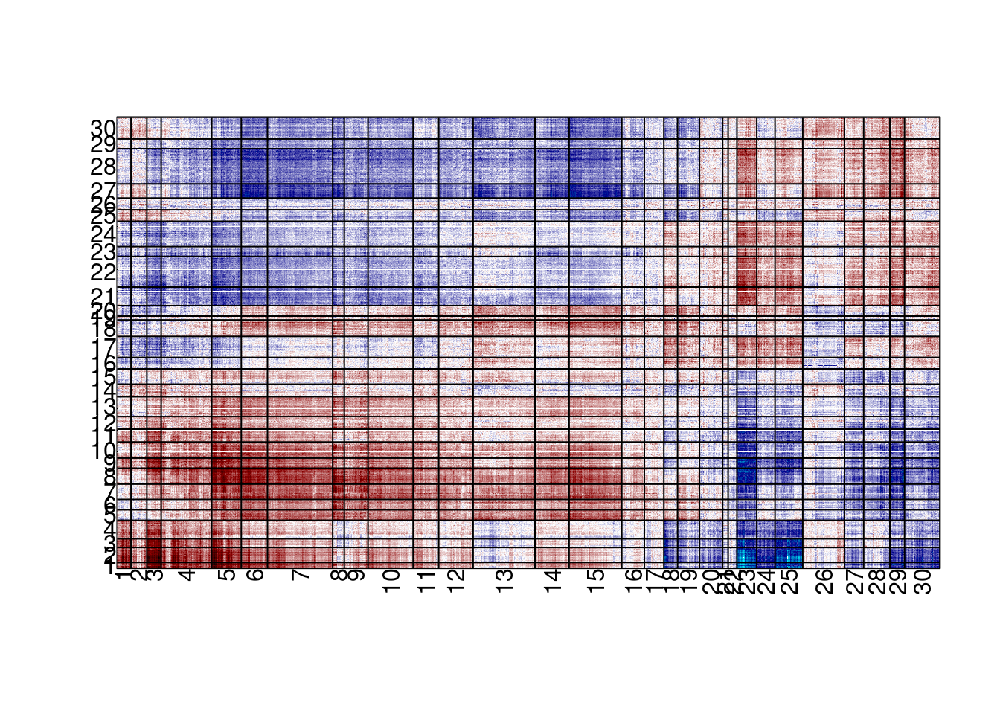


```r
dim(ER_positive_norm_meth$em_cross_clust$em_cross)
```

```
## [1] 2701 5879
```


```r
options(repr.plot.width = 7, repr.plot.height=10)
plot_em_cross_cor(ER_negative_norm_meth$em_cross_clust)
```

```
## plotting em cross
```

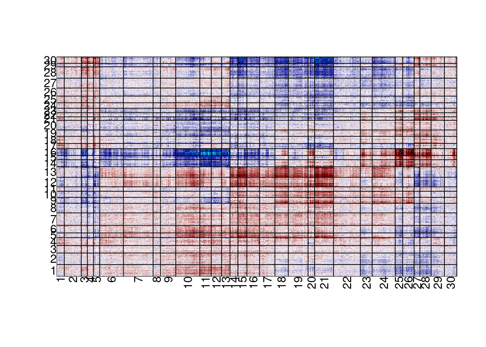


```r
dim(ER_negative_norm_meth$em_cross_clust$em_cross)
```

```
## [1]  3525 11054
```


```r
options(repr.plot.width = 7, repr.plot.height=10)
plot_em_cross_cor(normal_norm_meth$em_cross_clust)
```

```
## plotting em cross
```

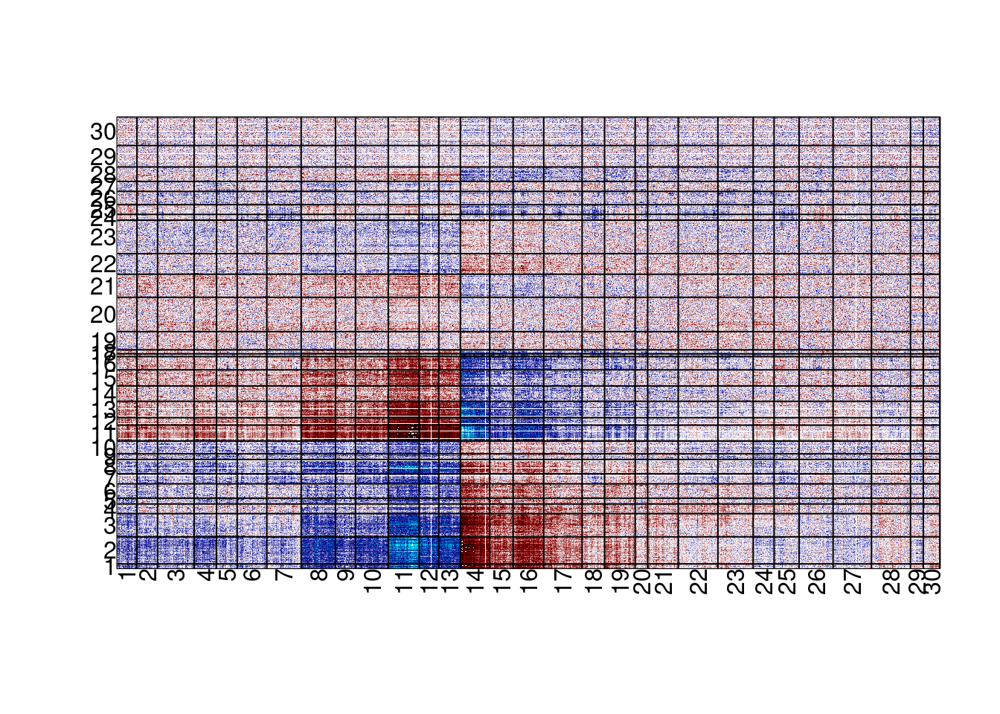


```r
dim(normal_norm_meth$em_cross_clust$em_cross)
```

```
## [1]  2636 16806
```

### Export clustering


We can export summary statistics (centers) of the expression-methylation clusters to excel files:


```r
methylayer::export_em_cross_mods(ER_negative_norm_meth$em_cross_clust, here("export", "em_cross_ER_negative.xlsx"))
methylayer::export_em_cross_mods(ER_positive_norm_meth$em_cross_clust, here("export", "em_cross_ER_positive.xlsx"))
methylayer::export_em_cross_mods(normal_norm_meth$em_cross_clust, here("export", "em_cross_normal.xlsx"))
```

## Diagnose TME normalization


We will extract the correlation of the raw and normalized methylation to gene expression of selected genes in order to see that our normalization worked. 


```r
before_after_df <- methylayer::calc_gene_cor_before_after_deconv(
    ER_positive_norm_meth, 
    all_meth, 
    c("CAV1", "CD3D", "GATA3", "TOP2A")) %cache_df% 
    here("data/gene_cor_before_after_ER_positive.tsv") %>% 
    as_tibble()
```


```r
before_after_df <- before_after_df %>% 
    select(-ends_with(".norm")) %>% 
    gather("gene", "cor_raw", -(chrom:end)) %>% 
    left_join(before_after_df %>% 
              select(chrom:end, ends_with(".norm")) %>% 
              gather("gene", "cor_norm", -(chrom:end)) %>% 
              mutate(gene = gsub(".norm$", "", gene)), by = c("chrom", "start", "end", "gene"))
```

#### Figure 1h


```r
options(repr.plot.width = 8, repr.plot.height = 8)

lims <- c(-0.7, 0.7)

p_before_after <- before_after_df %>% 
    mutate(ER = "ER+") %>%     
    mutate(
            cor_raw = tgutil::clip_vals(cor_raw, lims[1], lims[2]),
            cor_norm = tgutil::clip_vals(cor_norm, lims[1], lims[2])
        ) %>% 
    ggplot(aes(x=cor_raw, y=cor_norm, color=ER)) + 
        geom_point(size=0.001) + 
        scale_color_manual(values=annot_colors$ER1) + 
        geom_abline(linetype = "dashed") + 
        xlab("Raw methylation vs. expression correlation") +
        ylab("Normalized methylation\nvs. expression correlation") +
        facet_wrap(.~gene, nrow=2) + 
        guides(color="none") + 
        xlim(lims[1], lims[2]) +
        ylim(lims[1], lims[2]) +
        theme(aspect.ratio=1) + 
        theme(panel.grid.major = element_blank(), panel.grid.minor = element_blank())

p_before_after + theme_bw() + theme(aspect.ratio=1) + theme(panel.grid.major = element_blank(), panel.grid.minor = element_blank())
```

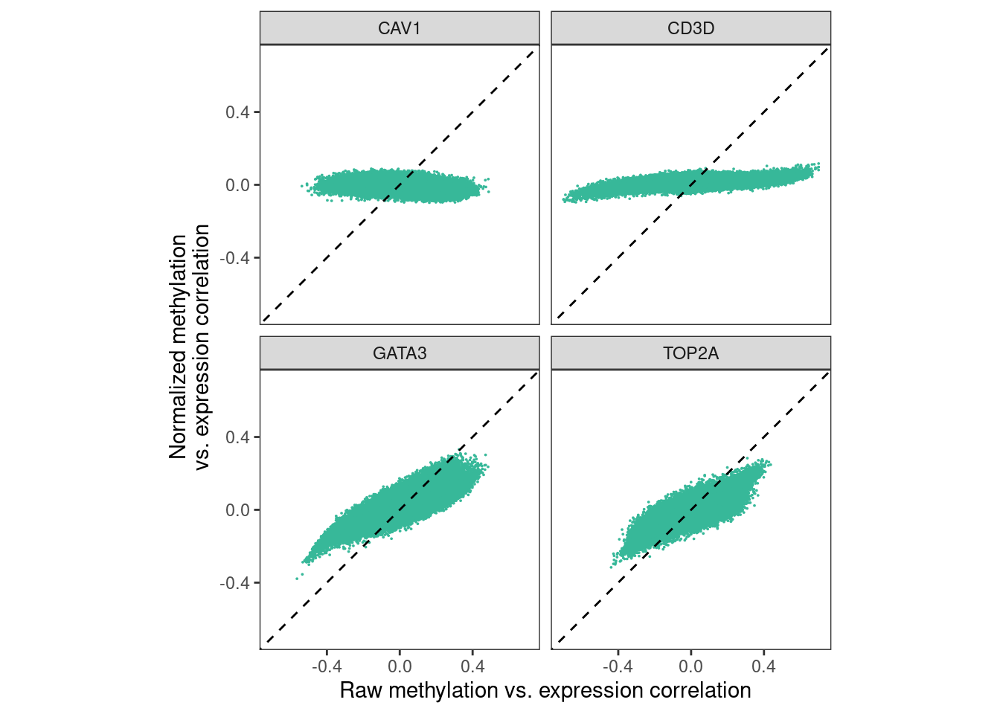

We plot the CAF and immune expression signatures against the promoter that is most anti-correlated with CD3D gene expression:


```r
get_top_cor_promoter <- function(gene, em_cross){
    em_cross[, gene] %>% 
        as.matrix() %>% 
        mat_to_intervs() %>% 
        rename(cor = V1) %>% 
        inner_join(promoter_intervs, by = c("chrom", "start", "end")) %>% 
        arrange(cor) %>% 
        slice(1) %>% 
        as_tibble()
}
```


```r
get_locus_before_after_meth <- function(deconv_list, raw_meth, intervals){
    raw_meth <- all_meth %>% 
        inner_join(intervals, by = c("chrom", "start", "end")) %>% 
        gather("samp", "raw_meth", -(chrom:end)) %>% 
        as_tibble()
    norm_meth <- deconv_list$norm_meth[intervals %>% intervs_to_mat() %>% rownames(), ]  %>% 
        enframe("samp", "norm_meth") %>% 
        as_tibble()
    return(raw_meth %>% left_join(norm_meth, by = "samp"))
}
```


```r
plot_before_after_gene_cor_meth <- function(gene, tme_df, deconv_list, raw_meth){
    anti_cor_gene <- get_top_cor_promoter(gene, deconv_list$em_cross$em_cross)
before_after_meth <- get_locus_before_after_meth(deconv_list, raw_meth, anti_cor_gene %>% select(chrom, start, end)) %>% add_ER()
    p_gene_norm_before_after <- tme_df %>% 
        left_join(before_after_meth, by = "samp") %>% 
        filter(ER == "ER+") %>% 
        select(samp, CAF=caf, Immune=immune, `Methylation`=raw_meth, `Normalized\nMethylation`=norm_meth) %>% 
        gather("type", "meth", -samp, -Immune, -CAF) %>% 
        mutate(type = factor(type, levels=c("Methylation", "Normalized\nMethylation"))) %>% 
        gather("expr_type", "expr", -samp, -type, -meth) %>% 
        ggplot(aes(x=meth, y=expr)) + 
            geom_point(size=0.1) + 
            facet_grid(expr_type~type, scales="free_x") + 
            theme(aspect.ratio=1) + xlab("")  + 
            ylab("Expression") + 
            scale_y_continuous(labels = scales::number_format(accuracy = 0.1)) + 
            ggtitle(glue("{anti_cor_gene$name[1]} ({gene})")) + vertical_labs()
    p_gene_norm_before_after
}
```

#### Extended Data Figure 3a-d


```r
p_cd3d_top_meth <- plot_before_after_gene_cor_meth("CD3D", tme_df, ER_positive_norm_meth, all_meth)
p_cav1_top_meth <- plot_before_after_gene_cor_meth("CAV1", tme_df, ER_positive_norm_meth, all_meth)
p_top2a_top_meth <- plot_before_after_gene_cor_meth("TOP2A", tme_df, ER_positive_norm_meth, all_meth)
p_gata3_top_meth <- plot_before_after_gene_cor_meth("GATA3", tme_df, ER_positive_norm_meth, all_meth)

p_cd3d_top_meth + theme_bw()
```

```
## Warning: Removed 12 rows containing missing values (geom_point).
```

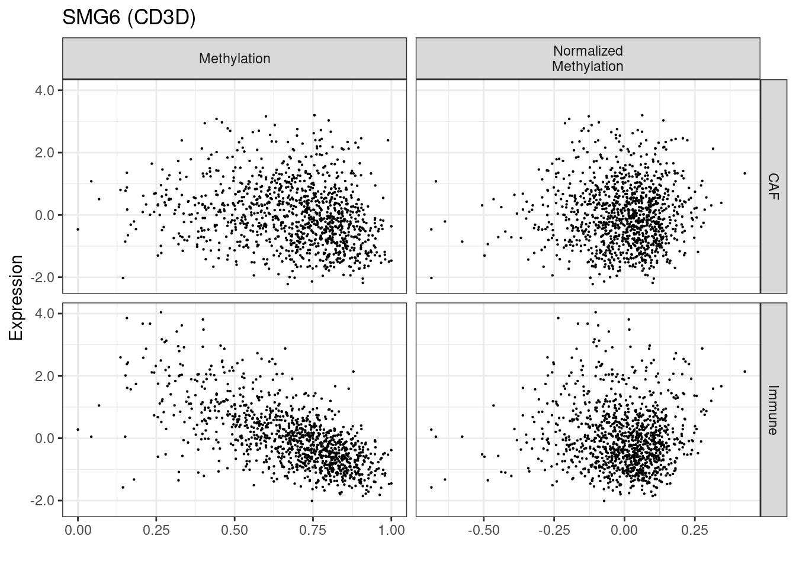

```r
p_cav1_top_meth + theme_bw()
```

```
## Warning: Removed 4 rows containing missing values (geom_point).
```

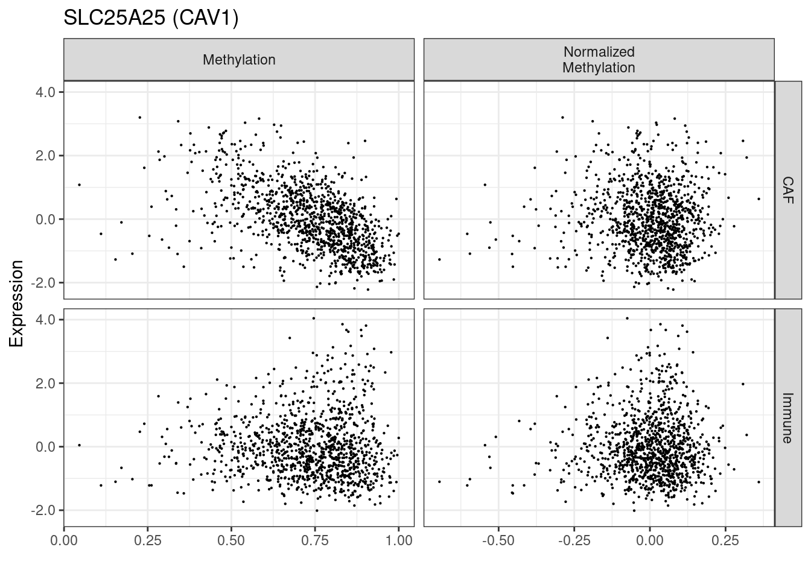

```r
p_top2a_top_meth + theme_bw()
```

```
## Warning: Removed 84 rows containing missing values (geom_point).
```

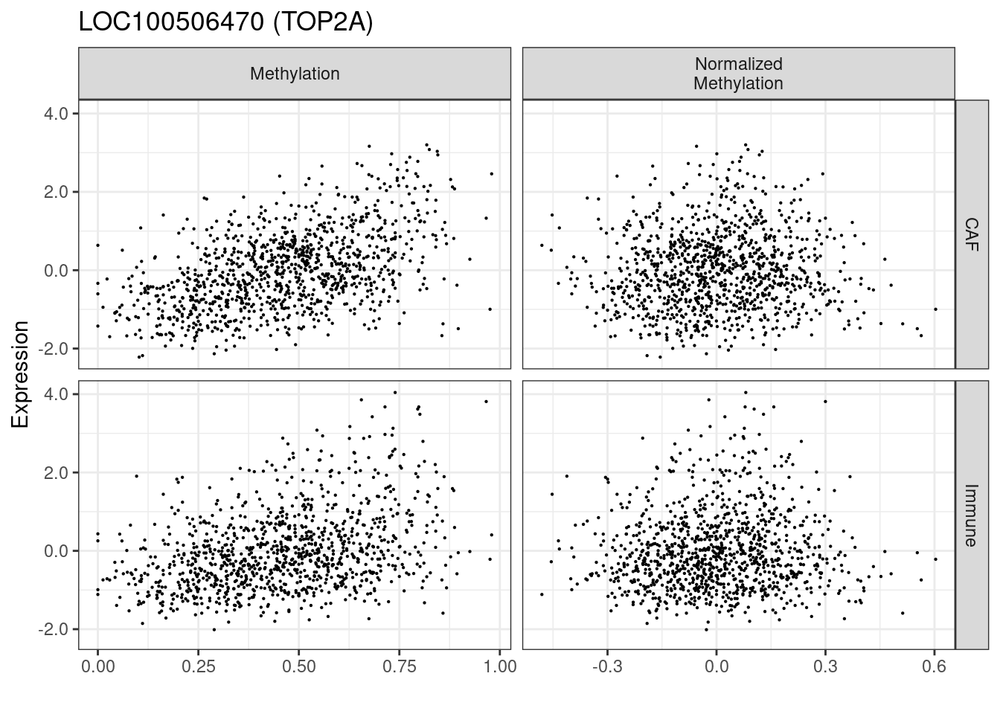

```r
p_gata3_top_meth + theme_bw()
```

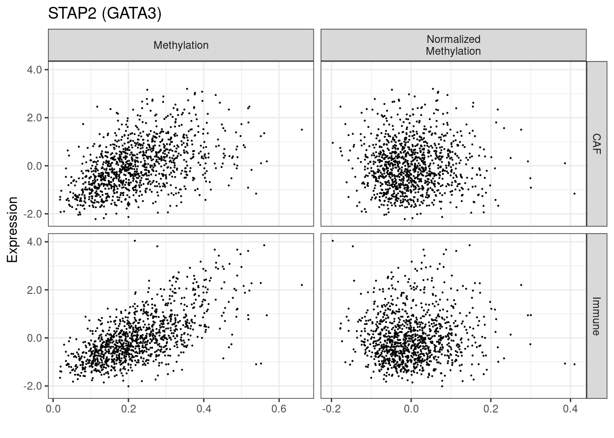

## Plot CD3D and CAV1 vs immune and CAF methylation modules


#### Figure 1f


```r
options(repr.plot.width = 8, repr.plot.height = 4)

df <- tme_df %>%     
    add_ER() %>% 
    left_join(expr_mat["CD3D", ] %>% 
    enframe("samp", "expr")) %>% 
    filter(ER != "normal") %>%     
    as_tibble() 
```

```
## Joining, by = "samp"
```

```r
rho_df <- df %>% 
    group_by(ER) %>% 
    summarise(rho = cor(immune.meth, expr, use="pairwise.complete.obs", method="spearman")) %>% 
    mutate(label = sprintf("~rho == %0.2f", rho))


p_CD3D <- df %>% 
    ggplot(aes(x=immune.meth, y=expr, color=ER)) + 
        geom_point(size=0.1) + 
        scale_color_manual(values=annot_colors$ER1) + 
        theme(aspect.ratio=1) + 
        guides(color=FALSE) + 
        facet_wrap(.~ER) + 
        xlab("Immune methylation module") + 
        ylab("CD3D expression")        
```

```
## Warning: `guides(<scale> = FALSE)` is deprecated. Please use `guides(<scale> =
## "none")` instead.
```

```r
p_CD3D + geom_text(data = rho_df, inherit.aes = FALSE, x = 0.65, y = 11, aes(label=label), parse=TRUE, size=5)
```

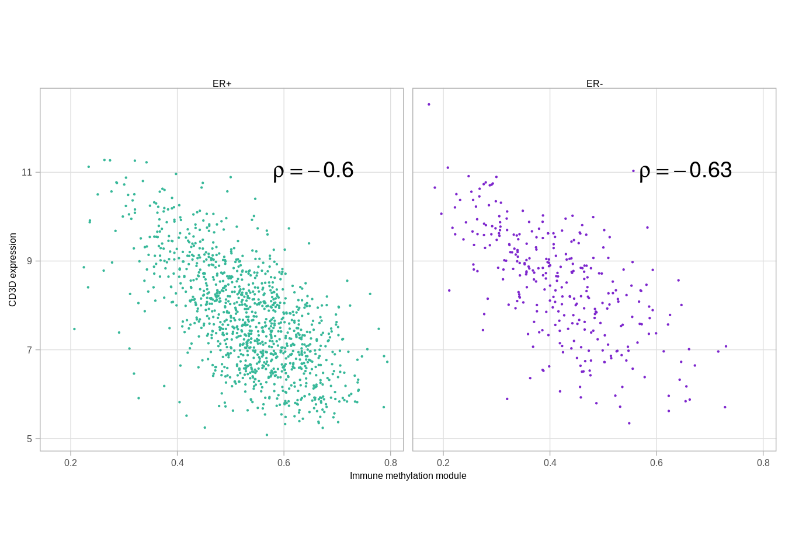


```r
options(repr.plot.width = 8, repr.plot.height = 4)

df <- tme_df %>%     
    add_ER() %>% 
    left_join(expr_mat["CAV1", ] %>% 
    enframe("samp", "expr")) %>% 
    filter(ER != "normal") %>%     
    as_tibble() 
```

```
## Joining, by = "samp"
```

```r
rho_df <- df %>% 
    group_by(ER) %>% 
    summarise(rho = cor(caf.meth, expr, use="pairwise.complete.obs", method="spearman")) %>% 
    mutate(label = sprintf("~rho == %0.2f", rho))


p_CAV1 <- df %>% 
    ggplot(aes(x=caf.meth, y=expr, color=ER)) + 
        geom_point(size=0.1) + 
        scale_color_manual(values=annot_colors$ER1) + 
        theme(aspect.ratio=1) + 
        guides(color=FALSE) + 
        facet_wrap(.~ER) + 
        xlab("CAFs methylation module") + 
        ylab("CAV1 expression") 
```

```
## Warning: `guides(<scale> = FALSE)` is deprecated. Please use `guides(<scale> =
## "none")` instead.
```

```r
p_CAV1 + geom_text(data = rho_df, inherit.aes = FALSE, x = 0.65, y = 11, aes(label=label), parse=TRUE, size=5)
```

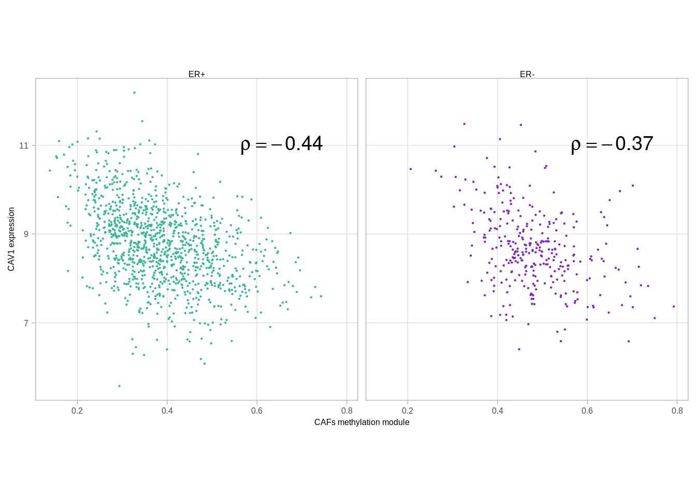

#### Extended Data Figure 2c


```r
options(repr.plot.width = 8, repr.plot.height = 4)

df <- expr_mat[c("CAV1", "CD3D"), ] %>% t() %>% as.data.frame() %>% rownames_to_column("samp") %>% as_tibble() %>% add_ER() %>% filter(ER != "normal")
    
rho_df <- df %>% 
    group_by(ER) %>% 
    summarise(rho = cor(CAV1, CD3D, use="pairwise.complete.obs", method="spearman")) %>% 
    mutate(label = sprintf("~rho == %0.2f", rho))


p_CAV1_CD3D <- df %>% 
    ggplot(aes(x=CAV1, y=CD3D, color=ER)) + 
        geom_point(size=0.1) + 
        scale_color_manual(values=annot_colors$ER1) + 
        theme(aspect.ratio=1) + 
        guides(color="none") + 
        facet_wrap(.~ER) + 
        xlab("CAV1 expression") + 
        ylab("CD3D expression") 
        

p_CAV1_CD3D + geom_text(data = rho_df, inherit.aes = FALSE, x = 11.5, y = 11.5, aes(label=label), parse=TRUE, size=5)
```

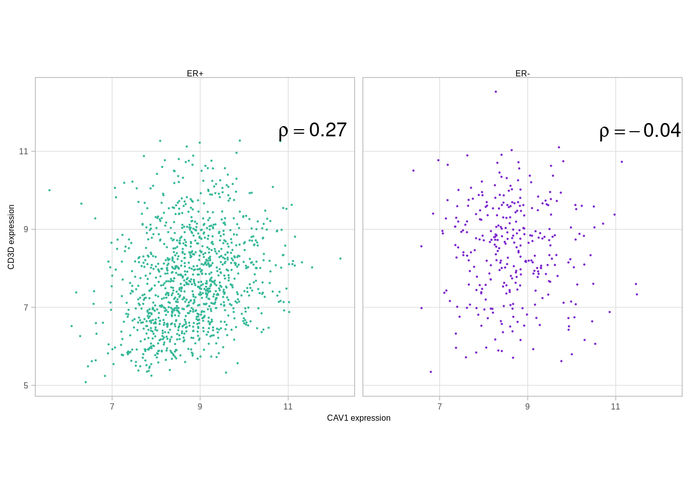


```r
options(repr.plot.width = 8, repr.plot.height = 4)

df <- tme_df %>%         
    add_ER() %>% 
    filter(ER != "normal") %>%     
    as_tibble() 
    
rho_df <- df %>% 
    group_by(ER) %>% 
    summarise(rho = cor(caf.meth, immune.meth, use="pairwise.complete.obs", method="spearman")) %>% 
    mutate(label = sprintf("~rho == %0.2f", rho))


p_immune_caf <- df %>% 
    ggplot(aes(x=caf.meth, y=immune.meth, color=ER)) + 
        geom_point(size=0.1) + 
        scale_color_manual(values=annot_colors$ER1) + 
        theme(aspect.ratio=1) + 
        guides(color="none") + 
        facet_wrap(.~ER) + 
        xlab("CAFs methylation module") + 
        ylab("Immune methylation module")         

p_immune_caf + geom_text(data = rho_df, inherit.aes = FALSE, x = 0.7, y = 0.4, aes(label=label), parse=TRUE, size=5)
```

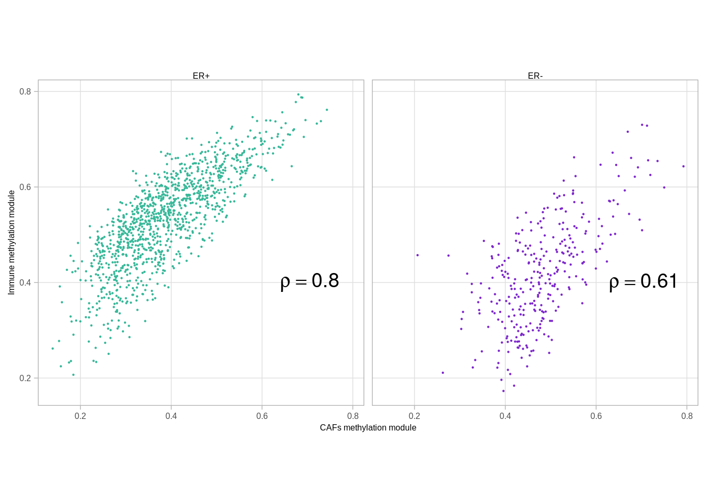

## Annotate TME scores


We reverse immune and CAF methylation scores so as higher score => more progressed. 


```r
feats <- tme_df %>% mutate(immune.meth = -immune.meth, caf.meth = -caf.meth)
```

We will calculate the distribution of tumor grade stratified by five bins of Immune/CAF methylation scores:


```r
nbins <- 5
df <- feats %>%     
    mutate(        
        immune = cut(immune, quantile(immune, 0:nbins/nbins, na.rm=TRUE), include.lowest=TRUE, labels=1:nbins), 
        caf = cut(caf, quantile(caf, 0:nbins/nbins, na.rm=TRUE), include.lowest=TRUE, labels=1:nbins), 
        immune.meth = cut(immune.meth, quantile(immune.meth, 0:nbins/nbins, na.rm=TRUE), include.lowest=TRUE, labels=1:nbins), 
        caf.meth = cut(caf.meth, quantile(caf.meth, 0:nbins/nbins, na.rm=TRUE), include.lowest=TRUE, labels=1:nbins)) %>% 
    left_join(samp_data %>% select(samp, ER=ER1, stage, grade), by = "samp") %>% 
    mutate(stage = ifelse(stage %in% c(0, "DCIS", 1), "0-1", stage)) %>% 
    mutate(stage = ifelse(ER == "normal", "N", stage)) %>% 
    mutate(grade = ifelse(ER == "normal", "N", grade))
```

Calculate p-values:


```r
df %>% 
    filter(ER %in% c("ER+", "ER-")) %>% 
    gather("feat", "bin", -samp, -ER, -stage, -grade) %>% 
    group_by(ER, feat) %>% 
    summarise(grade_pval = chisq.test(bin, grade)$p.value, stage_pval = chisq.test(bin, stage)$p.value) %>%
    mutate(signif = case_when(grade_pval <= 0.0001 ~ "****", grade_pval <= 0.001 ~ "***", grade_pval <= 0.01 ~ "**", grade_pval <= 0.05 ~ "*")) %>% 
    as.data.frame()
```

```
## Warning in chisq.test(bin, grade): Chi-squared approximation may be incorrect

## Warning in chisq.test(bin, grade): Chi-squared approximation may be incorrect

## Warning in chisq.test(bin, grade): Chi-squared approximation may be incorrect

## Warning in chisq.test(bin, grade): Chi-squared approximation may be incorrect
```

```
## Warning in chisq.test(bin, stage): Chi-squared approximation may be incorrect

## Warning in chisq.test(bin, stage): Chi-squared approximation may be incorrect

## Warning in chisq.test(bin, stage): Chi-squared approximation may be incorrect

## Warning in chisq.test(bin, stage): Chi-squared approximation may be incorrect

## Warning in chisq.test(bin, stage): Chi-squared approximation may be incorrect

## Warning in chisq.test(bin, stage): Chi-squared approximation may be incorrect

## Warning in chisq.test(bin, stage): Chi-squared approximation may be incorrect
```

```
##    ER        feat    grade_pval  stage_pval signif
## 1 ER-         caf 0.00022642925 0.001946125    ***
## 2 ER-    caf.meth 0.00308191469 0.209690818     **
## 3 ER-      immune 0.37129150376 0.580276177   <NA>
## 4 ER- immune.meth 0.30517904201 0.102242249   <NA>
## 5 ER+         caf 0.00006512545 0.060334718   ****
## 6 ER+    caf.meth 0.00001267372 0.070515621   ****
## 7 ER+      immune 0.00063631960 0.457202009    ***
## 8 ER+ immune.meth 0.00557962596 0.293001516     **
```

#### Figure 1g


```r
options(repr.plot.width = 6, repr.plot.height = 4)
p_grade_immune_positive <- df %>% 
    filter(ER == "ER+") %>% 
    mutate(grade = factor(grade, levels = c("N", "1", "2", "3"))) %>% 
    filter(!is.na(grade)) %>% 
    count(grade, immune.meth) %>% 
    group_by(immune.meth) %>% 
    mutate(p = n / sum(n)) %>% 
    ggplot(aes(x=immune.meth, y=p, fill=grade)) + 
        geom_col() + 
        scale_fill_manual(name = "Grade", values = c("N" = "gray", "1" = "darkblue", "2" = "red", "3" = "orange")) + 
        scale_y_continuous(labels=scales::percent) + 
        xlab("Immune") + 
        ylab("% of samples") + 
        ggtitle("ER+")
p_grade_immune_positive + theme_bw()
```

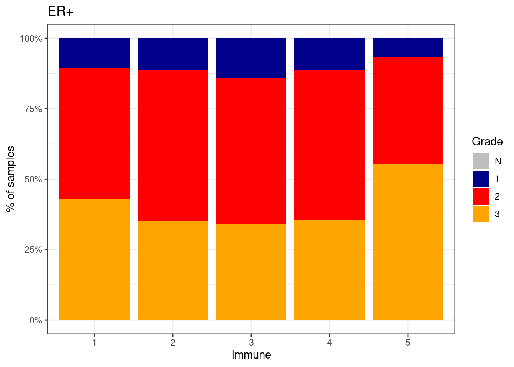


```r
p_grade_caf_positive <- df %>% 
    filter(ER == "ER+") %>% 
    mutate(grade = factor(grade, levels = c("N", "1", "2", "3"))) %>% 
    filter(!is.na(grade)) %>% 
    count(grade, caf.meth) %>% 
    group_by(caf.meth) %>% 
    mutate(p = n / sum(n)) %>% 
    ggplot(aes(x=caf.meth, y=p, fill=grade)) + 
        geom_col() + 
        scale_fill_manual(name = "Grade", values = c("N" = "gray", "1" = "darkblue", "2" = "red", "3" = "orange")) + 
        scale_y_continuous(labels=scales::percent) + 
        ylab("% of samples") + 
        xlab("CAF") + 
        ggtitle("ER+")
p_grade_caf_positive + theme_bw()
```

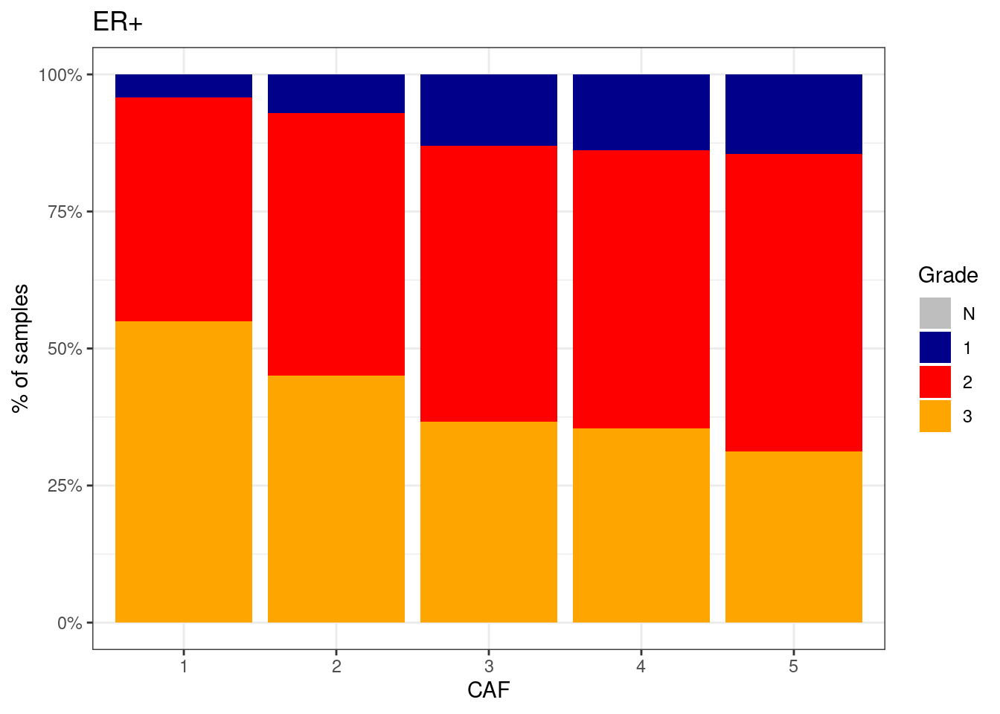


```r
p_grade_immune_negative <- df %>% 
    filter(ER == "ER-") %>% 
    mutate(grade = factor(grade, levels = c("N", "1", "2", "3"))) %>% 
    filter(!is.na(grade)) %>% 
    count(grade, immune.meth) %>% 
    group_by(immune.meth) %>% 
    mutate(p = n / sum(n)) %>% 
    ggplot(aes(x=immune.meth, y=p, fill=grade)) + 
        geom_col() + 
        scale_fill_manual(name = "Grade", values = c("N" = "gray", "1" = "darkblue", "2" = "red", "3" = "orange")) + 
        scale_y_continuous(labels=scales::percent) + 
        ylab("% of samples") + 
        xlab("Immune") + 
        ggtitle("ER-")
p_grade_immune_negative + theme_bw()
```

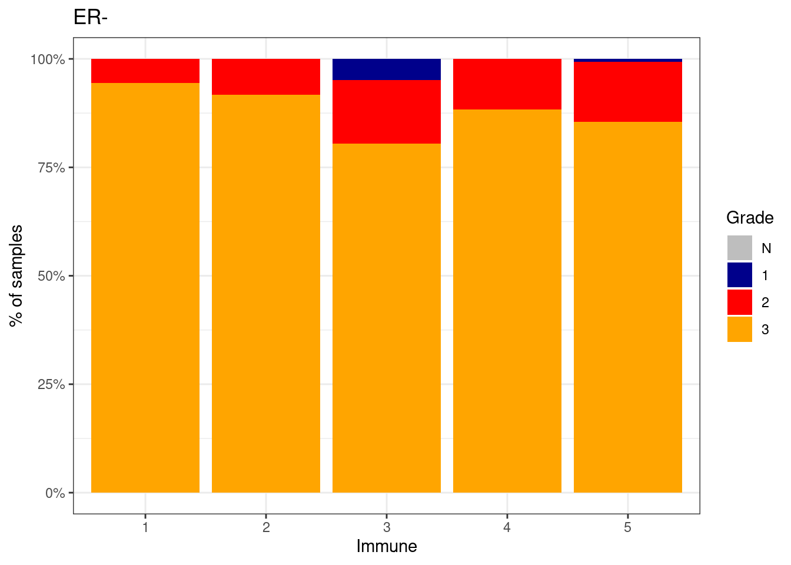


```r
p_grade_caf_negative <- df %>% 
    filter(ER == "ER-") %>% 
    mutate(grade = factor(grade, levels = c("N", "1", "2", "3"))) %>% 
    filter(!is.na(grade)) %>% 
    count(grade, caf.meth) %>% 
    group_by(caf.meth) %>% 
    mutate(p = n / sum(n)) %>% 
    ggplot(aes(x=caf.meth, y=p, fill=grade)) + 
        geom_col() + 
        scale_fill_manual(name = "Grade", values = c("N" = "gray", "1" = "darkblue", "2" = "red", "3" = "orange")) + 
        scale_y_continuous(labels=scales::percent) + 
        ylab("% of samples") + 
        xlab("CAF") + 
        ggtitle("ER-")
p_grade_caf_negative + theme_bw()
```

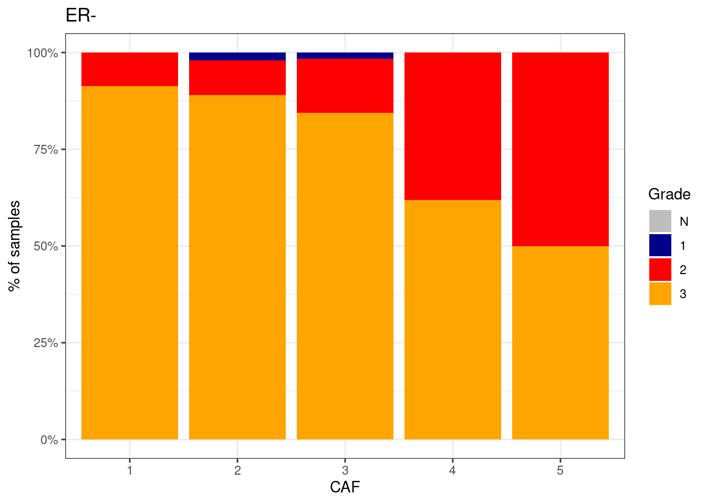

## Appendix: Sensitivity analysis of TME normalization


#### Extended Data Figure 3e


```r
get_TME_deconv_sensitivity <- function(prom_avg_meth, expr_mat, all_meth){
    {
        calc_tme_gene_cor <- function(samples, k, genes = c("CAV1", "CD3D", "TOP2A", "GATA3")){
            print(k)
            deconv_list <- deconv_TME_metabric(prom_avg_meth, all_meth, expr_mat, samples, k = k) 
            calc_gene_cor_before_after_deconv(deconv_list, all_meth, genes) %>% mutate(k = k)
        }

        ER_pos_df <- map_dfr(seq(5,60,5), ~ calc_tme_gene_cor(ER_positive_samples, .x) %>% mutate(ER = "ER+"))
        ER_neg_df <- map_dfr(seq(5,60,5), ~ calc_tme_gene_cor(ER_negative_samples, .x) %>% mutate(ER = "ER-"))
        normal_df <- map_dfr(seq(5,60,5), ~ calc_tme_gene_cor(normal_samples, .x) %>% mutate(ER = "normal+"))

        sens_df <- bind_rows(ER_pos_df, ER_neg_df, normal_df)
        sens_df 
    } %cache_df% here("data/TME_sensetivity.tsv") %>% as_tibble()
}
```


```r
sens_df <- get_TME_deconv_sensitivity(prom_avg_meth, expr_mat, all_meth) %>% mutate(ER = factor(ER, levels = c("ER+", "ER-", "normal")))
```


```r
options(repr.plot.width = 8, repr.plot.height = 5)
CD3D_plot <- sens_df %>% 
    mutate(cor = CD3D.norm) %>% 
    ggplot(aes(x=factor(k), y=cor)) + 
        geom_violin(fill="gray") + 
        ggtitle("CD3D") + 
        xlab("K") + 
        ylab("Normalized methylation\ncorrelation") + 
        facet_grid(.~ER) + 
        ylim(-0.6, 0.6) + 
        theme(aspect.ratio=0.8) + 
        vertical_labs()
CAV_plot <- sens_df %>% 
        mutate(cor = CAV1.norm) %>% 
        ggplot(aes(x=factor(k), y=cor)) + 
            geom_violin(fill="gray") + 
            ggtitle("CAV1") + 
            xlab("K") + 
            ylab("Normalized methylation\ncorrelation") + facet_grid(.~ER) + ylim(-0.6, 0.6) + theme(aspect.ratio=0.8) + vertical_labs()

p_sens <- cowplot::plot_grid(CD3D_plot, CAV_plot, nrow=2, align = "hv")
p_sens
```

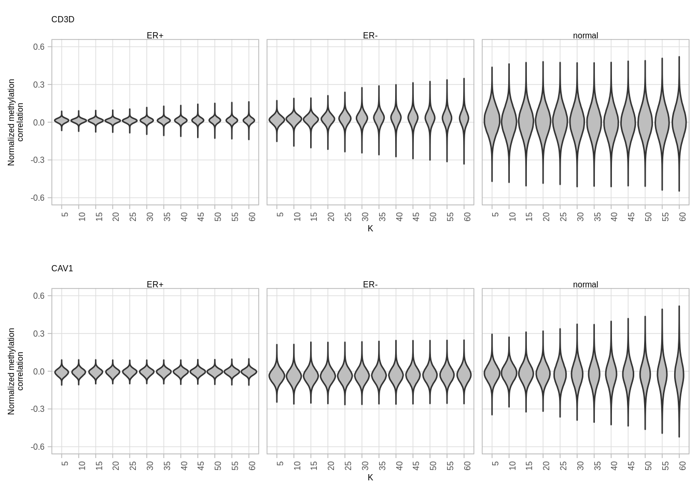

We can see that larger values of K lead to less effective normalization (wider correlation distribution) of the CAF and immune signatures since the neighborhood becomes less homogenous in the Immune/CAF space. 


```r
gc()
```

```
##              used    (Mb) gc trigger    (Mb)   max used    (Mb)
## Ncells    4549619   243.0    8043172   429.6    8043172   429.6
## Vcells 1994787427 15219.1 3106352163 23699.6 2588522739 19748.9
```
