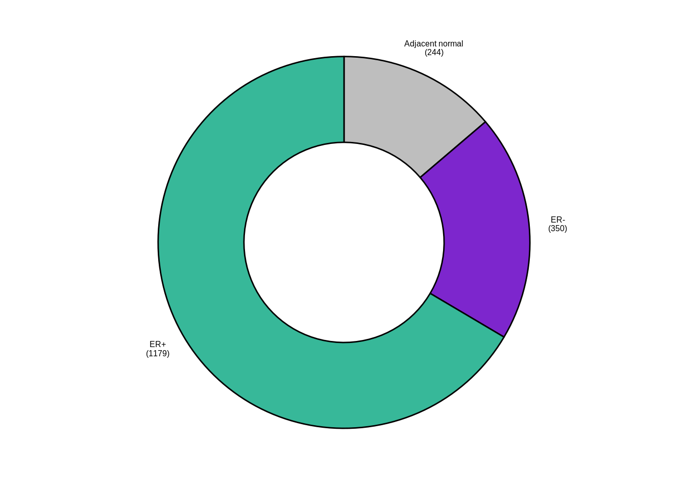
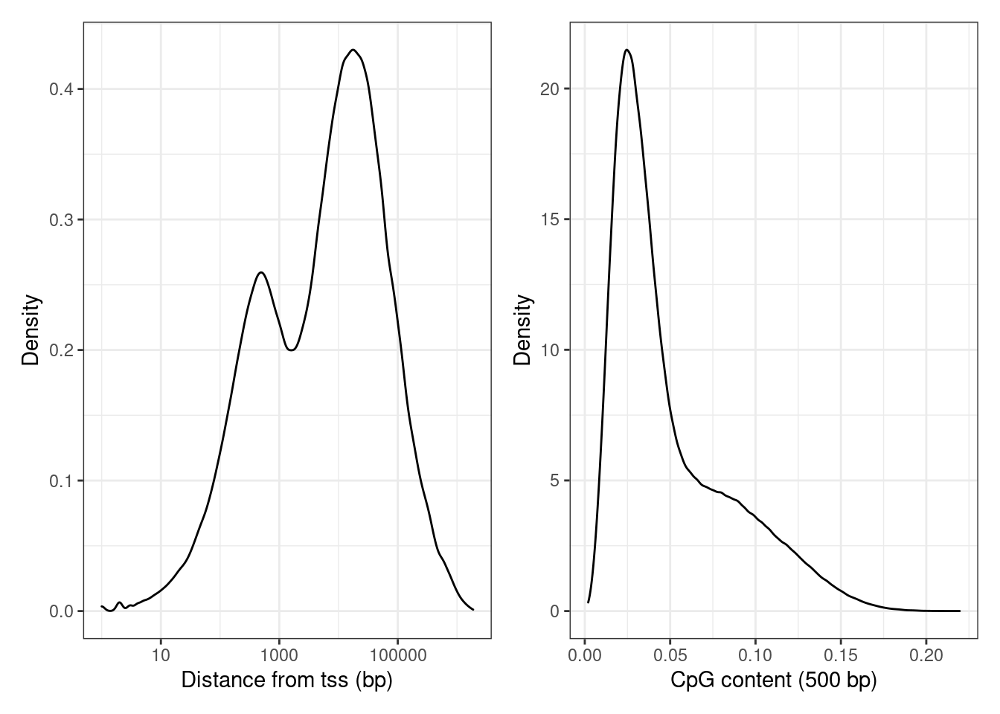
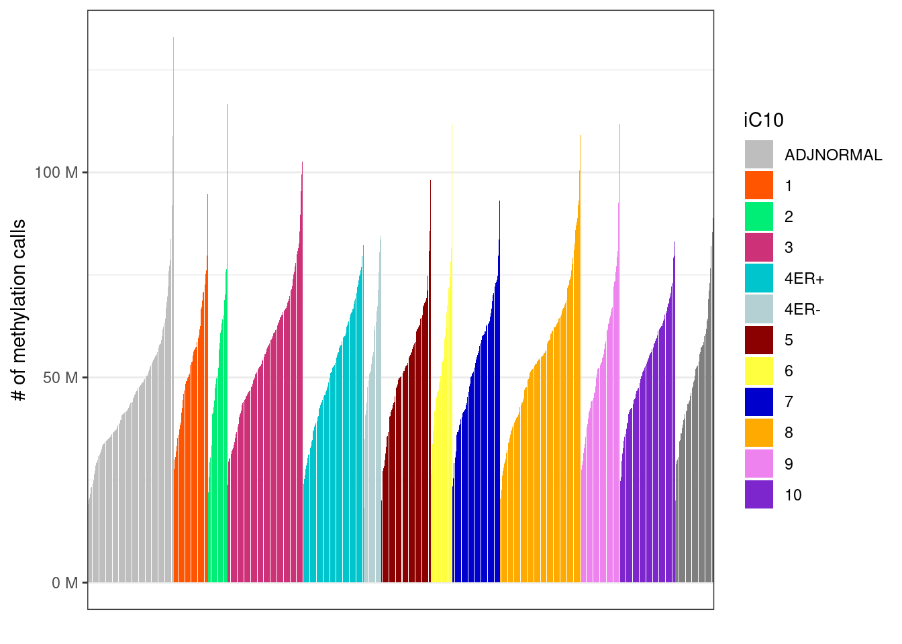
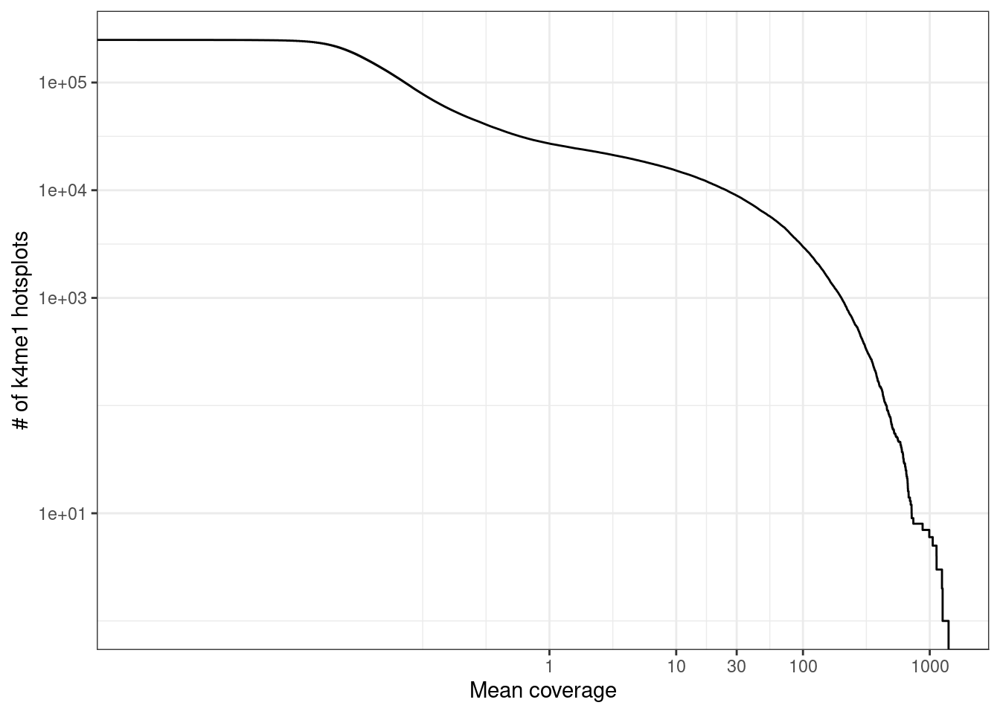
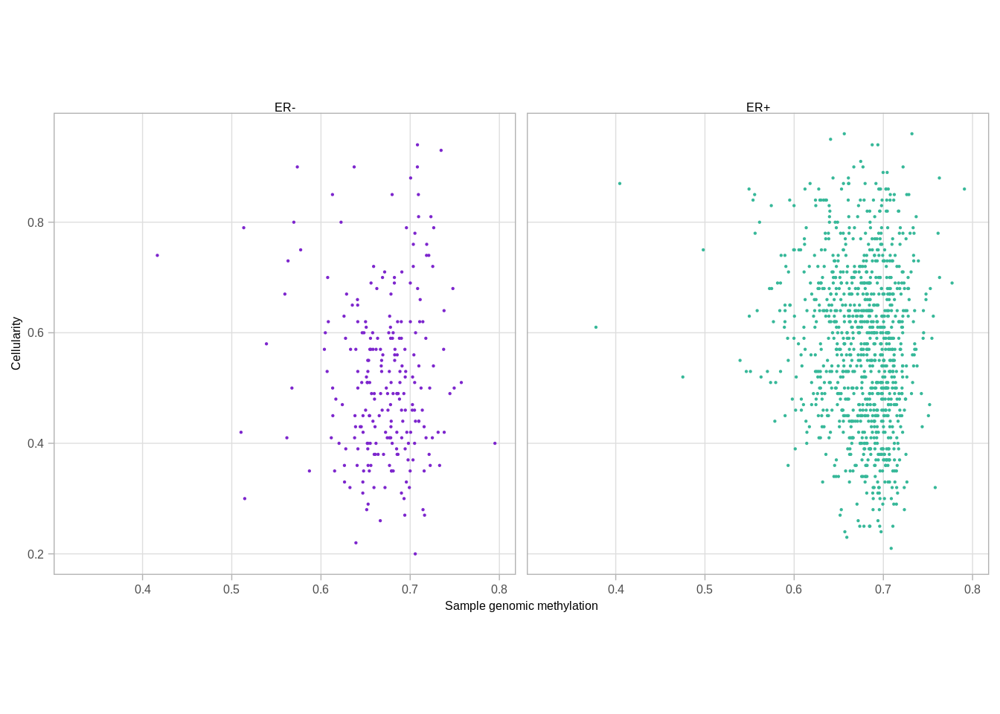

---
jupyter:
  jupytext:
    formats: ipynb,Rmd
    text_representation:
      extension: .Rmd
      format_name: rmarkdown
      format_version: '1.2'
      jupytext_version: 1.11.4
  kernelspec:
    display_name: R
    language: R
    name: ir
---

# METABRIC methylation data statistics


```r
source(here::here("scripts/init.R"))
```

## Breakdown of samples


#### Figure 1A


```r
options(repr.plot.width = 7, repr.plot.height = 7)

p_donut <- samp_data %>%
        count(IHC) %>%
        filter(!is.na(IHC)) %>%
        left_join(
            tibble(
                IHC = c("ER+HER2-", "ER+HER2+", "ER-HER2+", "TNBC", "ADJNORMAL"),
                group = c("ER+", "ER+HER2+", "ER-HER2+", "Triple negative", "Adjacent normal")
            ), by = "IHC") %>%
        mutate(
            IHC = factor(IHC, levels = c("ER+HER2-", "ER+HER2+", "ER-HER2+", "TNBC", "ADJNORMAL")),
            lab = glue("{group}\n({n})")
        ) %>%
        ggpubr::ggdonutchart("n", "lab", fill = "IHC", lab.pos = "out", palette = annot_colors$IHC, font.family = "Arial", lab.font = c(6, "bold", "black"), ggtheme = ggpubr::theme_pubr(base_size = 6, base_family = "Arial")) + guides(fill = "none")


p_donut1 <- samp_data %>%
        count(ER1) %>%
        rename(ER = ER1) %>% 
        filter(!is.na(ER)) %>%
        left_join(
            tibble(
                ER = c("ER+", "ER-", "normal"),
                group = c("ER+", "ER-", "Adjacent normal")
            ), by = "ER") %>%
        mutate(
            ER = factor(ER, levels = c("ER+", "ER-", "normal")),
            lab = glue("{group}\n({n})")
        ) %>%
        ggpubr::ggdonutchart("n", "lab", fill = "ER", lab.pos = "out", palette = annot_colors$ER1, font.family = "Arial", lab.font = c(6, "bold", "black"), ggtheme = ggpubr::theme_pubr(base_size = 6, base_family = "Arial")) + guides(fill = "none")

p_donut
```


```r
p_donut1
```



## Number of samples


```r
samp_data %>% mutate(ER1 = forcats::fct_explicit_na(ER1)) %>% count(ER1)
```

```
## # A tibble: 4 x 2
##         ER1    n
## 1       ER-  350
## 2       ER+ 1179
## 3    normal  244
## 4 (Missing)    9
```

## Total number of reads


```r
tot_reads <- fread(here("data/sample_qc.csv")) %>%     
    inner_join(samp_data %>% 
        select(track), by = "track") %>% 
    pull(total_reads) %>% 
    sum() 

glue("Overall, we used {round(tot_reads / 1e9, digits = 1)}B reads to cover {scales::comma(nrow(samp_data))} breast tumor and normal samples")
```

```
## Overall, we used 30.4B reads to cover 1,782 breast tumor and normal samples
```

## Distribution of CpG coverage per sample


We calculate the distribution of every sample's CpG coverage:


```r
samp_covs <- get_samples_coverage_dist(
    tracks = samp_data$track, 
    breaks = c(0:100, 1e5), 
    intervals = gintervals.all()) %cache_df% here("data/sample_coverage_dist.tsv") %>% as_tibble()
```


```r
samp_covs <- samp_covs %>% left_join(samp_data %>% select(samp, ER = ER1), by = "samp")
```

#### Figure 1B


```r
options(repr.plot.width = 7, repr.plot.height = 7)
p_comulative <- samp_covs %>%
        group_by(samp) %>%
        summarise(
            `>=10` = sum(cpgs[cov >= 10]),
            `>=20` = sum(cpgs[cov >= 20]),
            `>=30` = sum(cpgs[cov >= 30]),
            `>=50` = sum(cpgs[cov >= 50]),
            n_tot = sum(cpgs)
        ) %>%
        gather("type", "n", -samp, -n_tot) %>%
        ggplot(aes(x = n, color = type, y = 1 - ..y..)) +
        stat_ecdf() +
        scale_x_log10(labels = scales::scientific) +
        scale_color_viridis_d("CpG coverage") +
        scale_y_continuous(labels = function(x) round(x * length(unique(samp_covs$samp)))) +
        ylab("Samples with #CpGs >= x") +
        xlab("# of CpGs (log10)") +
        theme(aspect.ratio = 0.8)

p_comulative + theme_bw() + theme(aspect.ratio = 0.8)
```


```r
cov_above_10 <- samp_covs %>% 
    filter(cov >= 10) %>% 
    group_by(samp) %>% 
    summarise(cpgs = sum(cpgs))

df <- cov_above_10 %>%
    summarise(n_threshold = sum(cpgs >= 1e6), n_tot = n()) %>% 
    mutate(p = scales::percent(n_threshold / n_tot))

glue("Number of samples (Y axis) with a given number of CpGs (X axis) covered with at least 10, 20, 30 or 50 reads. For example, in all samples 449,710 CpGs are covered with over 10 reads.", n_cpgs = scales::comma(min(cov_above_10$cpgs)))
```

```
## Number of samples (Y axis) with a given number of CpGs (X axis) covered with at least 10, 20, 30 or 50 reads. For example, in all samples 449,710 CpGs are covered with over 10 reads.
```

```r
glue("Using our version of the RRBS protocol {perc} of the samples were covered by more than 10 reads for more than 1M CpGs", perc = df$p)
```

```
## Using our version of the RRBS protocol 93% of the samples were covered by more than 10 reads for more than 1M CpGs
```

## Distribution of covered CpGs


We screen for CpGs that are covered by at least 5 reads in half or more of the samples:


```r
min_samples <- round(0.5 * nrow(samp_data))
min_samples
```

```
## [1] 891
```


```r
cov_cpgs <- gscreen_coverage(samp_data$track, 5, min_samples) %>% annotate_loci() %cache_df% here("data/cov_cpgs.tsv") %>% as_tibble()
```

#### Figure 1C


```r
options(repr.plot.width = 7, repr.plot.height = 3)
p_tss <- cov_cpgs %>%
        mutate(tss_d = abs(tss_d) + 1) %>%
        ggplot(aes(x = tss_d)) +
        geom_density() +
        scale_x_log10() +
        xlab("Distance from tss (bp)") +
        ylab("Density")

p_cg_cont <- cov_cpgs %>%
        ggplot(aes(x = cg_cont)) +
        geom_density() +
        xlab("CpG content (500 bp)") +
        ylab("Density")

(p_tss + theme_bw()) + (p_cg_cont + theme_bw())
```

```
## Warning: Removed 147 rows containing non-finite values (stat_density).
```



## Promoter coverage


Distribution of mean promoter coverage over all METABRIC samples, considering 13,282 active promoters. Active promoters were defined as promoters that had log expression >7 in at least one of the METABRIC samples used in this paper.


#### Figure 1D


```r
options(repr.plot.width = 4.6, repr.plot.height = 2.7)
prom_expr_cov <- get_promoter_expr_covs()

min_n_expr <- 0
max_expr <- 7

prom_expr_cov_active <- prom_expr_cov %>%
        filter(n_expr > min_n_expr, max_expr > !! max_expr)

p_prom_cov <- prom_expr_cov_active  %>%
        ggplot(aes(x = cov)) +
        geom_histogram(binwidth = 0.1) +
        scale_x_log10(breaks = c(1, 10, 50, 1000), labels = function(x) round(x)) +
        coord_cartesian(xlim = c(0.01,1500)) + 
        ylab("# of promoters") +
        xlab("Mean promoter coverage")

p_prom_cov + theme_bw()
```

```
## Warning: Transformation introduced infinite values in continuous x-axis
```

```
## Warning: Removed 119 rows containing non-finite values (stat_bin).
```


```r
nrow(prom_expr_cov_active)
```

```
## [1] 13198
```


```r
n_cov <- prom_expr_cov_active %>% filter(cov >= 20) %>% nrow()

glue("{perc} of the promoters were nevertheless covered with over 20 reads on average (mean coverage {cov}), facilitating quantitative analysis downstream.", perc = scales::percent(n_cov / nrow(prom_expr_cov_active)), cov = round(mean(prom_expr_cov_active$cov) ))
```

```
## 75% of the promoters were nevertheless covered with over 20 reads on average (mean coverage 246), facilitating quantitative analysis downstream.
```


```r
samp_tot_calls <- get_sample_tot_meth_calls() %cache_df% here("data/sample_tot_meth_calls.tsv") %>% as_tibble()
samp_tot_calls_promoters <- get_sample_tot_meth_calls(promoter_intervs) %cache_df% here("data/sample_tot_meth_calls_promoters.tsv") %>% as_tibble()
tot_reads <- sum(samp_tot_calls$Sum)
tot_promoter_reads <- sum(samp_tot_calls_promoters$Sum)
glue("{perc} of the reads mapped to bona-fide promoters", perc = scales::percent(tot_promoter_reads / tot_reads))
```

```
## 9% of the reads mapped to bona-fide promoters
```

We can also calculate the % of MSP1 fragments that is covering a promoter: 


```r
well_covered_loci <- {
    msp1_meth <- get_msp1_meth()
    msp1_meth_f <- filter_avg_meth(msp1_meth$avg, normal_fraction = 0.7, tumor_fraction = 0.7)
    msp1_meth_f %>% select(chrom, start, end)
} %cache_df% here("data/well_covered_msp1_frags.tsv") %>% as_tibble()

n_loci <- nrow(well_covered_loci)
n_promoters <- well_covered_loci %>% gintervals.neighbors1(promoter_intervs) %>% filter(dist == 0) %>% nrow()

scales::percent(n_promoters / n_loci)
```

```
## [1] "10%"
```

## Coverage per clinical annotations


```r
samp_covs <- get_sample_tot_meth_calls() %cache_df% here("data/sample_tot_meth_calls.tsv") %>% as_tibble()
samp_covs <- samp_covs %>%
        select(samp, tot_cov = Sum) %>%
        left_join(samp_data %>% select(samp, stage, grade, iC10, ER = ER1), by = "samp") %>% 
        mutate(stage = ifelse(stage %in% c(0, "DCIS", 1), "0-1", stage)) %>% 
        mutate(stage = ifelse(ER == "normal", "N", stage)) %>% 
        mutate(grade = ifelse(ER == "normal", "N", grade)) %>% 
        mutate(stage = factor(stage, levels = c("N", "0-1", "2", "3", "4"))) %>% 
        mutate(grade = factor(grade, levels = c("N", "1", "2", "3")))        
```

#### Extended Data Figure 1a


```r
options(repr.plot.width = 10, repr.plot.height = 3)
p_stage <- samp_covs %>%        
        filter(!is.na(stage), !is.na(ER)) %>%        
        arrange(stage, tot_cov) %>%
        mutate(samp = forcats::fct_inorder(samp)) %>%
        ggplot(aes(x = samp, y = tot_cov, fill = stage)) +
        geom_col() +
        theme(axis.ticks.x = element_blank(), axis.text.x = element_blank()) +
        scale_y_continuous(labels = scales::unit_format(unit = "M", scale = 1e-6)) +
        scale_x_discrete(breaks = FALSE) +
        scale_fill_manual(name = "Stage", values = c("N" = "gray", "0-1" = "black", "2" = "blue", "3" = "red", "4" = "orange")) + 
        xlab("") +
        ylab("# of methylation calls")

p_stage + theme_bw() + theme(axis.ticks.x = element_blank(), axis.text.x = element_blank())
```


#### Extended Data Figure 1b


```r
options(repr.plot.width = 10, repr.plot.height = 3)

p_iC10 <- samp_covs %>%
        filter(!is.na(iC10), !is.na(ER)) %>%
        mutate(iC10 = factor(iC10, levels = names(annot_colors$iC10))) %>%
        arrange(iC10, tot_cov) %>%
        mutate(samp = forcats::fct_inorder(samp)) %>%
        ggplot(aes(x = samp, y = tot_cov, fill = iC10)) +
        geom_col() +
        theme(axis.ticks.x = element_blank(), axis.text.x = element_blank()) +
        scale_y_continuous(labels = scales::unit_format(unit = "M", scale = 1e-6)) +
        scale_x_discrete(breaks = FALSE) +
        scale_fill_manual(values = annot_colors$iC10) +
        xlab("") +
        ylab("# of methylation calls")

p_iC10 + theme_bw() + theme(axis.ticks.x = element_blank(), axis.text.x = element_blank())
```



## Marginal CpG coverage


```r
cpg_mars <- covs_marginal(samp_data$track) %cache_df% here("data/cpg_cov_marginal.tsv") %>% as_tibble()
```


```r
cpg_mars <- cpg_mars %>% mutate(mean_cov = cov / nrow(samp_data))
cov_cdf <- map_df(c(0:100, seq(200, 1000, 20)), ~ tibble(cov = .x, n = sum(cpg_mars$mean_cov >= .x)))  %cache_df% here("data/cpg_cov_cdf.tsv") %>% as_tibble()
```

#### Extended Data Figure 1b


```r
options(repr.plot.width = 4.4, repr.plot.height = 3.5)

p_cov_cdf <- cov_cdf %>%
        filter(cov >= 1) %>%
        ggplot(aes(x = cov, y = n)) +
        geom_line() +
        scale_y_log10(labels = scales::scientific) +
        scale_x_log10() +
        xlab("Average CpG coverage") +
        ylab("# of CpGs")

p_cov_cdf + theme_bw() 
```

```
## Warning: Transformation introduced infinite values in continuous y-axis
```


### Marginal CpG coverage of k4me1 hotspots


```r
conf <- main_config$genomic_regions$enhancers

conf$H3K4me1_tracks
```

```
## [1] "Roadmap.Breast_Luminal_Epithelial_Cells.H3K4me1"      
## [2] "Roadmap.Breast_Myoepithelial_Cells.H3K4me1_1"         
## [3] "Roadmap.Breast_Myoepithelial_Cells.H3K4me1_2"         
## [4] "encode.Tfbs.HMECwgEncodeBroadHistoneHmecH3k4me1StdSig"
```

```r
conf$H3K4me1_thresh
```

```
## [1] 0.97
```

```r
conf$H3K4me1_size
```

```
## [1] 200
```

```r
intervs <- gpatterns.putative_enhancers(conf$H3K4me1_tracks, quant_thresh = conf$H3K4me1_thresh, normalize = conf$H3K4me1_size, min_tss_dist = conf$H3K4me1_tss_dist)
k4me1_mars <- cpg_mars %>%
    gintervals.neighbors1(intervs) %>%
    filter(dist == 0) %>%
    group_by(chrom1, start1, end1) %>%
    summarise(cov = sum(cov), mean_cov = cov / nrow(samp_data))
k4me1_mars <- k4me1_mars %>%
    ungroup() %>%
    select(chrom = chrom1, start = start1, end = end1, cov, mean_cov)
```

#### Extended Data Figure 1c


```r
options(repr.plot.width = 4.4, repr.plot.height = 3.5)

p_k4me1 <- k4me1_mars %>%
        ggplot(aes(x = mean_cov, y = (1 - ..y..) * nrow(k4me1_mars))) +
        stat_ecdf() +
        scale_y_log10(labels = scales::scientific, breaks = c(10, 1e3, 1e4, 1e5)) +
        scale_x_log10(breaks = c(1, 10, 30, 100, 1000)) +
        xlab("Mean coverage") +
        ylab("# of k4me1 hotsplots") +
        vertical_labs()

p_k4me1 + theme_bw()
```

```
## Warning: Transformation introduced infinite values in continuous y-axis
```


```r
k4me1_mars <- cpg_mars %>%
    gintervals.neighbors1(enh_intervs_tumors) %>%
    filter(dist == 0) %>%
    group_by(chrom1, start1, end1) %>%
    summarise(cov = sum(cov), mean_cov = cov / nrow(samp_data))
k4me1_mars <- k4me1_mars %>%
    ungroup() %>%
    select(chrom = chrom1, start = start1, end = end1, cov, mean_cov)
```


```r
options(repr.plot.width = 4.4, repr.plot.height = 3.5)

p_k4me1_tumors <- k4me1_mars %>%
        ggplot(aes(x = mean_cov, y = (1 - ..y..) * nrow(k4me1_mars))) +
        stat_ecdf() +
        scale_y_log10(labels = scales::scientific, breaks = c(10, 1e3, 1e4, 1e5)) +
        scale_x_log10(breaks = c(1, 10, 30, 100, 1000)) +
        xlab("Mean coverage") +
        ylab("# of k4me1 hotsplots") +
        vertical_labs()

p_k4me1_tumors + theme_bw()
```

```
## Warning: Transformation introduced infinite values in continuous y-axis
```



## Sample cellularity


#### Extended Data Figure 1d


```r
p_cellularity_cov <- samp_covs %>%
        filter(!is.na(ER)) %>%
        left_join(samp_data %>% select(samp, cna_cellularity)) %>%
        slice(sample(1:n())) %>%
        filter(ER != "normal") %>% 
        ggplot(aes(x = tot_cov, y = cna_cellularity, color = ER)) + 
            geom_point(size=0.1) + 
            scale_color_manual(values = annot_colors$ER1) + 
            scale_x_log10() + 
            theme(aspect.ratio = 1) + 
            guides(color = FALSE) + 
            xlab("Sample Coverage") + 
            ylab("Cellularity") + 
            vertical_labs() + 
            facet_grid(.~ER)
```

```
## Joining, by = "samp"
```

```
## Warning: `guides(<scale> = FALSE)` is deprecated. Please use `guides(<scale> =
## "none")` instead.
```

```r
p_cellularity_cov
```

```
## Warning: Removed 279 rows containing missing values (geom_point).
```


```r
samp_genomic_meth <- get_genomic_avg_meth() %>% intervs_to_mat() %>% colMeans(na.rm=TRUE) %>% enframe("samp", "meth") %cache_df% here("data/samp_genomic_meth.tsv") %>% as_tibble()

p_cellularity_meth <- samp_genomic_meth %>%
        left_join(samp_data %>% select(samp, cna_cellularity, ER = ER1)) %>%
        filter(!is.na(ER)) %>%        
        slice(sample(1:n())) %>%
        filter(ER != "normal") %>% 
        ggplot(aes(x = meth, y = cna_cellularity, color = ER)) + 
        geom_point(size=0.1) + 
        scale_color_manual(values = annot_colors$ER1) + 
        theme(aspect.ratio = 1) + 
        guides(color = FALSE) + 
        xlab("Sample genomic methylation") + 
        ylab("Cellularity") + 
        facet_grid(.~ER)
```

```
## Joining, by = "samp"
```

```
## Warning: `guides(<scale> = FALSE)` is deprecated. Please use `guides(<scale> =
## "none")` instead.
```

```r
p_cellularity_meth
```

```
## Warning: Removed 279 rows containing missing values (geom_point).
```




```r
gc()
```

```
##             used   (Mb) gc trigger   (Mb)  max used   (Mb)
## Ncells   4497725  240.3    7606011  406.3   7606011  406.3
## Vcells 211991261 1617.4  562383716 4290.7 490804511 3744.6
```
