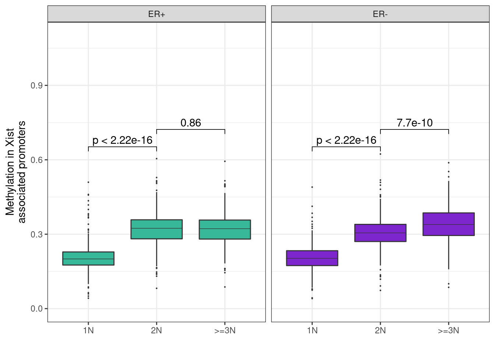
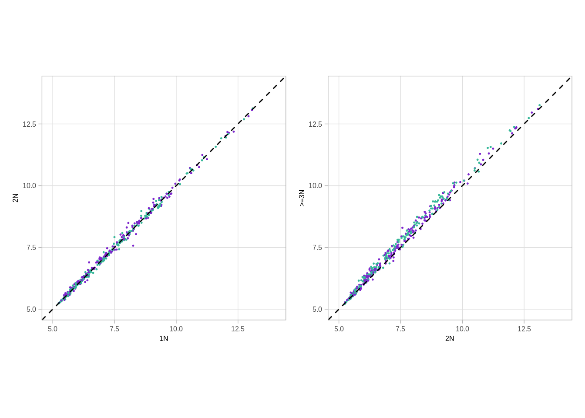
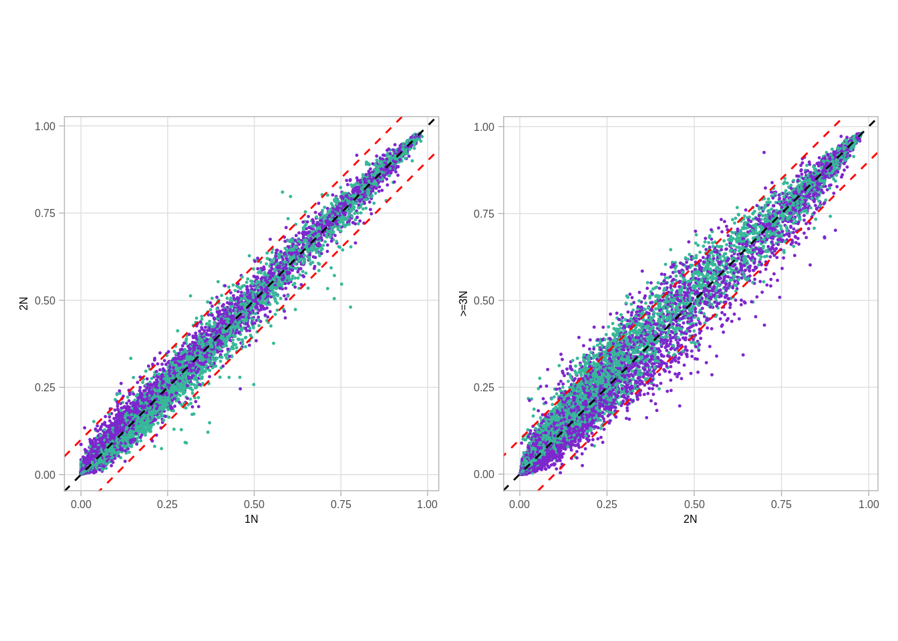
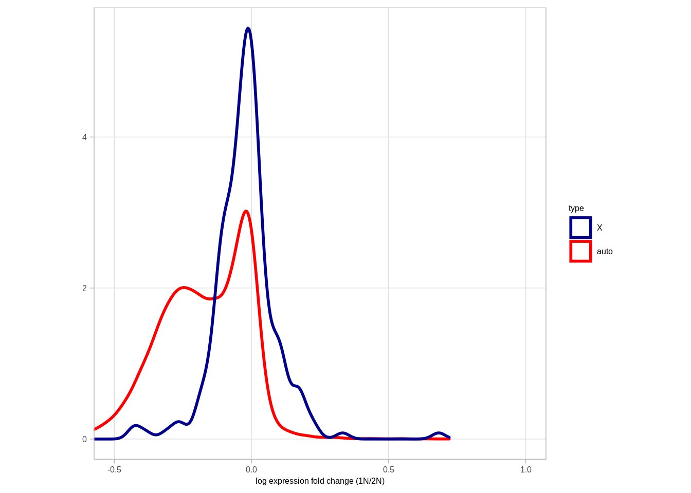
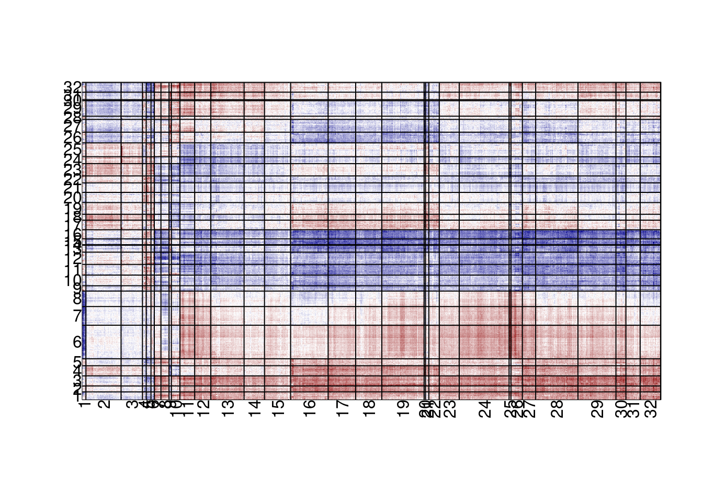

---
jupyter:
  jupytext:
    formats: ipynb,Rmd
    text_representation:
      extension: .Rmd
      format_name: rmarkdown
      format_version: '1.2'
      jupytext_version: 1.11.4
  kernelspec:
    display_name: R
    language: R
    name: ir
---

# X dosage compensation


```r
source(here::here("scripts/init.R"))
```

We start by looking at the CNA data


```r
options(repr.plot.width = 8, repr.plot.height = 4)
p1 <- cna %>% ggplot(aes(x=cna_val)) + geom_density() + xlim(0,5) + geom_vline(xintercept=c(0,0.5, 1.5, 2.5, 3.5, 4.5), color="red") 
p2 <- cna %>% ggplot(aes(x=cna_val, color=factor(cna_round))) + geom_density() + xlim(0,5)  + guides(color=FALSE)
```

```
## Warning: `guides(<scale> = FALSE)` is deprecated. Please use `guides(<scale> =
## "none")` instead.
```

```r
p1 + p2
```

```
## Warning: Removed 12192 rows containing non-finite values (stat_density).
```

```
## Warning: Removed 12192 rows containing non-finite values (stat_density).
```


## X analysis


We then go to extract loci that are associated with xist expression


```r
xist_loci <- get_xist_loci()

xist_loci_meth <- get_xist_loci_meth()
```

```
## Joining, by = c("chrom", "start", "end")
```

```r
xist_meth <- xist_loci_meth %>%
    group_by(samp) %>%
    summarise(meth = mean(meth, na.rm = TRUE))

xist_expr <- get_gene_expression_mat() %>%
    filter(name == "XIST") %>%
    gather("samp", "expr", -(chrom:name3.chr))

xist_loci_expr <- get_xist_loci_expr()
```

```
## Joining, by = c("chrom", "start", "end")
```

```r
df <- xist_meth %>%
    left_join(xist_expr %>% select(samp, expr)) %>%
    left_join(samp_data %>% select(samp, ER = ER1)) %>%
    filter(!is.na(ER))
```

```
## Joining, by = "samp"
```

```
## Joining, by = "samp"
```

```r
head(xist_loci)
```

```
## # A tibble: 6 x 3
##   chrom    start      end
## 1  chrX  9983293  9983844
## 2  chrX 11776199 11776750
## 3  chrX 14891025 14891576
## 4  chrX 16964312 16964863
## 5  chrX 17393041 17393592
## 6  chrX 18443223 18443774
```

```r
count(xist_loci, chrom)
```

```
## # A tibble: 1 x 2
##   chrom   n
## 1  chrX 615
```

We show that Xist expression is correlated with XIST loci methylation


```r
head(df)
```

```
## # A tibble: 6 x 4
##      samp      meth     expr  ER
## 1 MB_0006 0.3131481 8.088802 ER+
## 2 MB_0028 0.1560928 6.482577 ER+
## 3 MB_0030 0.3030659       NA ER+
## 4 MB_0035 0.1877706 6.406843 ER-
## 5 MB_0040 0.2148237       NA ER+
## 6 MB_0046 0.1631259 6.652839 ER+
```

#### Extended Data Figure 9B


```r
options(repr.plot.width = 7, repr.plot.height = 7)
df %>% group_by(ER) %>% summarise(cor = cor(meth, expr, use="pairwise.complete.obs"))
```

```
## # A tibble: 3 x 2
##       ER       cor
## 1    ER- 0.6021123
## 2    ER+ 0.5171663
## 3 normal 0.4914330
```

```r
p_xist_meth_cor <- df %>%
    arrange(sample(samp)) %>% 
    ggplot(aes(x = meth, y = expr, color = ER)) +
    geom_point(size=0.2) + 
    scale_color_manual(values = annot_colors$ER1, guide = FALSE) +
    theme(aspect.ratio = 1) +
    xlab("Methylation") +
    ylab("Xist expression") +
    annotate("text", x = 0.45, y = 6, label = sprintf("~ rho == %0.2f", cor(df$meth, df$expr, method = "spearman", use = "pairwise.complete.obs")), parse = TRUE, size = 2, family = "Arial")
p_xist_meth_cor
```

```
## Warning: Removed 263 rows containing missing values (geom_point).
```

```
## Warning: It is deprecated to specify `guide = FALSE` to remove a guide. Please
## use `guide = "none"` instead.
```


Moving on to look at the methylation in different CNA regimes


```r
get_xist_cna
```

```
## function () 
## {
##     xist_cna <- get_xist_loci() %>% gintervals.neighbors1(cna %>% 
##         mutate(end = ifelse(start == end, start + 1, end)) %>% 
##         filter(chrom == "chrX"), maxneighbors = nrow(samp_data)) %>% 
##         filter(dist == 0) %>% select(chrom, start, end, samp, 
##         cna = cna_round)
##     xist_cna <- xist_cna %>% mutate(cna_grp = cut(cna, breaks = c(-1, 
##         0, 1, 2, 10), labels = c("0N", "1N", "2N", ">=3N"))) %>% 
##         filter(cna_grp != "0N") %>% left_join(samp_data %>% select(samp, 
##         ER = ER1))
##     return(xist_cna)
## }
```


```r
xist_cna <- get_xist_cna()
```

```
## Joining, by = "samp"
```

```r
xist_cna %>% count(cna) %>% ggplot(aes(x=factor(cna), y=n)) + geom_col() + theme_bw()
```


Plotting the distribution of loci


#### Extended Data Figure 9D


```r
options(repr.plot.width = 8, repr.plot.height = 5)
df <- xist_cna %>%
    left_join(get_xist_loci_meth()) %>%
    group_by(cna_grp, ER, chrom, start, end) %>%
    summarise(meth = mean(meth, na.rm = TRUE)) %>%
    filter(!is.na(ER)) %>% 
    mutate(cna_grp = factor(cna_grp, levels = c("1N", "2N", ">=3N"))) %>% 
    mutate(ER = factor(ER, levels = c("ER+", "ER-")))
```

```
## Joining, by = c("chrom", "start", "end")
```

```
## Joining, by = c("chrom", "start", "end", "samp")
```

```r
p_boxp_meth_cna <- df %>% 
    ggplot(aes(x = cna_grp, y = meth, fill = ER, group = cna_grp)) +
#     ggrastr::geom_boxplot_jitter(outlier.size = 0.1, outlier.jitter.width = 0.01, raster=TRUE) +
    geom_boxplot(linewidth=0.1, fatten=0.5, outlier.size=0.1) + 
    scale_fill_manual(values = annot_colors$ER1, guide = FALSE) +
    xlab("") +
    ylab("Methylation in Xist\nassociated promoters") +
    facet_grid(. ~ ER) +
    ylim(0, 1.1) + 
            theme(
                panel.grid.major.x = element_blank(),
                panel.grid.minor.x = element_blank()
            )
```

```
## Warning: Ignoring unknown parameters: linewidth
```

```r
p_boxp_meth_cna  + ggpubr::stat_compare_means(label = "p.signif", comparisons = list(c("1N", "2N"), c("2N", ">=3N")))+ theme_bw()
```

```
## Warning: Removed 2016 rows containing non-finite values (stat_boxplot).
```

```
## Warning: Removed 2016 rows containing non-finite values (stat_signif).
```

```
## Warning: It is deprecated to specify `guide = FALSE` to remove a guide. Please
## use `guide = "none"` instead.
```


```r
p_boxp_meth_cna  + ggpubr::stat_compare_means(comparisons = list(c("1N", "2N"), c("2N", ">=3N")))+ theme_bw()
```

```
## Warning: Removed 2016 rows containing non-finite values (stat_boxplot).
```

```
## Warning: Removed 2016 rows containing non-finite values (stat_signif).
```

```
## Warning: It is deprecated to specify `guide = FALSE` to remove a guide. Please
## use `guide = "none"` instead.
```




```r
df %>% ungroup() %>% distinct(chrom, start, end, ER, cna_grp) %>% count(ER, cna_grp)
```

```
## # A tibble: 6 x 3
##    ER cna_grp   n
## 1 ER+      1N 615
## 2 ER+      2N 615
## 3 ER+    >=3N 615
## 4 ER-      1N 615
## 5 ER-      2N 615
## 6 ER-    >=3N 615
```


```r
xist_cna %>% distinct(cna_grp, samp, ER) %>% count(cna_grp, ER) 
```

```
## # A tibble: 6 x 3
##   cna_grp  ER   n
## 1      1N ER- 181
## 2      1N ER+ 444
## 3      2N ER- 269
## 4      2N ER+ 988
## 5    >=3N ER- 135
## 6    >=3N ER+ 413
```

We now move to show scatters of loci in different CNA regimes


```r
get_xist_meth_cna
```

```
## function () 
## {
##     get_xist_cna() %>% inner_join(get_xist_loci_meth()) %>% group_by(chrom, 
##         start, end, ER, cna_grp) %>% summarise(meth = mean(meth, 
##         na.rm = TRUE)) %>% ungroup() %>% spread(cna_grp, meth)
## }
```

```r
xist_meth_cna <- get_xist_meth_cna()
```

```
## Joining, by = "samp"
```

```
## Joining, by = c("chrom", "start", "end")
```

```
## Joining, by = c("chrom", "start", "end", "samp")
```

```r
head(xist_meth_cna)
```

```
## # A tibble: 6 x 7
##   chrom    start      end  ER        1N        2N      >=3N
## 1  chrX  9983293  9983844 ER- 0.2078918 0.3067645 0.3205268
## 2  chrX  9983293  9983844 ER+ 0.1944013 0.3302692 0.3235067
## 3  chrX 11683770 11684321 ER- 0.2001634 0.2802105 0.2939960
## 4  chrX 11683770 11684321 ER+ 0.2885676 0.3238455 0.3123392
## 5  chrX 11776199 11776750 ER- 0.3316496 0.4977368 0.5313945
## 6  chrX 11776199 11776750 ER+ 0.3403706 0.5048260 0.5023405
```

#### Extended Data Figure 9E


```r
p_scatter_meth_cna_2_3 <- xist_meth_cna %>%
        ggplot(aes(x = `2N`, y = `>=3N`, color = ER)) +
#         ggrastr::geom_point_rast(size = 0.2, raster.width = 1, raster.height = 1) +
        geom_point(size=0.2) + 
        geom_abline(color = "black", linetype = "dashed") +
        scale_color_manual(values = annot_colors$ER1, guide = FALSE) +
        theme(aspect.ratio = 1) +
        xlim(0, 0.65) +
        ylim(0, 0.65) #+
#         annotate("text", x = 0.5, y = 0.1, label = paste("rho = ", round(cor(xist_meth_cna$`2N`, xist_meth_cna$`>=3N`, use = "pairwise.complete.obs"), digits = 3)), size = 2, family = "Arial")
p_scatter_meth_cna_1_2 <- xist_meth_cna %>%
        ggplot(aes(x = `1N`, y = `2N`, color = ER)) +
#         ggrastr::geom_point_rast(size = 0.2, raster.width = 1, raster.height = 1) +
        geom_point(size=0.2) + 
        geom_abline(color = "black", linetype = "dashed") +
        scale_color_manual(values = annot_colors$ER1, guide = FALSE) +
        theme(aspect.ratio = 1) +
        xlim(0, 0.65) +
        ylim(0, 0.65) #+
#         annotate("text", x = 0.5, y = 0.1, label = paste("rho = ", round(cor(xist_meth_cna$`1N`, xist_meth_cna$`2N`, use = "pairwise.complete.obs"), digits = 3)), size = 2, family = "Arial")
(p_scatter_meth_cna_1_2 + theme_bw() + theme(aspect.ratio = 1)) + (p_scatter_meth_cna_2_3 + theme_bw() + theme(aspect.ratio = 1))
```

```
## Warning: It is deprecated to specify `guide = FALSE` to remove a guide. Please
## use `guide = "none"` instead.

## Warning: It is deprecated to specify `guide = FALSE` to remove a guide. Please
## use `guide = "none"` instead.
```


```r
p_scatter_meth_cna_2_3 + facet_wrap(~ER) + theme_bw() + theme(aspect.ratio = 1) 
```

```
## Warning: It is deprecated to specify `guide = FALSE` to remove a guide. Please
## use `guide = "none"` instead.
```


Same with expression:


```r
get_xist_expr_cna
```

```
## function () 
## {
##     get_xist_cna() %>% inner_join(get_xist_loci_expr()) %>% group_by(chrom, 
##         start, end, ER, cna_grp) %>% summarise(expr = mean(expr, 
##         na.rm = TRUE)) %>% ungroup() %>% spread(cna_grp, expr)
## }
```

```r
xist_expr_cna <- get_xist_expr_cna()
```

```
## Joining, by = "samp"
```

```
## Joining, by = c("chrom", "start", "end")
```

```
## Joining, by = c("chrom", "start", "end", "samp")
```

```r
head(xist_expr_cna)
```

```
## # A tibble: 6 x 7
##   chrom    start      end  ER       1N       2N     >=3N
## 1  chrX  9983293  9983844 ER- 7.880753 7.976930 8.193818
## 2  chrX  9983293  9983844 ER+ 7.770670 7.811101 8.114064
## 3  chrX 14891025 14891576 ER- 7.175153 7.258638 7.427273
## 4  chrX 14891025 14891576 ER+ 7.268545 7.233742 7.451081
## 5  chrX 14891133 14891684 ER- 6.111207 6.018312 6.172959
## 6  chrX 14891133 14891684 ER+ 5.900340 5.859142 5.912923
```

#### Extended Data Figure 9F


```r
p_scatter_expr_cna_2_3 <- xist_expr_cna %>%
        ggplot(aes(x = `2N`, y = `>=3N`, color = ER)) +
        geom_point(size=0.2) + 
        geom_abline(color = "black", linetype = "dashed") +
        scale_color_manual(values = annot_colors$ER1, guide = FALSE) +
        theme(aspect.ratio = 1) +
        xlim(5, 14) +
        ylim(5, 14)

 p_scatter_expr_cna_1_2 <- xist_expr_cna %>% ggplot(aes(x = `1N`, y = `2N`, color = ER)) +
        geom_point(size=0.2) + 
        geom_abline(color = "black", linetype = "dashed") +
        scale_color_manual(values = annot_colors$ER1, guide = FALSE) +
        theme(aspect.ratio = 1) +
        xlim(5, 14) +
        ylim(5, 14) 

p_scatter_expr_cna_1_2 + p_scatter_expr_cna_2_3
```

```
## Warning: Removed 60 rows containing missing values (geom_point).
```

```
## Warning: It is deprecated to specify `guide = FALSE` to remove a guide. Please
## use `guide = "none"` instead.
```

```
## Warning: Removed 60 rows containing missing values (geom_point).
```

```
## Warning: It is deprecated to specify `guide = FALSE` to remove a guide. Please
## use `guide = "none"` instead.
```



## autosome analysis


```r
get_autosome_loci
```

```
## function () 
## {
##     get_promoter_avg_meth() %>% select(chrom, start, end) %>% 
##         filter(chrom != "chrX", chrom != "chrY") %>% anti_join(get_xist_loci(), 
##         by = c("chrom", "start", "end"))
## }
```

```r
autosome_loci <- get_autosome_loci()
```


```r
get_autosome_cna
```

```
## function () 
## {
##     {
##         autosome_cna <- get_autosome_loci() %>% gintervals.neighbors1(cna %>% 
##             mutate(end = ifelse(start == end, start + 1, end)) %>% 
##             filter(chrom != "chrX"), maxneighbors = nrow(samp_data)) %>% 
##             filter(dist == 0) %>% select(chrom, start, end, samp, 
##             cna = cna_round)
##         autosome_cna <- autosome_cna %>% mutate(cna_grp = cut(cna, 
##             breaks = c(-1, 0, 1, 2, 10), labels = c("0N", "1N", 
##                 "2N", ">=3N"))) %>% filter(cna_grp != "0N") %>% 
##             left_join(samp_data %>% select(samp, ER = ER1))
##         autosome_cna
##     } %cache_df% here("data/autosome_cna.tsv") %>% as_tibble()
## }
```

```r
autosome_cna <- get_autosome_cna()
head(autosome_cna)
```

```
## # A tibble: 6 x 7
##   chrom  start    end    samp cna cna_grp  ER
## 1  chr1 762469 763020 MB_0006   2      2N ER+
## 2  chr1 762469 763020 MB_0028   1      1N ER+
## 3  chr1 762469 763020 MB_0035   2      2N ER-
## 4  chr1 762469 763020 MB_0046   2      2N ER+
## 5  chr1 762469 763020 MB_0050   2      2N ER+
## 6  chr1 762469 763020 MB_0053   1      1N ER+
```


```r
get_autosome_loci_meth
```

```
## function () 
## {
##     get_autosome_loci() %>% inner_join(get_promoter_avg_meth()) %>% 
##         gather("samp", "meth", -(chrom:end))
## }
```

```r
autosome_loci_meth <- get_autosome_loci_meth()
```

```
## Joining, by = c("chrom", "start", "end")
```

```r
head(autosome_loci_meth)
```

```
##   chrom  start    end    samp        meth
## 1  chr1 762469 763020 MB_0006 0.000000000
## 2  chr1 762676 763227 MB_0006 0.021929825
## 3  chr1 860619 861170 MB_0006 0.001870324
## 4  chr1 895465 896016 MB_0006 0.014367816
## 5  chr1 901375 901926 MB_0006 0.024253731
## 6  chr1 948345 948896 MB_0006 0.000000000
```

Plotting the distribution of loci


#### Extended Data Figure 9G


```r
options(repr.plot.width = 8, repr.plot.height = 5)
df <- autosome_cna %>%
    left_join(autosome_loci_meth) %>%
    group_by(cna_grp, ER, chrom, start, end) %>%
    summarise(meth = mean(meth, na.rm = TRUE)) %>%
    filter(!is.na(ER)) %>% 
    mutate(cna_grp = factor(cna_grp, levels = c("1N", "2N", ">=3N"))) %>% 
    mutate(ER = factor(ER, levels = c("ER+", "ER-")))
```

```
## Joining, by = c("chrom", "start", "end", "samp")
```

```r
p_boxp_meth_cna_autosome <- df %>% 
    ggplot(aes(x = cna_grp, y = meth, fill = ER, group = cna_grp)) +
#     ggrastr::geom_boxplot_jitter(outlier.size = 0.1, outlier.jitter.width = 0.01, raster=TRUE) + 
    geom_boxplot(linewidth=0.1, fatten=0.5, outlier.size = 0.1) + 
    scale_fill_manual(values = annot_colors$ER1, guide = FALSE) +
    xlab("") +
    ylab("Methylation in autosomes") +
    facet_grid(. ~ ER) +
    ylim(0, 1.1) + 
            theme(
                panel.grid.major.x = element_blank(),
                panel.grid.minor.x = element_blank()
            )
```

```
## Warning: Ignoring unknown parameters: linewidth
```

```r
p_boxp_meth_cna_autosome + ggpubr::stat_compare_means(comparisons = list(c("1N", "2N"), c("2N", ">=3N")))
```

```
## Warning: Removed 6 rows containing missing values (geom_signif).
```

```
## Warning: It is deprecated to specify `guide = FALSE` to remove a guide. Please
## use `guide = "none"` instead.
```


```r
p_boxp_meth_cna_autosome +
     ggpubr::stat_compare_means(label = "p.signif", comparisons = list(c("1N", "2N"), c("2N", ">=3N"))) 
```

```
## Warning: Removed 6 rows containing missing values (geom_signif).

## Warning: It is deprecated to specify `guide = FALSE` to remove a guide. Please
## use `guide = "none"` instead.
```


```r
p_boxp_meth_cna_autosome
```

```
## Warning: It is deprecated to specify `guide = FALSE` to remove a guide. Please
## use `guide = "none"` instead.
```


```r
df %>% ungroup() %>% distinct(chrom, start, end, ER) %>% count(ER)
```

```
## # A tibble: 2 x 2
##    ER     n
## 1 ER+ 15207
## 2 ER- 15207
```


```r
autosome_cna %>% distinct(cna_grp, samp, ER) %>% count(ER, cna_grp)
```

```
## # A tibble: 6 x 3
##    ER cna_grp    n
## 1 ER-    >=3N  296
## 2 ER-      1N  278
## 3 ER-      2N  293
## 4 ER+    >=3N 1077
## 5 ER+      1N 1060
## 6 ER+      2N 1085
```

We now move to show scatters of loci in different CNA regimes


```r
get_autosome_meth_cna
```

```
## function () 
## {
##     {
##         auto_df <- get_autosome_cna() %>% inner_join(get_autosome_loci_meth()) %>% 
##             group_by(chrom, start, end, ER, cna_grp) %>% summarise(meth = mean(meth, 
##             na.rm = TRUE)) %>% ungroup() %>% spread(cna_grp, 
##             meth)
##         auto_df
##     } %cache_df% here("data/autosome_meth_cna.tsv") %>% as_tibble()
## }
```

```r
autosome_meth_cna <- get_autosome_meth_cna()
head(autosome_meth_cna)
```

```
## # A tibble: 6 x 7
##   chrom  start    end  ER        >=3N          1N          2N
## 1  chr1 762469 763020 ER- 0.007852706 0.008341878 0.007857689
## 2  chr1 762469 763020 ER+ 0.006506879 0.008089050 0.008125402
## 3  chr1 762676 763227 ER- 0.028412915 0.021358769 0.026941446
## 4  chr1 762676 763227 ER+ 0.028590166 0.070967669 0.042346185
## 5  chr1 762851 763402 ER- 0.029766663 0.022340914 0.029069381
## 6  chr1 762851 763402 ER+ 0.032413643 0.078736553 0.047128295
```

#### Extended Data Figure 9H


```r
options(repr.plot.width = 5, repr.plot.height = 3)
p_scatter_meth_cna_2_3_autosome <- autosome_meth_cna %>%
        ggplot(aes(x = `2N`, y = `>=3N`, color = ER)) +
        geom_point(size=0.2) + 
        geom_abline(color = "black", linetype = "dashed") +
        scale_color_manual(values = annot_colors$ER1, guide = FALSE) +
        geom_abline(color = "red", linetype = "dashed", intercept = 0.1) + 
        geom_abline(color = "red", linetype = "dashed", intercept = -0.1) + 
        theme(aspect.ratio = 1)
p_scatter_meth_cna_1_2_autosome <- autosome_meth_cna %>%
        ggplot(aes(x = `1N`, y = `2N`, color = ER)) +
        geom_point(size=0.2) + 
        geom_abline(color = "black", linetype = "dashed") +
        scale_color_manual(values = annot_colors$ER1, guide = FALSE) +        
        geom_abline(color = "red", linetype = "dashed", intercept = 0.1) + 
        geom_abline(color = "red", linetype = "dashed", intercept = -0.1) +
        theme(aspect.ratio = 1)          
        
p_scatter_meth_cna_1_2_autosome + p_scatter_meth_cna_2_3_autosome
```

```
## Warning: Removed 5 rows containing missing values (geom_point).
```

```
## Warning: It is deprecated to specify `guide = FALSE` to remove a guide. Please
## use `guide = "none"` instead.

## Warning: It is deprecated to specify `guide = FALSE` to remove a guide. Please
## use `guide = "none"` instead.
```



Same with expression:


```r
get_autosome_expr_cna
```

```
## function () 
## {
##     {
##         auto_df <- get_autosome_cna() %>% inner_join(get_autosome_loci_expr()) %>% 
##             group_by(chrom, start, end, ER, cna_grp) %>% summarise(expr = mean(expr, 
##             na.rm = TRUE)) %>% ungroup() %>% spread(cna_grp, 
##             expr)
##         auto_df
##     } %cache_df% here("data/autosome_expr_cna.tsv") %>% as_tibble()
## }
```

```r
autosome_expr_cna <- get_autosome_expr_cna()
head(autosome_expr_cna)
```

```
## # A tibble: 6 x 7
##   chrom  start    end  ER     >=3N       1N       2N
## 1  chr1 762469 763020 ER-       NA       NA       NA
## 2  chr1 762469 763020 ER+       NA       NA       NA
## 3  chr1 762851 763402 ER-       NA       NA       NA
## 4  chr1 762851 763402 ER+       NA       NA       NA
## 5  chr1 860619 861170 ER- 5.598424 5.685151 5.844717
## 6  chr1 860619 861170 ER+ 5.816428 5.804565 5.811422
```


```r
p_scatter_expr_cna_2_3 <- autosome_expr_cna %>%
        ggplot(aes(x = `2N`, y = `>=3N`, color = ER)) +
        geom_point(size=0.2) + 
        geom_abline(color = "black", linetype = "dashed") +
        scale_color_manual(values = annot_colors$ER1, guide = FALSE) +
        theme(aspect.ratio = 1) +
        xlim(5, 14) +
        ylim(5, 14)

 p_scatter_expr_cna_1_2 <- autosome_expr_cna %>% ggplot(aes(x = `1N`, y = `2N`, color = ER)) +
        geom_point(size=0.2) + 
        geom_abline(color = "black", linetype = "dashed") +
        scale_color_manual(values = annot_colors$ER1, guide = FALSE) +
        theme(aspect.ratio = 1) +
        xlim(5, 14) +
        ylim(5, 14) 

p_scatter_expr_cna_1_2 + p_scatter_expr_cna_2_3
```

```
## Warning: Removed 5366 rows containing missing values (geom_point).
```

```
## Warning: It is deprecated to specify `guide = FALSE` to remove a guide. Please
## use `guide = "none"` instead.
```

```
## Warning: Removed 5369 rows containing missing values (geom_point).
```

```
## Warning: It is deprecated to specify `guide = FALSE` to remove a guide. Please
## use `guide = "none"` instead.
```


Looking at the distribution of loci in 2N / >=3N (averaging the samples expression per ER and CNA)


```r
get_xist_expr_cna
```

```
## function () 
## {
##     get_xist_cna() %>% inner_join(get_xist_loci_expr()) %>% group_by(chrom, 
##         start, end, ER, cna_grp) %>% summarise(expr = mean(expr, 
##         na.rm = TRUE)) %>% ungroup() %>% spread(cna_grp, expr)
## }
```

```r
get_autosome_expr_cna
```

```
## function () 
## {
##     {
##         auto_df <- get_autosome_cna() %>% inner_join(get_autosome_loci_expr()) %>% 
##             group_by(chrom, start, end, ER, cna_grp) %>% summarise(expr = mean(expr, 
##             na.rm = TRUE)) %>% ungroup() %>% spread(cna_grp, 
##             expr)
##         auto_df
##     } %cache_df% here("data/autosome_expr_cna.tsv") %>% as_tibble()
## }
```

```r
df_fc <- get_xist_expr_cna() %>%
        mutate(type = "X") %>%
        bind_rows(get_autosome_expr_cna() %>% mutate(type = "auto")) %>%
        mutate(diff = `>=3N` - `2N`, diff1 = `2N` - `1N`) %>%
#         filter(ER == "ER+")
        filter(ER == "ER-")
```

```
## Joining, by = "samp"
```

```
## Joining, by = c("chrom", "start", "end")
```

```
## Joining, by = c("chrom", "start", "end", "samp")
```

```r
head(df_fc)
```

```
## # A tibble: 6 x 10
##   chrom    start      end  ER       1N       2N     >=3N type        diff
## 1  chrX  9983293  9983844 ER- 7.880753 7.976930 8.193818    X 0.216887405
## 2  chrX 14891025 14891576 ER- 7.175153 7.258638 7.427273    X 0.168634811
## 3  chrX 14891133 14891684 ER- 6.111207 6.018312 6.172959    X 0.154646592
## 4  chrX 15353625 15354176 ER- 7.884146 7.926416 8.264637    X 0.338220886
## 5  chrX 16964312 16964863 ER- 6.916974 7.004652 7.381009    X 0.376356425
## 6  chrX 17393041 17393592 ER- 6.256066 6.338770 6.347885    X 0.009114449
##         diff1
## 1  0.09617691
## 2  0.08348508
## 3 -0.09289491
## 4  0.04227070
## 5  0.08767872
## 6  0.08270411
```

#### Extended Data Figure 9I


```r
pval <- ks.test(df_fc$diff[df_fc$type == "X"], df_fc$diff[df_fc$type == "auto"])$p.value
message(pval)
```

```
## 2.47357689886485e-12
```

```r
fc_p <- df_fc %>%
        ggplot(aes(color = type, x = diff)) +
        geom_density(size = 1) +
        theme(aspect.ratio = 1) +
        xlab("log expression fold change (>=3N/2N)") +
        ylab("") +
        scale_color_manual(values = c("X" = "darkblue", "auto" = "red")) +
        coord_cartesian(xlim = c(-0.5, 1)) +
        theme(aspect.ratio = 1) 
#         annotate("text", x = 0.5, y = 4, label = "p<<0.001 (KS)", size = 2, family = "Arial")

fc_p
```

```
## Warning: Removed 2710 rows containing non-finite values (stat_density).
```


```r
pval <- ks.test(df_fc$diff1[df_fc$type == "X"], df_fc$diff1[df_fc$type == "auto"])$p.value
message(pval)
```

```
## 0
```

```r
fc_p <- df_fc %>%
        ggplot(aes(color = type, x = -diff1)) +
        geom_density(size = 1) +
        theme(aspect.ratio = 1) +
        xlab("log expression fold change (1N/2N)") +
        ylab("") +
        scale_color_manual(values = c("X" = "darkblue", "auto" = "red")) +
        coord_cartesian(xlim = c(-0.5, 1)) +
        theme(aspect.ratio = 1) 
#         annotate("text", x = 0.5, y = 4, label = "p<<0.001 (KS)", size = 2, family = "Arial")

fc_p
```

```
## Warning: Removed 2710 rows containing non-finite values (stat_density).
```




```r
head(df_fc)
```

```
## # A tibble: 6 x 10
##   chrom    start      end  ER       1N       2N     >=3N type        diff
## 1  chrX  9983293  9983844 ER- 7.880753 7.976930 8.193818    X 0.216887405
## 2  chrX 14891025 14891576 ER- 7.175153 7.258638 7.427273    X 0.168634811
## 3  chrX 14891133 14891684 ER- 6.111207 6.018312 6.172959    X 0.154646592
## 4  chrX 15353625 15354176 ER- 7.884146 7.926416 8.264637    X 0.338220886
## 5  chrX 16964312 16964863 ER- 6.916974 7.004652 7.381009    X 0.376356425
## 6  chrX 17393041 17393592 ER- 6.256066 6.338770 6.347885    X 0.009114449
##         diff1
## 1  0.09617691
## 2  0.08348508
## 3 -0.09289491
## 4  0.04227070
## 5  0.08767872
## 6  0.08270411
```


```r
thresh <- 0.1
autosome_cna_meth_expr <- get_autosome_cna_meth_expr()
    dosage_cands <- autosome_cna_meth_expr %>% 
        filter(`>=3N` >= (`2N` + thresh) ) %>%         
        filter(`n_>=3N` >= 5, `n_2N` >= 5) 

    dosage_cands_1N <- autosome_cna_meth_expr %>% 
        filter(`1N` <= (`2N` - thresh) ) %>%         
        filter(`n_1N` >= 5, `n_2N` >= 5)     

    dosage_cands_expr <- dosage_cands %>% select(chrom, start, end, ER, `1N` = `expr_1N`, `2N` = `expr_2N`, `>=3N` = `expr_>=3N`)
    dosage_cands_expr_1N <- dosage_cands_1N %>% select(chrom, start, end, ER, `1N` = `expr_1N`, `2N` = `expr_2N`)

    df_fc <- get_xist_expr_cna() %>%
        mutate(type = "X") %>%
        bind_rows(autosome_expr_cna %>% anti_join(dosage_cands_expr) %>% mutate(type = "auto")) %>%
        bind_rows(dosage_cands_expr %>% mutate(type = "auto-dosage")) %>% 
        mutate(ER = factor(ER, levels=c("ER+", "ER-"))) %>%
        filter(!is.na(ER)) %>% 
        mutate(type = factor(type, levels=c("X", "auto", "auto-dosage"))) %>%
        arrange(type) %>%
        mutate(diff = `>=3N` - `2N`) 
```

```
## Joining, by = "samp"
```

```
## Joining, by = c("chrom", "start", "end")
```

```
## Joining, by = c("chrom", "start", "end", "samp")
```

```
## Joining, by = c("chrom", "start", "end", "ER", ">=3N", "1N", "2N")
```

```r
    fc_p <- df_fc %>%
        ggplot(aes(color = type, x = diff)) +
        geom_density(size = 0.5) +
        theme(aspect.ratio = 1) +
        xlab("log expression fold change (>=3N/2N)") +
        ylab("") +
        scale_color_manual(values = c("auto" = "red", "auto-dosage" = "blue", "X" = "gray")) + 
        # ggsci::scale_color_npg() +         
        coord_cartesian(xlim = c(-0.6, 1)) +
        theme(aspect.ratio = 1) + 
        facet_wrap(~ER, scale="free_y", nrow=1) + 
        guides(color = FALSE)
```

```
## Warning: `guides(<scale> = FALSE)` is deprecated. Please use `guides(<scale> =
## "none")` instead.
```

```r
    df_fc %>% group_by(ER) %>% summarise(p_x_auto = ks.test(diff[type == "X"], diff[type == "auto"])$p.value, p_auto_dosage =  ks.test(diff[type == "auto-dosage"], diff[type == "auto"])$p.value) %>% print()
```

```
## # A tibble: 2 x 3
##    ER     p_x_auto p_auto_dosage
## 1 ER+ 5.535245e-03             0
## 2 ER- 1.049272e-12             0
```

```r
    df_fc_1N <- get_xist_expr_cna() %>%
        mutate(type = "X") %>%
        bind_rows(autosome_expr_cna %>% anti_join(dosage_cands_expr_1N) %>% mutate(type = "auto")) %>%
        bind_rows(dosage_cands_expr_1N %>% mutate(type = "auto-dosage")) %>% 
        mutate(ER = factor(ER, levels=c("ER+", "ER-"))) %>%
        filter(!is.na(ER)) %>% 
        mutate(type = factor(type, levels=c("X", "auto", "auto-dosage"))) %>%
        arrange(type) %>%
        mutate(diff = `1N` - `2N`) 
```

```
## Joining, by = "samp"
```

```
## Joining, by = c("chrom", "start", "end")
```

```
## Joining, by = c("chrom", "start", "end", "samp")
```

```
## Joining, by = c("chrom", "start", "end", "ER", "1N", "2N")
```

```r
    fc_p_1N <- df_fc_1N %>%
        ggplot(aes(color = type, x = diff)) +
        geom_density(size = 0.5) +
        theme(aspect.ratio = 1) +
        xlab("log expression fold change (1N/2N)") +
        ylab("") +
        scale_color_manual(values = c("auto" = "red", "auto-dosage" = "blue", "X" = "gray")) +           
        coord_cartesian(xlim = c(-0.6, 1)) +
        theme(aspect.ratio = 1) + 
        facet_wrap(~ER, scale="free_y", nrow=1) + 
        guides(color = FALSE)
```

```
## Warning: `guides(<scale> = FALSE)` is deprecated. Please use `guides(<scale> =
## "none")` instead.
```

```r
    df_fc_1N %>% group_by(ER) %>% summarise(p_x_auto = ks.test(diff[type == "X"], diff[type == "auto"])$p.value, p_auto_dosage =  ks.test(diff[type == "auto-dosage"], diff[type == "auto"])$p.value) %>% print() 
```

```
## # A tibble: 2 x 3
##    ER p_x_auto p_auto_dosage
## 1 ER+        0   0.025082963
## 2 ER-        0   0.006876647
```

```r
fc_p
```

```
## Warning: Removed 5500 rows containing non-finite values (stat_density).
```


```r
fc_p_1N
```

```
## Warning: Removed 5431 rows containing non-finite values (stat_density).
```


## Checking dosage compensation on all X loci


```r
get_xist_loci
```

```
## function () 
## {
##     {
##         xist_expr <- get_gene_expression_mat() %>% filter(name == 
##             "XIST") %>% gather("samp", "expr", -(chrom:name3.chr)) %>% 
##             as_tibble()
##         all_norm_meth <- fread(here("data/all_norm_meth.tsv")) %>% 
##             filter(chrom == "chrX") %>% as_tibble()
##         ER_positive_mat <- all_norm_meth %>% select(chrom:end, 
##             any_of(ER_positive_samples)) %>% intervs_to_mat()
##         ER_negative_mat <- all_norm_meth %>% select(chrom:end, 
##             any_of(ER_negative_samples)) %>% intervs_to_mat()
##         xist_expr_vec <- xist_expr %>% select(samp, expr) %>% 
##             deframe()
##         samples <- intersect(names(xist_expr_vec), colnames(ER_positive_mat))
##         ER_pos_cors <- tgs_cor(t(ER_positive_mat[, samples]), 
##             as.matrix(xist_expr_vec[samples]), pairwise.complete.obs = TRUE)
##         samples <- intersect(names(xist_expr_vec), colnames(ER_negative_mat))
##         ER_neg_cors <- tgs_cor(t(ER_negative_mat[, samples]), 
##             as.matrix(xist_expr_vec[samples]), pairwise.complete.obs = TRUE)
##         xist_loci <- cbind(ER_pos_cors, ER_neg_cors) %>% mat_to_intervs() %>% 
##             filter(V1 >= 0.2 | V2 >= 0.2) %>% distinct(chrom, 
##             start, end)
##     } %cache_df% here("data/xist_loci.tsv") %>% as_tibble()
## }
## <bytecode: 0xfcb8860>
```


```r
all_norm_meth_x <- fread(here("data/all_norm_meth.tsv")) %>% 
            filter(chrom == "chrX") %>% as_tibble()
X_loci <- all_norm_meth_x %>% distinct(chrom, start, end)
```


```r
get_xist_cna
```

```
## function () 
## {
##     xist_cna <- get_xist_loci() %>% gintervals.neighbors1(cna %>% 
##         mutate(end = ifelse(start == end, start + 1, end)) %>% 
##         filter(chrom == "chrX"), maxneighbors = nrow(samp_data)) %>% 
##         filter(dist == 0) %>% select(chrom, start, end, samp, 
##         cna = cna_round)
##     xist_cna <- xist_cna %>% mutate(cna_grp = cut(cna, breaks = c(-1, 
##         0, 1, 2, 10), labels = c("0N", "1N", "2N", ">=3N"))) %>% 
##         filter(cna_grp != "0N") %>% left_join(samp_data %>% select(samp, 
##         ER = ER1))
##     return(xist_cna)
## }
## <bytecode: 0x1612c170>
```


```r
X_cna <- X_loci %>% gintervals.neighbors1(cna %>% 
    mutate(end = ifelse(start == end, start + 1, end)) %>% 
    filter(chrom == "chrX"), maxneighbors = nrow(samp_data)) %>% 
    filter(dist == 0) %>% select(chrom, start, end, samp, 
    cna = cna_round)
X_cna <- X_cna %>% mutate(cna_grp = cut(cna, breaks = c(-1, 
        0, 1, 2, 10), labels = c("0N", "1N", "2N", ">=3N"))) %>% 
        filter(cna_grp != "0N") %>% left_join(samp_data %>% select(samp, 
        ER = ER1)) %cache_df% here("data/X_cna.tsv") %>% as_tibble()
head(X_cna)
```

```
## # A tibble: 6 x 7
##   chrom  start    end    samp cna cna_grp  ER
## 1  chrX 192489 193040 MB_0006   2      2N ER+
## 2  chrX 192489 193040 MB_0028   1      1N ER+
## 3  chrX 192489 193040 MB_0046   1      1N ER+
## 4  chrX 192489 193040 MB_0050   1      1N ER+
## 5  chrX 192489 193040 MB_0053   1      1N ER+
## 6  chrX 192489 193040 MB_0054   2      2N ER+
```


```r
get_xist_loci_meth
```

```
## function () 
## {
##     get_xist_loci() %>% inner_join(get_promoter_avg_meth()) %>% 
##         gather("samp", "meth", -(chrom:end))
## }
## <bytecode: 0x498253b0>
```


```r
X_loci_meth <- X_loci %>% inner_join(get_promoter_avg_meth()) %>% 
        gather("samp", "meth", -(chrom:end))
```

```
## Joining, by = c("chrom", "start", "end")
```


```r
options(repr.plot.width = 5, repr.plot.height = 3)
p_boxp_meth_cna_all <- X_cna %>%
    left_join(X_loci_meth) %>%
    group_by(cna_grp, ER, chrom, start, end) %>%
    summarise(meth = mean(meth, na.rm = TRUE)) %>%
    filter(!is.na(ER)) %>% 
    mutate(cna_grp = factor(cna_grp, levels = c("1N", "2N", ">=3N"))) %>% 
    mutate(ER = factor(ER, levels = c("ER+", "ER-"))) %>% 
    ggplot(aes(x = cna_grp, y = meth, fill = ER, group = cna_grp)) +
    geom_boxplot(linewidth=0.1, fatten=0.5, outlier.size = 0.1) + 
    scale_fill_manual(values = annot_colors$ER1, guide = FALSE) +
    xlab("") +
    ylab("Methylation in X promoters") +
    facet_grid(. ~ ER) +
    ylim(0, 1.1) +
    ggpubr::stat_compare_means(label = "p.signif", comparisons = list(c("1N", "2N"), c("2N", ">=3N"))) + 
            theme(
                panel.grid.major.x = element_blank(),
                panel.grid.minor.x = element_blank()
            )
```

```
## Joining, by = c("chrom", "start", "end", "samp")
```

```
## Warning: Ignoring unknown parameters: linewidth
```

```r
p_boxp_meth_cna_all
```

```
## Warning: Removed 41928 rows containing non-finite values (stat_boxplot).
```

```
## Warning: Removed 41928 rows containing non-finite values (stat_signif).
```

```
## Warning: Removed 6 rows containing missing values (geom_signif).
```

```
## Warning: It is deprecated to specify `guide = FALSE` to remove a guide. Please
## use `guide = "none"` instead.
```


> Looks very similar to the XIST associated version


## % of X lost


#### Extended Data Figure 9C


```r
chr_x_len <- gintervals.all() %>% filter(chrom == "chrX") %>% pull(end)
p_x_perc <- cna %>% 
    filter(chrom == "chrX") %>% mutate(l = end - start) %>% 
    mutate(cna = cut(cna_round, breaks = c(0, 1, 2, 20), include.lowest=TRUE, labels=c("Loss", "normal", "Gain"))) %>% 
    group_by(samp, cna) %>% 
    summarise(p = sum(l) / chr_x_len) %>% 
    filter(cna != "normal") %>% 
    ungroup() %>% 
    add_ER() %>% 
    filter(!is.na(ER)) %>% 
    ggplot(aes(x=p, color=ER, y=1-..y..)) + 
        stat_ecdf() + 
        facet_wrap(~cna) + 
        scale_color_manual(values=annot_colors$ER1) + 
        theme(aspect.ratio=1) + 
        xlab("% of X") + 
        ylab("% of samples") + 
        scale_x_continuous(labels=scales::percent) + 
        scale_y_continuous(labels=scales::percent)
p_x_perc
```


## Plot Expression-Methylation correlation for X


```r
meth_mat <- all_norm_meth_x %>% select(chrom:end, any_of(ER_positive_samples)) %>% intervs_to_mat()
```


```r
expr_m <- get_gene_expression_mat() %>% select(-any_of(c("chrom", "start", "end", "name3.chr")))
expr_mat <- expr_m %>%
    as.data.frame() %>%
    column_to_rownames("name")
f <- rowSums(!is.na(expr_mat)) > 0
expr_mat <- expr_mat[f, ]
dim(expr_mat)
```

```
## [1] 17691  2124
```


```r
em_cross <- em_cross_cor(meth_mat, expr_mat, meth_cor_thresh = 0.25, expr_cor_thresh = 0.25) %cache_rds% here("data/X_er_positive_em_cross_cor.rds")
```


```r
em_cross_clust <- cluster_em_cross_cor(em_cross, k_meth = 32, k_expr = 32) %cache_rds% here("data/X_er_positive_em_cross_cor_clust.rds")
```

#### Extended Data Figure 9A


```r
options(repr.plot.width = 8, repr.plot.height = 13)
plot_em_cross_cor(em_cross_clust)
```

```
## plotting em cross
```




```r
em_cross_clust$em_cross[1:5, 1:5]
```

```
##                                AARS        ABCA6        ABCA8        ABCB1
## chrX_12156083_12156634 -0.009473256  0.069027019  0.089264904  0.014470847
## chrX_14261885_14262436 -0.029288914 -0.007331325 -0.003098204 -0.054763278
## chrX_23017576_23018127  0.091659895 -0.029980425 -0.017798906 -0.016557969
## chrX_23800773_23801324 -0.142085957  0.028894237  0.062800268 -0.001669589
## chrX_23925621_23926172 -0.080076720 -0.025302800  0.012101469  0.012796371
##                              ABI3BP
## chrX_12156083_12156634  0.089861306
## chrX_14261885_14262436 -0.001929155
## chrX_23017576_23018127 -0.010672580
## chrX_23800773_23801324  0.016375597
## chrX_23925621_23926172 -0.010378608
```


```r
dim(em_cross_clust$em_cross)
```

```
## [1] 1218  595
```

# Finding specific dosage compensation examples


```r
autosome_cands_3n <- get_autosome_dosage_comp_cands("3N")
head(autosome_cands_3n)
```

```
## # A tibble: 6 x 17
##   chrom  start    end  ER          1N          2N        >=3N n_>=3N n_1N n_2N
## 1  chr1 762469 763020 ER- 0.008341878 0.007857689 0.007852706     15   60  210
## 2  chr1 762469 763020 ER+ 0.008089050 0.008125402 0.006506879     12  211  816
## 3  chr1 762676 763227 ER- 0.021358769 0.026941446 0.028412915     16   67  220
## 4  chr1 762676 763227 ER+ 0.070967669 0.042346185 0.028590166     16  228  846
## 5  chr1 762851 763402 ER- 0.022340914 0.029069381 0.029766663     16   67  220
## 6  chr1 762851 763402 ER+ 0.078736553 0.047128295 0.032413643     15  228  845
##   expr_>=3N expr_1N expr_2N n_expr_>=3N n_expr_1N n_expr_2N      name
## 1        NA      NA      NA          NA        NA        NA LINC01128
## 2        NA      NA      NA          NA        NA        NA LINC01128
## 3        NA      NA      NA          NA        NA        NA      <NA>
## 4        NA      NA      NA          NA        NA        NA      <NA>
## 5        NA      NA      NA          NA        NA        NA LINC00115
## 6        NA      NA      NA          NA        NA        NA LINC00115
```


```r
thresh <- 0.1
dosage_cands_gain_3n <- autosome_cands_3n %>% 
        filter(`>=3N` >= (`2N` + thresh) ) %>%         
        filter(`n_>=3N` >= 5, `n_2N` >= 5) %>% #,  !is.na(name))  %>%
        select(chrom, start, end, name, ER, `>=3N`, `2N`, `n_>=3N`, n_2N, `expr_>=3N`, `expr_2N`, `n_expr_>=3N`, `n_expr_2N`) %>%
        arrange(-`>=3N`, ER, name) 
dosage_cands_gain_3n %>% count(ER)
```

```
## # A tibble: 2 x 2
##    ER   n
## 1 ER- 197
## 2 ER+ 279
```


```r
autosome_cands_4n <- get_autosome_dosage_comp_cands("4N")
head(autosome_cands_4n)
```

```
## # A tibble: 6 x 21
##   chrom  start    end  ER          1N          2N          3N        >=4N
## 1  chr1 762469 763020 ER- 0.008341878 0.007857689 0.007852706          NA
## 2  chr1 762469 763020 ER+ 0.008089050 0.008125402 0.006234499 0.007324019
## 3  chr1 762676 763227 ER- 0.021358769 0.026941446 0.028412915          NA
## 4  chr1 762676 763227 ER+ 0.070967669 0.042346185 0.032404898 0.012059659
## 5  chr1 762851 763402 ER- 0.022340914 0.029069381 0.029766663          NA
## 6  chr1 762851 763402 ER+ 0.078736553 0.047128295 0.037778446 0.010954431
##   n_>=4N n_1N n_2N n_3N expr_>=4N expr_1N expr_2N expr_3N n_expr_>=4N n_expr_1N
## 1     NA   60  210   15        NA      NA      NA      NA          NA        NA
## 2      3  211  816    9        NA      NA      NA      NA          NA        NA
## 3     NA   67  220   16        NA      NA      NA      NA          NA        NA
## 4      3  228  846   13        NA      NA      NA      NA          NA        NA
## 5     NA   67  220   16        NA      NA      NA      NA          NA        NA
## 6      3  228  845   12        NA      NA      NA      NA          NA        NA
##   n_expr_2N n_expr_3N      name
## 1        NA        NA LINC01128
## 2        NA        NA LINC01128
## 3        NA        NA      <NA>
## 4        NA        NA      <NA>
## 5        NA        NA LINC00115
## 6        NA        NA LINC00115
```


```r
thresh <- 0.1
dosage_cands_gain_4n <- autosome_cands_4n %>% 
        filter(`>=4N` >= (`2N` + thresh) ) %>%         
        filter(`n_>=4N` >= 5, `n_2N` >= 5) %>% #,  !is.na(name))  %>%
        select(chrom, start, end, name, ER, `>=4N`, `2N`, `n_>=4N`, n_2N, `expr_>=4N`, `expr_2N`, `n_expr_>=4N`, `n_expr_2N`) %>%
        arrange(-`>=4N`, ER, name) 
dosage_cands_gain_4n %>% count(ER)
```

```
## # A tibble: 2 x 2
##    ER   n
## 1 ER- 261
## 2 ER+ 522
```


```r
dosage_cands_loss <- autosome_cna_meth_expr %>% 
        filter(`1N` <= (`2N` - thresh) ) %>%         
        filter(`n_1N` >= 5, `n_2N` >= 5)  %>%
        select(chrom, start, end, name, ER, `1N`, `2N`, `n_1N`, n_2N, `expr_1N`, `expr_2N`, `n_expr_1N`, `n_expr_2N`) %>%
        arrange(-`n_1N`, ER, name)

dosage_cands_loss %>% count(ER)
```

```
##    ER  n
## 1 ER- 23
## 2 ER+ 25
```


```r
df <- get_autosome_meth_cna()
```

Validating that we have enough samples for each locus:


```r
auto_cna <- get_autosome_cna() %>% inner_join(get_autosome_loci_meth())
```

```
## Joining, by = c("chrom", "start", "end")
```

```
## Joining, by = c("chrom", "start", "end", "samp")
```


```r
num_cna_meth <- auto_cna %>% filter(!is.na(meth)) %>% count(chrom, start, end, ER, cna_grp) %>% mutate(cna_grp = paste0("n_", cna_grp)) %>% spread(cna_grp, n)
```


```r
num_cna_meth %>% gather('type', 'num', -(chrom:ER)) %>% group_by(chrom, start, end, ER) %>% mutate(p = num / sum(num))  %>% select(-num) %>% spread(type, p) %>% ggplot(aes(x=`n_1N`, y=`n_2N`, color=ER)) + geom_point() + scale_color_manual(values=annot_colors$ER1, guide = FALSE) + theme(aspect.ratio=1)
```

```
## Warning: Removed 5 rows containing missing values (geom_point).
```

```
## Warning: It is deprecated to specify `guide = FALSE` to remove a guide. Please
## use `guide = "none"` instead.
```


```r
num_cna_meth %>% gather('type', 'num', -(chrom:ER)) %>% group_by(chrom, start, end, ER) %>% mutate(p = num / sum(num))  %>% select(-num) %>% spread(type, p) %>% ggplot(aes(x=`n_2N`, y=`n_>=3N`, color=ER)) + geom_point() + scale_color_manual(values=annot_colors$ER1, guide = FALSE) + theme(aspect.ratio=1)
```

```
## Warning: Removed 5 rows containing missing values (geom_point).

## Warning: It is deprecated to specify `guide = FALSE` to remove a guide. Please
## use `guide = "none"` instead.
```


```r
df <- df %>% left_join(num_cna_meth)
```

```
## Joining, by = c("chrom", "start", "end", "ER")
```


```r
df_expr <- get_autosome_expr_cna() %>% gather("cna", "expr", -(chrom:ER)) %>% mutate(cna = paste0("expr_", cna)) %>% spread(cna, expr)
```


```r
df <- df %>% left_join(df_expr)
```

```
## Joining, by = c("chrom", "start", "end", "ER")
```


```r
num_cna_expr <- get_autosome_cna() %>% inner_join(get_autosome_loci_expr()) %>% filter(!is.na(expr)) %>% count(chrom, start, end, ER, cna_grp) %>% mutate(cna_grp = paste0("n_expr_", cna_grp)) %>% spread(cna_grp, n)
```

```
## Joining, by = c("chrom", "start", "end")
```

```
## Joining, by = c("chrom", "start", "end", "samp")
```


```r
df <- df %>% left_join(num_cna_expr)
```

```
## Joining, by = c("chrom", "start", "end", "ER")
```


```r
df <- df %>% left_join(get_gene_expression_mat() %>% select(chrom:end, name) %>% mutate(start = start + 1, end = end + 1))
```

```
## Joining, by = c("chrom", "start", "end")
```


```r
fwrite(df, here("data/autosome_cna_meth_expr.tsv"), sep="\t")
```


```r
thresh <- 0.1
```


```r
options(repr.plot.width = 4, repr.plot.height = 4)

df %>% ggplot(aes(x = `2N`, y = `>=3N`, color = ER)) +geom_point(size=0.2)  + geom_abline(color = "black", linetype = "dashed") + scale_color_manual(values = annot_colors$ER1, guide = FALSE) + theme(aspect.ratio = 1) + geom_line(data = tibble(`2N` = seq(0,1,0.001), `>=3N`= `2N` - thresh), color="red", linetype="dashed") +  geom_line(data = tibble(`2N` = seq(0,1,0.001), `>=3N`= `2N` + thresh), color="red", linetype = "dashed") + xlim(0,1) + ylim(0,1)
```

```
## Warning: Removed 100 row(s) containing missing values (geom_path).

## Warning: Removed 100 row(s) containing missing values (geom_path).
```

```
## Warning: It is deprecated to specify `guide = FALSE` to remove a guide. Please
## use `guide = "none"` instead.
```


```r
df %>% filter(`>=3N` >= (`2N` + thresh) ) %>% select(chrom, start, end, ER, `>=3N`, `2N`, `n_>=3N`, n_2N, `expr_>=3N`, `expr_2N`, `n_expr_>=3N`, `n_expr_2N`, name) %>% filter(`n_>=3N` >= 5, `n_2N` >= 5, !is.na(name)) %>% arrange(-`n_>=3N`, ER, name) %>% ggplot(aes(x=(`expr_>=3N` - `expr_2N`))) + geom_density() + xlim(-0.5, 1)
```


```r
df %>% filter(`>=3N` >= (`2N` + thresh) ) %>% select(chrom, start, end, ER, `>=3N`, `2N`, `n_>=3N`, n_2N, `expr_>=3N`, `expr_2N`, `n_expr_>=3N`, `n_expr_2N`, name) %>% filter(`n_>=3N` >= 5, `n_2N` >= 5, !is.na(name)) %>% arrange(-`n_>=3N`, ER, name)
```

```
## # A tibble: 0 x 13
##  [1] chrom       start       end         ER          >=3N        2N         
##  [7] n_>=3N      n_2N        expr_>=3N   expr_2N     n_expr_>=3N n_expr_2N  
## [13] name       
## <0 rows> (or 0-length row.names)
```


```r
df %>% filter(`>=3N` <= (`2N` - thresh) ) %>% select(chrom, start, end, ER, `>=3N`, `2N`, `n_>=3N`, n_2N, `expr_>=3N`, `expr_2N`, `n_expr_>=3N`, `n_expr_2N`, name) %>% filter(`n_>=3N` >= 5, `n_2N` >= 5, !is.na(name))
```

```
## # A tibble: 0 x 13
##  [1] chrom       start       end         ER          >=3N        2N         
##  [7] n_>=3N      n_2N        expr_>=3N   expr_2N     n_expr_>=3N n_expr_2N  
## [13] name       
## <0 rows> (or 0-length row.names)
```


```r
dosage_cands <- df %>% filter(`>=3N` >= (`2N` + thresh) ) %>% select(chrom, start, end, ER, `>=3N`, `2N`, `n_>=3N`, n_2N, `expr_>=3N`, `expr_2N`, `n_expr_>=3N`, `n_expr_2N`, name) %>% filter(`n_>=3N` >= 5, `n_2N` >= 5, !is.na(name)) %>% arrange(-`n_>=3N`, ER, name)
```


```r
dosage_cands_mean_expr <- dosage_cands %>% select(chrom, start, end, ER) %>% inner_join(get_gene_expression_mat() %>% select(-name3.chr) %>% mutate(start = start + 1, end = end + 1))  %>% gather("samp", "expr", -(chrom:name)) %>% left_join(samp_data %>% select(samp, ER1)) %>% filter(ER == ER1) %>% group_by(chrom, start, end, name, ER) %>% summarise(mean_expr = mean(expr, na.rm=TRUE)) %>% ungroup()
```

```
## Joining, by = c("chrom", "start", "end")
```

```
## Joining, by = "samp"
```

```r
all_mean_expr <- get_gene_expression_mat() %>% select(-name3.chr) %>% mutate(start = start + 1, end = end + 1)  %>% gather("samp", "expr", -(chrom:name)) %>% left_join(samp_data %>% select(samp, ER1)) %>% group_by(chrom, start, end, name, ER1) %>% summarise(mean_expr = mean(expr, na.rm=TRUE)) %>% ungroup()
```

```
## Joining, by = "samp"
```


```r
dosage_cands_mean_expr %>% mutate(type = "dosage") %>% bind_rows(all_mean_expr %>% mutate(type = "all")) %>% ggplot(aes(x=mean_expr, color=type)) + geom_density()
```

```
## Warning: Removed 34216 rows containing non-finite values (stat_density).
```


```r
get_xist_cna() %>%
        left_join(get_xist_loci_expr()) %>%
        group_by(cna_grp, samp, ER, chrom, start, end) %>%
        summarise(expr = mean(expr, na.rm = TRUE)) %>%
        ggplot(aes(x = cna_grp, y = expr, fill = ER, group = cna_grp)) +
        geom_boxplot(outlier.size = 0.1) + 
        scale_fill_manual(values = annot_colors$ER1, guide = FALSE) +
        xlab("") +
        ylab("Expression in Xist\nassociated promoters") +
        facet_grid(. ~ ER) +        
        ggpubr::stat_compare_means(label = "p.signif", comparisons = list(c("1N", "2N"), c("2N", ">=3N")))
```

```
## Joining, by = "samp"
```

```
## Joining, by = c("chrom", "start", "end")
```

```
## Joining, by = c("chrom", "start", "end", "samp")
```

```
## Warning: Removed 569263 rows containing non-finite values (stat_boxplot).
```

```
## Warning: Removed 569263 rows containing non-finite values (stat_signif).
```

```
## Warning: It is deprecated to specify `guide = FALSE` to remove a guide. Please
## use `guide = "none"` instead.
```


```r
gc()
```

```
##              used    (Mb) gc trigger    (Mb)   max used    (Mb)
## Ncells    5486807   293.1   38886436  2076.8   60760054  3245.0
## Vcells 1399051102 10674.0 2838607215 21656.9 2825762492 21558.9
```
