---
jupyter:
  jupytext:
    formats: ipynb,Rmd
    text_representation:
      extension: .Rmd
      format_name: rmarkdown
      format_version: '1.2'
      jupytext_version: 1.11.4
  kernelspec:
    display_name: R
    language: R
    name: ir
---

# Epigenomic instability


```r
source(here::here("scripts/init.R"))
```

## Compare features to each other


> ##### We change the direction (sign) of the `clock` and `ML` in order for it to be aligned with `MG` score, i.e. more progressed always equals higher score. This is implemented also in `get_all_features()` function. 


```r
feats_df_fixed <- fread(here("data/epigenomic_features.tsv")) %>% mutate(ML = -ML, clock = -clock) %>% as_tibble()
```

#### Figure 2E


```r
options(repr.plot.width = 8, repr.plot.height = 4)
rho_pos <- cor(feats_df_fixed$MG[feats_df_fixed$ER == "ER+"], feats_df_fixed$ML[feats_df_fixed$ER == "ER+"], use="pairwise.complete.obs", method="spearman")
message(glue("rho ER+ = {rho_pos}"))
```

```
## rho ER+ = -0.166831861226654
```

```r
p_MG_ML_scatter_ER_positive <- feats_df_fixed %>%     
    filter(ER == "ER+") %>% 
    ggplot(aes(x=MG, y=ML, color=ER)) + 
        geom_point(size=0.1) + 
        scale_color_manual(values = annot_colors$ER1) + 
        theme(aspect.ratio = 1) + 
        xlab("MG epigenomic instability") + 
        ylab("ML epigenomic instability") +         
        guides(color=FALSE) + 
        ggtitle("ER+")
```

```
## Warning: `guides(<scale> = FALSE)` is deprecated. Please use `guides(<scale> =
## "none")` instead.
```

```r
rho_neg <- cor(feats_df_fixed$MG[feats_df_fixed$ER == "ER-"], feats_df_fixed$ML[feats_df_fixed$ER == "ER-"], use="pairwise.complete.obs", method="spearman")
message(glue("rho ER- = {rho_neg}"))
```

```
## rho ER- = -0.382303128930548
```

```r
p_MG_ML_scatter_ER_negative <- feats_df_fixed %>%     
    filter(ER == "ER-") %>% 
    ggplot(aes(x=MG, y=ML, color=ER)) + 
        geom_point(size=0.1) + 
        scale_color_manual(values = annot_colors$ER1) + 
        theme(aspect.ratio = 1) + 
        xlab("MG epigenomic instability") + 
        ylab("ML epigenomic instability") +         
        guides(color=FALSE) + 
        ggtitle("ER-")
```

```
## Warning: `guides(<scale> = FALSE)` is deprecated. Please use `guides(<scale> =
## "none")` instead.
```

```r
(p_MG_ML_scatter_ER_positive + theme_bw() + theme(aspect.ratio = 1)) + (p_MG_ML_scatter_ER_negative + theme_bw() + theme(aspect.ratio = 1))
```

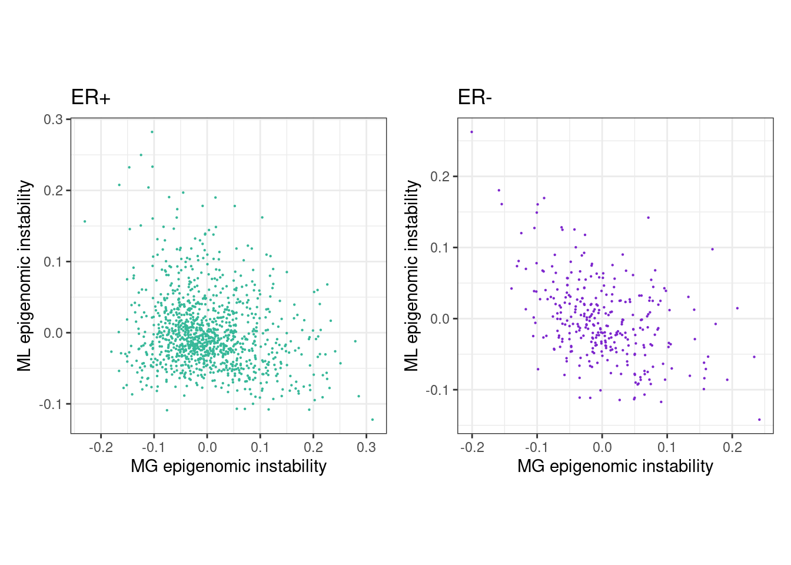

#### Extended Data Figure 6A


```r
options(repr.plot.width = 8, repr.plot.height = 4)
rho_pos <- cor(feats_df_fixed$MG[feats_df_fixed$ER == "ER+"], feats_df_fixed$clock[feats_df_fixed$ER == "ER+"], use="pairwise.complete.obs", method="spearman")
message(glue("rho ER+ = {rho_pos}"))
```

```
## rho ER+ = -0.162654292782067
```

```r
p_MG_clock_scatter_ER_positive <- feats_df_fixed %>%     
    filter(ER == "ER+") %>% 
    ggplot(aes(x=MG, y=clock, color=ER)) + 
        geom_point(size=0.1) + 
        scale_color_manual(values = annot_colors$ER1) + 
        theme(aspect.ratio = 1) + 
        xlab("MG epigenomic instability") + 
        ylab("Clock") + 
        guides(color=FALSE) + 
        ggtitle("ER+")
```

```
## Warning: `guides(<scale> = FALSE)` is deprecated. Please use `guides(<scale> =
## "none")` instead.
```

```r
rho_neg <- cor(feats_df_fixed$MG[feats_df_fixed$ER == "ER-"], feats_df_fixed$clock[feats_df_fixed$ER == "ER-"], use="pairwise.complete.obs", method="spearman")
message(glue("rho ER- = {rho_neg}"))
```

```
## rho ER- = -0.28563668716636
```

```r
p_MG_clock_scatter_ER_negative <- feats_df_fixed %>%     
    filter(ER == "ER-") %>% 
    ggplot(aes(x=MG, y=clock, color=ER)) + 
        geom_point(size=0.1) + 
        scale_color_manual(values = annot_colors$ER1) + 
        theme(aspect.ratio = 1) + 
        xlab("MG epigenomic instability") + 
        ylab("Clock") + 
        guides(color=FALSE) + 
        ggtitle("ER-")
```

```
## Warning: `guides(<scale> = FALSE)` is deprecated. Please use `guides(<scale> =
## "none")` instead.
```

```r
(p_MG_clock_scatter_ER_positive + theme_bw() + theme(aspect.ratio = 1)) + (p_MG_clock_scatter_ER_negative + theme_bw() + theme(aspect.ratio = 1))
```

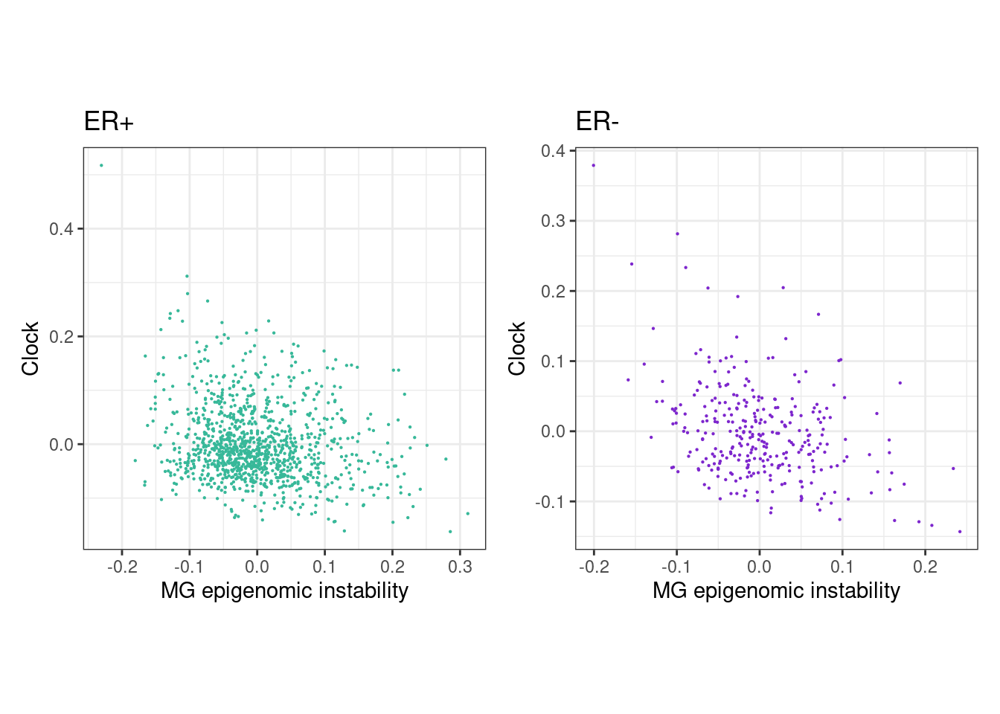


```r
options(repr.plot.width = 8, repr.plot.height = 4)
rho_pos <- cor(feats_df_fixed$ML[feats_df_fixed$ER == "ER+"], feats_df_fixed$clock[feats_df_fixed$ER == "ER+"], use="pairwise.complete.obs", method="spearman")
message(glue("rho ER+ = {rho_pos}"))
```

```
## rho ER+ = 0.353548126048103
```

```r
p_ML_clock_scatter_ER_positive <- feats_df_fixed %>%     
    filter(ER == "ER+") %>% 
    ggplot(aes(x=ML, y=clock, color=ER)) + 
        geom_point(size=0.1) + 
        scale_color_manual(values = annot_colors$ER1) + 
        theme(aspect.ratio = 1) + 
        xlab("ML epigenomic instability") + 
        ylab("Clock") + 
        guides(color=FALSE) + 
        ggtitle("ER+")
```

```
## Warning: `guides(<scale> = FALSE)` is deprecated. Please use `guides(<scale> =
## "none")` instead.
```

```r
rho_neg <- cor(feats_df_fixed$ML[feats_df_fixed$ER == "ER-"], feats_df_fixed$clock[feats_df_fixed$ER == "ER-"], use="pairwise.complete.obs", method="spearman")
message(glue("rho ER- = {rho_neg}"))
```

```
## rho ER- = 0.64775559075671
```

```r
p_ML_clock_scatter_ER_negative <- feats_df_fixed %>%     
    filter(ER == "ER-") %>% 
    ggplot(aes(x=ML, y=clock, color=ER)) + 
        geom_point(size=0.1) + 
        scale_color_manual(values = annot_colors$ER1) + 
        theme(aspect.ratio = 1) + 
        xlab("ML epigenomic instability") + 
        ylab("Clock") + 
        guides(color=FALSE) + 
        ggtitle("ER-")
```

```
## Warning: `guides(<scale> = FALSE)` is deprecated. Please use `guides(<scale> =
## "none")` instead.
```

```r
(p_ML_clock_scatter_ER_positive + theme_bw() + theme(aspect.ratio = 1)) + (p_ML_clock_scatter_ER_negative + theme_bw() + theme(aspect.ratio = 1))
```

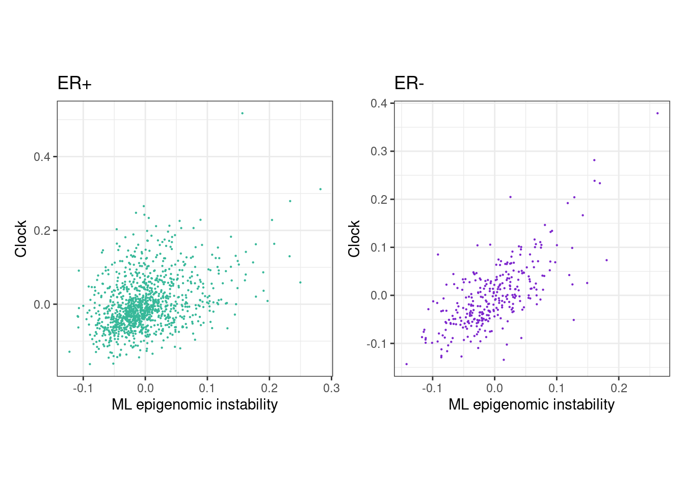

#### Extended Data Figure 6B


```r
options(repr.plot.width = 8, repr.plot.height = 4)
rho_pos <- cor(feats_df_fixed$MG[feats_df_fixed$ER == "ER+"], feats_df_fixed$immune[feats_df_fixed$ER == "ER+"], use="pairwise.complete.obs", method="spearman")
message(glue("rho ER+ = {rho_pos}"))
```

```
## rho ER+ = 0.0256502058498626
```

```r
p_MG_immune_scatter_ER_positive <- feats_df_fixed %>%     
    filter(ER == "ER+") %>% 
    ggplot(aes(x=MG, y=immune, color=ER)) + 
        geom_point(size=0.1) + 
        scale_color_manual(values = annot_colors$ER1) + 
        theme(aspect.ratio = 1) + 
        xlab("MG epigenomic instability") + 
        ylab("immune") + 
        guides(color=FALSE) + 
        ggtitle("ER+")
```

```
## Warning: `guides(<scale> = FALSE)` is deprecated. Please use `guides(<scale> =
## "none")` instead.
```

```r
rho_neg <- cor(feats_df_fixed$MG[feats_df_fixed$ER == "ER-"], feats_df_fixed$immune[feats_df_fixed$ER == "ER-"], use="pairwise.complete.obs", method="spearman")
message(glue("rho ER- = {rho_neg}"))
```

```
## rho ER- = -0.0505710341049502
```

```r
p_MG_immune_scatter_ER_negative <- feats_df_fixed %>%     
    filter(ER == "ER-") %>% 
    ggplot(aes(x=MG, y=immune, color=ER)) + 
        geom_point(size=0.1) + 
        scale_color_manual(values = annot_colors$ER1) + 
        theme(aspect.ratio = 1) + 
        xlab("MG epigenomic instability") + 
        ylab("immune") + 
        guides(color=FALSE) + 
        ggtitle("ER-")
```

```
## Warning: `guides(<scale> = FALSE)` is deprecated. Please use `guides(<scale> =
## "none")` instead.
```

```r
(p_MG_immune_scatter_ER_positive + theme_bw() + theme(aspect.ratio = 1)) + (p_MG_immune_scatter_ER_negative + theme_bw() + theme(aspect.ratio = 1))
```

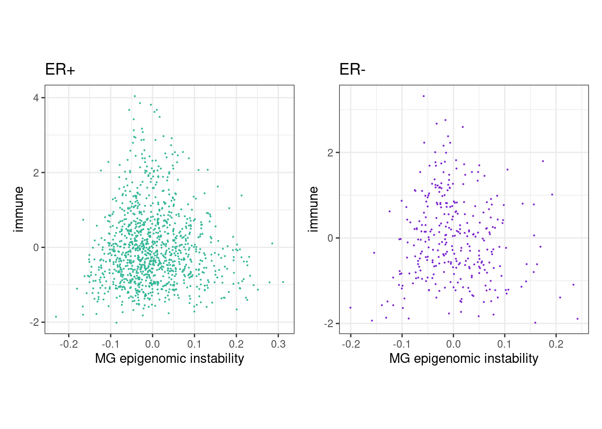


```r
options(repr.plot.width = 8, repr.plot.height = 4)
rho_pos <- cor(feats_df_fixed$ML[feats_df_fixed$ER == "ER+"], feats_df_fixed$immune[feats_df_fixed$ER == "ER+"], use="pairwise.complete.obs", method="spearman")
message(glue("rho ER+ = {rho_pos}"))
```

```
## rho ER+ = 0.0182424884995677
```

```r
p_ML_immune_scatter_ER_positive <- feats_df_fixed %>%     
    filter(ER == "ER+") %>% 
    ggplot(aes(x=ML, y=immune, color=ER)) + 
        geom_point(size=0.1) + 
        scale_color_manual(values = annot_colors$ER1) + 
        theme(aspect.ratio = 1) + 
        xlab("ML epigenomic instability") + 
        ylab("immune") + 
        guides(color=FALSE) + 
        ggtitle("ER+")
```

```
## Warning: `guides(<scale> = FALSE)` is deprecated. Please use `guides(<scale> =
## "none")` instead.
```

```r
rho_neg <- cor(feats_df_fixed$ML[feats_df_fixed$ER == "ER-"], feats_df_fixed$immune[feats_df_fixed$ER == "ER-"], use="pairwise.complete.obs", method="spearman")
message(glue("rho ER- = {rho_neg}"))
```

```
## rho ER- = -0.0483692724136299
```

```r
p_ML_immune_scatter_ER_negative <- feats_df_fixed %>%     
    filter(ER == "ER-") %>% 
    ggplot(aes(x=ML, y=immune, color=ER)) + 
        geom_point(size=0.1) + 
        scale_color_manual(values = annot_colors$ER1) + 
        theme(aspect.ratio = 1) + 
        xlab("ML epigenomic instability") + 
        ylab("immune") + 
        guides(color=FALSE) + 
        ggtitle("ER-")
```

```
## Warning: `guides(<scale> = FALSE)` is deprecated. Please use `guides(<scale> =
## "none")` instead.
```

```r
(p_ML_immune_scatter_ER_positive + theme_bw() + theme(aspect.ratio = 1)) + (p_ML_immune_scatter_ER_negative + theme_bw() + theme(aspect.ratio = 1))
```

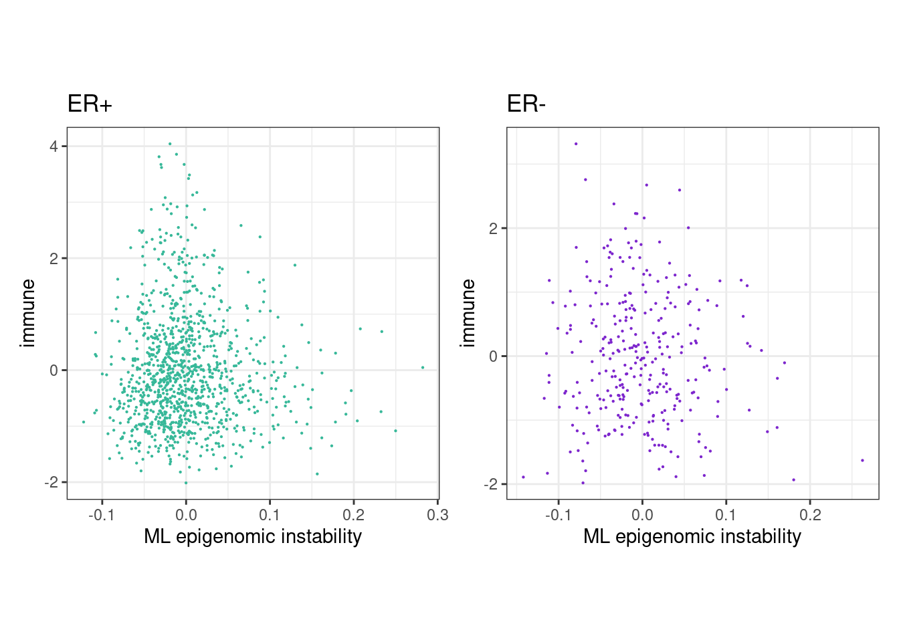


```r
options(repr.plot.width = 8, repr.plot.height = 4)
rho_pos <- cor(feats_df_fixed$MG[feats_df_fixed$ER == "ER+"], feats_df_fixed$caf[feats_df_fixed$ER == "ER+"], use="pairwise.complete.obs", method="spearman")
message(glue("rho ER+ = {rho_pos}"))
```

```
## rho ER+ = 0.0201120969323973
```

```r
p_MG_caf_scatter_ER_positive <- feats_df_fixed %>%     
    filter(ER == "ER+") %>% 
    ggplot(aes(x=MG, y=caf, color=ER)) + 
        geom_point(size=0.1) + 
        scale_color_manual(values = annot_colors$ER1) + 
        theme(aspect.ratio = 1) + 
        xlab("MG epigenomic instability") + 
        ylab("caf") + 
        guides(color=FALSE) + 
        ggtitle("ER+")
```

```
## Warning: `guides(<scale> = FALSE)` is deprecated. Please use `guides(<scale> =
## "none")` instead.
```

```r
rho_neg <- cor(feats_df_fixed$MG[feats_df_fixed$ER == "ER-"], feats_df_fixed$caf[feats_df_fixed$ER == "ER-"], use="pairwise.complete.obs", method="spearman")
message(glue("rho ER- = {rho_neg}"))
```

```
## rho ER- = -0.00276791172007093
```

```r
p_MG_caf_scatter_ER_negative <- feats_df_fixed %>%     
    filter(ER == "ER-") %>% 
    ggplot(aes(x=MG, y=caf, color=ER)) + 
        geom_point(size=0.1) + 
        scale_color_manual(values = annot_colors$ER1) + 
        theme(aspect.ratio = 1) + 
        xlab("MG epigenomic instability") + 
        ylab("caf") + 
        guides(color=FALSE) + 
        ggtitle("ER-")
```

```
## Warning: `guides(<scale> = FALSE)` is deprecated. Please use `guides(<scale> =
## "none")` instead.
```

```r
(p_MG_caf_scatter_ER_positive + theme_bw() + theme(aspect.ratio = 1)) + (p_MG_caf_scatter_ER_negative + theme_bw() + theme(aspect.ratio = 1))
```

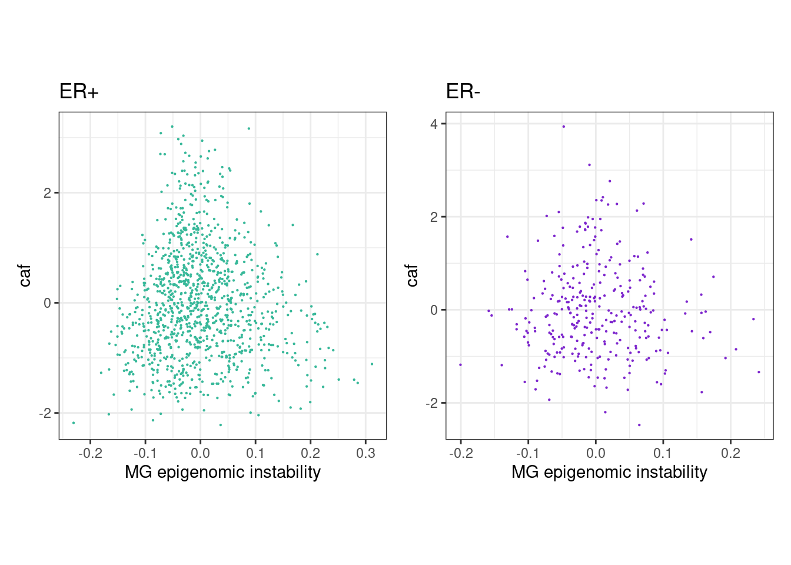


```r
options(repr.plot.width = 8, repr.plot.height = 4)
rho_pos <- cor(feats_df_fixed$ML[feats_df_fixed$ER == "ER+"], feats_df_fixed$caf[feats_df_fixed$ER == "ER+"], use="pairwise.complete.obs", method="spearman")
message(glue("rho ER+ = {rho_pos}"))
```

```
## rho ER+ = 0.0336682666159654
```

```r
p_ML_caf_scatter_ER_positive <- feats_df_fixed %>%     
    filter(ER == "ER+") %>% 
    ggplot(aes(x=ML, y=caf, color=ER)) + 
        geom_point(size=0.1) + 
        scale_color_manual(values = annot_colors$ER1) + 
        theme(aspect.ratio = 1) + 
        xlab("ML epigenomic instability") + 
        ylab("caf") + 
        guides(color=FALSE) + 
        ggtitle("ER+")
```

```
## Warning: `guides(<scale> = FALSE)` is deprecated. Please use `guides(<scale> =
## "none")` instead.
```

```r
rho_neg <- cor(feats_df_fixed$ML[feats_df_fixed$ER == "ER-"], feats_df_fixed$caf[feats_df_fixed$ER == "ER-"], use="pairwise.complete.obs", method="spearman")
message(glue("rho ER- = {rho_neg}"))
```

```
## rho ER- = 0.0020186843607852
```

```r
p_ML_caf_scatter_ER_negative <- feats_df_fixed %>%     
    filter(ER == "ER-") %>% 
    ggplot(aes(x=ML, y=caf, color=ER)) + 
        geom_point(size=0.1) + 
        scale_color_manual(values = annot_colors$ER1) + 
        theme(aspect.ratio = 1) + 
        xlab("ML epigenomic instability") + 
        ylab("caf") + 
        guides(color=FALSE) + 
        ggtitle("ER-")
```

```
## Warning: `guides(<scale> = FALSE)` is deprecated. Please use `guides(<scale> =
## "none")` instead.
```

```r
(p_ML_caf_scatter_ER_positive + theme_bw() + theme(aspect.ratio = 1)) + (p_ML_caf_scatter_ER_negative + theme_bw() + theme(aspect.ratio = 1))
```

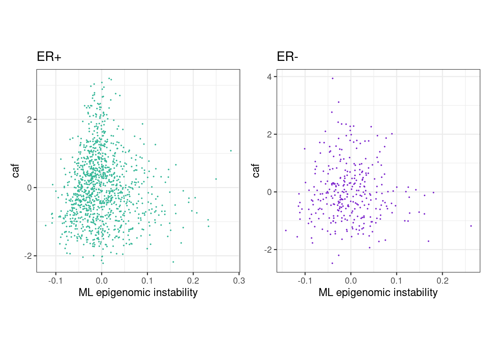

## Annotate epignomic instability scores


```r
feats <- get_all_features()
nbins <- 5
df <- feats %>% 
    mutate(
        clock = cut(clock, quantile(clock, 0:nbins/nbins, na.rm=TRUE), include.lowest=TRUE, labels=1:nbins), 
        immune = cut(immune, quantile(immune, 0:nbins/nbins, na.rm=TRUE), include.lowest=TRUE, labels=1:nbins), 
        caf = cut(caf, quantile(caf, 0:nbins/nbins, na.rm=TRUE), include.lowest=TRUE, labels=1:nbins), 
        immune.meth = cut(immune.meth, quantile(immune.meth, 0:nbins/nbins, na.rm=TRUE), include.lowest=TRUE, labels=1:nbins), 
        caf.meth = cut(caf.meth, quantile(caf.meth, 0:nbins/nbins, na.rm=TRUE), include.lowest=TRUE, labels=1:nbins), 
        MG = cut(MG, quantile(MG, 0:nbins/nbins, na.rm=TRUE), include.lowest=TRUE, labels=1:nbins), 
        ML = cut(ML, quantile(ML, 0:nbins/nbins, na.rm=TRUE), include.lowest=TRUE, labels=1:nbins)) %>% 
    left_join(samp_data %>% select(samp, stage, grade), by = "samp") %>% 
    mutate(stage = ifelse(stage %in% c(0, "DCIS", 1), "0-1", stage)) %>% 
    mutate(stage = ifelse(ER == "normal", "N", stage)) %>% 
    mutate(grade = ifelse(ER == "normal", "N", grade))
```


```r
df_pval <- df %>% filter(ER %in% c("ER+", "ER-")) %>% gather("feat", "bin", -samp, -ER, -stage, -grade)  %>% group_by(ER, feat) %>% summarise(grade_pval = chisq.test(bin, grade)$p.value, stage_pval = chisq.test(bin, stage)$p.value) %>% mutate(signif_grade = case_when(grade_pval < 0.0001 ~ "****", grade_pval < 0.001 ~ "***", grade_pval < 0.01 ~ "**", grade_pval < 0.05 ~ "*"), signif_stage = case_when(stage_pval < 0.0001 ~ "****", stage_pval < 0.001 ~ "***",  stage_pval < 0.01 ~ "**", stage_pval < 0.05 ~ "*"))
```

```
## Warning in chisq.test(bin, grade): Chi-squared approximation may be incorrect

## Warning in chisq.test(bin, grade): Chi-squared approximation may be incorrect

## Warning in chisq.test(bin, grade): Chi-squared approximation may be incorrect

## Warning in chisq.test(bin, grade): Chi-squared approximation may be incorrect

## Warning in chisq.test(bin, grade): Chi-squared approximation may be incorrect

## Warning in chisq.test(bin, grade): Chi-squared approximation may be incorrect

## Warning in chisq.test(bin, grade): Chi-squared approximation may be incorrect
```

```
## Warning in chisq.test(bin, stage): Chi-squared approximation may be incorrect

## Warning in chisq.test(bin, stage): Chi-squared approximation may be incorrect

## Warning in chisq.test(bin, stage): Chi-squared approximation may be incorrect

## Warning in chisq.test(bin, stage): Chi-squared approximation may be incorrect

## Warning in chisq.test(bin, stage): Chi-squared approximation may be incorrect

## Warning in chisq.test(bin, stage): Chi-squared approximation may be incorrect

## Warning in chisq.test(bin, stage): Chi-squared approximation may be incorrect

## Warning in chisq.test(bin, stage): Chi-squared approximation may be incorrect

## Warning in chisq.test(bin, stage): Chi-squared approximation may be incorrect

## Warning in chisq.test(bin, stage): Chi-squared approximation may be incorrect

## Warning in chisq.test(bin, stage): Chi-squared approximation may be incorrect

## Warning in chisq.test(bin, stage): Chi-squared approximation may be incorrect

## Warning in chisq.test(bin, stage): Chi-squared approximation may be incorrect
```

```r
as.data.frame(df_pval)
```

```
##     ER        feat   grade_pval  stage_pval signif_grade signif_stage
## 1  ER-         caf 2.264293e-04 0.001946125          ***           **
## 2  ER-    caf.meth 3.081915e-03 0.209690818           **         <NA>
## 3  ER-       clock 6.348596e-01 0.070940655         <NA>         <NA>
## 4  ER-      immune 3.712915e-01 0.580276177         <NA>         <NA>
## 5  ER- immune.meth 3.051790e-01 0.102242249         <NA>         <NA>
## 6  ER-          MG 5.763868e-01 0.042991948         <NA>            *
## 7  ER-          ML 6.479486e-01 0.873719290         <NA>         <NA>
## 8  ER+         caf 6.512545e-05 0.060334718         ****         <NA>
## 9  ER+    caf.meth 1.267372e-05 0.070515621         ****         <NA>
## 10 ER+       clock 1.471181e-01 0.572271776         <NA>         <NA>
## 11 ER+      immune 6.363196e-04 0.457202009          ***         <NA>
## 12 ER+ immune.meth 5.579626e-03 0.293001516           **         <NA>
## 13 ER+          MG 1.588818e-06 0.099708353         ****         <NA>
## 14 ER+          ML 5.428637e-10 0.230225194         ****         <NA>
```

```r
df_pval %>% filter(grade_pval <= 0.05)
```

```
## # A tibble: 8 x 6
## # groups: ER
##    ER        feat    grade_pval  stage_pval signif_grade signif_stage
## 1 ER-         caf 0.00022642925 0.001946125          ***           **
## 2 ER-    caf.meth 0.00308191469 0.209690818           **         <NA>
## 3 ER+         caf 0.00006512545 0.060334718         ****         <NA>
## 4 ER+    caf.meth 0.00001267372 0.070515621         ****         <NA>
## 5 ER+      immune 0.00063631960 0.457202009          ***         <NA>
## 6 ER+ immune.meth 0.00557962596 0.293001516           **         <NA>
## # ... with 2 more rows
```


```r
df_pval %>% filter(stage_pval <= 0.05)
```

```
## # A tibble: 2 x 6
## # groups: ER
##    ER feat   grade_pval  stage_pval signif_grade signif_stage
## 1 ER-  caf 0.0002264293 0.001946125          ***           **
## 2 ER-   MG 0.5763867809 0.042991948         <NA>            *
```

#### Extended Data Figure 6D


```r
options(repr.plot.width = 6, repr.plot.height = 4)
p_stage_MG <- df %>% 
    filter(ER == "ER+") %>%
    mutate(stage = factor(stage, levels = c("N", "0-1", "2", "3", "4"))) %>% 
    filter(!is.na(stage)) %>% 
    count(stage, MG) %>% 
    group_by(MG) %>% 
    mutate(p = n / sum(n)) %>% 
    ggplot(aes(x=MG, y=p, fill=stage)) + 
        geom_col() + 
        scale_fill_manual(name = "Stage", values = c("N" = "gray", "0-1" = "black", "2" = "blue", "3" = "red", "4" = "orange")) + 
        scale_y_continuous(labels=scales::percent) + 
        ylab("% of samples")

p_stage_ML <- df %>% 
    filter(ER == "ER+") %>%
    mutate(stage = factor(stage, levels = c("N", "0-1", "2", "3", "4"))) %>% 
    filter(!is.na(stage)) %>% 
    count(stage, ML) %>% 
    group_by(ML) %>% 
    mutate(p = n / sum(n)) %>% 
    ggplot(aes(x=ML, y=p, fill=stage)) + 
        geom_col() + 
        scale_fill_manual(name = "Stage", values = c("N" = "gray", "0-1" = "black", "2" = "blue", "3" = "red", "4" = "orange")) + 
        scale_y_continuous(labels=scales::percent) + 
        ylab("% of samples")

p_stage_MG + theme_bw()
```

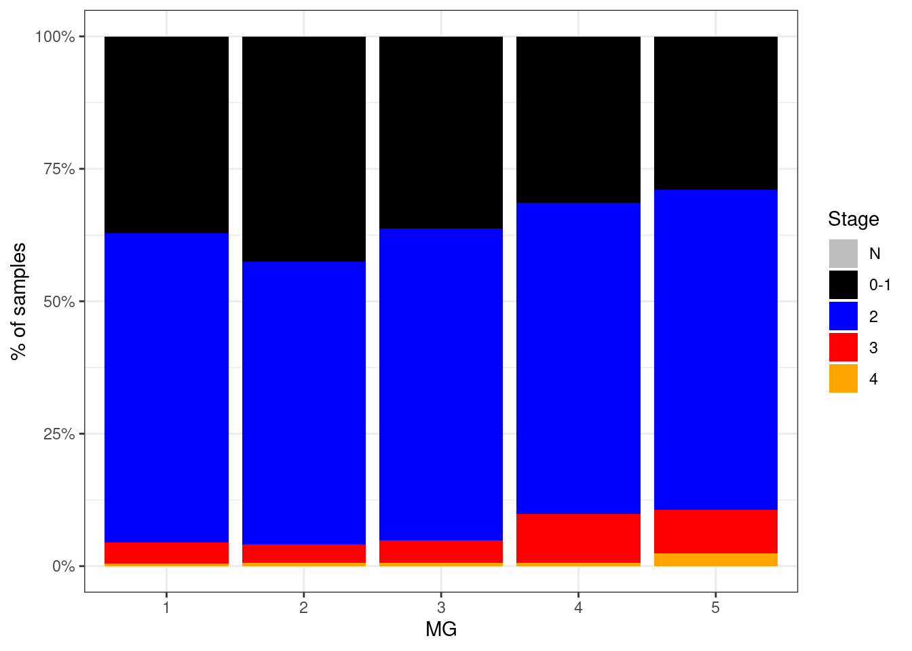

```r
p_stage_ML + theme_bw()
```

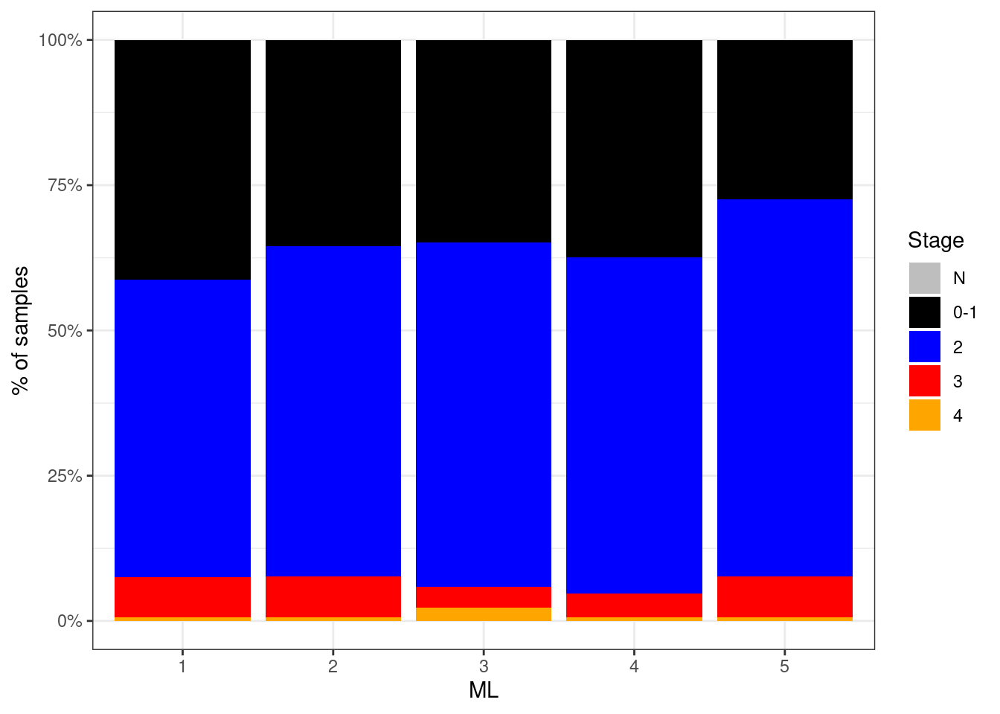

Same for ER-:


```r
options(repr.plot.width = 6, repr.plot.height = 4)
p_grade_MG_neg <- df %>% 
    filter(ER == "ER-") %>%
    mutate(grade = factor(grade, levels = c("N", "1", "2", "3"))) %>% 
    filter(!is.na(grade)) %>% 
    count(grade, MG) %>% 
    group_by(MG) %>% 
    mutate(p = n / sum(n)) %>% 
    ggplot(aes(x=MG, y=p, fill=grade)) + 
        geom_col() + 
        scale_fill_manual(name = "Grade", values = c("N" = "gray", "1" = "darkblue", "2" = "red", "3" = "orange")) + 
        scale_y_continuous(labels=scales::percent) + 
        ylab("% of samples")

p_grade_ML_neg <- df %>% 
    filter(ER == "ER-") %>%
    mutate(grade = factor(grade, levels = c("N", "1", "2", "3"))) %>% 
    filter(!is.na(grade)) %>% 
    count(grade, ML) %>% 
    group_by(ML) %>% 
    mutate(p = n / sum(n)) %>% 
    ggplot(aes(x=ML, y=p, fill=grade)) + 
        geom_col() + 
        scale_fill_manual(name = "Grade", values = c("N" = "gray", "1" = "darkblue", "2" = "red", "3" = "orange")) + 
        scale_y_continuous(labels=scales::percent) + 
        ylab("% of samples")

p_grade_MG_neg + theme_bw()
```

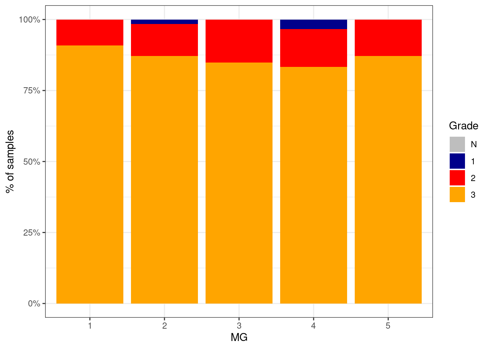

```r
p_grade_ML_neg + theme_bw()
```

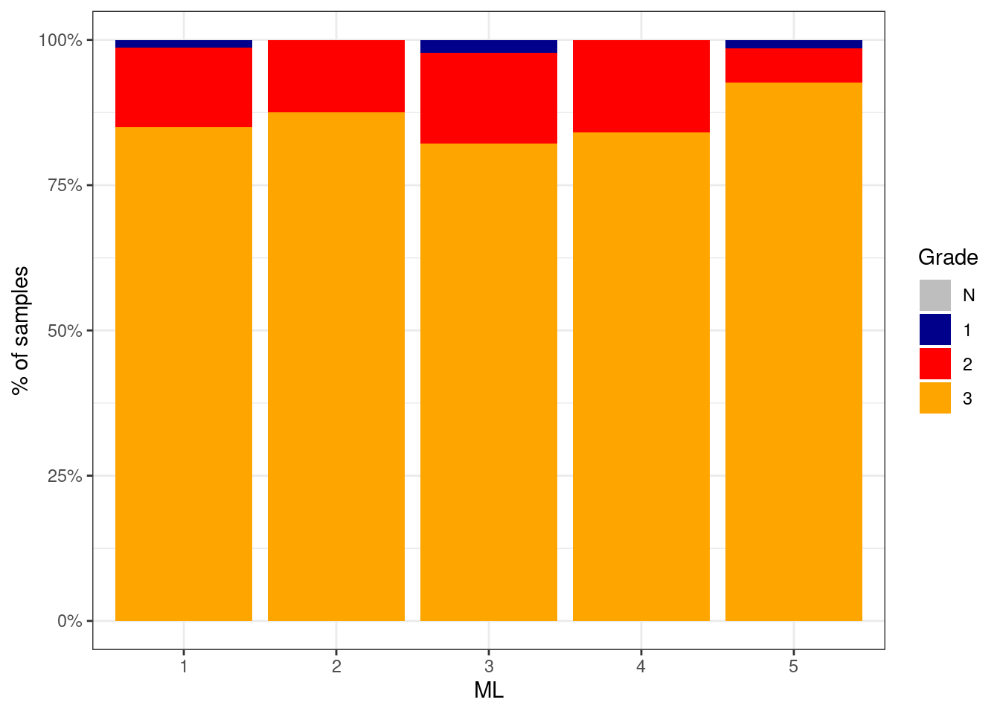


```r
options(repr.plot.width = 6, repr.plot.height = 4)
p_stage_MG_neg <- df %>% 
    filter(ER == "ER-") %>%
    mutate(stage = factor(stage, levels = c("N", "0-1", "2", "3", "4"))) %>% 
    filter(!is.na(stage)) %>% 
    count(stage, MG) %>% 
    group_by(MG) %>% 
    mutate(p = n / sum(n)) %>% 
    ggplot(aes(x=MG, y=p, fill=stage)) + 
        geom_col() + 
        scale_fill_manual(name = "Stage", values = c("N" = "gray", "0-1" = "black", "2" = "blue", "3" = "red", "4" = "orange")) + 
        scale_y_continuous(labels=scales::percent) + 
        ylab("% of samples")

p_stage_ML_neg <- df %>% 
    filter(ER == "ER-") %>%
    mutate(stage = factor(stage, levels = c("N", "0-1", "2", "3", "4"))) %>% 
    filter(!is.na(stage)) %>% 
    count(stage, ML) %>% 
    group_by(ML) %>% 
    mutate(p = n / sum(n)) %>% 
    ggplot(aes(x=ML, y=p, fill=stage)) + 
        geom_col() + 
        scale_fill_manual(name = "Stage", values = c("N" = "gray", "0-1" = "black", "2" = "blue", "3" = "red", "4" = "orange")) + 
        scale_y_continuous(labels=scales::percent) + 
        ylab("% of samples")

p_stage_MG_neg + theme_bw()
```

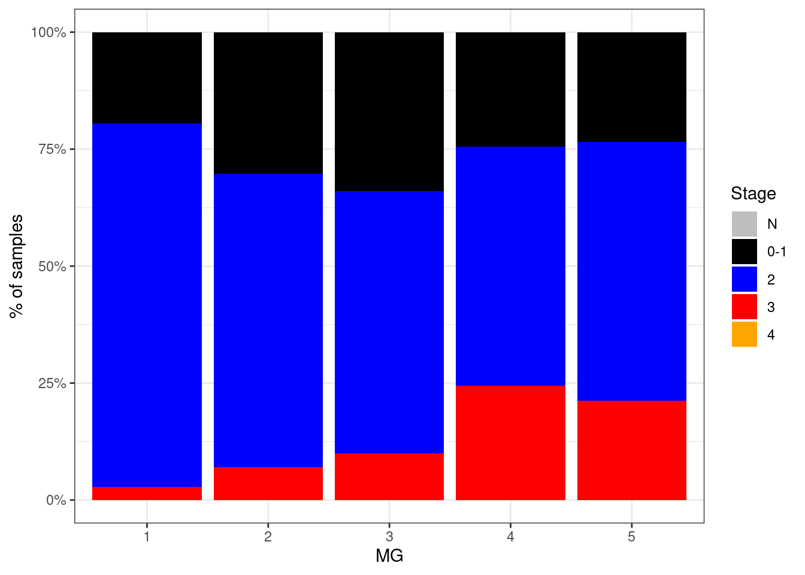

```r
p_stage_ML_neg + theme_bw()
```

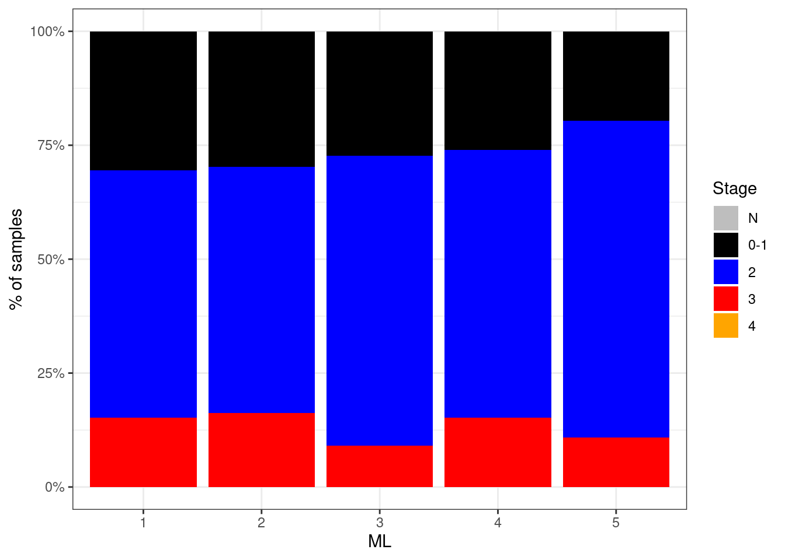

#### Figure 2D


```r
options(repr.plot.width = 6, repr.plot.height = 4)
p_grade_MG <- df %>% 
    filter(ER == "ER+") %>%
    mutate(grade = factor(grade, levels = c("N", "1", "2", "3"))) %>% 
    filter(!is.na(grade)) %>% 
    count(grade, MG) %>% 
    group_by(MG) %>% 
    mutate(p = n / sum(n)) %>% 
    ggplot(aes(x=MG, y=p, fill=grade)) + 
        geom_col() + 
        scale_fill_manual(name = "Grade", values = c("N" = "gray", "1" = "darkblue", "2" = "red", "3" = "orange")) + 
        scale_y_continuous(labels=scales::percent) + 
        ylab("% of samples")

p_grade_ML <- df %>% 
    filter(ER == "ER+") %>%
    mutate(grade = factor(grade, levels = c("N", "1", "2", "3"))) %>% 
    filter(!is.na(grade)) %>% 
    count(grade, ML) %>% 
    group_by(ML) %>% 
    mutate(p = n / sum(n)) %>% 
    ggplot(aes(x=ML, y=p, fill=grade)) + 
        geom_col() + 
        scale_fill_manual(name = "Grade", values = c("N" = "gray", "1" = "darkblue", "2" = "red", "3" = "orange")) + 
        scale_y_continuous(labels=scales::percent) + 
        ylab("% of samples")

p_grade_MG + theme_bw()
```

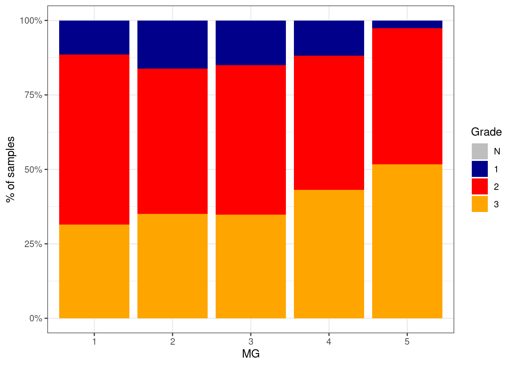

```r
p_grade_ML + theme_bw()
```


### Integrative clusters


#### Extended Data Figure 7C


```r
options(repr.plot.width = 8, repr.plot.height = 6)
df <- feats %>%
        left_join(samp_data %>% select(samp, iC10)) %>%
        filter(!is.na(iC10)) %>%
        mutate(iC10 = factor(iC10, levels = names(annot_colors$iC10))) %>%
        select(samp, ER, MG, ML, iC10) %>%
        gather("clust", "score", -ER, -iC10, -samp)
```

```
## Joining, by = "samp"
```

```r
p_iC10 <- df %>%
        ggplot(aes(x = iC10, y = score, fill = iC10)) +
        geom_boxplot(lwd = 0.2, outlier.size = 0.2) +
        facet_grid(clust ~ .) +
        guides(fill = FALSE) +
        scale_fill_manual(values = annot_colors$iC10) +
        ylab("") +
        theme(aspect.ratio = 0.5) + 
        vertical_labs()
```

```
## Warning: `guides(<scale> = FALSE)` is deprecated. Please use `guides(<scale> =
## "none")` instead.
```

```r
p_iC10 + theme_bw() + theme(aspect.ratio = 0.5) + vertical_labs() + ggpubr::stat_compare_means(method = "kruskal")
```

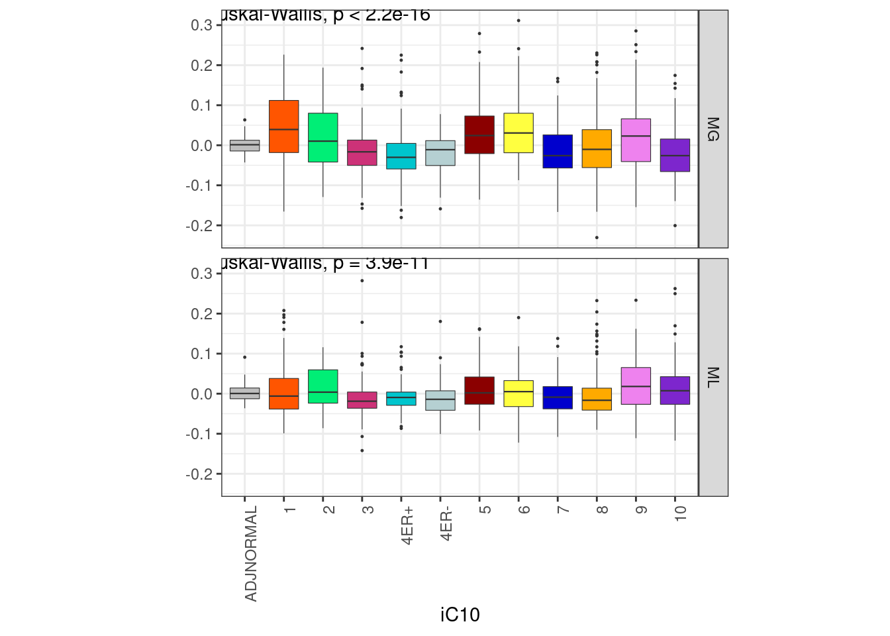


```r
df %>% distinct(samp, iC10) %>% count(iC10)
```

```
## # A tibble: 12 x 2
##        iC10   n
## 1 ADJNORMAL  92
## 2         1  98
## 3         2  54
## 4         3 214
## 5      4ER+ 172
## 6      4ER-  50
## # ... with 6 more rows
```

## Cross correlation (methylation-expression) of epigenomic instability loci


Create a matrix with methylation of loci that are part of MG or ML epigenmic instability and cross correlate it with gene expression in ER+:


```r
all_norm_meth <- fread(here("data/all_norm_meth.tsv")) %>% as_tibble()
ER_positive_mat <- all_norm_meth %>% select(chrom:end, any_of(ER_positive_samples)) %>% intervs_to_mat()
loci_annot <- fread(here("data/loci_annot_epigenomic_features.tsv")) %>% as_tibble()
cor_thresh <- 0.3
```


```r
coords <- loci_annot %>% 
    filter(abs(MG) >= cor_thresh | abs(ML) >= cor_thresh & abs(clock) < cor_thresh) %>% 
    select(chrom:end) %>% intervs_to_mat() %>% rownames()
meth_mat <- ER_positive_mat[coords, ]

expr_m <- fread(here("data/expression_matrix.csv")) %>% select(-any_of(c("chrom", "start", "end", "name3.chr")))
expr_mat <- expr_m %>%
    as.data.frame() %>%
    column_to_rownames("name")
f <- rowSums(!is.na(expr_mat)) > 0
expr_mat <- expr_mat[f, ]
```


```r
em_cross <- em_cross_cor(meth_mat, expr_mat, meth_cor_thresh = 0.25, expr_cor_thresh = 0.25) %cache_rds% here("data/MG_ML_em_cross_cor.rds")
```


```r
em_cross_clust <- cluster_em_cross_cor(em_cross, k_meth = 32, k_expr = 32) %cache_rds% here("data/MG_ML_em_cross_cor_clust.rds")
```

#### Figure 2F


```r
options(repr.plot.width = 8, repr.plot.height = 13)
plot_em_cross_cor(em_cross_clust)
```

```
## plotting em cross
```

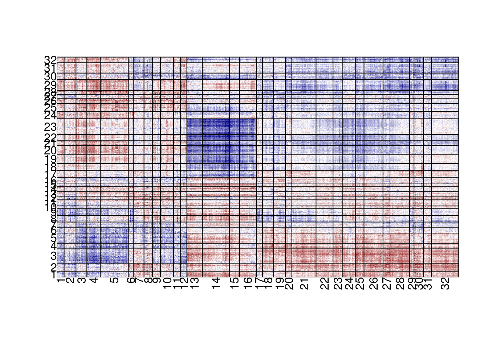

Annotating the methylation clusters we can see which are `MG` and which are `ML`


```r
options(repr.plot.width = 10, repr.plot.height = 7)
cutree_order(em_cross_clust$hc_meth, k=32)  %>% 
    mat_to_intervs() %>% 
    set_names(c("chrom", "start", "end", "clust")) %>% 
    left_join(loci_annot %>% select(chrom, start, end,clock, MG, ML)) %>% 
    mutate(feat = case_when(
        clock >= cor_thresh ~ "clock", 
        MG >= cor_thresh ~ "MG", 
        ML >= cor_thresh ~ "ML", 
        TRUE ~ "other")) %>% 
    count(clust, feat)  %>% 
    as_tibble() %>% 
    group_by(clust) %>% 
    mutate(p = n / sum(n)) %>% 
    ggplot(aes(x=factor(clust), y=n, fill=feat)) + geom_col() + theme_bw()
```

```
## Joining, by = c("chrom", "start", "end")
```

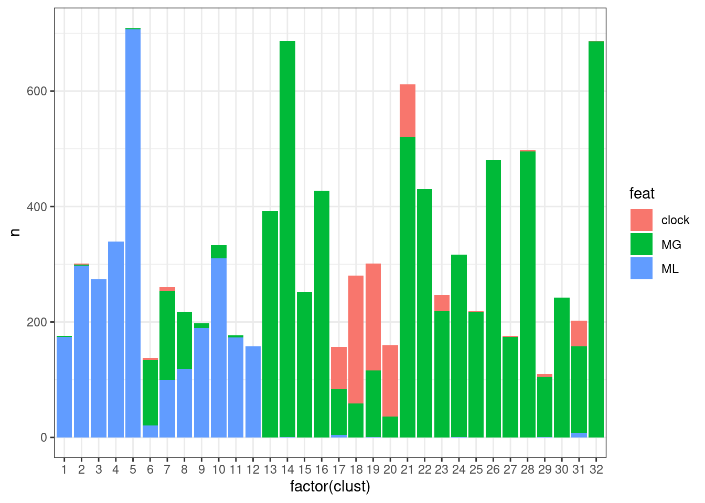


```r
options(repr.plot.width = 8, repr.plot.height = 13)
plot_em_cross_cor(em_cross_clust, k_meth = 3, k_exp = 32)
```

```
## plotting em cross
```

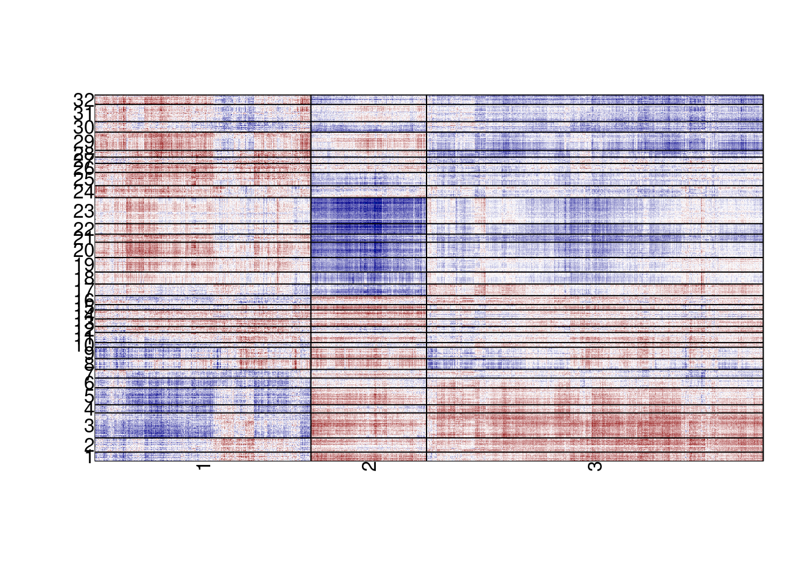


```r
em_cross_clust$expr_clust %>% arrange(clust) %>% fwrite(here("data/MG_ML_em_cross_gene_clust_id.tsv"), sep="\t")
```

Plot for each expression cluster the name of the gene with highest correlation to any locus.


```r
top_genes <- em_cross_clust$em_cross %>%
    gather_matrix("name", "locus", "cor") %>%
    left_join(em_cross_clust$expr_clust) %>%
    arrange(clust, cor) %>%
    group_by(clust) %>%
    slice(1) %>%
    ungroup() %>%
    left_join(em_cross_clust$expr_clust %>%
        count(clust) %>%
        mutate(p = cumsum(n / sum(n)), pos = p - (p - lag(p, default = 0)) / 2) %>%
        select(clust, pos)) %cache_df% here("data/MG_ML_em_cross_top_genes.tsv")
```


```r
p_gene_names <- ggplot(top_genes, aes(x = 1, y = pos, label = name)) + geom_text() + theme_void(base_size = 3, base_family = "Arial")
```

Plot barplots of MG gene expression correlations


```r
gene_annots <- get_gene_annots()
```

```
## Joining, by = "type"
```


```r
feat_gene_cors <- get_expression_features_cors()
```


```r
gene_annots_cors <- feat_gene_cors  %>% left_join(gene_annots, by = "name")  %>% filter(ER == "ER+", MG >= 0.15)  %>% distinct() 
```

#### Figure 2G


```r
options(repr.plot.width = 8, repr.plot.height = 8)

p_cc <- gene_annots_cors %>%
        filter(type == "Cell Cycle") %>%
        ggplot(aes(x = reorder(name, MG), y = MG)) + geom_col(fill = "#008B45FF") + xlab("") + ylab("Correlation to MG") + vertical_labs() + ggtitle("Cell Cycle") + ylim(0, 0.5) + theme(axis.text.x = element_text(size = 4, family = "Arial")) + theme(plot.title = element_text(hjust = 0.5), panel.grid.major.x = element_blank())
p_emb <- gene_annots_cors %>%
        filter(type == "Embryonic TF") %>%
        ggplot(aes(x = reorder(name, MG), y = MG)) + geom_col(fill = "#3B4992FF") + xlab("") + ylab("Correlation to MG") + vertical_labs() + ggtitle("Embryonic TF") + ylim(0, 0.5) + theme(axis.text.x = element_text(size = 4, family = "Arial"), plot.title = element_text(hjust = 0.5), panel.grid.major.x = element_blank()) 
p_other <- gene_annots_cors %>%
        filter(type == "Other") %>%
        ggplot(aes(x = reorder(name, MG), y = MG)) + geom_col(fill = "black") + xlab("") + ylab("Correlation to MG") + vertical_labs() + ggtitle("Other") + ylim(0, 0.5) + theme(axis.text.x = element_text(size = 4, family = "Arial"), plot.title = element_text(hjust = 0.5), panel.grid.major.x = element_blank()) 

p_cc
```

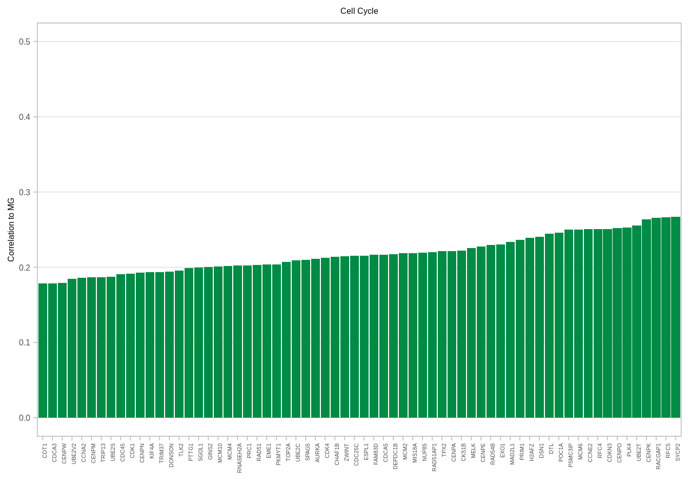

```r
p_emb
```

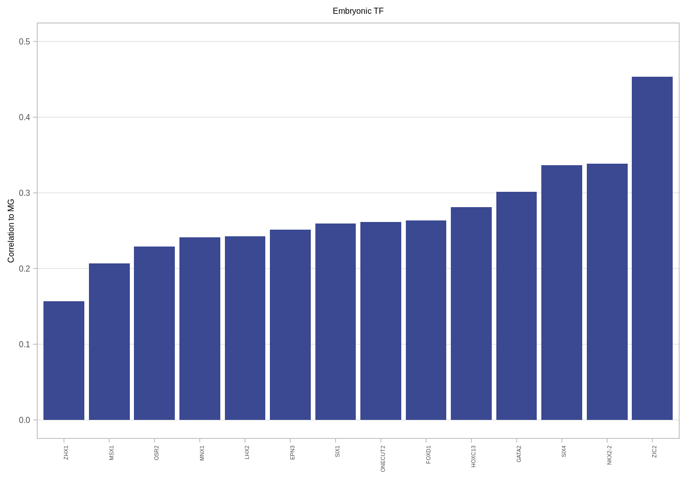

```r
p_other
```

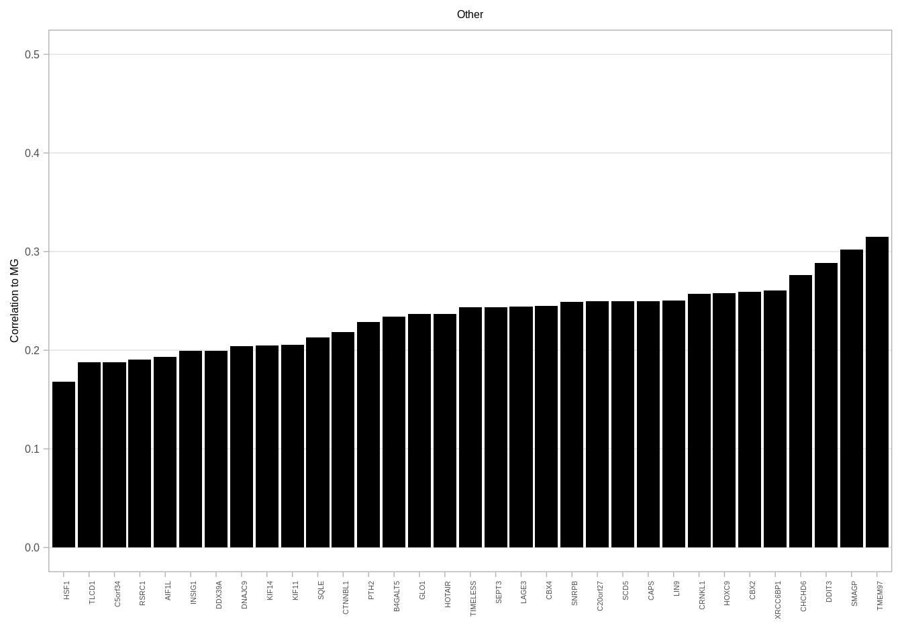

## Epigenomic instability in different Time of replication (TOR) regimes


```r
loci_annot <- fread(here("data/loci_annot_epigenomic_features.tsv")) %>% as_tibble()
loci_clust <- fread(here("data/ER_positive_loci_clust_df.tsv")) %>% as_tibble()
loci_clust <- loci_clust %>% left_join(loci_annot)
```

```
## Joining, by = c("chrom", "start", "end")
```

```r
loci_clust_MG <- loci_clust %>% filter(clust == "MG")
loci_clust_ML <- loci_clust %>% filter(clust == "ML")
```


```r
all_mat_raw <- get_all_meth() %>% intervs_to_mat()
```


```r
tor_strata <- loci_clust_MG %>% mutate(tor_strata = cut(tor, breaks = main_config$genomic_regions$tor_low_mid_high, labels=c("late", "intermediate", "early"))) %>% pull(tor_strata) %>% forcats::fct_explicit_na()
intervs <- loci_clust_MG %>% intervs_to_mat() %>% rownames()
```


```r
samp_meth_tor_MG <- tgs_matrix_tapply(t(all_mat_raw[intervs, ]), tor_strata, mean, na.rm=TRUE) %>% t() %>% as.data.frame() %>% rownames_to_column("samp") %>% add_ER() %>% as_tibble()
```

#### Extended Data Figure 7B


```r
options(repr.plot.width = 4, repr.plot.height = 4)
p_early_late <- samp_meth_tor_MG %>% 
    filter(ER != "normal") %>% 
    ggplot(aes(x=early, y=late, color=ER)) + 
        geom_abline(linetype = "dashed") + 
        geom_point(size=0.5) + 
        xlim(0, 0.8) + 
        ylim(0, 0.8) + 
        xlab("MG loci: early replicating") + 
        ylab("MG loci: late replicating") + 
        scale_color_manual(values=annot_colors$ER1) +         
        theme(aspect.ratio = 1) 

samp_meth_tor_MG %>% filter(ER != "normal") %>% summarise(cor_early_late = cor(early, late, method = "spearman", use = "pairwise.complete.obs"), cor_early_mid = cor(early, intermediate, method = "spearman", use = "pairwise.complete.obs"))
```

```
## # A tibble: 1 x 2
##   cor_early_late cor_early_mid
## 1      0.8602804     0.9382058
```

```r
p_early_late + theme_bw() + theme(aspect.ratio = 1) 
```

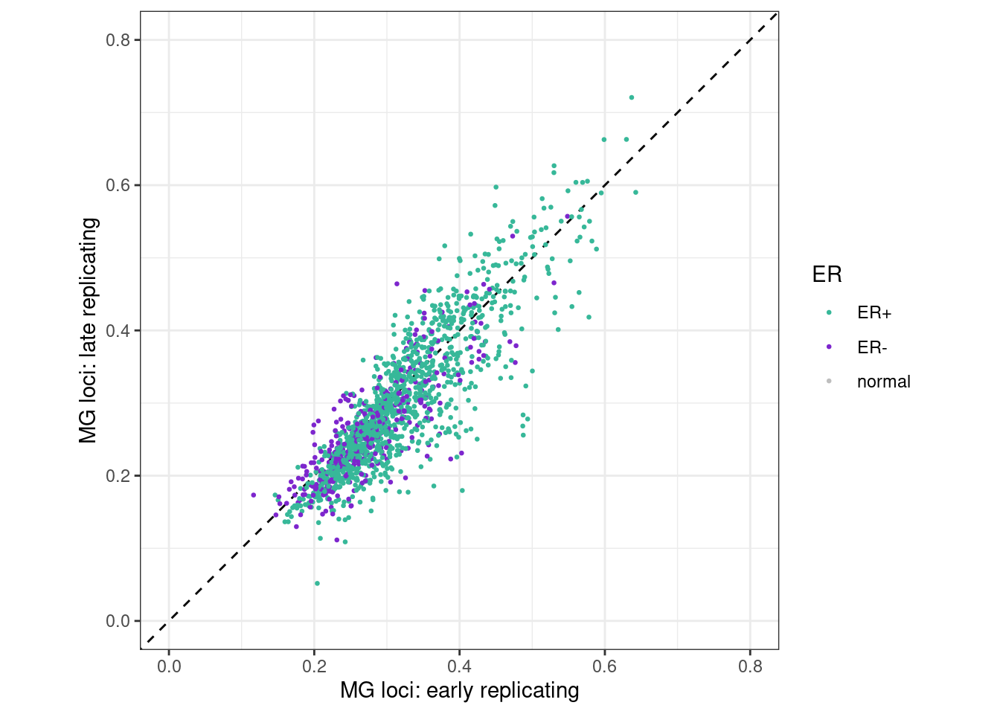


```r
tor_strata <- loci_clust_ML %>% mutate(tor_strata = cut(tor, breaks = main_config$genomic_regions$tor_low_mid_high, labels=c("late", "intermediate", "early"))) %>% pull(tor_strata) %>% forcats::fct_explicit_na()
intervs <- loci_clust_ML %>% intervs_to_mat() %>% rownames()
```


```r
samp_meth_tor_ML <- tgs_matrix_tapply(t(all_mat_raw[intervs, ]), tor_strata, mean, na.rm=TRUE) %>% t() %>% as.data.frame() %>% rownames_to_column("samp") %>% add_ER() %>% as_tibble()
```


```r
options(repr.plot.width = 4, repr.plot.height = 4)
p_early_late_ML <- samp_meth_tor_ML %>% 
    filter(ER != "normal") %>% 
    ggplot(aes(x=early, y=late, color=ER)) + 
        geom_abline(linetype = "dashed") + 
        geom_point(size=0.5) + 
        xlim(0, 0.8) + 
        ylim(0, 0.8) + 
        xlab("ML loci: early replicating") + 
        ylab("ML loci: late replicating") + 
        scale_color_manual(values=annot_colors$ER1) +         
        theme(aspect.ratio = 1) 

samp_meth_tor_ML %>% filter(ER != "normal") %>% summarise(cor_early_late = cor(early, late, method = "spearman", use = "pairwise.complete.obs"), cor_early_mid = cor(early, intermediate, method = "spearman", use = "pairwise.complete.obs"))
```

```
## # A tibble: 1 x 2
##   cor_early_late cor_early_mid
## 1      0.8201663     0.9276362
```

```r
p_early_late_ML + theme_bw() + theme(aspect.ratio = 1) 
```

```
## Warning: Removed 32 rows containing missing values (geom_point).
```

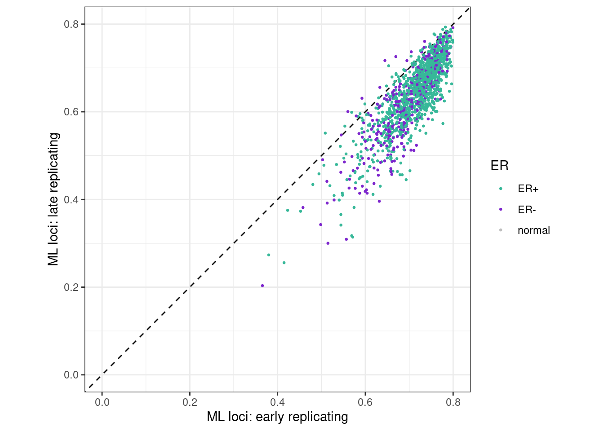


```r
gc()
```

```
##              used    (Mb) gc trigger    (Mb)   max used    (Mb)
## Ncells    4690952   250.6    8042191   429.5    8042191   429.5
## Vcells 1417529451 10814.9 2192953529 16731.0 1803628477 13760.6
```
