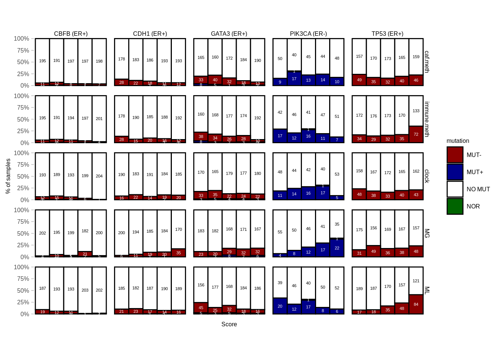

---
jupyter:
  jupytext:
    formats: ipynb,Rmd
    text_representation:
      extension: .Rmd
      format_name: rmarkdown
      format_version: '1.2'
      jupytext_version: 1.11.4
  kernelspec:
    display_name: R
    language: R
    name: ir
---

# Mutations


```r
source(here::here("scripts/init.R"))
```


```r
mut_df <- get_mut_df()
dim(mut_df)
```

```
## [1] 283689      4
```


```r
mut_df%>% distinct(samp) %>% nrow()
```

```
## [1] 1659
```

We compare the distribution of the epigenomic scores with and without mutation for a panel of 171 genes. We do it separatly for activating (+) and inactivating (-) mutations. 


```r
calc_features_mutation_pvals <- function(min_n = 10) {
    feats_tidy <- get_all_features() %>% 
        select(-caf, -immune) %>% 
        gather("feat", "score", -ER, -samp) 
    mut_df <- get_mut_df()
    df <- mut_df %>% left_join(feats_tidy, by = "samp")

    pvals_minus <- df %>%
        group_by(gene, ER, feat) %>%
        filter(sum(!is.na(score[mutation == "MUT-"])) >= min_n) %>%
        summarise(pval = wilcox.test(score[mutation == "MUT-"], score[mutation %in% c("NO MUT", "MUT+")])$p.value) %>%
        ungroup() %>%
        mutate(type = "MUT-")

    pvals_plus <- df %>%
        group_by(gene, ER, feat) %>%
        filter(sum(!is.na(score[mutation == "MUT+"])) >= min_n) %>%
        summarise(pval = wilcox.test(score[mutation == "MUT+"], score[mutation %in% c("NO MUT", "MUT-")])$p.value) %>%
        ungroup() %>%
        mutate(type = "MUT+")

    pvals <- bind_rows(pvals_minus, pvals_plus) %>%
        group_by(ER) %>% 
        mutate(qval = p.adjust(pval))    

    return(pvals)
} %cache_df% "data/features_mutations_pvals.tsv"

pvals <- calc_features_mutation_pvals()
```


```r
signif_genes <- pvals %>%
        filter(qval <= 0.01) %>%
        pull(gene) %>%
        unique()

pvals %>% filter(qval <= 0.01) %>% arrange(gene) %>% mutate(signif = case_when(qval < 0.0001 ~ "****", qval < 0.001 ~ "***", qval < 0.01 ~ "**", qval < 0.05 ~ "*"))
```

```
## # A tibble: 6 x 7
## # groups: ER
##     gene  ER        feat         pval type         qval signif
## 1   CBFB ER+          ML 1.859177e-06 MUT- 2.658623e-04    ***
## 2   CDH1 ER+          MG 1.250775e-07 MUT- 1.801116e-05   ****
## 3  GATA3 ER+          ML 3.488426e-05 MUT- 4.918680e-03     **
## 4 PIK3CA ER-          MG 6.510399e-07 MUT+ 1.302080e-05   ****
## 5   TP53 ER+ immune.meth 4.098744e-06 MUT- 5.820217e-04    ***
## 6   TP53 ER+          ML 4.633858e-20 MUT- 6.719094e-18   ****
```

We plot the distribution of scores and mutations for the genes that were significant.


#### Figure 4B


```r
options(repr.plot.width = 10, repr.plot.height = 10)
feats_tidy <- get_all_features() %>% 
        select(-caf, -immune) %>%         
        gather("feat", "score", -ER, -samp) 

mut_df_count <- get_mut_df() %>%
        left_join(feats_tidy) %>%
        mutate(mutation = factor(mutation, levels = c("NO MUT", "MUT-", "MUT+", "NOR"))) %>%
        filter(ER != "normal", mutation != "") %>%
        group_by(feat, ER) %>%
        mutate(score = cut(score, breaks = quantile(score, 0:5 / 5, na.rm = TRUE), include.lowest = TRUE, labels = as.character(1:5))) %>%
        count(gene, ER, feat, mutation, score) %>%
        group_by(gene, ER, feat, score) %>%
        mutate(p = n / sum(n)) %>%
        ungroup()
```

```
## Joining, by = "samp"
```

```r
p <- mut_df_count %>%
    filter((gene == "PIK3CA" & ER == "ER-") | (gene != "PIK3CA" & ER == "ER+"), gene %in% signif_genes) %>%
    mutate(feat = factor(feat, c("caf.meth", "immune.meth", "clock", "MG", "ML"))) %>% 
    mutate(gene = paste0(gene, " (", ER, ")")) %>% 
    ggplot(aes(fill = mutation, y = p, x = score, color = mutation, label = n)) +
    geom_col(width = 1, color = "black") +
    scale_color_manual(values = c("MUT+" = "white", "MUT-" = "white", "NO MUT" = "black")) +
    scale_fill_manual(values = annot_colors$mutation) +
    geom_text(family = "Arial", size = 1.5, position = position_stack(vjust = 0.5)) +
    guides(color = "none") +
    facet_grid(feat ~ gene) +
    ylab("% of samples") +
    xlab("Score") +
    scale_y_continuous(labels = scales::percent) +
    theme(
        aspect.ratio = 0.7,
        axis.text.x = element_blank(),
        axis.ticks.x = element_blank(),
        panel.grid.major = element_blank(),
        panel.grid.minor = element_blank(),
        panel.background = element_blank(),
        panel.border = element_blank()
    )

p
```



We can test which associations hold even after adding PAM50 as a confounder:


```r
calc_features_mutation_pvals_PAM50 <- function(min_n = 10) {
    feats_tidy <- get_all_features() %>% 
        select(-caf, -immune) %>% 
        gather("feat", "score", -ER, -samp) 
    mut_df <- get_mut_df()
    df <- mut_df %>% left_join(feats_tidy, by = "samp")
    
    df <- df %>% left_join(samp_data %>% select(samp, PAM50))

    pvals_minus <- df %>%
        group_by(gene, ER, PAM50, feat) %>%
        filter(sum(!is.na(score[mutation == "MUT-"])) >= min_n) %>%
        summarise(pval = wilcox.test(score[mutation == "MUT-"], score[mutation %in% c("NO MUT", "MUT+")])$p.value) %>%
        ungroup() %>%
        mutate(type = "MUT-")

    pvals_plus <- df %>%
        group_by(gene, ER, PAM50, feat) %>%
        filter(sum(!is.na(score[mutation == "MUT+"])) >= min_n) %>%
        summarise(pval = wilcox.test(score[mutation == "MUT+"], score[mutation %in% c("NO MUT", "MUT-")])$p.value) %>%
        ungroup() %>%
        mutate(type = "MUT+")

    pvals <- bind_rows(pvals_minus, pvals_plus) %>%
        group_by(ER, PAM50) %>% 
        mutate(qval = p.adjust(pval))    

    return(pvals)
} %cache_df% "data/features_mutations_pvals_PAM50.tsv"

pvals_pam50 <- calc_features_mutation_pvals_PAM50()
```

```
## Joining, by = "samp"
```


```r
signif_genes_pam50 <- pvals_pam50 %>%
        filter(qval <= 0.01) %>%
        pull(gene) %>%
        unique()

pvals_pam50 %>% filter(qval <= 0.01) %>% arrange(gene)
```

```
## # A tibble: 5 x 7
## # groups: ER, PAM50
##     gene  ER PAM50 feat            pval type          qval
## 1   CDH1 ER+  LUMA   MG 0.0000063740045 MUT- 0.00050354636
## 2  GATA3 ER+  LUMA   ML 0.0000465714399 MUT- 0.00363257231
## 3 PIK3CA ER+  LUMA   ML 0.0000004288503 MUT+ 0.00003430802
## 4   TP53 ER+  LUMA   ML 0.0000823223268 MUT- 0.00633881916
## 5   TP53 ER+  LUMB   ML 0.0000016139331 MUT- 0.00008069666
```


```r
gc()
```

```
##            used  (Mb) gc trigger  (Mb) max used  (Mb)
## Ncells  4262458 227.7    7549761 403.3  7549761 403.3
## Vcells 13663688 104.3   45292323 345.6 43948331 335.3
```
