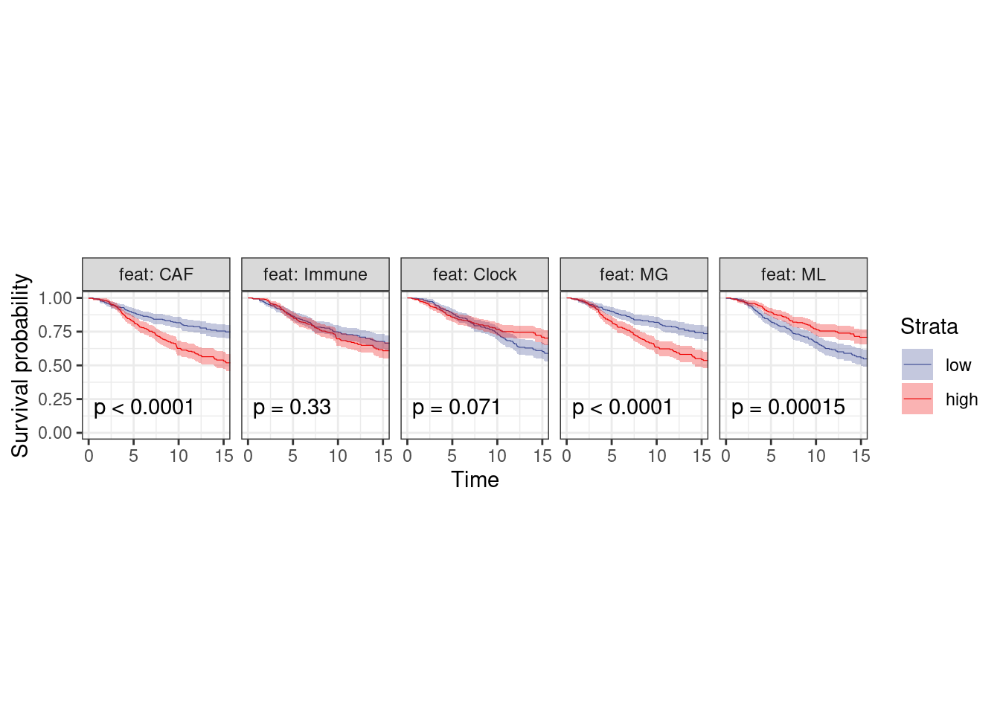

---
jupyter:
  jupytext:
    formats: ipynb,Rmd
    text_representation:
      extension: .Rmd
      format_name: rmarkdown
      format_version: '1.2'
      jupytext_version: 1.11.4
  kernelspec:
    display_name: R
    language: R
    name: ir
---

# Survival


```r
source(here::here("scripts/init.R"))
```


```r
feats_tidy <- get_all_features() %>% 
    select(-immune, -caf) %>% 
    rename(Immune = immune.meth, CAF = caf.meth, Clock = clock) %>% 
    gather("feat", "score", -ER, -samp) %>%
    mutate(feat = factor(feat, levels = c("CAF", "Immune", "Clock", "MG", "ML")))
```


```r
surv_df <- survival %>%
        select(-ER) %>%
        left_join(feats_tidy, by = "samp") %>%
        filter(ER != "normal") %>% 
        group_by(ER, feat) %>%
        filter(sum(!is.na(score)) >= 1) %>%
        mutate(score = cut(score, breaks = quantile(score, 0:3 / 3, na.rm = TRUE), labels = c("low", "mid", "high"), include.lowest = TRUE)) %>%
        ungroup() %>% 
        filter(score != "mid") %>%
        mutate(score = factor(score, levels = c("low", "high")))

surv_df %>% count(feat, ER, score)
```

```
## # A tibble: 20 x 4
##     feat  ER score   n
## 1    CAF ER-   low 104
## 2    CAF ER-  high 103
## 3    CAF ER+   low 370
## 4    CAF ER+  high 369
## 5 Immune ER-   low 104
## 6 Immune ER-  high 103
## # ... with 14 more rows
```


```r
surv_df %>% count(feat, ER)
```

```
## # A tibble: 10 x 3
##     feat  ER   n
## 1    CAF ER- 207
## 2    CAF ER+ 739
## 3 Immune ER- 207
## 4 Immune ER+ 739
## 5  Clock ER- 207
## 6  Clock ER+ 739
## # ... with 4 more rows
```

#### Figure 4D


```r
options(repr.plot.width = 12, repr.plot.height = 3)

p_surv_pos <- surv_df %>%
        filter(ER == "ER+") %>%
        plot_km("score", facet.by = "feat", ggtheme = theme_arial(6), time_breaks = 5, legend = "none", censor.size = 3, colors = "aaas", time_range = c(0, 15), nrow = 1, censor = FALSE, pval = TRUE, size=0.2) + theme(aspect.ratio = 1)
```

```
## Warning in (function (survsummary, times, survtable = c("cumevents",
## "risk.table", : The length of legend.labs should be 10
```

```
## Warning: `as.tibble()` was deprecated in tibble 2.0.0.
## Please use `as_tibble()` instead.
## The signature and semantics have changed, see `?as_tibble`.
```

```
## Warning: `select_()` was deprecated in dplyr 0.7.0.
## Please use `select()` instead.
```

```r
p_surv_neg <- surv_df %>%
        filter(ER == "ER-") %>%
        plot_km("score", facet.by = "feat", ggtheme = theme_arial(6), time_breaks = 5, legend = "none", colors = "aaas", time_range = c(0, 15), nrow = 1, censor = FALSE, pval = TRUE, size=0.2) + theme(aspect.ratio = 1)
```

```
## Warning in (function (survsummary, times, survtable = c("cumevents",
## "risk.table", : The length of legend.labs should be 10
```

```r
p_surv_pos + theme_bw() + theme(aspect.ratio=1)
```


```r
p_surv_neg + theme_bw() + theme(aspect.ratio=1)
```


```r
surv_df %>% group_by(feat, ER, score) %>% summarise(n_death = sum(y < 5 & death == 1), n_surv = sum(y >= 5), n = n_surv + n_death, surv = n_surv / n, surv_p = scales::percent(surv))  %>% as.data.frame
```

```
##      feat  ER score n_death n_surv   n      surv surv_p
## 1     CAF ER-   low      45     51  96 0.5312500    53%
## 2     CAF ER-  high      35     63  98 0.6428571    64%
## 3     CAF ER+   low      61    277 338 0.8195266    82%
## 4     CAF ER+  high      39    302 341 0.8856305    89%
## 5  Immune ER-   low      47     47  94 0.5000000    50%
## 6  Immune ER-  high      25     71  96 0.7395833    74%
## 7  Immune ER+   low      49    289 338 0.8550296    86%
## 8  Immune ER+  high      47    293 340 0.8617647    86%
## 9   Clock ER-   low      38     60  98 0.6122449    61%
## 10  Clock ER-  high      34     61  95 0.6421053    64%
## 11  Clock ER+   low      51    290 341 0.8504399    85%
## 12  Clock ER+  high      35    298 333 0.8948949    89%
## 13     MG ER-   low      36     64 100 0.6400000    64%
## 14     MG ER-  high      41     51  92 0.5543478    55%
## 15     MG ER+   low      31    308 339 0.9085546    91%
## 16     MG ER+  high      57    281 338 0.8313609    83%
## 17     ML ER-   low      41     56  97 0.5773196    58%
## 18     ML ER-  high      32     61  93 0.6559140    66%
## 19     ML ER+   low      35    309 344 0.8982558    90%
## 20     ML ER+  high      64    267 331 0.8066465    81%
```


```r
df <- surv_df %>% filter(ER == "ER+", feat == "MG")
survival::survdiff(survival::Surv(df$y, df$death) ~ score, data = as.data.frame(df))
```

```
## Call:
## survival::survdiff(formula = survival::Surv(df$y, df$death) ~ 
##     score, data = as.data.frame(df))
## 
##              N Observed Expected (O-E)^2/E (O-E)^2/V
## score=low  370       95      123      6.55      14.1
## score=high 369      136      108      7.51      14.1
## 
##  Chisq= 14.1  on 1 degrees of freedom, p= 0.0002
```

```r
df <- surv_df %>% filter(ER == "ER-", feat == "MG")
survival::survdiff(survival::Surv(df$y, df$death) ~ score, data = as.data.frame(df))
```

```
## Call:
## survival::survdiff(formula = survival::Surv(df$y, df$death) ~ 
##     score, data = as.data.frame(df))
## 
##              N Observed Expected (O-E)^2/E (O-E)^2/V
## score=low  104       44     51.1     0.977      2.12
## score=high 103       51     43.9     1.136      2.12
## 
##  Chisq= 2.1  on 1 degrees of freedom, p= 0.1
```


```r
df <- surv_df %>% filter(ER == "ER+", feat == "MG")
survival::coxph(survival::Surv(df$y, df$death) ~ score, data = as.data.frame(df))
```

```
## Call:
## survival::coxph(formula = survival::Surv(df$y, df$death) ~ score, 
##     data = as.data.frame(df))
## 
##             coef exp(coef) se(coef)     z        p
## scorehigh 0.4998    1.6484   0.1343 3.722 0.000198
## 
## Likelihood ratio test=14.14  on 1 df, p=0.0001699
## n= 739, number of events= 231
```

```r
df <- surv_df %>% filter(ER == "ER-", feat == "MG")
survival::coxph(survival::Surv(df$y, df$death) ~ score, data = as.data.frame(df))
```

```
## Call:
## survival::coxph(formula = survival::Surv(df$y, df$death) ~ score, 
##     data = as.data.frame(df))
## 
##             coef exp(coef) se(coef)     z     p
## scorehigh 0.2988    1.3483   0.2060 1.451 0.147
## 
## Likelihood ratio test=2.11  on 1 df, p=0.1461
## n= 207, number of events= 95
```

#### Extended Data Figure 10D


```r
df <- survival %>%
        select(-ER) %>%
        left_join(feats_tidy, by = "samp") %>%
        filter(ER != "normal") %>% 
        left_join(get_mut_df() %>%
            filter(gene == "TP53") %>%
            filter(!is.na(mutation)) %>%
            select(samp, gene, mutation)) %>%        
        filter(ER == "ER+", !is.na(mutation)) 
```

```
## Joining, by = "samp"
```

```r
p_surv_p53 <- df %>%
        group_by(ER, feat) %>%
        filter(sum(!is.na(score)) >= 1) %>%
        mutate(score = cut(score, breaks = quantile(score, 0:3 / 3, na.rm = TRUE), labels = c("low", "mid", "high"), include.lowest = TRUE)) %>%
        ungroup() %>% 
        filter(score != "mid") %>%
        mutate(score = factor(score, levels = c("low", "high"))) %>%
        plot_km("score", facet.by = c("mutation", "feat"), ggtheme = theme_arial(6), time_breaks = 5, legend = "none", censor.size = 3, colors = "aaas", time_range = c(0, 15), nrow = 1, censor = FALSE, pval = TRUE) + theme(aspect.ratio = 1)
```

```
## Warning in (function (survsummary, times, survtable = c("cumevents",
## "risk.table", : The length of legend.labs should be 20
```

```r
p_surv_p53 + theme_bw() + theme(aspect.ratio=1)
```


```r
df %>% distinct(samp, ER, mutation) %>% count(mutation)
```

```
## # A tibble: 2 x 2
##   mutation   n
## 1     MUT- 202
## 2   NO MUT 824
```

### Raw-methylation 


```r
feats_tidy <- get_all_features_raw() %>% 
    select(-immune, -caf) %>% 
    rename(Immune = immune.meth, CAF = caf.meth, Clock = clock) %>% 
    gather("feat", "score", -ER, -samp) %>%
    mutate(feat = factor(feat, levels = c("CAF", "Immune", "Clock", "MG", "ML")))
```


```r
surv_df <- survival %>%
        select(-ER) %>%
        left_join(feats_tidy, by = "samp") %>%
        filter(ER != "normal") %>% 
        group_by(ER, feat) %>%
        filter(sum(!is.na(score)) >= 1) %>%
        mutate(score = cut(score, breaks = quantile(score, 0:3 / 3, na.rm = TRUE), labels = c("low", "mid", "high"), include.lowest = TRUE)) %>%
        ungroup() %>%
        filter(score != "mid") %>%
        mutate(score = factor(score, levels = c("low", "high")))

surv_df %>% count(feat, ER, score)
```

```
## # A tibble: 20 x 4
##     feat  ER score   n
## 1    CAF ER-   low 104
## 2    CAF ER-  high 103
## 3    CAF ER+   low 370
## 4    CAF ER+  high 369
## 5 Immune ER-   low 104
## 6 Immune ER-  high 103
## # ... with 14 more rows
```


```r
options(repr.plot.width = 12, repr.plot.height = 3)

p_surv_pos <- surv_df %>%
        filter(ER == "ER+") %>%
        plot_km("score", facet.by = "feat", ggtheme = theme_arial(6), time_breaks = 5, legend = "none", censor.size = 3, colors = "aaas", time_range = c(0, 15), nrow = 1, censor = FALSE, pval = TRUE, size=0.2) + theme(aspect.ratio = 1)
```

```
## Warning in (function (survsummary, times, survtable = c("cumevents",
## "risk.table", : The length of legend.labs should be 10
```

```r
p_surv_neg <- surv_df %>%
        filter(ER == "ER-") %>%
        plot_km("score", facet.by = "feat", ggtheme = theme_arial(6), time_breaks = 5, legend = "none", colors = "aaas", time_range = c(0, 15), nrow = 1, censor = FALSE, pval = TRUE, size=0.2) + theme(aspect.ratio = 1)
```

```
## Warning in (function (survsummary, times, survtable = c("cumevents",
## "risk.table", : The length of legend.labs should be 10
```

```r
p_surv_pos + theme_bw() + theme(aspect.ratio=1)
```



```r
p_surv_neg + theme_bw() + theme(aspect.ratio=1)
```


```r
options(repr.plot.width = 12, repr.plot.height = 6)
surv_df_p53 <- surv_df %>%
        left_join(get_mut_df() %>%
            filter(gene == "TP53") %>%
            filter(!is.na(mutation)) %>%
            select(samp, gene, mutation)) %>% 
            filter(!is.na(mutation))
```

```
## Joining, by = "samp"
```

```r
p_surv_p53 <- surv_df_p53 %>%        
        filter(ER == "ER+") %>%
        plot_km("score", facet.by = c("mutation", "feat"), ggtheme = theme_arial(6), time_breaks = 5, legend = "none", censor.size = 3, colors = "aaas", time_range = c(0, 15), nrow = 1, censor = FALSE, pval = TRUE) + theme(aspect.ratio = 1)
```

```
## Warning in (function (survsummary, times, survtable = c("cumevents",
## "risk.table", : The length of legend.labs should be 20
```

```r
p_surv_p53 + theme_bw() + theme(aspect.ratio=1)
```


